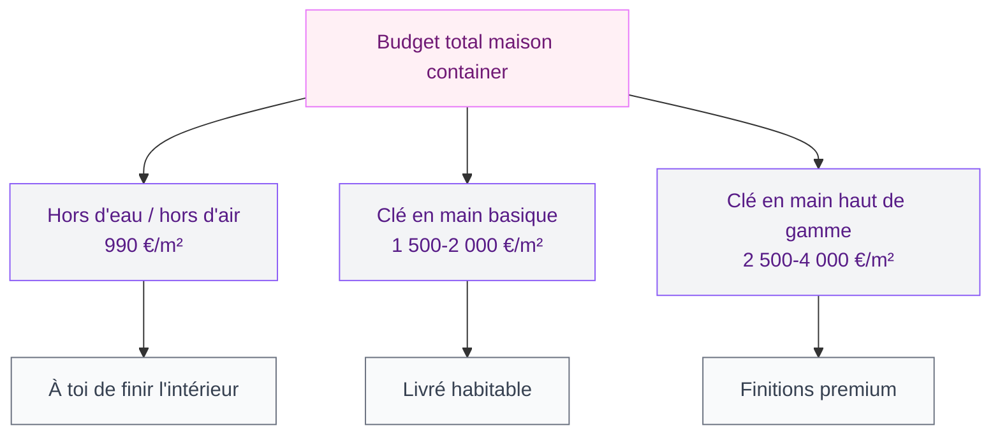

La maison container, c'est le genre de projet qui fait rêver sur Pinterest mais qui soulève vite un tas de questions une fois qu'on creuse. Est-ce que c'est vraiment moins cher ? Est-ce que c'est confortable à vivre ? Est-ce qu'il faut un permis de construire ? Je t'explique tout ce que j'ai appris en fouillant le sujet à fond, avec des chiffres concrets et sans te vendre du rêve.

## C'est quoi exactement une maison container ?

Une maison container, c'est une habitation construite à partir de conteneurs maritimes recyclés. Ces boîtes en acier, conçues pour transporter des marchandises par bateau, sont réutilisées comme modules de base pour créer un logement. On les découpe, on les assemble, on les isole, on les aménage - et au final on obtient une maison à part entière.

<div class="my-8">
  
</div>


Il existe deux formats standards :
- Le **20 pieds** (6 m x 2,4 m, soit environ 14 m²) - plutôt utilisé pour des dépendances ou des espaces de travail
- Le **40 pieds** (12 m x 2,4 m, soit environ 28 m²) - la brique de base pour une vraie maison habitable

La plupart des maisons containers combinent plusieurs modules. Une maison de 80 m² nécessite typiquement 3 containers 40 pieds, assemblés côte à côte ou en L.

> [!NOTE]
> Les containers "High Cube" (HC) mesurent 2,9 m de haut au lieu de 2,6 m. Pour une habitation, c'est vraiment la hauteur à privilégier - les 30 cm de plus font une grosse différence en confort une fois l'isolation posée.

## Les prix réels - sans langue de bois

Voilà la partie qui fait souvent déchanter. Les prix "à partir de 25 000 €" qu'on voit partout, c'est vrai... mais uniquement pour la coque brute, sans terrain, sans fondations, sans raccordements.

<div class="my-8">
  
</div>


### Le container seul

Un container maritime d'occasion 40 HC en bon état, c'est entre **2 500 € et 5 000 €** selon la qualité. Neuf, compte entre 4 000 € et 7 000 €. Ça paraît pas cher - mais ce n'est que le début.

### Les différentes formules



**Chez Ma Construction Container (MCC)**, par exemple, le pack Agathe de 39 m² se négocie autour de 39 000 € hors d'eau/hors d'air (soit 990 €/m²). Leur modèle Jade de 109 m² clé en main tourne autour de 160 000-180 000 €.

**Chez RG Conception**, la Moana 60 (57 m², 2 chambres, plain-pied) est proposée aux alentours de 80 000-100 000 € selon les finitions.

### Ce qu'on oublie souvent de compter

- **Le terrain** - entre 20 000 € et 200 000 € selon la région
- **Les fondations** - 5 000 à 20 000 € (plots béton ou dalle)
- **Le raccordement eau/électricité/gaz** - 5 000 à 15 000 €
- **Le permis de construire et frais d'architecte** - 1 500 à 5 000 €
- **La livraison et le positionnement** - 1 000 à 5 000 € selon l'accès au terrain

> [!WARNING]
> Les estimations basses circulent beaucoup, mais une maison container habitable sur un terrain viabilisé coûte rarement moins de 120 000-150 000 € pour une famille. C'est moins qu'une construction traditionnelle dans certaines régions, mais pas miraculeux.

## Ce qui est vraiment bien avec une maison container


<div class="my-8">
  
</div>

### La rapidité de construction

C'est l'argument le plus solide. Une maison traditionnelle, c'est 12 à 24 mois de chantier. Une maison container bien menée, c'est 3 à 6 mois. Les modules sont préfabriqués en atelier, livrés prêts, et la phase chantier est réduite au minimum. Moins de temps sur le chantier = moins d'aléas météo, moins de problèmes de coordination entre corps de métier.

### L'aspect écologique (à nuancer)

Recycler un container, c'est éviter qu'il finisse à la casse et réutiliser une structure qui a déjà consommé de l'énergie pour être produite. La construction nécessite moins de béton que le traditionnel, et les systèmes constructifs permettent d'intégrer facilement des isolants biosourcés (laine de chanvre, ouate de cellulose). Ma Construction Container base tout leur discours là-dessus, et c'est sincère.

La nuance : un container a souvent été traité avec des peintures industrielles (anti-corrosion, anti-parasite) qu'il faut décaper avant d'y vivre. Les containers ayant transporté des produits chimiques sont à éviter absolument.

### La modularité

Tu peux commencer avec un module de 28 m², puis en ajouter un deuxième deux ans plus tard. C'est une logique d'extension assez souple qui s'adapte à l'évolution d'une famille.

> [!TIP]
> Pour les façades, les containers se prêtent à tous les styles : bardage bois pour un rendu chalet, béton ciré pour un effet industriel, végétalisation pour quelque chose de plus organique. Jette un oeil aux [couleurs et matériaux pour les façades en 2026](/couleurs-pour-les-exterieurs-et-les-facades-de-maisons-2026/) pour t'inspirer avant de choisir.

## Ce qu'on ne te dit pas toujours


<div class="my-8">
  
</div>

### L'isolation, c'est le nerf de la guerre

Un container en acier brut, c'est un four l'été et un congélateur l'hiver. L'isolation est absolument centrale dans ce type de construction - et elle mange de la surface. Une isolation par l'intérieur (la moins chère) enlève 15 à 20 cm de largeur sur chaque côté. Dans un container de 2,4 m de large, ça compte vite.

Les solutions :
- **Isolation intérieure** - la plus économique, perd de la surface habitable
- **Isolation extérieure** - plus chère, conserve le volume intérieur
- **Isolation mixte** - le meilleur compromis selon les constructeurs sérieux

### Le bruit et la condensation

L'acier transmet les sons et la chaleur/froid différemment du béton. Sans une isolation phonique soignée (et une ventilation mécanique bien calibrée), on peut vite se retrouver avec des problèmes de condensation et d'acoustique. Ce n'est pas insurmontable, mais ça nécessite de la rigueur à la conception.

### Les démarches administratives

Une maison container de moins de 20 m² sur une surface non imperméabilisée peut être dispensée de permis de construire. Au-delà, il faut un permis comme pour n'importe quelle construction. Et selon les zones (terrain agricole, zone inondable, secteur protégé), certaines communes refusent ce type de construction.

> [!CAUTION]
> Renseigne-toi auprès de ta mairie AVANT d'acheter un container. Certains PLU (Plans Locaux d'Urbanisme) interdisent explicitement les constructions container ou imposent des contraintes esthétiques qui compliquent sérieusement le projet.

### La revente

C'est le point qu'on évite d'aborder mais qui compte si tu penses à long terme. Une maison container reste moins "bankable" qu'une construction classique. Les banques hésitent parfois à financer, et la revente peut être plus compliquée selon les marchés locaux. Ca s'améliore avec le temps et la démocratisation du concept, mais ça reste un facteur à peser.

## Comment est organisé un projet container de A à Z

```mermaid
flowchart LR
    A["Projet &\nterrain"] --> B["Permis &\nadministratif"]
    B --> C["Achat\ncontainers"]
    C --> D["Fondations\n& livraison"]
    D --> E["Aménagement\natelier"]
    E --> F["Chantier\nsite"]
    F --> G["Raccordements\n& finitions"]

<div class="my-8">
  
</div>


    style A fill:#FFF0F5,stroke:#E879F9,color:#701A75
    style B fill:#F3F4F6,stroke:#8B5CF6,color:#581C87
    style C fill:#FEF3F2,stroke:#F97316,color:#9A3412
    style D fill:#F3F4F6,stroke:#8B5CF6,color:#581C87
    style E fill:#FEF3F2,stroke:#F97316,color:#9A3412
    style F fill:#F3F4F6,stroke:#8B5CF6,color:#581C87
    style G fill:#F9FAFB,stroke:#6B7280,color:#374151
```

La phase "aménagement atelier" est celle qui différencie les constructeurs sérieux des bricoleurs. Les bons font le maximum en usine (découpes, portes, fenêtres, isolation, plomberie en attente) et minimisent le travail sur site. Ca réduit les délais et améliore la qualité.

## Quel type de maison container te correspond ?

### Le projet tiny house

Pour un budget serré et une vie minimaliste, un seul container 40 HC bien aménagé peut suffire à deux personnes. Quelques constructeurs comme Hestia ou Hermès proposent des tiny houses container très abouties autour de 30 000-50 000 €. Attention au permis selon la taille et si elle est sur roues ou fixe.

### La résidence principale familiale

Pour une famille de 4, compte 3 containers minimum, soit 80-100 m². Budget total réaliste : 200 000-300 000 € terrain compris selon la région. C'est comparable à une maison traditionnelle en zones tendues, légèrement moins cher en zones plus abordables.

### L'extension ou le studio en fond de jardin

C'est peut-être le cas d'usage le plus rentable. Un container 20 pieds transformé en bureau ou chambre d'amis, posé sur plots dans ton jardin, c'est 15 000-30 000 € tout compris. Selon ta commune et la surface, tu peux être en déclaration préalable simple plutôt que permis de construire.

Pour les travaux d'isolation et d'aménagement intérieur de ce genre d'espace, les guides sur [comment crépir un mur intérieur](/crepir-un-mur-interieur/) et [comment isoler une montée d'escalier](/comment-isoler-une-montee-descalier/) peuvent t'aider pour les finitions.

## Choisir son constructeur container

Le marché est encore jeune et les acteurs sérieux ne sont pas si nombreux. Voici comment distinguer les bons des moins bons :

- **Ils ont des réalisations récentes visitables** - les constructeurs sérieux proposent des visites de maisons livrées
- **Ils parlent sans détour de l'isolation** - c'est le point technique le plus délicat, un bon constructeur en fait un sujet central
- **Ils te donnent un devis détaillé** - méfie-toi des devis au forfait sans détail des postes
- **Ils gèrent les démarches administratives** - ou au moins t'accompagnent dedans

Quelques noms reconnus en France : Ma Construction Container (MCC), RG Conception, Box'n House. Il en existe d'autres selon les régions.

> [!IMPORTANT]
> Demande systématiquement à voir des chantiers en cours ou des maisons livrées. Une photo sur un site ne dit pas grand chose - une visite avec les propriétaires, ça vaut de l'or. Les forums comme "maison container france" regorgent de retours d'expérience très concrets.


## Sur le meme theme

- [tiny house container](/tiny-house-container/)

## Ce que ça donne au quotidien

Les retours d'expérience des habitants de maisons container sont globalement positifs sur quelques points clés :

- La robustesse : l'acier résiste très bien aux intempéries et aux impacts
- Le sentiment d'originalité : c'est une maison qui ne ressemble à rien d'autre
- La facilité d'entretien extérieur si la finition est bien faite
- La rapidité avec laquelle on s'y installe après les travaux

Les points de vigilance soulevés le plus souvent : la condensation si la ventilation n'est pas bien gérée, le bruit de la pluie sur la toiture métallique (que certains adorent, d'autres non), et les démarches administratives parfois longues selon les communes.

Pour l'extérieur, une maison container accepte très bien les créations originales. Si tu veux pousser le concept plus loin, les [maisons modernes en 2026](/maisons-modernes-2026-images-dexterieur-et-dinterieur/) donnent plein d'idées d'architectures qui se marient bien avec l'esprit container.

---

La maison container n'est pas la solution miracle qu'on vend parfois, mais c'est un vrai projet de vie cohérent pour qui cherche rapidité, modularité et une démarche plus responsable dans la construction. Le tout est d'y entrer avec des yeux ouverts sur les contraintes réelles - et un bon constructeur à ses côtés.
