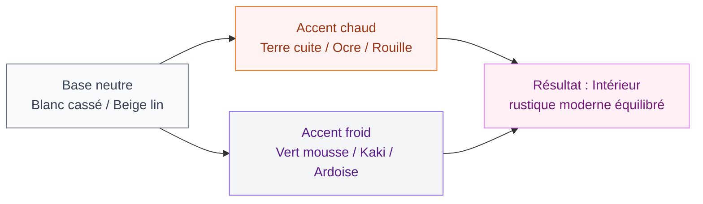
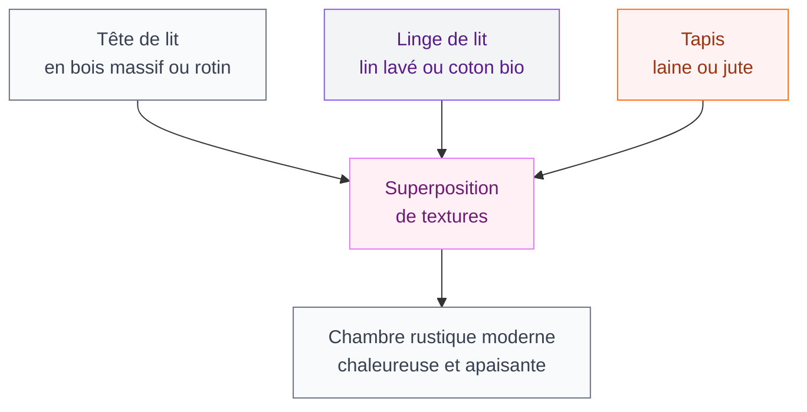

Tu aimes les intérieurs avec du caractère, les matières naturelles qui racontent une histoire, mais tu ne veux pas d'un décor figé dans le passé ? Le style rustique moderne est fait pour toi. C'est ce mariage un peu improbable entre la chaleur de la campagne et la sobriété du design contemporain - et le résultat est franchement beau.

Dans cet article, on plonge dans les codes du style rustique moderne : matériaux, couleurs, mobilier, pièce par pièce. Avec des prix, des marques, et des idées directement applicables chez toi.

## Qu'est-ce que le style rustique moderne exactement ?

Le rustique moderne, c'est pas juste poser une planche de bois au mur et appeler ça du "décor". C'est un équilibre entre deux univers qui se complètent mieux qu'on ne le pense.

  

D'un côté, tu gardes les codes du rustique : les matières brutes (bois, pierre, lin, laine), les couleurs de la nature (ocre, terre, vert mousse, blanc cassé), les imperfections assumées. De l'autre, tu apportes la modernité : des lignes épurées, des meubles fonctionnels, des luminaires design, et une organisation pensée.

Le style "farmhouse" américain ou le style "farm life" européen sont deux déclinaisons populaires de cette tendance. Ce qui les caractérise : un intérieur vivant, presque "imparfait", où un parquet légèrement usé ou un mur irrégulier deviennent des atouts plutôt que des défauts.

> [!NOTE]
> Le rustique moderne n'est pas réservé aux maisons de campagne. Un appartement en ville peut tout à fait adopter ce style avec quelques éléments bien choisis - une poutre apparente peinte, un carrelage pierre, du mobilier en chêne massif.

## Les matériaux stars du rustique moderne

  

### Le bois - toujours lui, mais autrement

Le bois reste le pilier de ce style, mais pas n'importe comment. On oublie les meubles en pin vieilli des années 90. En 2026, le bois rustique moderne, c'est :

- **Chêne massif ou chêne huilé** pour les plans de travail, tables et étagères
- **Bois brut recyclé** (poutres de grange récupérées, planches palettes traitées) pour les habillages muraux
- **Bois noirci ou fumé** pour un effet plus contemporain

Côté prix, une table en chêne massif chez **Maisons du Monde** tourne autour de 400-600 €, et chez **IKEA** avec le plan KARLBY en chêne tu es à 180 €. Pour un vrai bois de récupération, des marques comme **BoisChic** ou **Authentik Design** proposent des planches murales à partir de 30 €/m².

### La pierre et le béton ciré

La pierre apporte l'authenticité. Que ce soit un mur en pierre apparente, un évier en vasque de pierre ou un plan de travail en granit brut, elle ancre l'espace dans quelque chose de solide et intemporel.

Le béton ciré est l'alternative moderne qui colle parfaitement à ce style : il apporte la même minéralité avec une finition plus lisse. En cuisine ou en salle de bain, l'effet est bluffant. Les [meubles salle de bain en béton ciré](/crepir-un-mur-interieur/) ont d'ailleurs le vent en poupe pour ça.

### Lin, laine et jute

Les textiles naturels sont aussi importants que les matières dures. Un jeté en laine bouillie (**Merci Paris**, 89 €), un tapis en jute (**But**, 49-120 € selon la taille), des coussins en lin lavé (**Zara Home**, 25-35 €) - ces petites touches font toute la différence pour réchauffer un intérieur.

> [!TIP]
> Pour habiller un mur de façon économique, les enduits à la chaux ou le [crépi intérieur](/crepir-un-mur-interieur/) sont une alternative authentique à la pierre. Comptez 15-30 €/m² en produit, et le rendu rappelle parfaitement les vieilles fermes rénovées.

## Palette de couleurs : jouer sur les neutres chauds

Le rustique moderne fonctionne avec des couleurs que la nature a déjà validées. Pas de couleurs vives, pas de contrastes agressifs. On reste dans les tons qui apaisent.

  

Les murs en blanc légèrement cassé (pense au **Dulux Valentine "Lin Blanchi"** ou au **Tollens "Blanc Argile"**) forment la base parfaite. Ensuite, tu peux introduire de la couleur via les accessoires et les meubles, sans jamais surcharger.

Les teintes terracotta, caramel, et vert sauge sont les grandes tendances actuelles pour ce style. Un seul mur en couleur d'accent suffit souvent.

## Pièce par pièce : comment appliquer le style rustique moderne

  

### Le salon : chaleur et sobriété

C'est la pièce centrale de l'expression du style. Les ingrédients qui font mouche :

**Le canapé** : lin brut, velours texturé ou cuir vieilli. Évite les canapés trop contemporains en cuir lisse. Chez **La Redoute Intérieurs**, le canapé Melina en lin naturel est à 799 €. Chez **IKEA**, un KIVIK avec housse en lin/coton tourne à 599 €.

**La table basse** : bois massif avec pieds en métal noir, ou une ancienne malle reconvertie. Le mélange bois/métal est la signature du rustique moderne.

**L'éclairage** : fuis les spots encastrés froids. Opte pour une suspension en rotin ou en métal rouillé, des lampes à abat-jour en tissu naturel. **Renaissence** et **Serax** ont des références sympas à 50-150 €.

Pour les [salons modernes et élégants](/salons-modernes-et-elegants-2026/), l'ajout d'une cheminée ou d'un poêle à bois est l'accessoire ultime du rustique moderne - rien de plus authentique.

> [!WARNING]
> Attention à ne pas surcharger. Le rustique moderne, c'est aussi de la retenue. Si tu accumules trop de bibelots vintage, tu bascules dans le "brocante décor" qui manque d'air. Trois éléments forts valent mieux que dix petits accessoires éparpillés.

### La cuisine : le coeur rustique de la maison

La cuisine est l'endroit où le style rustique moderne exprime tout son potentiel. Quelques idées concrètes :

**La façade des meubles** : bois naturel huilé ou laqué mat dans des tons très doux (blanc chaud, gris lin). Évite le blanc pur trop clinique.

**Le plan de travail** : bois massif, granit flammé ou béton ciré. Un plan en chêne massif chez **Ikea** (plateau KARLBY 300 cm) coûte 300 €. En granit brut chez un marbrier local, compte 200-400 €/m².

**La crédence** : carreaux de ciment à motifs, tomettes hexagonales ou briques de verre dépoli. Chez **Leroy Merlin**, les carreaux de ciment à partir de 35 €/m².

**L'îlot central** : si tu as la place, un îlot en bois de récupération avec des tabourets en rotin ou en métal est l'élément signature d'une cuisine rustique moderne réussie.

### La chambre : cocon naturel

La chambre rustique moderne, c'est l'endroit où tu as envie de te sentir dans un chalet haut de gamme. La clé : les superpositions de textures.

Une tête de lit en bois massif - comme le modèle **Fjell** chez IKEA (159 €) ou les têtes en rotin chez **Maisons du Monde** (180-350 €) - pose immédiatement l'ambiance. Couple ça avec un linge de lit en lin lavé (**Harmony Paris**, à partir de 59 € la taie), et le tour est joué.

Pour les murs, une couleur de peinture vert sauge ou vieux rose poudré donne une atmosphère intimiste. **Farrow & Ball "Mole's Breath"** ou **Little Greene "Aged White"** sont des références dans ce domaine.

### La salle de bain : minéralité assumée

Le béton, la pierre et le bois font une entrée remarquée dans les salles de bain rustiques modernes. Un lavabo vasque en pierre naturelle (**Allibert** ou artisans locaux, 150-400 €), un meuble sous-vasque en bois teint, des joints de carrelage couleur terre - ces détails changent tout.

Pour l'esprit rustique sans trop de budget, un simple miroir en bois brut ou en rotin (à partir de 39 € chez **Action** ou **Hema**) et une applique ampoule Edison suffisent à transformer une salle de bain ordinaire.

## Les erreurs à éviter

Le style rustique moderne peut vite partir dans le mauvais sens. Les pièges les plus fréquents :

  

**1. Tout assortir** : Le charme de ce style vient des mélanges imparfaits. Une table ancienne avec des chaises neuves, un luminaire design dans un espace en pierre - c'est ça qui crée l'intérêt visuel.

**2. Confondre rustique et vieillot** : Un décor rustique moderne doit rester épuré. Si tu multiplies les napperons brodés et les bibelots en faïence, tu perds la modernité.

**3. Négliger l'éclairage** : La chaleur d'un espace rustique vient beaucoup de la lumière. Des ampoules à filament (température de couleur 2200-2700K), des bougies, des guirlandes lumineuses dans les coins - l'éclairage est aussi important que le mobilier.

> [!IMPORTANT]
> Le rustique moderne fonctionne mieux avec peu d'objets de qualité plutôt qu'un maximum d'accessoires. Investis dans 3-4 pièces fortes (une belle table, un canapé en matière noble, une suspension marquante) et épure le reste.

## S'inspirer de styles cousins

Le style rustique moderne a des cousins proches qui peuvent t'apporter d'autres idées :

La [décoration marocaine moderne](/decoration-marocaine-moderne-ou-classique/) partage plusieurs codes avec le rustique moderne : les matières naturelles, les couleurs terracotta, la valorisation de l'artisanat. Si tu aimes les deux univers, tu peux les marier avec subtilité - une zellige dans une cuisine rustique, c'est un mariage qui fonctionne très bien.

Du côté des extérieurs, les [maisons modernes 2026](/maisons-modernes-2026-images-dexterieur-et-dinterieur/) montrent comment le style rustique moderne s'applique aussi à la façade : bardage bois, enduit à la chaux, pierres apparentes - l'intérieur et l'extérieur peuvent parler le même langage.

## Budget : à partir de combien ?

Le rustique moderne peut s'adapter à presque tous les budgets, selon l'approche choisie :

| Approche | Budget indicatif | Ce que ça couvre |
|----------|-----------------|-----------------|
| Accessoires uniquement | 200-500 € | Textiles, luminaires, quelques objets |
| Rénovation légère | 1 000-3 000 € | Peinture, nouveaux meubles clés, revêtement sol |
| Rénovation complète | 5 000-15 000 € | Cuisine, salle de bain, sols, mobilier |

La bonne nouvelle : beaucoup d'éléments rustiques modernes se trouvent en seconde main à des prix très accessibles. Les vide-greniers, **Le Bon Coin** et **Vinted Maison** regorgent de meubles en bois massif que tu peux poncer et huiler pour 50-100 € au lieu de 500 €.

> [!TIP]
> Les marchés de brocante sont tes meilleurs amis pour ce style. Une armoire normande à 80 €, poncée et peinte en blanc cassé, devient un meuble de chambre rustique moderne parfait. L'authenticité ne se fabrique pas - elle se trouve.

## Le résumé en trois gestes

Si tu devais retenir trois actions concrètes pour démarrer ton intérieur rustique moderne :

**1. Choisir une palette neutre et chaude** - Blanc cassé ou lin pour les murs, bois naturel pour les meubles, quelques touches de terracotta ou de vert sauge dans les accessoires.

**2. Miser sur deux ou trois matières naturelles** - Bois massif + lin + pierre/béton. C'est suffisant pour créer une cohérence sans surcharger.

**3. Accepter l'imperfection** - Un mur légèrement irrégulier, un parquet qui craque, un meuble avec une rayure - dans ce style, c'est une qualité. C'est ce qui donne à l'espace son âme.

Le rustique moderne, c'est finalement un style honnête. Il ne cherche pas à impressionner, il cherche à mettre à l'aise. Et ça, ça ne se démode pas.

---

## Sur le meme theme

- [salons modernes 2026](/salons-modernes-tendances-2026/)

## Questions fréquentes

**Quelle différence entre rustique et rustique moderne ?**
Le rustique traditionnel mise sur l'abondance de bois sombre, les motifs à carreaux et une accumulation d'objets campagnards. Le rustique moderne garde les matières naturelles mais les associe à des lignes plus épurées, des couleurs plus douces et un mobilier fonctionnel. Le résultat est plus aéré et moins chargé.

**Peut-on faire du rustique moderne dans un appartement ?**
Oui, tout à fait. Les poutres apparentes (même fausses, posées en déco), un revêtement mural en bois, un carrelage aspect pierre et quelques meubles en bois massif suffisent à créer l'ambiance, même sans jardin ni cheminée.

**Quels meubles IKEA conviennent au style rustique moderne ?**
Plusieurs références IKEA s'intègrent bien : la table MÖRBYLÅNGA en chêne plaqué (549 €), les étagères IVAR en pin massif (à customiser), le plan de travail KARLBY en chêne (180-300 €), et les canapés KIVIK avec housse en coton/lin. Ces bases à prix accessibles se mélangent très bien avec des pièces plus travaillées.

**Comment éviter que mon intérieur rustique moderne paraisse daté dans quelques années ?**
En misant sur la qualité des matières naturelles plutôt que sur les tendances. Le bois massif, la pierre et le lin traversent les modes. Limite les éléments très typés d'une période (comme les ampoules Edison à l'excès) et préfère des formes simples et intemporelles.
