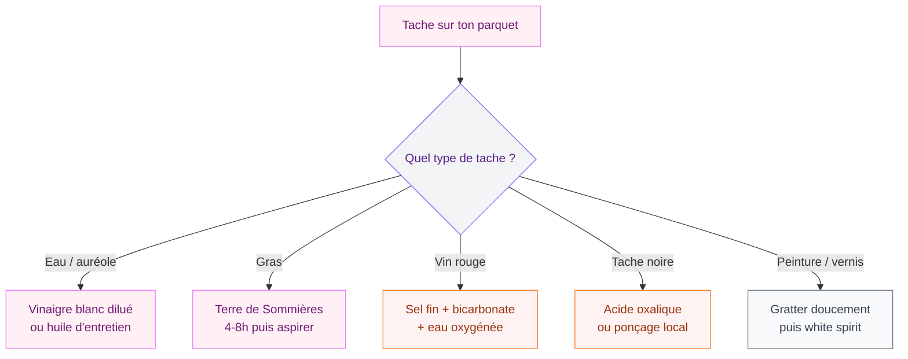

Tu viens de découvrir une tache sur ton parquet et tu paniques un peu ? Respire. Que ce soit une auréole d'eau oubliée sous un verre, une éclaboussure de sauce tomate ou une trace noire de chaussure, il existe une solution pour chaque type de tache. Et bonne nouvelle : la plupart se traitent avec des produits que tu as déjà chez toi.

Le parquet taché, c'est le cauchemar de tous ceux qui ont un beau sol en bois. Mais avant de te lancer dans un ponçage complet (spoiler : c'est rarement la bonne idée en premier recours), il faut comprendre quel type de parquet tu as et quelle tache tu affrontes. Parce qu'un parquet huilé et un parquet vitrifié ne se traitent pas du tout de la meme manière.

## Identifier ton type de parquet avant d'agir

C'est la première chose a faire, et c'est ce qui va déterminer toute ta stratégie. Utiliser le mauvais produit sur le mauvais type de parquet peut aggraver la situation - voire abimer définitivement ton sol.

  

### Parquet vitrifié (ou verni)

Le plus facile a entretenir. Il est recouvert d'une couche de vernis qui protège le bois des infiltrations. Les taches restent en surface la plupart du temps. Un chiffon humide suffit souvent a régler le problème. Si tu viens de renverser quelque chose, éponge vite et tu n'auras meme pas besoin de lire la suite.

### Parquet huilé

Celui-la est plus délicat. L'huile pénètre dans les fibres du bois, ce qui veut dire que le bois reste "ouvert". Les liquides peuvent s'infiltrer si tu ne réagis pas rapidement. Mais l'avantage, c'est qu'on peut traiter une zone localement sans que ça se voie - pas besoin de refaire tout le sol.

### Parquet ciré

Le plus sensible des trois. La cire offre une protection légère, mais elle se dissout avec l'eau et les détergents. Il faut y aller tout en douceur, avec des produits spécifiques.

### Parquet stratifié

Techniquement, ce n'est pas du vrai bois. La couche supérieure est un décor protégé par une résine. Les taches partent facilement, mais attention : si l'eau s'infiltre par les joints, le panneau peut gonfler de manière irréversible.

> [!TIP]
> Tu ne sais pas quel type de parquet tu as ? Verse une goutte d'eau dans un coin discret. Si elle perle en surface, c'est du vitrifié. Si elle s'absorbe lentement, c'est du huilé. Si elle fait une marque blanche, c'est du ciré.

## Les taches les plus courantes et comment les traiter

  

### Taches d'eau et auréoles blanches

Le classique. Un verre posé sans dessous-de-verre, un pot de fleur qui a débordé, un parapluie mal rangé. Les auréoles blanches sur parquet ciré ou huilé sont causées par l'humidité qui s'est infiltrée dans le bois.

**Sur parquet vitrifié :** un simple coup de chiffon humide, puis séchage immédiat. Si la tache est ancienne, un peu de vinaigre blanc dilué (1 cuillère a soupe dans un litre d'eau tiède) fait l'affaire.

**Sur parquet huilé :** frotte légèrement avec un chiffon imbibé d'huile de lin ou d'huile d'entretien pour parquet. La tache va se fondre dans le bois. Produit recommandé : Huile d'entretien Blanchon (environ 25-30 euros le litre chez Leroy Merlin).

**Sur parquet ciré :** la cire de carnauba appliquée en fine couche sur la zone abimée va masquer l'auréole. Laisse sécher 20 minutes puis lustre avec un chiffon doux.

### Taches de gras (huile de cuisine, beurre, sauce)

Le gras pénètre vite dans un parquet huilé ou ciré, mais reste en surface sur un vitrifié.

**La méthode express :** saupoudre la tache de terre de Sommières (c'est une argile naturelle ultra absorbante, environ 6 euros le sachet chez Bricomarché). Laisse agir 4 a 8 heures, puis aspire. Si le gras est ancien, renouvelle l'opération.

**Alternative :** le talc ou la fécule de maïs fonctionnent aussi, mais la terre de Sommières reste plus efficace sur le bois.

> [!WARNING]
> Ne frotte jamais une tache de gras avec de l'eau chaude : ça va la fixer dans les fibres du bois. Absorbe d'abord, traite ensuite.

### Taches de vin rouge

Le grand classique des soirées. Le vin rouge contient des tanins qui colorent le bois en profondeur si tu ne réagis pas vite.

**Action immédiate :** éponge le maximum avec du papier absorbant. Saupoudre de sel fin pour absorber le reste. Après 10 minutes, aspire le sel et nettoie avec un chiffon humide.

**Tache ancienne :** prépare une pate de bicarbonate de soude (2 cuillères a soupe) et d'eau oxygénée a 3% (1 cuillère a soupe). Applique sur la tache, couvre avec du film alimentaire et laisse poser 2 heures. L'eau oxygénée est un agent blanchissant léger qui va atténuer la coloration. Attention : fais un test dans un endroit caché avant, car ça peut éclaircir légèrement le bois.

### Taches noires (moisissure, métal, urine d'animal)

Les taches noires sont souvent les plus tenaces. Elles peuvent venir d'un pot de fleur en métal qui a oxydé, de moisissure sous un tapis ou d'un accident d'animal de compagnie.

**Sur parquet vitrifié :** l'acide oxalique (sel d'oseille, en droguerie, environ 8 euros les 500g) est ton meilleur allié. Dilue 20g dans un litre d'eau tiède, applique au pinceau sur la tache, laisse agir 30 minutes et rince. Porte des gants.

**Sur parquet huilé :** il faut souvent poncer légèrement la zone avec du papier de verre grain 120, appliquer l'acide oxalique, puis ré-huiler. C'est un peu plus de travail, mais le résultat est bluffant.

> [!CAUTION]
> L'acide oxalique est irritant : porte toujours des gants et aère bien la pièce. Ne l'utilise pas sur du parquet ciré, il dissoudrait la cire.

### Taches de peinture, colle ou vernis

Si tu fais des travaux chez toi (ou si tu as suivi notre guide pour [crépir un mur intérieur](/guides/decoration/crepir-un-mur-interieur/)), tu as peut-etre laissé tomber une goutte de peinture sur ton parquet.

**Peinture fraiche :** essuie immédiatement avec un chiffon humide. La peinture acrylique (a l'eau) part très facilement tant qu'elle n'a pas séché.

**Peinture sèche :** gratte doucement avec une spatule en plastique (pas en métal, tu risques de rayer le bois). Pour la peinture glycéro, un chiffon imbibé de white spirit fera le travail, mais teste d'abord sur une zone cachée.

**Colle :** un glaçon posé sur la colle pendant 5 minutes la rend cassante. Tu pourras ensuite la décoller en morceaux avec un ongle ou une spatule plastique.

## La boite a outils anti-taches : les produits a avoir

Tu n'as pas besoin de 15 produits. Voici le kit de base qui couvre 90% des situations :

  

| Produit | Prix moyen | Ou l'acheter | Usage principal |
|---------|-----------|--------------|-----------------|
| Bicarbonate de soude | 3 euros | Supermarché | Taches organiques, odeurs |
| Vinaigre blanc | 1,50 euros | Supermarché | Calcaire, auréoles |
| Terre de Sommières | 6 euros | Bricomarché, Leroy Merlin | Taches de gras |
| Savon noir liquide | 5 euros | Droguerie | Nettoyage courant |
| Huile d'entretien parquet | 25-35 euros/L | Leroy Merlin, Castorama | Parquets huilés |
| Papier de verre (grain 120-180) | 4 euros/lot | Brico Dépot | Ponçage localisé |

> [!NOTE]
> Le savon noir liquide Marius Fabre (environ 8 euros le litre) est un produit polyvalent qui nettoie le parquet sans l'agresser. Dilue 2 cuillères a soupe dans un seau d'eau tiède pour un nettoyage en douceur.

## Protéger ton parquet pour éviter les futures taches

Rattraper une tache c'est bien, mais empecher la prochaine c'est mieux. Quelques habitudes simples vont garder ton parquet beau plus longtemps.

  

### Le réflexe anti-tache au quotidien

- **Essuie tout de suite** : c'est la règle d'or. Un liquide renversé sur du parquet huilé, tu as 5 minutes avant que ça pénètre.
- **Utilise des patins en feutre** sous les pieds de meubles - ca évite aussi les rayures. Un lot de 100 patins autocollants coute moins de 5 euros chez Ikea.
- **Paillasson a l'entrée** : 80% des saletés arrivent par les chaussures. Un bon paillasson en coco (Leroy Merlin, 15-25 euros) réduit vraiment les traces.
- **Serpillère bien essorée** : le parquet déteste l'eau stagnante. Utilise toujours une serpillère micro-fibre a peine humide.

### La ré-huile ou re-vitrification

Si tu as un parquet huilé, une couche d'huile d'entretien tous les 6 a 12 mois va renforcer sa protection. C'est l'équivalent d'une crème hydratante pour ta peau : ca nourrit le bois et ca le rend plus résistant aux taches.

Pour un parquet vitrifié, la vitrification dure en moyenne 10 a 15 ans avant de devoir etre refaite. Si tu vois que le vernis s'use dans les zones de passage, c'est le moment d'y penser.

## Quand appeler un pro ?

Parfois, la tache est trop profonde ou trop étendue pour un traitement maison. Si tu te retrouves dans l'une de ces situations, contacte un professionnel :

  

- **Tache noire qui couvre plus de 30 cm de large** : elle a probablement pénétré en profondeur et nécessite un ponçage mécanique.
- **Parquet gondolé ou soulevé** : c'est un dégat des eaux, pas juste une tache. Il faut intervenir sur la structure.
- **Lames fendues ou éclatées** : le remplacement de lames individuelles demande du matériel spécifique.
- **Parquet ancien ou parquet de valeur** : si tu as un parquet Versailles ou un point de Hongrie d'époque, confie-le a un spécialiste pour ne pas risquer de l'abimer.

Le tarif moyen d'un ponçage-vitrification par un pro se situe entre 25 et 45 euros/m2, selon ta région. Pour une pièce de 20 m2, compte entre 500 et 900 euros. C'est un investissement, mais ton parquet repartira comme neuf pour 10-15 ans.

Si tu rénoves plus largement et que tu t'attaques aussi a tes [murs en parpaings](/guides/decoration/recouvrir-parpaings/), pense a bien protéger ton parquet avec une bache épaisse et du ruban de masquage pendant les travaux.

## Sur le meme theme

- [décirer un meuble en bois](/guides/decoration/decirer-un-meuble-en-bois-les-astuces-pratiques/)
- [volets en bois](/guides/decoration/volets-en-bois/)

## FAQ - Les questions que tout le monde se pose

### Comment enlever une tache d'eau sur du parquet huilé ?

Frotte la zone avec un chiffon imbibé d'huile d'entretien pour parquet (Blanchon ou Liberon, 25-35 euros/L). L'huile va pénétrer dans les fibres et atténuer l'auréole. Pour les taches tenaces, un léger ponçage au grain 120 suivi d'une ré-huile locale donne un résultat propre.

### Peut-on utiliser du vinaigre blanc sur du parquet ?

Oui, mais toujours dilué (1 cuillère a soupe pour 1 litre d'eau) et uniquement sur du parquet vitrifié. Sur un parquet huilé ou ciré, le vinaigre risque de dégrader la finition. Si tu cherches un nettoyant doux et polyvalent, le savon noir reste le meilleur choix pour tous les types de parquet.

### Comment rattraper un parquet taché par de l'urine d'animal ?

Absorbe d'abord le maximum avec du papier absorbant. Nettoie avec un mélange d'eau tiède et de savon noir, puis passe un chiffon imbibé d'eau oxygénée a 3% sur la tache résiduelle. L'eau oxygénée va neutraliser l'odeur et atténuer la coloration. Si tu as un parquet huilé, il faudra probablement poncer et ré-huiler la zone concernée.

### Le bicarbonate de soude abime-t-il le parquet ?

Le bicarbonate est légèrement abrasif, mais utilisé en pate humide il ne raye pas un parquet normal. Evite de frotter trop fort et rince bien après. Ne laisse pas une pate de bicarbonate sécher sur un parquet ciré : en séchant, les cristaux peuvent rayer la surface quand tu les retires.

> [!IMPORTANT]
> Avant tout traitement, fais toujours un test dans un endroit discret (sous un meuble, dans un coin). Meme les produits naturels peuvent réagir différemment selon la finition de ton parquet.

Ton parquet a une tache ? Maintenant tu sais quoi faire. Le plus important reste la rapidité d'intervention : plus tu agis vite, moins la tache a le temps de s'incruster. Et si tu veux un sol beau et facile a entretenir sur le long terme, pense a l'entretien régulier - c'est la meilleure protection qui existe. Si tu te lances dans un projet de rénovation de sol, jette aussi un oeil a notre article sur [peindre du lino](/guides/decoration/peindre-lino/) pour une alternative économique au remplacement complet.
