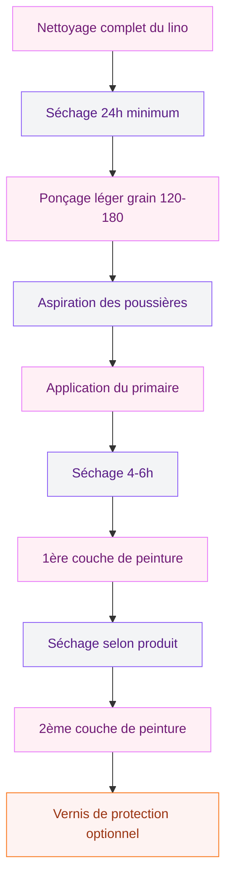

Tu as un vieux lino dans ta cuisine, ta salle de bain ou ton entrée et tu n'en peux plus de cette couleur passée ? Bonne nouvelle : peindre ton sol en lino est une solution rapide, économique et assez bluffante quand c'est bien fait. Pas besoin de tout arracher ni de poser un nouveau revêtement. Un week-end, les bons produits et un peu de méthode, et tu obtiens un résultat qui change complètement l'ambiance de la pièce.

Je vais te guider à travers toutes les étapes pour repeindre ton lino comme une pro, du choix de la peinture jusqu'à l'entretien au quotidien. On parle prix, marques, erreurs à éviter - bref, tout ce qu'il faut savoir avant de te lancer.

## Pourquoi peindre son lino plutôt que le remplacer ?

Le linoleum, c'est un revêtement de sol plutôt costaud. Résistant, facile à nettoyer, isolant : il a plein de qualités. Mais avec les années, il peut jaunir, se décolorer ou simplement ne plus correspondre à tes goûts. Et là, deux options : tout changer (cher et compliqué) ou peindre (malin et rapide).

Peindre un sol en lino, c'est une solution économique qui te coûte entre 15 et 40 euros le m2 tout compris (peinture + sous-couche + vernis). Pour comparaison, poser un nouveau revêtement revient à 30-80 euros le m2 pose comprise. Le calcul est vite fait.

> [!TIP]
> La peinture sur lino fonctionne mieux dans les pièces à passage modéré : chambre, bureau, salle de bain, toilettes. Pour un couloir ou une cuisine très fréquentée, prévois un vernis de protection costaud ou pense à un autre revêtement.

Autre avantage : tu peux choisir exactement la couleur que tu veux. Envie d'un sol gris béton ultra moderne ? D'un blanc lumineux ? D'un motif géométrique au pochoir ? Tout est possible. Si tu cherches des idées de couleurs pour ton intérieur, jette un oeil à notre guide sur les [couleurs apaisantes pour un intérieur zen](/couleurs-apaisantes-zen/).

## Choisir la bonne peinture pour sol en lino

C'est LE point qui fait toute la différence entre un résultat durable et une peinture qui s'écaille au bout de trois semaines. Le lino est une surface lisse, un peu souple, parfois brillante. Il faut donc une peinture spécifique qui accroche bien dessus.

### Les types de peintures adaptées

**Peinture sol polyuréthane** - C'est la référence pour peindre du lino. Elle offre une résistance top aux passages, aux chocs et à l'humidité. Séchage un peu plus long (6-8h entre les couches), mais la durabilité est au rendez-vous.

**Peinture sol acrylique renforcée** - Plus facile à appliquer, séchage rapide (2-4h), quasi sans odeur. Elle convient bien pour les pièces à passage léger. Moins résistante que la polyuréthane sur le long terme, mais largement suffisante pour une chambre ou un bureau.

**Résine de sol** - Le top du top en résistance. La résine époxy crée un film ultra dur et imperméable. Par contre, c'est plus cher (40-60 euros le m2) et l'application demande plus de précision.

### Comparatif des marques et prix

| Produit | Type | Prix (0.75L) | Surface couverte | Idéal pour |
|---------|------|-------------|-------------------|------------|
| V33 Rénovation Sol | Polyuréthane | 35-42 euros | 7-9 m2 | Toutes pièces |
| Julien Peinture Sol | Acrylique | 25-32 euros | 8-10 m2 | Pièces calmes |
| Syntilor Rénovation Sol | Polyuréthane | 38-45 euros | 6-8 m2 | Pièces humides |
| Résinence Color | Résine | 45-55 euros | 5-7 m2 | Passage intensif |

Tu trouves ces produits chez Leroy Merlin, Castorama ou Mr Bricolage. La V33 Rénovation Sol, c'est celle que je recommande le plus souvent : bon rapport qualité-prix et un choix de couleurs sympa (plus de 30 teintes).

> [!NOTE]
> N'utilise jamais une peinture murale classique sur du lino. Elle n'est pas formulée pour résister aux passages et se dégradera très vite. Choisis toujours un produit portant la mention "peinture sol" ou "spécial sol souple".

## Préparer son lino avant de peindre

La préparation, c'est 80% du résultat. Un lino mal préparé = une peinture qui tient mal. Prends le temps de bien faire cette étape, ça vaut le coup.

### Le matériel nécessaire

- Aspirateur
- Serpillère et nettoyant dégraissant (Saint-Marc ou équivalent)
- Papier de verre grain 120-180 ou abrasif en mousse
- Ruban de masquage
- Sous-couche d'accrochage (primaire d'adhérence)
- Rouleau mousse à poils ras (velours)
- Pinceau à réchampir pour les bords
- Bac à peinture

### Étape 1 : nettoyer à fond

Passe l'aspirateur soigneusement pour enlever toutes les poussières et particules. Lave ensuite ton lino à la serpillère avec un nettoyant dégraissant bien dilué. L'idée, c'est d'éliminer toute trace de gras, de cire ou de produit d'entretien qui empêcherait la peinture d'accrocher.

Laisse sécher complètement - minimum 24 heures. Un sol humide, c'est un sol où la peinture n'adhérera pas.

### Étape 2 : poncer légèrement

Prends ton papier de verre grain 120-180 et ponce légèrement toute la surface du lino. L'objectif n'est pas de tout décaper, juste de créer une rugosité pour que la sous-couche et la peinture accrochent mieux. Ponce en faisant des mouvements circulaires, sans appuyer comme une brute.

Repasse l'aspirateur après le ponçage pour enlever toute la poussière.

### Étape 3 : appliquer la sous-couche

La sous-couche d'adhérence (ou primaire), c'est le secret d'une peinture qui dure. Elle crée un pont chimique entre le lino et la peinture. Utilise un primaire d'accrochage universel ou, encore mieux, un primaire spécifique sols souples.

Le Julien Sous-Couche J7 (environ 18-22 euros le litre) ou le V33 Primaire Multi-Supports sont deux valeurs sûres. Applique au rouleau mousse en une couche fine et régulière. Laisse sécher 4 à 6 heures minimum.

> [!WARNING]
> Ne saute pas l'étape du primaire, même si la peinture indique "sans sous-couche". Sur du lino, l'adhérence directe est souvent insuffisante. Le primaire, c'est ta garantie anti-écaillage.

## Appliquer la peinture sur le lino

Ça y est, ton sol est propre, poncé et sous-couché. C'est le moment le plus satisfaisant : peindre !

### Première couche

Commence par les bords et les coins au pinceau à réchampir. Utilise le ruban de masquage pour protéger les plinthes. Puis attaque la surface au rouleau mousse, en travaillant par bandes parallèles. Commence par le fond de la pièce et avance vers la porte - sinon tu te retrouves coincée dans un coin (ça m'est arrivé, c'est un classique).

Applique une couche fine et régulière. Mieux vaut deux couches fines qu'une couche épaisse qui risque de couler ou de mal sécher. Respecte bien le temps de séchage indiqué sur le pot avant de passer à la deuxième couche.

### Deuxième couche

Même technique, mais cette fois tu croises les passes. Si ta première couche était dans le sens de la longueur, passe la deuxième dans le sens de la largeur. Ça donne un résultat plus homogène et une meilleure couverture.

Pour certaines couleurs claires sur un lino foncé, une troisième couche peut être utile. Attends toujours le séchage complet entre chaque couche - c'est la clé d'un rendu impeccable.

### Finition et protection

Pour les pièces à passage fréquent, je te recommande d'appliquer un vernis de protection après la dernière couche de peinture. Le V33 Vitrificateur Sol (environ 30-35 euros le litre) ajoute une couche de résistance supplémentaire qui prolonge vraiment la durabilité du résultat.

Laisse sécher 48 à 72 heures avant de remettre les meubles et de marcher normalement dessus. Je sais, c'est long, mais un séchage complet fait toute la différence pour la tenue dans le temps.

## Entretien du lino peint

Un sol en lino peint demande un peu d'attention pour garder son look longtemps. Rien de compliqué, mais quelques réflexes à prendre.

**Nettoyage courant** - Serpillère humide (pas trempée !) avec un nettoyant doux neutre. Évite les produits agressifs à base d'ammoniaque ou de javel concentrée qui attaquent la peinture.

**Protéger les zones de passage** - Un tapis d'entrée, des patins en feutre sous les pieds de chaises et de tables. Ces petits détails empêchent les rayures et l'usure prématurée. Si tu veux des idées pour compléter ta déco avec des [textiles cosy et des tapis](/textiles-maison-cosy/), j'ai un article dédié.

**Retouches ponctuelles** - Garde un petit pot de ta peinture pour les retouches. Un éclat, une rayure ? Un coup de pinceau et c'est reparti. C'est l'avantage d'un sol peint par rapport à un revêtement collé.

> [!TIP]
> Mets des patins adhésifs en feutre sous tous les pieds de meubles posés sur ton lino peint. Ça coûte 3-5 euros le lot chez Leroy Merlin et ça évite 90% des rayures.

## Les erreurs courantes (et comment les éviter)

Après avoir aidé plusieurs amies à repeindre leur lino, voici les pièges dans lesquels on tombe le plus souvent :

**Erreur n1 : sauter la préparation** - Peindre directement sur un lino sale ou non poncé, c'est la garantie d'un écaillage rapide. La préparation prend du temps mais c'est ce qui détermine la tenue de ta peinture.

**Erreur n2 : choisir la mauvaise peinture** - Une peinture murale, une peinture bois ou une peinture extérieure ne conviennent pas pour un sol en lino. Utilise toujours des peintures spécifiques sols.

**Erreur n3 : couches trop épaisses** - L'envie de tout couvrir en une seule couche est forte. Résiste ! Des couches fines multiples donnent un résultat bien plus joli et durable qu'une grosse couche qui coule et sèche mal.

**Erreur n4 : ne pas respecter les temps de séchage** - Chaque produit a ses propres temps. Entre les couches, c'est minimum 4-6h pour l'acrylique et 6-8h pour la polyuréthane. Avant de remettre les meubles, 48-72h. Patience !

**Erreur n5 : oublier la ventilation** - Même les peintures acryliques dégagent des composants volatils. Ouvre les fenêtres grand pendant l'application et le séchage. Si tu travailles dans une pièce mal ventilée, porte un masque.

## Budget total : combien ça coûte vraiment ?

Voici une estimation pour une pièce de 10 m2 :

En moyenne, compte entre 90 et 137 euros pour 10 m2, soit 9 à 14 euros le m2. C'est environ 3 à 5 fois moins cher que poser un nouveau sol. Et si tu veux pousser la rénovation plus loin dans ta maison sans exploser ton budget, regarde nos astuces pour [agrandir un petit espace](/agrandir-petit-espace-astuces/) - des idées malignes qui changent tout.

## Pour quelles pièces ça marche le mieux ?

Toutes les pièces ne se valent pas quand on parle de peindre du lino. Voici mon classement :

**Top : chambre, bureau, dressing** - Passage faible, peu d'humidité. La peinture tient des années sans souci. C'est le terrain de jeu idéal pour se lancer.

**Bien : salle de bain, toilettes** - Ça marche très bien avec une peinture polyuréthane et un vernis adapté aux pièces humides. Si tu prévois aussi de refaire ta [salle de bain cosy](/salle-de-bain-cosy/), peindre le lino peut être la première étape.

**Correct : cuisine, entrée** - Passage plus fréquent, risques de projections. Prévois un vernis de protection solide et des retouches régulières. Ça reste viable mais demande plus d'entretien.

**À éviter : garage, buanderie** - Trop de passages, produits chimiques, objets lourds. Le lino peint ne tiendra pas longtemps dans ces conditions.

## Sur le meme theme

- [peindre sans poncer](/guides/decoration/peindre-sans-poncer/)
- [isolation dalle béton](/guides/decoration/isolation-dune-dalle-en-beton-techniques-options-disolation-et-cout/)
- [enduire un mur en parpaing](/guides/decoration/comment-enduir-un-mur-en-parpaing/)
- [comment recouvrir des parpaings](/guides/decoration/recouvrir-parpaings/)
- [crépir un mur intérieur](/guides/decoration/crepir-un-mur-interieur/)

## Questions fréquentes

### Combien de temps dure un lino peint ?

Avec une bonne préparation et des produits de qualité, un sol en lino peint tient 3 à 5 ans dans une pièce à passage modéré (chambre, bureau). Dans une cuisine ou un couloir, compte plutôt 1 à 3 ans avant d'avoir besoin de retouches ou d'une nouvelle couche.

### Peut-on peindre un lino qui a des trous ou des fissures ?

Oui, mais il faut d'abord réparer. Utilise un mastic de rebouchage souple (pas du plâtre classique qui est trop rigide pour un sol souple). Laisse sécher, ponce pour lisser, puis lance-toi dans la peinture. Si les dégâts sont trop importants, mieux vaut remplacer le lino.

### Est-ce que la peinture tient sur du lino avec des motifs en relief ?

Ça tient, mais les motifs en relief restent visibles sous la peinture. Si tu veux un sol parfaitement lisse, il faudra appliquer un enduit de lissage avant la mise en peinture. Sinon, le relief apporte un côté texture qui peut être sympa selon le style que tu recherches.

### Faut-il déménager tous les meubles ?

Idéalement oui, vide la pièce complètement. Sinon, déplace les meubles d'un côté, peins la moitié, attends le séchage complet, puis fais l'autre moitié. C'est plus long mais ça fonctionne.

### Quelles couleurs choisir pour son lino peint ?

Les teintes claires (gris perle, blanc cassé, beige) agrandissent visuellement l'espace. Les couleurs foncées (anthracite, bleu nuit) donnent du caractère mais marquent plus les poussières. Pour un premier essai, le gris moyen est une valeur sûre : moderne, facile à entretenir et passe-partout.

---

Peindre son lino, c'est un projet accessible, économique et gratifiant. Avec les bons produits, une préparation soignée et un peu de patience au séchage, tu peux transformer complètement une pièce en un week-end. Le plus dur, honnêtement ? Choisir la couleur. Alors, tu te lances quand ?
