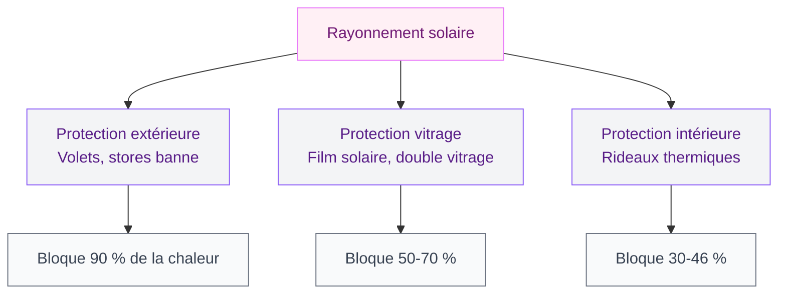
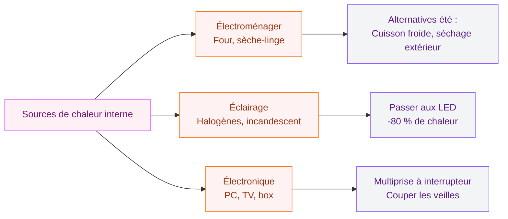
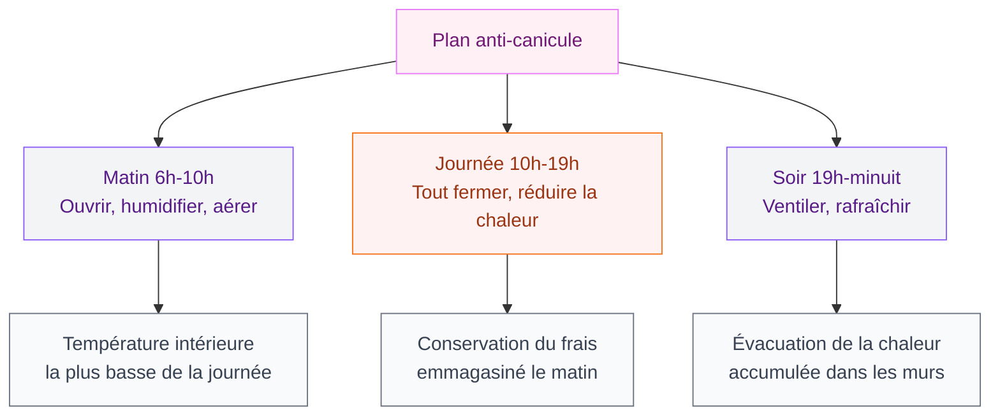

# Pièce trop chaude : 9 solutions efficaces pour retrouver la fraîcheur chez toi

Tu connais cette sensation ? Il est 22h, tu rentres chez toi après une journée déjà bien chaude, et l'intérieur de ton appart' est PIRE que dehors. L'air est lourd, étouffant, et ton premier réflexe c'est d'ouvrir grand les fenêtres - sauf que l'air extérieur est tout aussi tiède.

Que ce soit en plein été avec la canicule ou en hiver quand le chauffage collectif s'emballe, une pièce surchauffée ça rend dingue. Mauvais sommeil, fatigue, irritabilité - la température idéale se situe entre 18 et 20 °C pour dormir, et autour de 22 °C en journée. Au-delà, ton corps galère à réguler sa température.

La bonne nouvelle ? Pas besoin d'investir 2000 euros dans une clim' réversible. Voici 9 solutions concrètes, de la plus simple (gratuite, faisable ce soir) à la plus investie.

## 1. Gère ta ventilation comme une pro

  

### La technique du courant d'air croisé

La ventilation ne sert à rien si tu ouvres les fenêtres en plein après-midi à 35 °C. Le principe : ouvrir le soir, la nuit et tôt le matin (quand l'air extérieur est plus frais), puis tout fermer dès que le soleil tape.

Pour créer un vrai courant d'air efficace, ouvre des fenêtres sur deux façades opposées. L'air frais entre d'un côté, pousse l'air chaud de l'autre. Si tu n'as qu'une seule façade exposée, place un ventilateur face à la fenêtre ouverte pour forcer le flux.

> [!TIP]
> La nuit, même 2 heures de fenêtres ouvertes entre 3h et 5h du matin suffisent à faire chuter la température de 3 à 5 °C. Programme une alarme si tu dors comme une marmotte, ça vaut le coup !

### Le ventilateur stratégique

Un bon ventilateur sur pied (Rowenta Turbo Silence à 60-80 euros, ou Dyson Pure Cool à partir de 300 euros) positionné correctement fait des merveilles. L'astuce qui marche vraiment : place un grand saladier de glaçons devant le ventilateur. L'air passe sur la glace et se rafraîchit de 2 à 3 °C avant d'arriver jusqu'à toi. C'est de la clim' artisanale, mais ça dépanne.

## 2. Bloque le soleil AVANT qu'il n'entre

C'est la règle numéro un. 80 % de la chaleur qui rentre chez toi passe par les fenêtres. Bloque le rayonnement avant qu'il ne touche le verre, et tu as déjà fait la moitié du travail.

  

### Les protections extérieures - le top du top

Les volets roulants ou les stores banne restent les champions toutes catégories. Un volet fermé bloque jusqu'à 90 % du rayonnement solaire. Si tu es en location sans volets, des stores à enrouleur extérieur type screen se fixent sans perçage pour 40 à 80 euros la fenêtre.

### Les protections intérieures - le plan B

Si tu ne peux rien installer dehors, les rideaux thermiques sont ton meilleur allié. Pas les petits voilages légers - on parle de vrais [rideaux occultants avec doublure isolante](/erreurs-rideaux/). Ikea en propose de très corrects (gamme HILLEBORG à 35-50 euros la paire) et Moondream fait des rideaux thermiques certifiés qui bloquent jusqu'à 46 % de la chaleur pour 50-80 euros le panneau.

> [!WARNING]
> Les rideaux de couleur foncée absorbent la chaleur au lieu de la renvoyer. Pour un effet rafraîchissant, choisis toujours des rideaux clairs (blanc, beige, gris pâle) avec un dos réflecteur argenté.

### Le film solaire pour vitrage

Si tu es en appartement sans volets, le film anti-chaleur à coller sur les vitres est une pépite méconnue. Pour 15 à 30 euros le rouleau, tu réduis la chaleur entrante de 50 à 70 %. La marque Reflectiv propose des films miroir qui s'appliquent avec de l'eau savonneuse en 20 minutes. C'est amovible et ça ne laisse pas de trace - parfait en location.

## 3. Choisis les bons textiles et matériaux

Ta déco joue un rôle direct sur la température ressentie. En été, tout ce qui est polyester, velours, flanelle, ça piège la chaleur. Et ton beau canapé en simili cuir noir ? Un sauna personnel dès que le mercure dépasse 25 °C.

  

### Les tissus qui rafraîchissent

Le lin est le roi des fibres d'été. Il absorbe l'humidité, sèche vite et procure une sensation de frais au toucher. Pour ta literie, passe aux draps en lin lavé (La Redoute Intérieurs à 50 euros, ou Zara Home vers 60-80 euros). Le coton percale est aussi un bon choix : gamme NATTJASMIN chez Ikea à 20-35 euros.

Pour le canapé, jette un plaid en lin ou en coton léger sur l'assise. C'est rapide, ça change tout au toucher, et tu retrouves ton velours douillet dès l'automne.

> [!NOTE]
> La couleur de tes textiles influence aussi la température ressentie. Des housses de coussin blanches ou bleu clair donnent visuellement une impression de fraîcheur, même à température égale. Le cerveau associe ces teintes à l'eau et au froid - [les couleurs ont un vrai pouvoir en déco](/des-couleurs-pour-donner-de-la-profondeur-a-un-mur-ou-a-une-piece/).

## 4. Les plantes qui refroidissent l'air

Ce n'est pas un mythe. Les plantes d'intérieur rafraîchissent l'air par évapotranspiration : elles rejettent de l'eau par leurs feuilles, ce qui humidifie et refroidit l'air ambiant.

  

### Les championnes de la fraîcheur

- **Ficus elastica (caoutchouc)** : grandes feuilles, forte évapotranspiration. 15-25 euros en jardinerie.
- **Spathiphyllum (fleur de lune)** : parfait à l'ombre, très bon purificateur d'air. 10-20 euros.
- **Aloe vera** : libère de l'oxygène la nuit, idéal dans une chambre.
- **Areca (palmier d'intérieur)** : la NASA l'a classé comme l'un des meilleurs humidificateurs naturels.

Regroupe 3 à 5 plantes dans la pièce la plus chaude. L'effet combiné peut faire baisser la température de 1 à 2 °C dans un rayon de 2 mètres. Additionné à d'autres astuces, ça compte.

## 5. Réduis les sources de chaleur internes

On n'y pense pas assez, mais ton intérieur fabrique sa propre chaleur. Et pas qu'un peu.

  

### Les appareils qui chauffent en silence

- **Le four** : un four à 200 °C pendant 1h augmente la température de la cuisine de 2 à 4 °C. En été, privilégie les salades, les plats froids, ou le micro-ondes (qui dégage beaucoup moins de chaleur).
- **Le sèche-linge** : c'est un radiateur déguisé. Fais sécher ton linge dehors ou sur un étendoir.
- **L'éclairage** : les ampoules à incandescence et les halogènes transforment 90 % de l'énergie en chaleur. Passe aux LED - elles chauffent 5 fois moins et consomment 80 % d'électricité en moins.
- **L'ordinateur** : un PC de bureau dégage entre 100 et 300 watts de chaleur. Si tu bosses de chez toi, déplace ton bureau dans la pièce la plus fraîche, ou [pense à repenser ton espace de travail](/fabriquer-un-bureau-avec-des-caissons/).

> [!IMPORTANT]
> Coupe tous les appareils en veille. Un décodeur TV, une box internet, un chargeur branché à vide - tout ça produit de la chaleur 24h/24. Branche-les sur une multiprise avec interrupteur pour tout couper d'un geste.

## 6. Isole intelligemment (même en location)

L'isolation, c'est pas que pour l'hiver. Un appartement mal isolé sous les toits peut atteindre 40 °C en été à cause du rayonnement solaire sur la toiture. Même si tu ne peux pas faire de gros travaux, il existe des solutions accessibles.

### Solutions légères

- **Les joints de fenêtre** : si tu sens de l'air chaud passer autour du cadre, un rouleau de joint adhésif mousse (5 euros chez Bricorama) empêche l'air extérieur de s'infiltrer quand tu fermes en journée.
- **Le boudin de porte** : même principe sous les portes. 3 euros et ça marche.
- **La peinture réflective** : pour un mur très exposé, il existe des peintures blanches à base de céramique (Thermacote, Enercool) qui réfléchissent une partie du rayonnement. Compte 35 à 50 euros le litre.

### Si tu es propriétaire

Là, tu peux investir dans de l'isolation par l'extérieur (ITE) ou le remplacement des fenêtres par du double vitrage à contrôle solaire. L'investissement est lourd (entre 8000 et 15000 euros pour l'ITE d'un appartement en dernier étage), mais les aides comme MaPrimeRénov' peuvent couvrir 40 à 75 % du coût selon tes revenus. Le gain de confort est spectaculaire : -5 à -8 °C dans les pièces sous toit.

## 7. Le rafraîchisseur d'air - l'alternative éco à la clim'

Si la ventilation seule ne suffit pas, le rafraîchisseur d'air évaporatif est un bon compromis. Il fonctionne en faisant passer l'air sur un tampon humide, ce qui le refroidit de 3 à 5 °C. Pas de gaz réfrigérant, pas de gaine à installer, une consommation de 60 à 100 watts (contre 1000 à 2500 watts pour une clim' mobile).

Les modèles corrects commencent à 80 euros (Klarstein Maxfresh à 100 euros) et les plus performants tournent autour de 200-250 euros (Honeywell CL30XC). Attention : ils sont vraiment efficaces uniquement quand l'air est sec. En climat humide (bord de mer, jour d'orage), l'évaporation marche moins bien.

## 8. Optimise l'aménagement de ta pièce

La disposition de tes meubles a un impact direct sur la circulation de l'air et la température ressentie.

### Dégage les bouches d'aération

C'est bête mais ça arrive tout le temps : un meuble collé contre une bouche de VMC bloque la circulation. Vérifie que tes grilles d'aération sont bien dégagées et propres. Un coup d'aspirateur mensuel fait la différence.

### Éloigne les meubles des murs extérieurs

En été, les murs exposés au soleil emmagasinent la chaleur et la restituent comme un radiateur. Si ton lit ou ton canapé est collé contre un mur plein sud, tu cuis littéralement. Déplace-le de 10-15 cm pour créer un espace d'air tampon.

### Le sol compte aussi

Le carrelage et la pierre sont naturellement frais - c'est pour ça que les maisons méditerranéennes en sont couvertes. Si tu as du parquet ou de la moquette dans ta pièce la plus chaude, retire le tapis épais que tu gardes pour l'hiver. Ce petit geste change la température au sol de 2 à 3 °C ressentis.

## 9. Le plan anti-canicule complet

Quand la météo annonce une vague de chaleur (plus de 35 °C pendant 3 jours consécutifs), il faut passer en mode "stratégie globale".

### Le matin (6h-10h)

- Ouvre tout grand pour faire entrer l'air frais
- Humidifie le sol (carrelage, terrasse) avec une serpillière mouillée - l'évaporation refroidit l'air
- Arrose tes plantes généreusement

### La journée (10h-19h)

- Ferme tout : fenêtres, volets, rideaux thermiques
- Éteins le maximum d'appareils
- Utilise le ventilateur + glaçons dans les pièces occupées
- Reste dans la pièce la plus fraîche (souvent orientée nord ou en rez-de-chaussée)

### Le soir (19h-minuit)

- Ouvre les fenêtres quand la température extérieure passe sous celle de l'intérieur
- Crée un courant d'air croisé
- Passe un coup de serpillière fraîche au sol

> [!TIP]
> Accroche un drap mouillé devant ta fenêtre ouverte le soir. L'air qui passe à travers se rafraîchit par évaporation - c'est la technique utilisée depuis des siècles dans les pays chauds et ça fonctionne vraiment bien.

## Bonus : le cas spécial de la chambre trop chaude la nuit

C'est souvent la pièce qui pose le plus de problèmes, parce que la qualité du sommeil en dépend directement. Au-dessus de 24 °C, ton corps n'arrive plus à baisser sa température interne pour déclencher l'endormissement. Résultat : tu tournes dans ton lit, tu transpires, tu dors mal.

Quelques réflexes spécifiques pour la chambre :

- **Draps en percale ou en lin** : le satin et le polyester sont à bannir en été
- **Oreiller en sarrasin** : les cosses ne retiennent pas la chaleur contrairement à la mousse à mémoire de forme. Compte 35-50 euros (marques Zizzz ou Kipli)
- **Douche tiède avant le coucher** : pas froide (ça fait remonter la température du corps par réaction), tiède pour aider le corps à évacuer la chaleur
- **La bouillotte inversée** : remplis ta bouillotte d'eau froide ou mets-la au congélateur 2h avant le coucher. Glisse-la dans le lit 30 minutes avant d'y aller

La température idéale pour bien dormir se situe entre 16 et 19 °C. Si tu n'arrives pas à descendre sous 24 °C malgré tout, un [aménagement malin de la chambre](/decoration-de-la-chambre-a-coucher-2026-tendances-et-photos/) et un ventilateur silencieux (moins de 40 dB) brassé sur toi toute la nuit feront la différence.

## Sur le meme theme

- [décoration art déco](/50-idees-de-decoration-art-deco/)

## FAQ

### À quelle température une pièce est-elle trop chaude ?

En journée, au-delà de 26 °C on considère qu'une pièce est inconfortablement chaude pour y travailler ou se détendre. Pour dormir, les spécialistes du sommeil fixent la limite à 20-21 °C, avec un idéal entre 16 et 19 °C. Au-dessus de 28 °C en intérieur, les risques pour la santé augmentent, surtout pour les enfants et les personnes âgées.

### Comment rafraîchir une pièce sans climatisation ?

Trois gestes clés : fermer volets et rideaux en journée (bloque 80-90 % de la chaleur solaire), ventiler uniquement la nuit quand l'air est plus frais, et réduire les sources de chaleur internes (LED, pas de four, veilles coupées). Un ventilateur avec des glaçons peut faire baisser la température ressentie de 2 à 3 °C.

### Le ventilateur refroidit-il vraiment l'air ?

Non, un ventilateur ne baisse pas la température de l'air. Il accélère l'évaporation de la sueur sur ta peau, ce qui donne une sensation de fraîcheur de 3 à 4 °C. C'est pour ça qu'il ne sert à rien dans une pièce vide. Combiné avec des glaçons ou un linge humide, il peut refroidir l'air de 2 à 3 °C.

### La climatisation mobile, bonne ou mauvaise idée ?

Un climatiseur mobile (300-600 euros) peut dépanner, mais c'est bruyant (55-65 dB), gourmand en électricité (environ 100 à 150 euros par été) et il faut évacuer l'air chaud par une fenêtre - ce qui crée une entrée d'air chaud. Si tu investis, préfère un modèle split (unité intérieure + extérieure) bien plus performant, mais il faut l'accord du syndic en copropriété.
