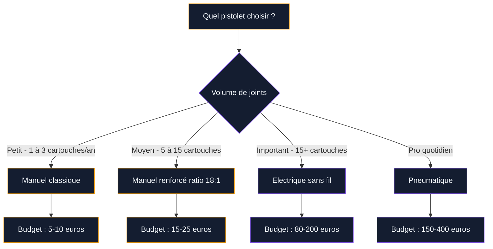

Tu as des courants d'air autour de tes fenêtres, un filet de lumière sous la porte d'entrée ou un joint de baignoire qui commence à noircir ? Le pistolet à calfeutrer, c'est l'outil qui va régler tout ça. Mastic, silicone, acrylique, polyuréthane - il permet d'appliquer proprement n'importe quel produit d'étanchéité en cartouche. Et le mieux : c'est un outil simple, pas cher, et accessible même si tu n'as jamais bricolé de ta vie.

Je t'explique ici comment choisir le bon modèle, bien l'utiliser, et surtout éviter les bavures qui gâchent le rendu.

## Qu'est-ce qu'un pistolet à calfeutrer exactement ?

C'est un outil en forme de pistolet qui accueille une cartouche de mastic ou de silicone (format standard 310 ml). Tu appuies sur la gâchette, une tige pousse le fond de la cartouche, et le produit sort par la buse. Simple, mécanique, efficace.

Il existe trois grandes familles :

- **Manuel à tige** : le plus courant, entre 5 et 25€. Tu presses la gâchette, la tige avance cran par cran. Suffisant pour 90% des travaux maison.
- **Electrique sans fil** : fonctionne sur batterie 18 ou 20V. Le moteur pousse la tige à ta place. Idéal si tu as beaucoup de joints à faire. Compte 80 à 200€ selon la marque.
- **Pneumatique** : branché sur un compresseur. Réservé aux pros qui posent des joints toute la journée. Prix : 150 à 400€ hors compresseur.

Le choix dépend de la fréquence d'utilisation et du volume de travail. Pour refaire le joint de ta baignoire une fois par an, un modèle manuel à 10€ fait le job. Pour isoler toutes les fenêtres d'une maison, le modèle électrique te fera gagner un temps considérable - et surtout, il évitera la fatigue dans les mains.

## Les types de pistolets en détail

### Le pistolet manuel classique

C'est le modèle que tu trouves dans tous les rayons bricolage. Le berceau en acier moulé accueille la cartouche, et la tige crantée pousse le piston quand tu actionnes la gâchette.

**Ce qu'il faut vérifier avant d'acheter :**

- **Le ratio de poussée** : exprimé en rapport (ex. 12:1, 18:1, 26:1). Plus le chiffre est élevé, moins tu forces sur la gâchette. Un ratio de 18:1 ou plus est confortable pour les mastics épais.
- **La décompression automatique** : un système (souvent un petit levier au pouce) qui relâche la pression quand tu arrêtes de presser. Sans ça, le mastic continue à couler après chaque arrêt, et tu te retrouves avec des bavures partout.
- **Le berceau ouvert ou fermé** : le berceau fermé (en demi-cylindre) maintient mieux les cartouches souples. Le berceau ouvert (en tige) est plus léger et plus polyvalent.

Chez Leroy Merlin, un pistolet manuel basique coûte 5 à 8€. Un modèle renforcé avec décompression automatique tourne autour de 15 à 25€. La marque Sika propose des modèles fiables dans cette gamme.

> [!TIP]
> Pour du silicone standard, un ratio de 12:1 suffit. Pour du mastic polyuréthane ou du mastic-colle (beaucoup plus épais), vise un ratio de 18:1 minimum. Sinon tu vas te cramer les doigts en dix minutes.

### Le pistolet électrique sans fil

Le Milwaukee M12 (environ 120-150€ nu, sans batterie) est la référence chez les artisans. Mais d'autres marques comme Makita, Bosch ou Ryobi proposent des modèles compatibles avec leurs gammes de batteries existantes.

**Avantages du sans fil :**

- Débit constant et régulier, pas de pression inégale
- Vitesse de débit réglable (pratique pour adapter le cordon de joint)
- Pas de fatigue, même après 20 cartouches
- Décompression automatique intégrée

**Limites :**

- Le prix, évidemment
- Le poids (1,5 à 2,5 kg avec batterie)
- Un modèle de plus dans la collection d'outils sans fil

Si tu as déjà un écosystème de batteries (Makita 18V, DeWalt 20V, Bosch 18V...), regarde d'abord si la marque propose un pistolet compatible. Acheter une batterie et un chargeur en plus, ça fait vite grimper la note.

> [!NOTE]
> Un pistolet électrique n'est pas réservé aux pros. Si tu rénoves un appartement entier ou que tu [aménages ta salle de bain](https://www.cristallina.fr/guides/salle-de-bain/amenager-une-salle-de-bain-en-2026-styles-et-conseils/), tu vas poser des dizaines de mètres de joints. Le confort d'un modèle électrique change vraiment la donne.

### Le pistolet pneumatique

On en parle pour être complet, mais à moins que tu bosses sur des chantiers régulièrement, tu n'en as pas besoin. Il fonctionne à l'air comprimé, offre un débit ultra-régulier, et permet d'enchaîner les cartouches sans la moindre fatigue. Les modèles 3M professionnels sont utilisés dans l'industrie automobile et l'aéronautique.

## Quel mastic utiliser avec ton pistolet ?

Le pistolet, c'est juste le support. Le résultat final dépend surtout du produit que tu mets dedans. Voici les principaux types de mastic en cartouche :

**Silicone sanitaire** : pour les joints de salle de bain, cuisine, douche. Résiste à l'eau et aux moisissures (choisir un modèle antifongique). Ne se peint pas. Prix : 5 à 12€ la cartouche.

**Acrylique** : pour les joints intérieurs - tour de fenêtre, plinthes, fissures légères. Se peint facilement, se lisse à l'eau. Moins souple que le silicone. Prix : 3 à 8€.

**Polyuréthane (PU)** : le plus costaud. Adhère sur presque tout (béton, bois, métal, PVC), très résistant aux mouvements. Idéal pour l'extérieur et les joints de dilatation. Attention, il tache et ne s'enlève que mécaniquement. Prix : 8 à 15€.

**Mastic-colle hybride** : combine collage et étanchéité. Les produits type "MS polymère" (Sika, Bostik) sont très polyvalents. Se peignent, restent souples, résistent à l'eau. Prix : 10 à 18€.

Si tu travailles sur de l'isolation - par exemple pour [calfeutrer une montée d'escalier](https://www.cristallina.fr/guides/decoration/comment-isoler-une-montee-descalier/) - un mastic acrylique ou polyuréthane sera plus adapté qu'un silicone.

## Comment utiliser un pistolet à calfeutrer : la méthode étape par étape

### 1. Préparer la cartouche

Coupe l'embout de la cartouche en biseau, à 45 degrés, avec un cutter. Le diamètre de la coupe détermine l'épaisseur du cordon : coupe petit (3-4 mm) pour un joint fin, plus large (6-8 mm) pour un joint de baignoire.

Perce la membrane intérieure avec la tige métallique intégrée au pistolet (la plupart des modèles en ont une) ou avec un long clou.

Insère la cartouche dans le berceau, embout vers l'avant. Pousse la tige jusqu'à ce qu'elle touche le fond du piston.

### 2. Préparer la surface

C'est là que beaucoup de gens bâclent. Un joint posé sur une surface poussiéreuse, grasse ou humide ne tiendra pas.

- Retire l'ancien joint au cutter ou avec un grattoir
- Nettoie avec de l'alcool ménager ou un dégraissant
- Sèche bien la surface
- Pose du scotch de masquage de chaque côté du joint (c'est le secret d'un joint parfait et bien droit)

### 3. Appliquer le joint

Tiens le pistolet à 45 degrés par rapport à la surface. Appuie sur la gâchette avec une pression régulière et avance lentement, sans t'arrêter. Le cordon doit être continu - si tu t'arrêtes au milieu, tu auras une surépaisseur.

**Astuce de pro** : tire le pistolet vers toi plutôt que de le pousser. Le cordon se dépose mieux et tu vois où tu en es.

### 4. Lisser le joint

Tu as 5 à 10 minutes avant que le produit commence à former une peau. Trempe ton doigt dans de l'eau savonneuse (pour le silicone) ou simplement dans de l'eau (pour l'acrylique) et lisse le joint en un seul passage. Un seul. Si tu repasses plusieurs fois, tu vas arracher le produit et créer des irrégularités.

Des outils de lissage en plastique existent pour 3 à 5€ le lot. Ils donnent un profil plus régulier que le doigt, surtout pour les joints larges.

### 5. Retirer le scotch et nettoyer

Retire le scotch de masquage immédiatement après le lissage, avant que le mastic sèche. Tire-le d'un geste franc, en tirant vers l'extérieur du joint.

Ensuite, actionne la décompression du pistolet (le levier au pouce ou la rotation de la tige) pour que le mastic arrête de couler. C'est un réflexe à prendre dès le début.

> [!WARNING]
> Le silicone frais se nettoie avec du white spirit ou de l'acétone. Une fois sec, c'est grattage mécanique obligatoire. Protège tes vêtements et tes surfaces, parce que ça ne pardonne pas.

## Les erreurs que tout le monde fait (et comment les éviter)

**Couper l'embout trop large** : tu te retrouves avec un cordon de 12 mm alors que ton joint fait 5 mm. Coupe toujours plus petit que ce dont tu penses avoir besoin. Tu peux élargir, mais pas rétrécir.

**Aller trop vite** : le mastic n'a pas le temps de se déposer correctement et tu obtiens un cordon irrégulier avec des "vagues". Prends ton temps, avance à vitesse constante.

**Oublier la décompression** : tu poses le pistolet deux secondes, et quand tu regardes, il y a une flaque de silicone sur le sol. Active systématiquement la décompression à chaque pause.

**Lisser plusieurs fois** : le premier passage, c'est le bon. Chaque passage supplémentaire arrache du produit et crée des traces. Un seul geste, fluide, du début à la fin.

**Ne pas nettoyer le pistolet** : les résidus de mastic sèchent dans le mécanisme et bloquent la tige. Un coup de chiffon après chaque utilisation, et ton pistolet durera des années.

## Entretien et conservation

Un pistolet manuel en acier moulé ne demande quasi aucun entretien. Un coup de chiffon après usage, un peu d'huile sur la tige de temps en temps si elle force, et c'est tout.

Pour les cartouches entamées, enfonce un clou dans l'embout pour empêcher l'air d'entrer. Un mastic silicone ouvert se conserve 2 à 4 semaines comme ça. L'acrylique sèche plus vite - compte 1 à 2 semaines maximum.

Les pistolets électriques demandent un peu plus d'attention : vérifie que la batterie est chargée avant chaque chantier, nettoie le mécanisme de poussée, et range-le dans son coffret pour protéger l'électronique.

> [!TIP]
> Si ta cartouche de silicone est bouchée après quelques jours, ne jette pas tout. Coupe l'embout 1 cm plus haut pour dépasser le bouchon séché. Tu perds un peu de précision sur le diamètre, mais tu sauves le reste de la cartouche.

## Où acheter et à quel prix ?

Voici un récapitulatif des prix constatés en 2026 :

- **Pistolet manuel basique** (berceau ouvert, sans décompression) : 5-8€ chez Brico Dépôt, Castorama
- **Pistolet manuel renforcé** (acier moulé, décompression, ratio 18:1) : 15-25€ chez Leroy Merlin, Amazon
- **Pistolet électrique entrée de gamme** (Ryobi, Einhell) : 60-90€ avec batterie
- **Pistolet électrique pro** (Milwaukee M12, Makita) : 120-200€ nu, 180-280€ avec batterie
- **Pistolet pneumatique** : 150-400€ (+ compresseur si tu n'en as pas)

Pour un usage ponctuel, un modèle à 15€ avec décompression automatique est le meilleur rapport qualité-prix. C'est ce que je recommande quand on me demande.

Si tu fais des travaux d'[enduit sur parpaing](https://www.cristallina.fr/guides/decoration/comment-enduir-un-mur-en-parpaing/) ou de [finition murale](https://www.cristallina.fr/guides/decoration/recouvrir-parpaings/), un pistolet à calfeutrer te servira aussi pour boucher les petits trous et les raccords entre matériaux avant la finition.

## Sur le meme theme

- [enduire un mur en parpaing](/guides/decoration/comment-enduir-un-mur-en-parpaing/)
- [crépir un mur intérieur](/guides/decoration/crepir-un-mur-interieur/)
- [isolation dalle béton](/guides/decoration/isolation-dune-dalle-en-beton-techniques-options-disolation-et-cout/)
- [comment recouvrir des parpaings](/guides/decoration/recouvrir-parpaings/)
- [peindre du lino](/guides/decoration/peindre-lino/)

## Questions fréquentes

**Un pistolet à calfeutrer, ça marche avec toutes les cartouches ?**
Oui, pour les cartouches au format standard de 310 ml (le plus courant en grande surface bricolage). Certains pistolets acceptent aussi les cartouches de 400 ml ou 600 ml, mais vérifie la compatibilité avant d'acheter. Les poches souples (saucisses) nécessitent un adaptateur spécifique.

**Comment éviter que le mastic coule quand j'arrête de presser ?**
Utilise un pistolet avec décompression automatique (levier ou rotation de la tige). Sur un modèle sans cette fonction, tu peux relâcher la pression manuellement en tirant la tige vers l'arrière d'un cran. C'est un geste à intégrer dès tes premières utilisations.

**Peut-on appliquer du mastic sans pistolet ?**
Techniquement oui, avec des tubes de mastic à presser (type tube de dentifrice). Mais la pression est irrégulière et le résultat rarement propre. Pour quelques euros de plus, un pistolet manuel te donnera un résultat bien supérieur. L'investissement est vraiment minime.

**Quelle est la durée de vie d'un joint en silicone ?**
Un joint silicone sanitaire bien posé dure 8 à 12 ans en conditions normales. En zone très humide (douche utilisée quotidiennement), compte plutôt 5 à 8 ans. Quand le joint commence à noircir ou à se décoller, il est temps de le refaire.
