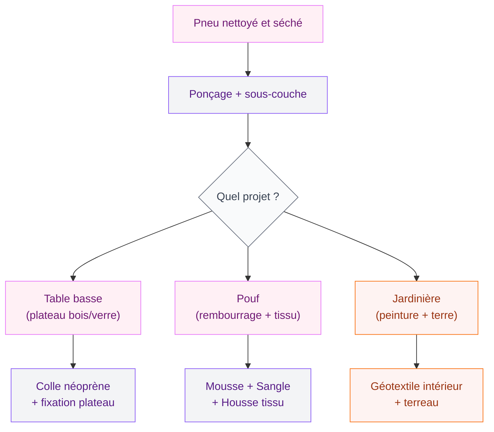
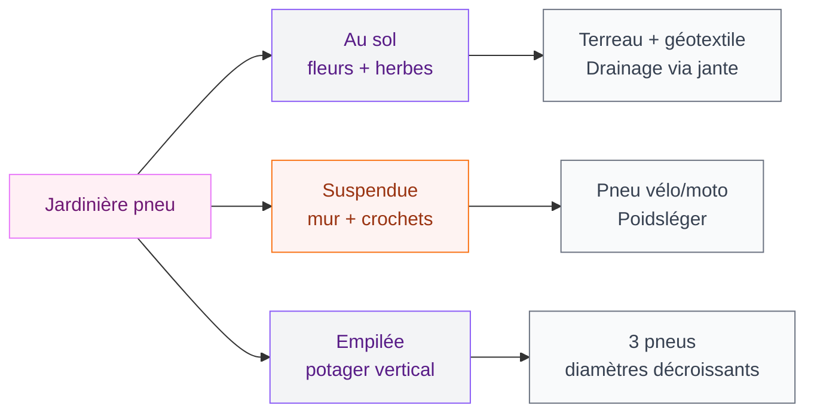

On a tous eu ce moment bizarre : le garagiste te tend tes vieux pneus après un changement et tu te demandes quoi en faire. Les jeter, c'est dommage - et franchement pas top pour la planète. Les garder dans la cave, ça finit par envahir tout l'espace. Alors autant les transformer en quelque chose de beau, non ?

Les pneus recyclés en déco, c'est une tendance qui s'installe vraiment depuis quelques années. Et pour de bonnes raisons : c'est costaud, résistant aux intempéries, et ça donne un résultat super original. Que tu aies un jardin, une terrasse ou même un intérieur en quête d'une touche industrielle, il y a forcément une idée qui te correspond.

Je vais te guider à travers les projets les plus accessibles, avec des conseils concrets sur les matériaux à utiliser et les étapes à suivre. Pas besoin d'être un expert en bricolage - la plupart de ces projets se réalisent en un week-end.

## Pourquoi recycler ses pneus en déco ?

Avant de se lancer, une petite mise en contexte. Un pneu usagé met environ 1000 ans à se décomposer naturellement. En France, des millions de pneus sont collectés chaque année via des filières de recyclage, mais une bonne partie finit quand même dans des circuits peu vertueux.

Transformer un pneu en objet décoratif, c'est donc un geste concret. Et contrairement à ce qu'on pourrait croire, le résultat peut être vraiment joli - même à l'intérieur. La clé, c'est la préparation.

> [!NOTE]
> Un pneu bien nettoyé et peint avec une peinture adaptée ne dégage aucune odeur. Le caoutchouc libère des composés volatils surtout quand il est neuf ou exposé à une forte chaleur. Un vieux pneu à température ambiante, c'est stable.

## Préparer un pneu pour la déco : les étapes à ne pas sauter

La préparation, c'est 80% du résultat. Si tu bâcles cette étape, ta déco tiendra moins longtemps et aura moins de cachet.

**Nettoyage en profondeur**

Commence par frotter le pneu avec une brosse dure et de l'eau savonneuse. La terre, la graisse et les résidus de route s'incrustent dans le caoutchouc - un simple rinçage ne suffit pas. Certains bricoleurs utilisent du white spirit pour les taches grasses, puis rincent abondamment. Laisse sécher au moins 24h à l'air libre.

**Ponçage léger**

Un ponçage rapide au papier de verre grain 80 permet à la peinture de mieux accrocher. Passe sur toute la surface en insistant sur les zones lisses. Rince et laisse sécher à nouveau.

**Peinture adaptée**

Pour l'extérieur, utilise une peinture caoutchouc ou une peinture multi-supports résistante aux UV. La marque Rust-Oleum propose des sprays "peinture pour pneus" autour de 12-15 euros la bombe, qui tiennent très bien dans le temps. Pour l'intérieur, une peinture acrylique classique suffit.

> [!TIP]
> Applique toujours une sous-couche grise avant la couleur finale sur un pneu noir. Le caoutchouc est très sombre et absorbe les teintes claires. Deux couches de sous-couche + deux couches de couleur, c'est le minimum pour un résultat propre.

## Les tables basses : le projet le plus populaire

La table basse en pneu, c'est LE projet DIY pneu par excellence. Et pour cause : le résultat est vraiment beau et fonctionnel.

**Version simple : pneu + plateau**

Prends un pneu de voiture standard, nettoie-le, peins-le dans la couleur de ton choix. Coupe ensuite un plateau rond dans du MDF ou de la contreplaqué (épaisseur 18 mm minimum pour tenir le poids). Le diamètre idéal correspond à l'extérieur du pneu plus 5-10 cm. Fixe le plateau avec de la colle époxy ou des vis.

Pour une finition pro, pose du tissu ou de la corde de sisal à l'intérieur du pneu et colle-y une planche de bois pour créer un espace de rangement bas. La marque Bois & Matières chez Leroy Merlin propose des plateaux ronds tout prêts autour de 20-30 euros selon le diamètre.

**Version empilée : deux ou trois pneus**

Empile deux pneus de même taille (ou de tailles légèrement différentes pour un effet original), colle-les ensemble avec de la colle néoprène forte, et pose un plateau en bois ou en verre sur le dessus. Le verre donne un effet plus chic - prévois un verre trempé d'au moins 8 mm pour la sécurité.

## Les poufs et sièges : confort + originalité

Un pneu de voiture rembourré fait un pouf parfait. Solide, bas, et clairement original.

**Ce qu'il te faut**

- 1 pneu (de voiture ou de moto selon la taille voulue)
- De la mousse à découper (densité 30 kg/m³ minimum pour le confort)
- Du tissu au choix - 1 mètre suffit généralement
- Une planche de contreplaqué 12 mm pour le fond
- Colle à mousse, agrafeuse ou colle textile

**Les étapes**

Découpe deux disques de contreplaqué : un pour le dessus du pneu (le siège) et un pour le dessous (le fond). Coupe la mousse en cylindre à la forme de la jante intérieure et colle-la sur le disque supérieur. Recouvre l'ensemble avec le tissu choisi en tirant bien pour éviter les plis, et fixe-le sous la planche avec une agrafeuse. Glisse le fond sous le pneu - il tient par friction.

Pour le tissu, jette un oeil à la gamme Tissu Papi en ligne : leur velours côtelé tient très bien dans le temps et le rendu est top. Comptez 8-15 euros le mètre.

> [!WARNING]
> Évite les pneus de camion ou de tracteur pour des projets de siège intérieur : leur poids rend le déplacement très difficile et le caoutchouc industriel a tendance à laisser des traces noires sur le sol.

## Les jardinières et bacs de plantes

Pour le jardin ou la terrasse, les pneus recyclés font d'excellentes jardinières. Résistants à la pluie, au gel (dans une certaine mesure), et très faciles à customiser.

**Jardinière au sol**

Pose ton pneu peint à plat ou incliné. Remplis l'intérieur avec un géotextile (pour éviter que la terre ne s'échappe par la jante) puis du terreau. Tu peux aussi poser le pneu sur une palette pour surélever l'ensemble. C'est idéal pour les plantes couvre-sol, les herbes aromatiques ou les fleurs basses.

**Jardinière suspendue**

Un pneu de vélo ou de moto, peint en blanc, accroché à un mur avec deux crochets solides : ça fait une jardinière murale très graphique. Parfait pour les zones où tu veux délimiter l'espace - en accord avec l'idée de [poser des bordures dans le jardin](/guides/exterieur/poser-bordure-jardin-sans-beton/), tu peux créer une vraie cohérence visuelle entre tes bordures et tes jardinières DIY.

**Tour de plantes empilée**

Prends trois pneus de diamètres décroissants (par exemple 60, 50, 40 cm), peins-les dans des nuances d'une même couleur, empile-les et plante dans chacun. Ça donne un potager vertical très décoratif. Parfait pour les tomates cerises, les fraises, ou les herbes aromatiques sur une terrasse.

## Déco murale et sculpture de jardin

Au-delà du fonctionnel, les pneus peuvent devenir de vraies pièces décoratives.

**Cadre végétal mural**

Découpe un pneu dans le sens de l'épaisseur pour obtenir des anneaux. Accroches-en plusieurs à un mur de clôture ou de terrasse, en variant les tailles. Peins-les en blanc ou en noir mat, et laisse pousser du lierre ou une autre plante grimpante à travers. L'effet graphique est très urbain.

**Sculptures de jardin**

Des pneus découpés et assemblés peuvent former des animaux, des fleurs ou des formes abstraites. Le style "upcycling art" est très tendance dans les jardins contemporains - ça s'inscrit bien dans une déco jardin un peu audacieuse, dans l'esprit d'une [décoration marocaine moderne](/guides/decoration/decoration-marocaine-moderne-ou-classique/) qui mélange les textures et les matières brutes avec des formes travaillées.

Pour les sculptures, deux outils à avoir : un cutter à lame céramo (type Stanley) et une scie sauteuse avec lame métal. Le caoutchouc est résistant mais se découpe bien avec les bons outils.

## Idées pour l'intérieur : oser le pneu dans le salon

Utiliser des pneus à l'intérieur, ça peut sembler bizarre. Mais avec la bonne approche, le résultat peut être franchement beau.

**La table basse chic**

Un pneu peint en blanc cassé ou en noir mat, surmonté d'un plateau en verre teinté ou en marbre : ça fait une table basse qui en jette. Dans un intérieur industriel ou scandinave, c'est parfaitement cohérent. Le résultat ressemble à des tables qu'on trouve chez des enseignes comme Maisons du Monde pour 150-200 euros, et tu l'as fait pour 30 euros.

**Le tabouret de bureau**

Un pneu de moto, rembourré et recouvert de cuir synthétique noir, fait un tabouret de bureau bas très stylé. Parfait pour une pièce avec une déco industrielle. Ajoute des petits pieds en métal vissés sous une planche de fond (chez Ikea, les pieds Capita font exactement ça pour 15 euros) et tu as quelque chose de vraiment about.

**Les bougies et photophores**

Un petit pneu de vélo, posé à plat et peint, fait un socle original pour des bougies piliers ou des photophores. Place-en trois sur une table basse, dans des tailles différentes, avec des bougies parfumées - effet garanti. Si tu aimes les plantes dans ton salon, tu peux aussi glisser un petit pot de [Peperomia Hope](/guides/la-peperomia-hope/) à l'intérieur d'un petit anneau de pneu pour un effet terrarium vintage.

> [!IMPORTANT]
> N'utilise jamais de pneu à l'intérieur pour un usage permanent si la pièce est mal ventilée. Même si les vieux pneus ne dégagent presque rien à température ambiante, une bonne aération reste une bonne pratique pour toute déco avec des matériaux industriels recyclés.

## Combien ça coûte vraiment ?

Un des avantages du pneu recyclé en déco, c'est le coût. Voilà une estimation honnête pour les projets les plus courants :

- Pneu usagé récupéré chez le garagiste : gratuit à 5 euros
- Peinture spray caoutchouc Rust-Oleum : 12-15 euros la bombe (couvre 2-3 pneus)
- Plateau MDF rond (60 cm) pour table basse : 20-25 euros chez Leroy Merlin
- Verre trempé sur mesure (60 cm) : 40-60 euros chez un vitrier
- Mousse pour pouf (50x50x15 cm) : 15-20 euros chez Rideaux & Accessoires ou Mondial Tissus
- Tissu velours pour pouf (1 m) : 8-15 euros

**Budget total pour une table basse** : entre 30 et 80 euros selon les finitions. Une table basse équivalente dans le commerce coûte entre 80 et 300 euros.

> [!TIP]
> Demande toujours chez plusieurs garagistes avant d'acheter des pneus usagés. La plupart sont ravis de s'en débarrasser gratuitement - ça leur évite des frais de recyclage. Certains centres auto comme Norauto ou Midas acceptent de te donner les pneus changés si tu le demandes poliment.

## Les projets pour enfants au jardin

Le pneu de jeu, c'est un classique. Mais au-delà de la balançoire basique, il y a plein d'autres idées sympas.

**Parcours de motricité**

Des pneus enterrés aux deux tiers dans le sol, en cercles ou en ligne, font un excellent parcours de motricité pour les enfants. Peins-les en couleurs vives (rouge, jaune, bleu) avec une peinture acrylique résistante. C'est le genre de projet qu'on voit dans les aires de jeux naturels et que tu peux recréer dans ton jardin pour moins de 50 euros.

**Bac à sable original**

Un grand pneu de tracteur (si tu en trouves un) enterré légèrement dans le sol, rempli de sable de jeu : ça fait un bac à sable adorable avec une forme ronde naturelle. Le pneu de tracteur se trouve parfois gratuitement dans les fermes ou sur les sites de dons type Leboncoin.

**Potager-jeu**

Des pneus peints en blanc, disposés en carré ou en rond, font un potager enfant parfait. Chaque pneu devient une parcelle avec une plante différente. Les enfants apprennent à jardiner et les pneus délimitent clairement les zones - une idée qui s'associe bien à la création de [bordures de jardin sans béton](/guides/exterieur/poser-bordure-jardin-sans-beton/) pour un espace extérieur cohérent et bien organisé.

## FAQ

**Est-ce que les pneus sont dangereux à utiliser en déco intérieure ?**

Un pneu usagé et bien nettoyé ne présente pas de danger particulier à température ambiante dans une pièce ventilée. Les risques liés aux composés du caoutchouc concernent surtout les pneus neufs, la combustion ou une exposition prolongée à forte chaleur. Pour l'intérieur, assure-toi simplement que le pneu est propre et que la pièce est aérée régulièrement.

**Quelle peinture utiliser pour un pneu extérieur ?**

Privilégie une peinture spéciale caoutchouc ou multi-supports résistante aux UV et aux intempéries. Les sprays Rust-Oleum ou Montana Cans tiennent très bien. Évite les peintures intérieures classiques qui s'écailleront rapidement à l'extérieur.

**Comment coller deux pneus ensemble ?**

La colle néoprène (type Sader Néoprène Contact) est la plus efficace sur caoutchouc. Applique une couche sur les deux surfaces, laisse sécher 5-10 minutes avant d'assembler et appuie fermement. Pour les assemblages soumis à des charges importantes (table basse), renforce avec des vis à travers les flancs.

**Peut-on peindre un pneu sans ponçage ?**

Techniquement oui, mais le résultat tiendra moins longtemps. Le ponçage crée une micro-rugosité qui améliore l'adhérence de la peinture. Si tu veux quelque chose qui dure plusieurs années à l'extérieur, ne saute pas cette étape.

**Où trouver des pneus usagés gratuitement ?**

Chez les garagistes et centres auto (Norauto, Midas, Speedy), les déchetteries (si elles acceptent les dons), sur Leboncoin ou Facebook Marketplace dans la catégorie "dons", ou dans les fermes pour les pneus agricoles.
