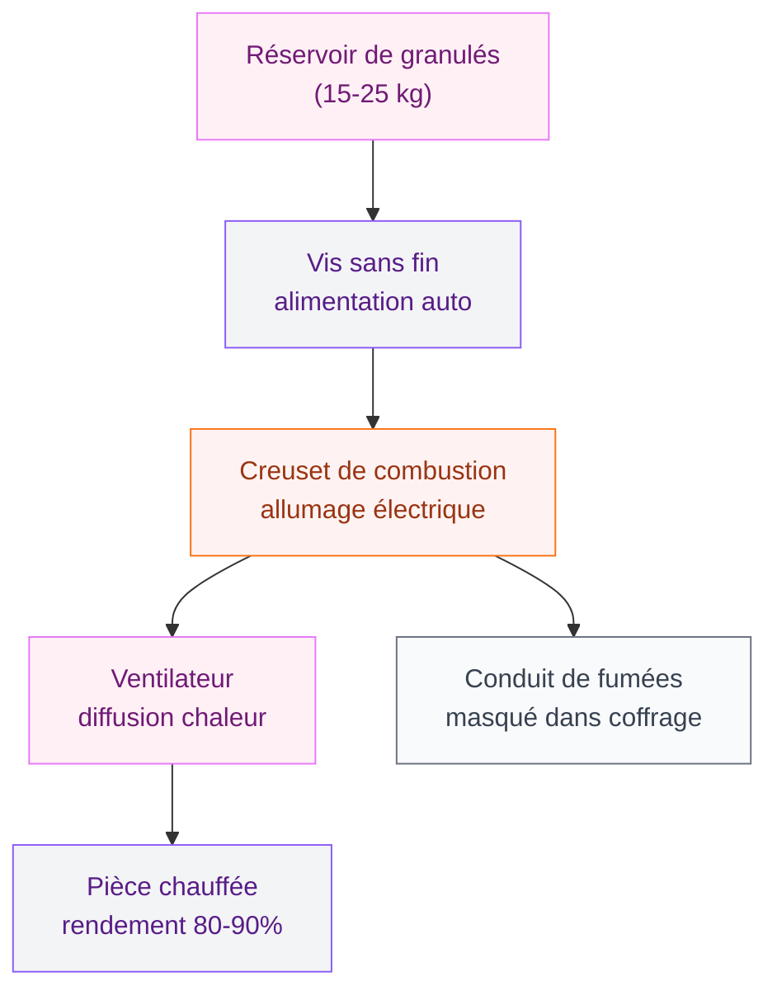
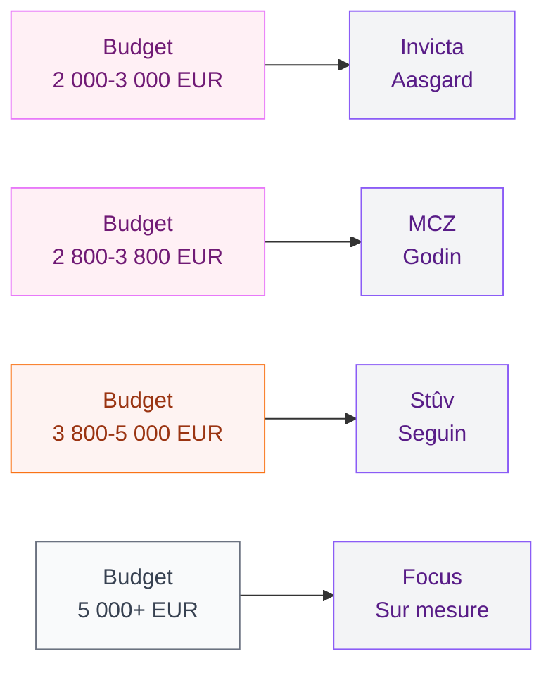

# Poêle à granulés suspendu : le chauffage design qui transforme ton salon

Tu cherches un mode de chauffage qui soit beau ET performant ? Le poêle à granulés suspendu, c'est exactement ça. Imagine un objet sculptural, fixé au mur ou encastré dans un coffrage épuré, qui chauffe ta pièce principale tout en lui donnant une allure de magazine déco. On est loin du vieux poêle de mamie posé dans un coin.

Depuis quelques années, ce type de poêle a conquis les intérieurs contemporains. Et pour cause : il combine un rendement entre 80 et 90 %, une autonomie programmable et un look qui en jette. Que tu rénoves un salon ou que tu construises, c'est une option qui mérite vraiment qu'on s'y arrête.

Je t'explique tout : comment ça marche, combien ça coûte, quelles marques valent le coup et comment réussir ton installation sans galérer.

## Pourquoi le poêle à granulés suspendu cartonne en déco

  

### Un objet design à part entière

Le premier atout du poêle suspendu, c'est son impact visuel. Contrairement à un poêle classique posé au sol, le modèle suspendu ou mural libère l'espace et crée un vrai point focal dans la pièce. C'est un peu comme accrocher une oeuvre d'art au mur, sauf que celle-là te chauffe aussi.

Les lignes sont épurées, les finitions soignées : acier brossé, verre trempé, habillage en céramique ou en pierre ollaire. Les fabricants rivalisent de créativité pour proposer des modèles qui s'intègrent dans tous les styles, du scandinave minimaliste au [style industriel moderne](/style-industriel-moderne/).

> [!TIP]
> Pour un rendu ultra clean, choisis un modèle avec conduit de fumée masqué dans un coffrage mural. Le résultat est bluffant : on dirait presque un écran géant design.

### La chaleur sans le bazar

Avec les granulés (aussi appelés pellets), tu évites la corvée du bois à stocker, à transporter et à recharger toutes les heures. Le réservoir de granulés alimente le foyer automatiquement. Selon le modèle, tu peux avoir une autonomie de 12 heures à 3 jours sans intervention. Certains poêles se programment même à distance depuis ton téléphone.

C'est le combo parfait : l'ambiance feu de cheminée, le côté pratique en plus.

## Comment fonctionne un poêle à granulés suspendu

  

### Le principe de fixation

Petite précision importante : les poêles à granulés suspendus ne flottent pas dans les airs accrochés à leur conduit comme certains poêles à bois. En réalité, ils sont fixés au mur par un système de support métallique robuste, ou bien encastrés à la manière d'un insert dans un coffrage sur mesure.

Le conduit d'évacuation des fumées passe généralement derrière le coffrage ou dans la cloison, ce qui donne cet aspect "flottant" très recherché. Le résultat est net, sans tuyaux visibles.

### Le système de chauffe

Le fonctionnement reste identique à un poêle à granulés classique :

1. Tu remplis le réservoir de pellets (capacité moyenne : 15 à 25 kg)
2. Une vis sans fin achemine les granulés vers le creuset de combustion
3. Une bougie d'allumage électrique lance la combustion automatiquement
4. Un ventilateur diffuse la chaleur dans la pièce
5. Les fumées sont évacuées par le conduit

La différence ? Tout le mécanisme est intégré dans un boîtier compact, conçu pour être fixé en hauteur. Le poids varie entre 60 et 120 kg selon les modèles - d'où l'importance d'un mur porteur pour l'installation.

> [!NOTE]
> Un poêle à granulés a besoin d'une prise électrique pour fonctionner (allumage, ventilateur, programmation). Pense à prévoir une alimentation électrique à proximité de l'emplacement choisi.

## Combien coûte un poêle à granulés suspendu

Soyons cash sur les prix, parce que c'est souvent le nerf de la guerre.

  

### Le poêle seul

Le tarif dépend de la puissance, de la marque et du design :

| Gamme | Prix HT | Exemples |
|-------|---------|----------|
| Entrée de gamme | 2 000 - 2 800 EUR | Modèles Invicta, Aasgard |
| Milieu de gamme | 2 800 - 3 800 EUR | MCZ, Godin, Palazzetti |
| Haut de gamme | 3 800 - 4 600 EUR | Stûv, Rika, Seguin |
| Premium / sur mesure | 4 600 - 7 000 EUR | Stûv P-10, Focus (bois+granulés) |

### L'installation

L'installation par un professionnel certifié RGE coûte entre 1 500 et 3 500 EUR, selon la complexité :

- **Cas simple** (conduit existant, mur porteur accessible) : 1 500 - 2 000 EUR
- **Cas moyen** (création de conduit, coffrage à réaliser) : 2 000 - 2 800 EUR
- **Cas complexe** (tubage complet, renfort mur, coffrage design) : 2 800 - 3 500 EUR

**Budget total réaliste : 3 500 à 8 000 EUR tout compris.**

> [!WARNING]
> Ne tente pas l'installation toi-même. Au-delà du risque sécuritaire (monoxyde de carbone, incendie), une installation non certifiée RGE t'empêche de bénéficier des aides financières comme MaPrimeRénov' ou l'éco-prêt à taux zéro.

### Les aides financières

Bonne nouvelle : le poêle à granulés est éligible à plusieurs aides en 2026 :

- **MaPrimeRénov'** : de 1 000 à 2 500 EUR selon tes revenus
- **Éco-prêt à taux zéro** : jusqu'à 15 000 EUR pour financer l'installation
- **TVA réduite à 5,5 %** si le logement a plus de 2 ans
- **Prime CEE** (Certificats d'Économies d'Énergie) : 200 à 800 EUR en complément

En cumulant, tu peux couvrir 30 à 50 % du coût total. Ça vaut le coup de monter un dossier.

## Les meilleures marques de poêles à granulés muraux et suspendus

  

### Stûv (Belgique) - Le roi du design

Stûv, c'est la référence absolue en matière de poêle design. Leur modèle P-10 propose une vision épurée et modulable. Le système est encastrable et suspendu, avec des finitions en acier ou en pierre. Prix : à partir de 4 500 EUR HT.

Mon avis : si tu as le budget, c'est le choix qui va sublimer ton [salon cocooning](/salon-cocooning-hiver-ambiance-ultra-cosy/). L'objet est magnifique, silencieux et ultra performant.

### MCZ (Italie) - Le rapport qualité-design

MCZ propose des modèles muraux et encastrables avec un excellent rapport qualité-prix. Leur gamme Philo et Mood offre des lignes contemporaines et une bonne puissance (6 à 11 kW). Comptée entre 2 800 et 3 800 EUR.

Le plus : l'application MCZ Maestro permet de programmer et piloter ton poêle depuis ton canapé. Température, horaires, intensité de la flamme - tout se règle au doigt.

### Invicta (France) - L'accessibilité

Marque française historique, Invicta propose des poêles à granulés à des prix plus doux, entre 2 000 et 3 000 EUR. Les modèles ne sont pas à proprement parler "suspendus", mais leurs versions murales compactes s'intègrent bien dans un coffrage sur mesure.

Disponible chez Leroy Merlin, Castorama et les revendeurs spécialisés.

### Godin (France) - La tradition qui se modernise

Godin a su évoluer avec des lignes plus contemporaines. Leurs poêles à granulés muraux oscillent entre 2 500 et 3 500 EUR. La marque mise sur la robustesse et un bon SAV en France.

### Seguin Duteriez (France) - Le sur-mesure

Seguin propose des poêles à granulés suspendus haut de gamme avec une approche quasi artisanale. Chaque installation est étudiée sur mesure. Le budget démarre autour de 4 000 EUR, mais le résultat est unique.

## Comment bien intégrer ton poêle suspendu dans ta déco

  

### Le mur support comme écrin

Le mur où tu fixes ton poêle devient automatiquement le point central de ta pièce. Profite-en pour créer un contraste :

- **Mur en pierre naturelle ou parement** : le combo poêle + pierre, c'est un classique qui marche à tous les coups
- **Mur peint en teinte sombre** (noir, anthracite, bleu nuit) : le poêle ressort encore plus
- **Mur en béton ciré** : pour un rendu brut et contemporain qui s'accorde bien avec le [carrelage moderne tendance 2026](/carrelage-moderne-tendances-2026/)
- **Niche en placo avec éclairage indirect** : pour un effet "galerie d'art"

### Le mobilier autour

Libère l'espace devant et autour du poêle. Pas de meuble à moins d'un mètre - c'est une question de sécurité, mais aussi d'esthétique. Un tapis moelleux posé à bonne distance, un fauteuil en retrait, et tu obtiens un coin lecture parfait.

Si tu cherches des idées pour aménager l'espace autour, jette un oeil à nos conseils sur l'[éclairage d'ambiance](/eclairage-ambiance-techniques-sublimer/) : le bon éclairage autour d'un poêle, ça fait toute la différence.

> [!TIP]
> Place un miroir face au poêle pour refléter la flamme et agrandir visuellement l'espace. L'effet est spectaculaire le soir venu.

### Le coffrage : clé de l'intégration

Si tu choisis un modèle encastré, le coffrage est l'élément qui fait tout le style. Quelques options :

- **Coffrage minimaliste blanc** : discret, le poêle devient un tableau
- **Coffrage en bois massif** : chaleur et authenticité (attention aux distances de sécurité)
- **Coffrage métal noir** : look industriel chic
- **Coffrage toute hauteur** : du sol au plafond, pour un effet monumental

Un bon menuisier ou plaquiste peut te réaliser ça pour 800 à 2 000 EUR, selon la complexité.

## Les erreurs à éviter

### 1. Oublier le mur porteur

Un poêle de 80 à 120 kg fixé au mur, ça ne s'improvise pas. Avant tout achat, fais vérifier la nature de ton mur par un pro. Une cloison en placo standard ne suffira pas - il faut un mur en brique, béton ou parpaing, ou bien prévoir un renfort métallique.

### 2. Sous-dimensionner la puissance

La puissance se calcule en fonction du volume à chauffer. En règle générale :

- Pièce de 30 à 50 m2 : 6 à 8 kW
- Pièce de 50 à 80 m2 : 8 à 10 kW
- Pièce de 80 à 100 m2 : 10 à 12 kW

Un poêle trop puissant va surchauffer et fonctionner au ralenti (mauvaise combustion, encrassement). Un poêle sous-dimensionné ne chauffera pas assez. Le juste milieu, c'est la clé.

### 3. Négliger l'entretien

Un poêle à granulés demande un entretien régulier :

- **Quotidien** : vider le cendrier (30 secondes)
- **Hebdomadaire** : nettoyer la vitre et le creuset
- **Annuel** : ramonage obligatoire par un professionnel (80 à 150 EUR)

> [!IMPORTANT]
> Le ramonage annuel est une obligation légale. Sans certificat de ramonage, ton assurance peut refuser de t'indemniser en cas de sinistre. Garde bien le document.

### 4. Ignorer le niveau sonore

Les poêles à granulés font du bruit - c'est un fait. Le ventilateur de convection et la vis sans fin d'alimentation produisent un ronronnement continu. Les modèles d'entrée de gamme tournent autour de 40-45 dB, les meilleurs descendent à 32-35 dB.

Mon conseil : si tu es sensible au bruit, oriente-toi vers des marques comme Stûv ou Rika qui ont travaillé l'acoustique. Et teste en magasin avant d'acheter, parce que 5 dB de différence, ça s'entend vraiment.

## Poêle à granulés suspendu vs poêle à bois suspendu

La question revient souvent. Voici les différences clés :

| Critère | Granulés suspendu | Bois suspendu |
|---------|------------------|---------------|
| Autonomie | 12h à 3 jours | 2 à 4 heures |
| Programmation | Oui (thermostat, appli) | Non |
| Stockage combustible | Sacs de 15 kg, facile | Bûches, encombrant |
| Bruit | Ventilateur (32-45 dB) | Silencieux (crackling) |
| Suspension | Murale / encastrée | Vraie suspension par conduit |
| Prix moyen | 3 000 - 5 000 EUR | 2 500 - 6 000 EUR |
| Entretien | Fréquent mais simple | Moins fréquent, plus salissant |

En résumé : si tu veux du pratique et du programmable, va vers les granulés. Si tu préfères le charme authentique de la flamme et le silence total, le poêle à bois suspendu sera plus adapté. Et si le design déco est ta priorité, les deux offrent des modèles qui en mettent plein la vue pour ton [salon](/decoration-salon-naturel-chic/).

## Sur le meme theme

- [table basse japonaise kotatsu](/guides/decoration/table-basse-japonaise-kotatsu/)
- [peindre sans poncer](/guides/decoration/peindre-sans-poncer/)
- [isolation dalle béton](/guides/decoration/isolation-dune-dalle-en-beton-techniques-options-disolation-et-cout/)
- [facades de maisons modernes 2026](/guides/decoration/facades-de-maisons-modernes-2026/)
- [tableau planning et pense-bête](/guides/decoration/choisir-tableau-planning-pense-bete/)

## FAQ - Poêle à granulés suspendu

**Est-ce qu'un poêle à granulés suspendu peut chauffer toute la maison ?**

En général, non. C'est un chauffage d'appoint performant qui chauffe très bien la pièce où il est installé et les espaces adjacents (couloir, mezzanine). Pour une maison entière, il faudra le coupler à un autre système ou opter pour un modèle canalisé qui envoie la chaleur dans d'autres pièces via des gaines.

**Combien coûte un sac de granulés en 2026 ?**

Le prix d'une tonne de granulés oscille entre 280 et 350 EUR en 2026, soit environ 5 à 7 EUR le sac de 15 kg. Pour un hiver complet, compte 1,5 à 2 tonnes, soit un budget annuel de 420 à 700 EUR. C'est bien moins cher que l'électricité ou le gaz.

**Faut-il un conduit de cheminée existant ?**

Non, pas obligatoirement. Un installateur certifié peut créer un conduit de fumée en façade ou en toiture. Par contre, ça augmente le coût d'installation de 1 000 à 2 000 EUR. Si tu as déjà un conduit, l'installation sera plus simple et moins chère.

**Le poêle à granulés suspendu est-il compatible avec un appartement ?**

Oui, sous conditions. Il te faut l'accord de la copropriété, un mur porteur adapté, et la possibilité de créer ou utiliser un conduit d'évacuation en façade. C'est plus compliqué qu'en maison individuelle, mais c'est faisable. Renseigne-toi auprès de ta copro avant de te lancer.
