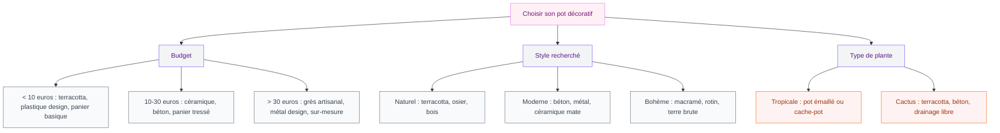

Tes plantes méritent mieux qu'un pot en plastique noir posé sur un rebord de fenêtre. Le contenant dans lequel tu places une plante change complètement l'ambiance d'un espace - autant qu'un cadre change un tableau. Que tu sois fan de terracotta brute, de céramique artisanale ou de cache-pots en fibres tressées, il existe des options pour tous les budgets et tous les styles.

Dans cet article, je te guide à travers les matériaux, les formes et les associations qui fonctionnent vraiment, avec des marques concrètes, des fourchettes de prix et des idées DIY pour personnaliser tes pots sans exploser ta CB.

## Pourquoi le pot compte autant que la plante

Un Monstera dans un pot en plastique beige, ça fait "j'ai acheté ça au supermarché hier". Le même Monstera dans un panier en osier tressé ou un pot en grès noir mat, et soudain ton salon prend une toute autre allure. Le pot, c'est le trait d'union entre la plante et ta déco - il donne le ton.

En plus de l'esthétique, le matériau du pot influence la santé de la plante. La terracotta est poreuse et laisse respirer les racines. Le plastique retient l'humidité plus longtemps. Le grès émaillé garde la fraicheur au pied. Bref, ton choix n'est pas juste décoratif, il est aussi pratique.

> [!NOTE]
> Si tu utilises un cache-pot (un pot décoratif sans trou de drainage), laisse toujours ta plante dans son pot de culture à l'intérieur. Ca te permet de contrôler l'arrosage et d'éviter que les racines baignent dans l'eau stagnante.

## Les matériaux qui changent tout

### Terracotta : le retour du classique

La terracotta, c'est LE matériau du moment. Brut, chaleureux, pas cher. Un pot en terre cuite simple commence à 3 euros en jardinerie (Botanic, Truffaut, Gamm vert). Et le charme de la terracotta, c'est qu'elle vieillit bien : les taches blanches de calcaire et les traces de mousse lui donnent du caractère avec le temps.

Pour un look plus travaillé, les pots en terracotta avec des reliefs géométriques ou des motifs végétaux se trouvent chez Maisons du Monde (à partir de 12 euros) ou chez H&M Home (autour de 10-15 euros). Le style [terracotta dans la déco](/guides/decoration/decorer-avec-terracota/) s'adapte aussi bien à un balcon qu'à un salon.

> [!TIP]
> La terracotta brute absorbe l'eau et sèche vite. Si tu as des plantes tropicales qui aiment l'humidité (pothos, calathea), applique une couche de vernis mat à l'intérieur du pot pour limiter l'évaporation. Un pot de vernis Syntilor à 8 euros suffit pour traiter 10 pots.

### Céramique et grès : l'option chic

La céramique émaillée donne un rendu lisse et coloré. Les teintes les plus tendance en 2026 : le vert sauge, le bleu pétrole, le blanc cassé et le noir mat. Chez IKEA, la gamme GRADVIS (8-15 euros) offre de jolis pots aux formes arrondies. Pour un rendu plus artisanal, Serax propose des pots en grès faits main à partir de 25 euros - c'est un investissement mais la qualité se voit.

Le grès japonais (tokoname) représente le haut du panier pour les amateurs de bonsai et de plantes d'intérieur. Des pots aux lignes épurées, souvent en teintes sombres ou rouille, entre 30 et 80 euros selon la taille. Tu en trouves sur Bonsai Plaza ou chez des revendeurs spécialisés en ligne.

### Béton et ciment : le look brut

Le béton est devenu un allié des intérieurs modernes. Il apporte une touche industrielle tout en mettant la plante en valeur par contraste. Les petits pots en béton faits main se trouvent sur Etsy à partir de 8 euros. En GSB, la marque Nortene propose des jardinières en béton fibré à partir de 20 euros.

Pour les fans de [déco minimaliste](/guides/decoration/decoration-minimaliste-idees-et-photos-faciles/), un pot en béton gris clair avec un cactus ou un Sansevieria, c'est le combo parfait. Simple, efficace, zéro risque de faux pas.

### Fibres naturelles : rotin, osier, jute

Les paniers tressés en rotin ou en jute font des cache-pots magnifiques. Ils apportent de la texture et de la chaleur, surtout dans les intérieurs clairs. IKEA les vend à partir de 5 euros (gamme FLADIS, KAFFEBÖNA). Pour un rendu plus raffiné, La Redoute Interieurs propose des paniers en jacinthe d'eau ou en bambou entre 15 et 35 euros.

L'avantage des paniers : ils camouflent parfaitement les pots de culture en plastique. Et ils sont super légers, donc faciles à déplacer quand tu réorganises ton salon un dimanche après-midi.

### Métal : laiton, zinc, acier noirci

Le métal donne un côté structuré et graphique. Un pot en laiton brossé sur une étagère blanche, c'est tout de suite élégant. Zara Home en propose à partir de 20 euros. Pour le zinc, les jardinieres à l'ancienne style marché aux fleurs se trouvent à Truffaut ou Jardiland entre 10 et 25 euros.

L'acier peint en noir mat est aussi très populaire. On le retrouve chez Ferm Living (gamme Plant Box, autour de 100 euros) ou en version budget chez Action (5-7 euros pour des cache-pots simples).

## Les formes de pots qui marchent en 2026

### Le pot cylindrique droit

C'est la forme la plus polyvalente. Elle passe partout, du sol à l'étagère. Le cylindre haut (type pot colonne) met particulièrement bien en valeur les plantes retombantes comme le [Scindapsus pictus](/guides/decoration/entretenir-du-scindapsus-pictus-la-plante-robuste-qui-a-tout-pour-plaire/) ou le pothos.

### Le pot évasé "tulipe"

Plus large en haut qu'en bas, il donne un effet visuel aérien. C'est une forme très photogénique qui fonctionne bien pour les fougères ou les plantes touffues. Chez Bloomingville, tu en trouves en céramique à partir de 18 euros.

### Le pot sur pieds

Très tendance depuis 2024, le pot sur pieds (en bois, en métal ou intégrés au pot) surélève la plante et crée de l'espace visuel. Ca marche particulièrement bien au sol, à côté d'un canapé ou dans un couloir. IKEA propose le modèle BUSKBO (panier en rotin sur pieds en acier) à 39 euros. Chez Made.com, le modèle Palm en fibre avec pieds en bois tourne autour de 55 euros.

### Le pot XXL statement

Les grands pots de sol (50 cm et plus) servent de véritables éléments de décoration à part entière. Un grand olivier, un Strelitzia ou un Ficus lyrata dans un pot XXL en terre cuite ou en béton fibré, ca pose un intérieur. Chez Deroma, les grands pots en terracotta vont de 25 à 60 euros. Pour du haut de gamme, Atelier Vierkant propose des pots en argile fait main à partir de 200 euros.

## Composer de belles associations de pots

### La règle des nombres impairs

Groupe toujours tes pots par 3, 5 ou 7. Les nombres impairs créent un effet visuel plus naturel et dynamique que les alignements pairs. Varie les hauteurs, les diamètres et les matériaux dans chaque groupe.

### Jouer sur les contrastes

Un pot noir mat à côté d'un pot en terracotta claire et d'un panier en osier : trois matériaux différents, mais un ensemble cohérent parce que les tons restent neutres et terreux. Le contraste de textures apporte de la richesse sans surcharger.

> [!IMPORTANT]
> Evite de mélanger plus de 3 matériaux différents dans un même groupe de pots. Au-delà, l'ensemble perd sa cohérence et donne un effet bric-à-brac plutôt que composé.

### Les associations par pièce

**Salon** : un grand pot de sol + 2-3 pots moyens sur une étagère ou un meuble bas. Privilégie les matériaux chauds (bois, terracotta, osier) pour une ambiance cosy.

**Cuisine** : pots d'herbes aromatiques en terracotta ou en émail blanc alignés sur le rebord de fenêtre. Compact, utile et joli.

**Salle de bain** : pots en céramique blanche ou en béton. Les plantes vertes dans cette pièce adorent l'humidité, et les pots clairs reflètent bien la lumière.

**Balcon** : jardinières en zinc ou en bois traité + pots en terre cuite. Pense aux soucoupes pour protéger le sol !

**Bureau** : un petit pot design en céramique ou en métal avec un petit cactus ou un Peperomia Hope, c'est sobre et ca ne prend pas de place.

## DIY : personnaliser tes pots pour trois fois rien

Tu n'as pas besoin de dépenser des fortunes pour avoir des pots qui ont du caractère. Voici des techniques simples qui transforment un pot basique en pièce déco.

### Peindre un pot en terracotta

La technique la plus accessible. Il te faut de la peinture acrylique (Pébéo, Liquitex, ou même de la peinture pour murs restante) et un pinceau. Tu peux faire des motifs géométriques au masking tape, des dégradés, ou simplement peindre la moitié inférieure dans une couleur contrastée (le "dip dye"). Pour les techniques de peinture sur différentes surfaces, l'article sur [peindre des bocaux en verre](/guides/decoration/comment-peindre-des-bocaux-ou-des-bouteilles-en-verre/) te donnera plein d'astuces transposables.

### Habiller un pot avec de la corde ou du raphia

Enroule de la corde de jute ou de sisal autour d'un pot en plastique en fixant avec de la colle forte (type Ni Clou Ni Vis de Pattex). Commence par le bas et serre bien chaque tour. Résultat : un cache-pot bohème pour moins de 5 euros de matériel.

### Customiser avec du béton créatif

Les poudres de béton créatif (Rayher, environ 8 euros le sac de 1 kg chez Cultura ou Amazon) permettent de mouler tes propres pots. Utilise des moules en silicone ou simplement deux gobelets emboités (un grand à l'extérieur, un petit à l'intérieur). Démoule après 48h, ponce légèrement, et tu obtiens un pot unique avec une texture brute très tendance.

### Recouvrir de bambou

La technique asiatisante repérée chez Gamm vert : coupe des bâtonnets de bambou à la hauteur de ton pot (plus 1 cm de marge), encolle le pot par sections et colle les bâtonnets bien serrés verticalement. Idéal pour accompagner une ambiance zen ou japandi.

> [!WARNING]
> Pour le DIY, utilise toujours un vernis de protection si le pot est destiné à l'extérieur ou à une pièce humide comme la salle de bain. Sans vernis, la peinture et les colles se dégradent vite au contact de l'eau.

## Les supports de pots : étagères, sellettes et suspensions

Le pot seul ne fait pas tout. La manière dont tu le places compte autant.

### Sellettes et tabourets

La sellette (petite table haute et étroite) est le meilleur ami des plantes en pot. En bois naturel, en métal noir ou en rotin, elle surélève le pot et crée un effet de mise en scène. Les modèles en bois de manguier chez Maisons du Monde démarrent à 30 euros. Chez IKEA, le tabouret KYRRE (15 euros) fait une sellette improvisée très correcte.

### Suspensions macramé

Le macramé revient en force pour suspendre les plantes retombantes. Un bon support en macramé coûte entre 8 et 20 euros sur Etsy ou chez Sostrene Grene. Tu peux aussi le fabriquer toi-même avec de la corde en coton (un tuto de 30 minutes suffit pour un modèle basique).

### Etagères murales dédiées

Des étagères fines en bois ou en métal, fixées en décalé sur un mur, créent un véritable mur végétal intérieur. L'étagère LACK d'IKEA (5 euros) est parfaite pour ça : pose 3-4 étagères à des hauteurs différentes et garnis-les de petits pots variés.

## Pots décoratifs pour l'extérieur : balcon, terrasse, jardin

A l'extérieur, la résistance aux intempéries est la priorité. La terracotta résiste au gel si elle est "gélive" (vérifiée pour le gel). Les pots en résine tressée ou en fibre de verre imitent les matériaux naturels tout en résistant au soleil et à la pluie. La marque Elho propose une gamme complète de pots extérieurs en plastique recyclé à partir de 8 euros, avec des couleurs sympa (anthracite, pierre, vert olive).

Pour les grands espaces, les bacs à plantes en bois (pin autoclave ou acacia) servent à la fois de jardinières et de séparations d'espace. Leroy Merlin et Castorama en proposent à partir de 25 euros.

> [!TIP]
> Sur un balcon exposé au vent, leste tes grands pots avec des billes d'argile au fond (plutôt que du terreau sur toute la hauteur). Ca alourdit le pot, améliore le drainage et consomme moins de terre. Un sac de 10 litres de billes d'argile coûte environ 5 euros.

## Sur le meme theme

- [plantes salle de bains](/guides/salle-de-bain/plantes-salle-de-bains/)

## FAQ

**Quel pot choisir pour une plante d'intérieur qui a besoin de drainage ?**
Choisis un pot avec un trou au fond (terracotta, céramique non émaillée) et place une soucoupe dessous. Si tu préfères un cache-pot décoratif sans trou, garde la plante dans son pot de culture en plastique à l'intérieur et vide l'eau résiduelle 15 minutes après l'arrosage.

**Peut-on laisser un pot en terracotta dehors en hiver ?**
Ca dépend de la qualité du pot. Les pots marqués "résistants au gel" ou "gélifs" supportent le froid. Les pots en terracotta standard d'importation peuvent se fissurer avec les cycles gel/dégel. En cas de doute, rentre-les ou surélève-les sur des pieds pour éviter le contact direct avec le sol gelé.

**Comment nettoyer des pots en terre cuite qui ont des dépôts blancs ?**
Les dépôts blancs sont du calcaire (de l'eau d'arrosage) ou du salpêtre. Frotte avec une brosse et un mélange d'eau chaude + vinaigre blanc (moitié-moitié). Laisse tremper 30 minutes si les dépôts sont tenaces. Rince bien et laisse sécher avant de rempoter.

**Quel est le meilleur rapport qualité-prix pour des pots décoratifs ?**
La terracotta reste imbattable en rapport qualité-prix (3-15 euros). Pour un look plus moderne sans casser ta tirelire, les pots en béton fibré de GSB (Nortene, Deroma) offrent un bon compromis entre esthétique et budget (15-30 euros). Et les cache-pots en fibres tressées d'IKEA (5-15 euros) sont une valeur sure.
