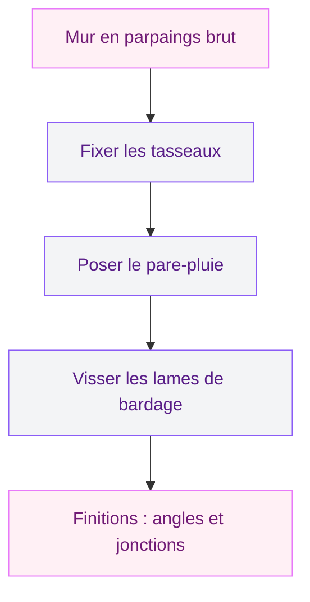
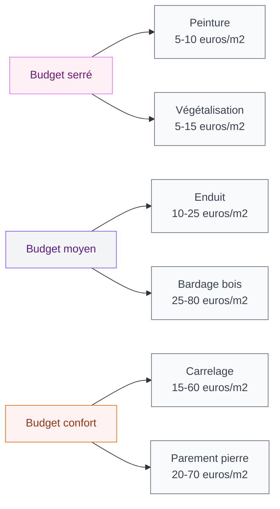

Un mur en parpaings bruts, on est d'accord, c'est pas le plus glamour du monde. Que ce soit dans ton jardin, sur ta terrasse ou même en intérieur (garage, sous-sol, buanderie), ce gris béton donne tout de suite un air de chantier inachevé. La bonne nouvelle ? Tu as plein d'options pour transformer ce mur triste en quelque chose de vraiment joli - et la plupart sont accessibles même si tu débutes en bricolage.

Je te donne ici 6 solutions concrètes avec les prix réels, les marques que je recommande et le niveau de difficulté pour chacune. Tu vas voir, il y en a pour tous les budgets et tous les styles.

## Pourquoi recouvrir un mur en parpaings ?

Au-delà de l'aspect esthétique (on ne va pas se mentir, c'est la raison numéro 1), recouvrir un mur en parpaings offre aussi des avantages pratiques :

- **Protection contre l'humidité** : le parpaing est poreux, il absorbe l'eau comme une éponge. Un revêtement adapté le protège des infiltrations.
- **Isolation thermique** : même un simple enduit améliore l'isolation de quelques degrés. Avec un bardage, c'est encore mieux.
- **Valorisation du bien** : un mur extérieur propre et fini, ça joue direct sur l'estimation de ta maison.
- **Durabilité** : un parpaing exposé aux intempéries se dégrade plus vite qu'un parpaing protégé.

> [!NOTE]
> Un mur en parpaings non recouvert peut perdre jusqu'à 15% de sa résistance en 20 ans à cause du gel et de l'humidité. Le recouvrir, c'est aussi le préserver.

## Solution 1 : l'enduit - le classique qui marche toujours

C'est LA solution la plus courante, et pour cause : c'est efficace, pas trop cher et le rendu est propre. Tu as deux types d'enduit à connaître.

### Enduit monocouche

Le monocouche, c'est le choix pratique par excellence. Tu l'appliques en une seule passe (d'où le nom) et il fait à la fois office d'imperméabilisation et de finition. Chez Leroy Merlin, un sac de 25 kg de monocouche PRB coûte environ 15 à 20 euros et couvre 1 à 1,5 m2. Pour un mur de 10 m2, compte 150 à 200 euros rien qu'en matériau.

### Enduit traditionnel (en 3 couches)

Plus technique mais aussi plus durable : une couche de gobetis (accroche), une couche de corps d'enduit, et la finition. C'est ce que font les pro et le résultat est impeccable. Budget : 30 à 50 euros/m2 pose comprise par un artisan.

> [!TIP]
> Si tu fais toi-même, loue une machine à projeter chez Kiloutou ou Loxam (environ 80 euros/jour). Ça va 10 fois plus vite qu'à la taloche et le résultat est plus régulier.

### Les finitions possibles

Tu peux obtenir des textures très différentes :

- **Finition grattée** : la plus classique, aspect granuleux, masque bien les défauts
- **Finition talochée** : lisse et moderne, demande plus de maîtrise
- **Finition écrasée** : effet rustique, très tendance pour les façades campagne
- **Finition ribbée** : petits sillons parallèles, original et graphique

**Budget total enduit** : 10 à 25 euros/m2 en fourniture seule, 30 à 60 euros/m2 pose comprise.

## Solution 2 : le parement en pierre - l'effet wow garanti

Si tu veux un mur qui a du caractère, les plaquettes de parement sont géniales. Ce sont des petites plaques de pierre (naturelle ou reconstituée) que tu colles directement sur le parpaing. Le rendu imite un mur en pierre et c'est bluffant.

### Parement en pierre naturelle

Chez Castorama, les plaquettes en pierre naturelle "Stonepanel" démarrent à 50 euros/m2. C'est du vrai calcaire ou du quartzite, le rendu est magnifique. Chez Leroy Merlin, la gamme "Multistone" tourne autour de 40 à 70 euros/m2.

### Parement en pierre reconstituée

Moins cher et plus léger : les parements en béton moulé imitent très bien la pierre pour 20 à 40 euros/m2. La marque Modulo chez Brico Dépôt propose des modèles corrects à partir de 18 euros/m2.

> [!WARNING]
> Avant de coller du parement, assure-toi que ton mur est plan et propre. Un coup de brosse métallique pour enlever la poussière, et si le mur est très irrégulier, un enduit de régularisation avant la pose. Sans ça, les plaquettes ne colleront pas bien.

**Budget total parement** : 20 à 70 euros/m2 en fourniture, 50 à 100 euros/m2 pose comprise.

## Solution 3 : le bardage bois - chaleur et caractère

Le bardage bois, c'est mon coup de cœur pour les murs extérieurs. Ça apporte immédiatement de la chaleur et un côté naturel que j'adore. Et tu peux l'installer toi-même avec un peu de méthode.

### Le principe

Tu fixes d'abord des tasseaux (des lattes de bois) sur le mur en parpaings avec des chevilles à frapper. Ensuite tu visses les lames de bardage sur ces tasseaux. L'avantage : ça crée une lame d'air entre le mur et le bois, ce qui améliore l'isolation et empêche l'humidité de remonter.

### Quels bois choisir ?

- **Douglas** : bon rapport qualité/prix, naturellement résistant, 25 à 35 euros/m2
- **Mélèze** : très durable sans traitement, 30 à 45 euros/m2
- **Pin autoclave classe 4** : le moins cher, 15 à 25 euros/m2, mais aspect moins noble
- **Composite** : sans entretien, 40 à 80 euros/m2 (marque Silvadec ou Fiberon chez Leroy Merlin)

Si tu aimes le style bois brut et les matières naturelles, tu vas aussi apprécier nos [idées déco murale](/deco-murale-idees-habiller-murs-style/) pour prolonger cette ambiance à l'intérieur.

**Budget total bardage bois** : 25 à 80 euros/m2 en fourniture, 60 à 120 euros/m2 pose comprise.

## Solution 4 : le carrelage extérieur - durable et facile à entretenir

On n'y pense pas toujours, mais le carrelage se pose très bien sur un mur en parpaings. C'est la solution idéale si tu cherches un revêtement zéro entretien, surtout dans les zones humides (mur de douche extérieure, cuisine d'été, contour de piscine).

### Les types de carrelage adaptés

- **Grès cérame** : le plus résistant, imperméable, existe en effet pierre, bois ou béton. Chez Leroy Merlin, la gamme "Colours" démarre à 15 euros/m2.
- **Zellige** : magnifique en crédence ou sur un petit mur, 30 à 60 euros/m2 selon la provenance
- **Carreaux grand format 60x60** : rendu très contemporain, moins de joints, 20 à 40 euros/m2

Pour en savoir plus sur les dernières tendances, je te conseille notre guide sur le [carrelage moderne en 2026](/carrelage-moderne-tendances-2026/) - il y a plein d'idées transposables à un mur extérieur.

### Pose sur parpaings : les règles

La clé, c'est la préparation. Le parpaing doit être propre, sec et régulier. Utilise une colle flexible (type C2S1 ou C2S2) qui absorbe les micro-mouvements du mur. Un double encollage (sur le mur ET sur le carreau) est recommandé pour une adhérence optimale.

**Budget total carrelage mural** : 15 à 60 euros/m2 en fourniture, 40 à 90 euros/m2 pose comprise.

## Solution 5 : la végétalisation - le mur vivant

Tu as un mur en parpaings dans le jardin et tu veux un rendu naturel ? Les plantes grimpantes sont une solution magnifique et économique. En 2 à 3 saisons, ton mur disparaît complètement sous la verdure.

### Les plantes grimpantes adaptées

- **Lierre** : le champion toutes catégories. Persistant, pousse partout, même à l'ombre. 5 à 10 euros le pot chez Gamm Vert.
- **Jasmin étoilé (Trachelospermum)** : feuillage persistant, fleurs parfumées en été. 12 à 20 euros le pot.
- **Vigne vierge** : caduque mais avec de superbes couleurs automnales, pousse très vite. 8 à 15 euros.
- **Hortensia grimpant** : idéal pour les murs à l'ombre. 15 à 25 euros.

### La technique du treillage

Si tu ne veux pas que les plantes s'accrochent directement au mur (ce qui peut abîmer les joints), installe un treillis en bois ou en métal à 5-10 cm du parpaing. Ça guide la croissance et tu peux détacher le treillis si tu dois intervenir sur le mur.

> [!TIP]
> Pour un mur de 10 m2, plante 3 à 4 pieds de grimpantes espacées de 1,5 m. En mêlant lierre (persistant) et jasmin étoilé (fleuri), tu obtiens un mur vert toute l'année avec une floraison parfumée en été.

Pour d'autres idées de jardins et d'espaces verts, jette un œil à notre article sur les [aménagements extérieurs tendance](/terrasse-design-amenagements-exterieurs-tendance/) - tu y trouveras des inspirations complémentaires.

**Budget total végétalisation** : 50 à 150 euros pour un mur de 10 m2 (plantes + treillis). Patience requise : 2-3 ans pour un mur complètement couvert.

## Solution 6 : la peinture - la solution express

Bon, la peinture ne "recouvre" pas vraiment le parpaing au sens strict - on voit toujours la texture. Mais si ton budget est serré et que tu veux juste un coup de propre rapide, c'est la solution la plus accessible.

### Quelle peinture utiliser ?

Oublie la peinture classique d'intérieur. Il te faut une peinture spécifique :

- **Peinture façade acrylique** : la plus courante, 30 à 50 euros les 10 L chez Brico Dépôt ou Castorama
- **Peinture façade Pliolite** : meilleure adhérence sur support brut, 40 à 70 euros les 10 L
- **Peinture hydropliolite** : le compromis idéal, bonne pénétration et facile à appliquer

### Les étapes

1. Nettoyer le mur (brosse + eau, ou nettoyeur haute pression)
2. Laisser sécher 48 heures minimum
3. Appliquer un fixateur/primaire d'accrochage
4. Deux couches de peinture au rouleau à poils longs (le parpaing boit beaucoup)

**Budget total peinture** : 5 à 10 euros/m2 en fourniture seule. La solution la moins chère de toutes.

## Tableau comparatif des 6 solutions

## Comment choisir la bonne solution ?

Le choix dépend de trois critères principaux :

**1. Intérieur ou extérieur ?**
En extérieur, l'enduit et le bardage sont les solutions les plus adaptées. En intérieur (garage, sous-sol), le carrelage et le parement fonctionnent à merveille. Si tu aménages un [sous-sol en espace de vie](/sous-sol-amenage-espace-vie-cosy/), le parement pierre apporte un cachet dingue.

**2. Ton budget**
Avec moins de 200 euros pour 10 m2, oriente-toi vers la peinture ou la végétalisation. Entre 200 et 500 euros, l'enduit est le meilleur rapport qualité/prix. Au-delà, le parement ou le bardage bois offrent un rendu haut de gamme.

**3. Tes compétences en bricolage**
La peinture et la végétalisation sont à la portée de tout le monde. L'enduit monocouche est accessible avec un peu de pratique. Le bardage bois demande de savoir visser droit et utiliser un niveau. Le carrelage et le parement sont plus techniques - si tu doutes, fais appel à un artisan.

> [!IMPORTANT]
> Avant tout travail sur un mur mitoyen ou un mur de clôture, vérifie les règles d'urbanisme de ta commune. Certaines mairies imposent des couleurs ou des matériaux spécifiques en façade. Un coup de fil à la mairie t'évitera des mauvaises surprises.

## FAQ

### Quel est le revêtement le moins cher pour un mur en parpaings ?

La peinture façade reste la solution la plus économique, à partir de 5 euros/m2. La végétalisation avec des plantes grimpantes est aussi très abordable si tu es patiente : le coût initial est faible (50 à 100 euros pour un mur de 10 m2) mais il faut compter 2 à 3 ans pour que le mur soit complètement couvert.

### Peut-on carreler directement sur du parpaing ?

Oui, à condition d'utiliser une colle adaptée (type C2S1 minimum) et de faire un double encollage. Le parpaing doit être propre, sec et stable. Si le mur présente des irrégularités importantes, prévois un enduit de régularisation avant la pose du carrelage.

### Faut-il un permis pour recouvrir un mur extérieur en parpaings ?

Pour un mur de clôture ou un mur de jardin, en général non. Pour une façade de maison, une déclaration préalable de travaux est souvent obligatoire car tu modifies l'aspect extérieur. Renseigne-toi auprès du service urbanisme de ta mairie avant de commencer.

### Comment recouvrir un mur en parpaings humide ?

Un mur humide doit d'abord être traité avant d'être recouvert. Identifie la source d'humidité (remontées capillaires, infiltrations, condensation) et traite-la. Ensuite, un enduit à base de chaux est la meilleure option car la chaux laisse respirer le mur tout en le protégeant. Évite les revêtements étanches qui piégeraient l'humidité à l'intérieur.
