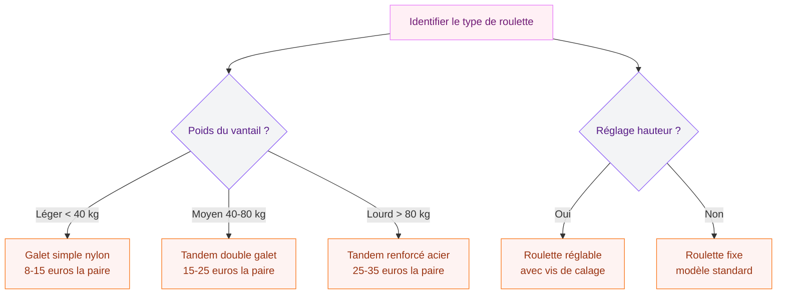

Ta porte de véranda coulisse mal, grince ou reste carrément bloquée au milieu du rail ? Avant de paniquer et d'appeler un vitrier, regarde en bas. Dans 9 cas sur 10, le problème vient des roulettes. Ces petites pièces en plastique ou en acier supportent le poids du vantail à chaque ouverture, et au bout de quelques années, elles s'usent, se déforment ou se cassent net. Le bon côté : les remplacer coûte entre 8 et 35 euros la paire, et ça se fait en moins d'une heure sans toucher au vitrage.

Je t'explique tout le processus, du diagnostic au remplacement, avec les bons gestes pour que ta porte retrouve un coulissement fluide et silencieux.

## Comment savoir si tes roulettes sont mortes ?

Avant de démonter quoi que ce soit, fais un rapide diagnostic. Ouvre et ferme ta porte lentement, en observant le comportement du vantail.

**Les signes qui ne trompent pas :**

- La porte frotte sur le rail ou sur le seuil
- Tu entends un bruit métallique ou un raclement à chaque manoeuvre
- Le vantail penche d'un côté, le jour sous la porte est irrégulier
- Il faut forcer pour ouvrir ou fermer, alors qu'avant ça glissait tout seul
- Tu vois des débris de plastique noir dans le rail

Si tu coches au moins deux de ces points, tes roulettes ont rendu l'âme. C'est normal : la durée de vie moyenne d'une roulette de véranda se situe entre 5 et 10 ans, selon la fréquence d'utilisation et l'exposition aux intempéries.

> [!NOTE]
> Parfois le rail lui-même est cabossé ou encrassé. Avant de changer les roulettes, nettoie le rail avec un aspirateur puis passe un chiffon humide. Si le problème persiste, c'est bien les roulettes.

## Quel type de roulette pour ta véranda ?

Toutes les roulettes ne se valent pas, et surtout, elles ne sont pas interchangeables. Tu dois identifier le bon modèle pour ta porte.

### Les roulettes à galet simple

C'est le type le plus courant sur les vérandas aluminium d'entrée de gamme. Un galet en nylon ou en acier monté sur un axe, logé dans un boîtier plastique. Prix : 8 à 15 euros la paire chez des fournisseurs comme Roulettes-Menuiserie ou Sud Roulettes Services.

### Les roulettes tandem (double galet)

Deux galets côte à côte dans un même boîtier. On les trouve sur les portes plus lourdes ou les baies vitrées à double vitrage. Elles répartissent mieux le poids et durent plus longtemps. Prix : 15 à 35 euros la paire.

### Les roulettes réglables en hauteur

Elles intègrent une vis de réglage qui permet d'ajuster la hauteur du vantail dans le rail. Très pratiques si ta porte a tendance à frotter par endroits. La plupart des vérandas récentes (après 2010) en sont équipées.

> [!TIP]
> Pour trouver la bonne référence, démonte une roulette existante et mesure le diamètre du galet, la largeur du boîtier et l'entraxe des vis de fixation. Prends une photo et envoie-la au fournisseur si tu hésites. Les sites comme Roulettes-Menuiserie proposent un service d'identification gratuit.

## Le matériel nécessaire

Rassemble tout avant de commencer. Tu n'as besoin de rien d'exotique :

- **Les roulettes neuves** (la paire, identiques à l'ancien modèle)
- **Un tournevis cruciforme** ou une visseuse
- **Un tournevis plat** large (pour faire levier si besoin)
- **Une clé Allen** de 4 ou 5 mm (selon les modèles)
- **Du spray lubrifiant** silicone (WD-40 Specialist Silicone ou Bardahl, 6-10 euros)
- **Un chiffon propre**
- **Une cale en bois** ou un tasseau pour maintenir la porte en position
- **Un ami ou une amie** pour t'aider à soulever le vantail (les portes de véranda pèsent entre 30 et 80 kg selon le vitrage)

## Tuto pas à pas : remplacer les roulettes

### Étape 1 : dégager le rail et sécuriser la zone

Commence par ouvrir complètement la porte. Aspire le rail pour retirer poussières, graviers et débris. Pose un vieux drap ou une couverture au sol, devant la porte - tu vas y déposer le vantail.

### Étape 2 : retirer la porte du rail

C'est l'étape la plus physique. Selon le modèle de ta véranda, il existe deux méthodes.

**Méthode A - Porte avec butées amovibles :** regarde en haut du rail. Il y a souvent un clip ou une vis de butée qui empêche la porte de sortir. Retire-le.

**Méthode B - Porte sans butée :** sur certaines vérandas, il suffit de soulever le vantail pour le dégager du rail inférieur, puis de le tirer vers toi.

Dans les deux cas, soulève la porte avec précaution en la saisissant des deux côtés. Fais-toi aider - un vantail de véranda avec double vitrage peut facilement peser 60 kg. Pose-le à plat sur le drap, face vitrée vers le haut.

> [!WARNING]
> Ne jamais poser une porte vitrée à la verticale sans la caler fermement. Une rafale de vent, un choc, et le vitrage éclate. Toujours à plat ou calée contre un mur avec des cales antidérapantes.

### Étape 3 : démonter les anciennes roulettes

Retourne la porte (ou penche-la) pour accéder au bas du vantail. Tu vas voir les roulettes logées dans des mortaises rectangulaires, fixées par une ou deux vis.

1. Dévisse les vis de fixation de la roulette (cruciforme ou Allen selon le modèle)
2. Retire la roulette de son logement. Si elle résiste, glisse un tournevis plat sur le côté et fais levier doucement
3. Nettoie la mortaise avec un chiffon - retire les copeaux de plastique et la poussière accumulée
4. Répète pour la seconde roulette

Garde les anciennes roulettes : elles te serviront de modèle si tu dois en recommander plus tard.

### Étape 4 : installer les nouvelles roulettes

1. Glisse la roulette neuve dans la mortaise. Elle doit entrer sans forcer
2. Aligne les trous de fixation avec les trous existants dans le profilé
3. Visse fermement sans trop serrer (le boîtier est souvent en plastique renforcé, il ne faut pas fendre le logement)
4. Vérifie que le galet tourne librement à la main

Si ta roulette est réglable, mets la vis de réglage en position médiane pour commencer. Tu ajusteras une fois la porte remontée.

### Étape 5 : remonter la porte sur le rail

Reprends le vantail avec ton aide. Incline-le légèrement pour engager d'abord les galets du haut dans le rail supérieur, puis dépose doucement les galets du bas dans le rail inférieur. La porte doit reposer sur ses roulettes sans toucher le seuil.

Remets les butées ou clips si tu les avais retirés.

### Étape 6 : régler et lubrifier

Fais coulisser la porte lentement sur toute la course. Si elle frotte à un endroit, ajuste la vis de réglage de la roulette concernée :

- **Tourner dans le sens horaire** = la porte monte (plus de jour en bas)
- **Tourner dans le sens antihoraire** = la porte descend (moins de jour en bas)

L'objectif : un jour régulier de 2 à 3 mm entre le bas de la porte et le seuil, sur toute la largeur.

Termine en appliquant du spray silicone sur le rail et sur les galets. Fais coulisser la porte 5 ou 6 fois pour bien répartir le lubrifiant.

## Penser aux joints : le détail qui change tout

Tant que la porte est démontée, c'est le moment idéal pour vérifier les joints d'étanchéité. Sur les vérandas, on utilise des joints EPDM (aussi appelés joints à moustache). Ils assurent l'étanchéité à l'air, à l'eau et protègent contre les UV.

**Comment savoir s'ils sont à changer ?**

- Le caoutchouc est dur, craquelé ou aplati
- Tu sens des courants d'air le long de la porte fermée
- De la condensation se forme sur le vitrage côté intérieur

Des joints EPDM de remplacement coûtent entre 3 et 8 euros le mètre linéaire. Ils se clipsent dans la gorge du profilé aluminium, sans colle. Si ta véranda a plus de 8 ans et que tu n'as jamais changé les joints, c'est le bon moment. Ca prend 15 minutes de plus et ça améliore l'isolation de la pièce. Si tu veux aller plus loin sur le sujet de l'isolation, jette un oeil à notre guide sur [comment isoler une montée d'escalier](/guides/decoration/comment-isoler-une-montee-descalier/).

> [!TIP]
> Pour retirer un vieux joint EPDM récalcitrant, utilise un tournevis plat ou un vieux couteau à mastic. Chauffe-le légèrement au sèche-cheveux pour ramollir le caoutchouc, il viendra plus facilement.

## Entretien préventif : éviter la panne

Remplacer les roulettes, c'est bien. Faire en sorte qu'elles durent le plus longtemps possible, c'est mieux. Quelques habitudes simples vont prolonger la durée de vie de tes roulettes et de ton rail.

**Tous les 3 mois :**
- Aspire le rail pour retirer sable, poussières et graviers. Ces petites particules agissent comme du papier de verre sur les galets
- Passe un chiffon humide sur le rail

**Tous les 6 mois :**
- Applique du spray silicone sur le rail et les galets
- Vérifie le réglage en hauteur (le vantail peut se décaler avec les variations de température)

**Tous les ans :**
- Inspecte visuellement les roulettes : galets usés, boîtier fissuré, vis desserrées
- Vérifie l'état des joints EPDM
- Contrôle que les butées de fin de course sont en place

Cette routine te permet de détecter un problème avant qu'il ne s'aggrave. Un galet légèrement usé qui continue de tourner sur un rail sale va se dégrader deux fois plus vite et risque d'abîmer le rail en aluminium - et là, la réparation coûte beaucoup plus cher.

Si tu t'intéresses à l'entretien des mécanismes de porte en général, notre article sur [les portes coulissantes chez Leroy Merlin](/guides/decoration/les-portes-coulissantes-disponible-chez-leroy-merlin/) te donnera des pistes complémentaires.

## Combien ça coûte au total ?

Voici un récapitulatif réaliste des coûts pour un remplacement en mode DIY :

| Poste | Prix indicatif |
|-------|---------------|
| Paire de roulettes (galet simple) | 8 - 15 euros |
| Paire de roulettes (tandem) | 15 - 35 euros |
| Spray lubrifiant silicone | 6 - 10 euros |
| Joints EPDM (4 ml) | 12 - 32 euros |
| **Total DIY** | **15 - 55 euros** |

Si tu fais appel à un professionnel (menuisier ou entreprise spécialisée comme Sud Roulettes Services), compte 80 à 150 euros main d'oeuvre comprise, déplacement inclus. C'est trois à cinq fois plus cher que de le faire toi-même, mais ça peut valoir le coup si ta porte est très lourde ou si le rail est endommagé.

Pour les portes d'intérieur qui posent aussi des soucis, pense à consulter notre guide sur [comment verrouiller une porte intérieure](/guides/decoration/comment-verouiller-porte-interieur/) - tu y trouveras des conseils sur les mécanismes de portes en général.

## Les erreurs à éviter

Quelques pièges classiques que je vois revenir souvent :

- **Acheter des roulettes "universelles"** : elles existent, mais rarement adaptées à 100 %. Mieux vaut prendre la référence exacte
- **Forcer sur le vantail** pour le sortir du rail : si ça résiste, il y a une butée ou un clip que tu n'as pas vu. Cherche encore avant de forcer
- **Oublier de lubrifier** après le montage : une roulette neuve qui roule à sec sur un rail poussiéreux va s'user beaucoup plus vite
- **Remplacer une seule roulette** : change toujours la paire. Si une roulette est morte, l'autre est en sursis. Tu t'épargneras un second démontage dans trois mois
- **Utiliser de la graisse** au lieu du lubrifiant silicone : la graisse attire la poussière et finit par former une pâte abrasive dans le rail

Pour le rangement de tes outils après l'intervention, notre article sur [les escaliers silencieux](/guides/decoration/escaliers-silencieux/) peut aussi t'inspirer pour l'entretien de ta maison en général.

## FAQ

### Peut-on remplacer les roulettes sans démonter la porte ?

Sur certains modèles de véranda avec roulettes accessibles par le dessous, oui. Il faut caler la porte en position haute avec un cric de maçon ou un vérin, dévisser la roulette par en dessous, et glisser la neuve. Mais sur la majorité des vérandas, il faut retirer le vantail. C'est plus sûr et ça te permet de nettoyer le rail et le boîtier correctement.

### Où acheter les bonnes roulettes ?

Les magasins de bricolage (Leroy Merlin, Castorama, Brico Dépôt) proposent des modèles standards. Pour les références précises, tourne-toi vers des spécialistes en ligne : Roulettes-Menuiserie.com, Sud Roulettes Services ou Renovation-Veranda. Ils ont des catalogues plus complets et un service d'identification sur photo.

### Ma porte de véranda est très lourde, je peux le faire seul ?

Non, ne prends pas ce risque. Une porte de véranda avec double vitrage pèse entre 40 et 80 kg. Il te faut au minimum une personne pour t'aider à soulever et déposer le vantail. Sur les modèles les plus lourds (triple vitrage, grande largeur), demande à deux personnes de t'assister.

### Les roulettes de véranda sont-elles compatibles entre marques ?

Rarement. Chaque fabricant (Technal, Schuco, Reynaers, Kawneer, etc.) utilise ses propres dimensions de boîtier et d'axe. Même au sein d'une même marque, les références changent d'une gamme à l'autre. Toujours mesurer et comparer avant de commander.
