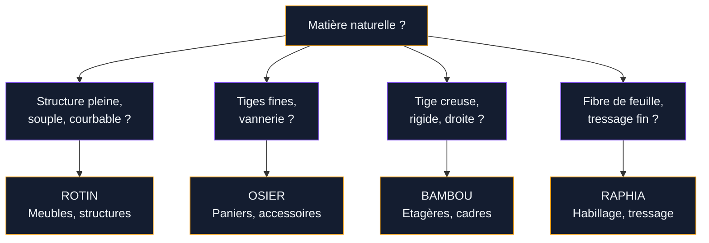
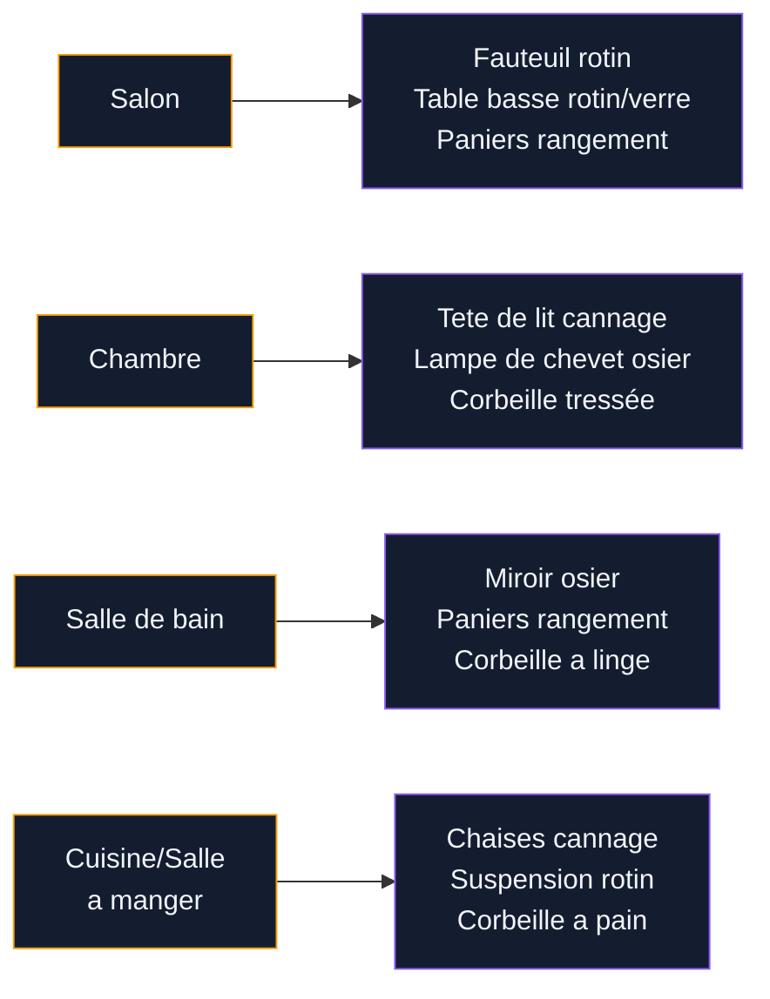

Le rotin et l'osier, tout le monde les confond. Et c'est normal : ces deux matières se ressemblent, se croisent souvent dans les memes meubles, et finissent par se mélanger dans nos tetes. Mais si tu veux acheter malin et décorer juste, il vaut mieux savoir ce que tu choisis - et pourquoi.

On va démeler tout ca : les vraies différences entre rotin, osier, bambou et raphia, les meubles qui marchent, les prix, l'entretien, et surtout des idées concretes pour intégrer ces matières chez toi sans que ca fasse "maison de vacances".

## Rotin vs osier : comprendre les différences

Commençons par la base, parce que c'est la ou la confusion nait. Le rotin et l'osier ne sont pas du tout la meme chose, meme si on les utilise souvent ensemble.

### Le rotin, c'est quoi ?

Le rotin est une liane tropicale qui pousse en Asie du Sud-Est (Indonésie, Philippines, Malaisie). C'est une plante grimpante qui peut atteindre 200 metres de long. Son coeur est plein et solide, ce qui le rend idéal pour fabriquer des structures de meubles : fauteuils, chaises, tables, cadres de lit.

Ce qui rend le rotin si intéressant en déco :

- **Souple et résistant** - Il se courbe sans casser, ce qui permet des formes arrondies élégantes
- **Léger** - Un fauteuil en rotin pese deux à trois fois moins qu'un fauteuil en bois massif
- **Durable** - Bien entretenu, un meuble en rotin dure 20 à 30 ans facile
- **Ecologique** - Le rotin repousse vite (5 à 7 ans), contrairement au bois dur

### L'osier, c'est quoi ?

L'osier, c'est du saule. Plus précisément, ce sont les jeunes tiges (ou brins) de saule, récoltées chaque année en hiver. Contrairement au rotin, l'osier pousse en Europe, notamment en France dans le Val de Loire et en Haute-Marne.

L'osier est plus fin, plus souple, et sert a la vannerie : paniers, corbeilles, cache-pots, abat-jour. Il ne supporte pas les memes charges que le rotin, donc tu ne trouveras pas de canapé en osier. Mais pour les accessoires déco, c'est le top.

> [!NOTE]
> Retiens cette regle simple : le rotin fait les meubles, l'osier fait les accessoires. Le rotin a un coeur plein et rigide, l'osier est creux et souple. Si tu tapes sur la tige et que c'est plein, c'est du rotin.

### Et le bambou, le raphia ?

Rapide tour des matières naturelles qu'on mélange souvent :

- **Bambou** - C'est une graminée creuse, pas une liane. Plus rigide que le rotin, il sert pour les structures droites (étageres, cadres, paravent). Le bambou est moins adapté aux courbes.
- **Raphia** - C'est la fibre tirée des feuilles de palmier raphia. On s'en sert pour le tressage de surface, les sets de table, les chapeaux. En déco, c'est surtout un habillage, pas une structure.

## Les meubles en rotin qui marchent en 2026

Le rotin a connu un vrai retour en grace ces dernieres années. Exit le fauteuil de grand-mere : les designers ont modernisé les formes, allégé les structures, et proposé des pieces qui s'integrent dans n'importe quel intérieur.

### Le fauteuil en rotin - la piece star

C'est l'achat le plus courant, et souvent le premier. Le fauteuil "Emmanuelle" (celui en forme de trone avec un grand dossier évasé) est devenu un classique vintage recherché. Mais il existe plein d'autres formes plus discretes et plus faciles a placer.

**Ou acheter et a quel prix :**

- **Ikea** - Fauteuil BUSKBO en rotin, 129 euros. Simple, sobre, parfait pour un premier achat.
- **Maisons du Monde** - Fauteuils rotin a partir de 200-350 euros. Des modeles plus travaillés, avec accoudoirs arrondis ou dossiers tressés.
- **La Redoute / AM.PM** - Gamme Malu et Galway, de 250 a 500 euros. Rotin naturel ou teinté noir, lignes contemporaines.
- **Made.com** - Fauteuils design en rotin, 300-600 euros. Pour ceux qui veulent un modele original.
- **Brin d'Ouest** - Artisan français, fauteuils haut de gamme en rotin tressé main. A partir de 500 euros. La qualité est au-dessus du lot.

> [!TIP]
> Si tu cherches un fauteuil en rotin pour l'intérieur, vérifie qu'il a un traitement anti-UV et une finition vernie ou huilée. Le rotin brut non traité va griser avec le temps. Les modeles Ikea et Maisons du Monde sont généralement traités, mais demande toujours.

### La tete de lit en rotin

C'est la tendance qui ne faiblit pas. Une tete de lit en rotin tressé ou cannage apporte immédiatement un coté chaleureux et naturel a la chambre, sans surcharger. Ca marche aussi bien avec du linge de lit en lin blanc qu'avec des [textiles colorés et douillets](/guides/decoration/textiles-maison-cosy/).

Chez **La Redoute**, la tete de lit Rattan coute entre 150 et 280 euros selon la largeur. Chez **Maisons du Monde**, compte 180-350 euros. En DIY, tu peux acheter un panneau de cannage (30-60 euros le metre chez Leroy Merlin) et le monter toi-meme sur un cadre en bois.

### La table basse et l'étagere

Les tables basses en rotin avec un plateau en verre restent un grand classique. Le contraste entre la structure organique du rotin et la transparence du verre crée un effet léger et aérien. Budget : 120-300 euros chez Maisons du Monde ou La Redoute.

Pour les étageres, le rotin se prete bien aux formes géométriques : étageres murales rondes, triangulaires, ou en arche. C'est décoratif et utile a la fois. Tu en trouves a partir de 30-80 euros chez Ikea, Action ou Zodio.

### Le cannage - la version subtile

Le cannage, c'est du rotin tressé en treillis fin. On le retrouve sur les portes de meubles (buffets, commodes), les dossiers de chaises, les panneaux décoratifs. C'est la maniere la plus discrète d'intégrer le rotin chez toi.

Le buffet en cannage est devenu la star des intérieurs d'inspiration [scandinave](/guides/decoration/mobilier-scandinave-design-nordique/) et [française classique](/guides/decoration/decoration-francaise-idees-et-photos-romantiques/). Chez Maisons du Monde, les buffets cannage démarrent a 350 euros. Chez AM.PM (La Redoute), compte 400-700 euros pour des modeles en chene et cannage naturel.

## Les accessoires en osier qui changent tout

L'osier est le roi des petits objets qui font la différence. Voici les pieces les plus efficaces pour donner une touche naturelle a ton intérieur.

### Paniers et corbeilles

C'est le B.A.-BA. Les paniers en osier servent de rangement visible, de cache-pot, de corbeille a linge, de panier a bois pres de la cheminée. Empilés ou alignés, ils structurent un espace tout en apportant de la chaleur.

Prix : de 5 euros (Action, Hema) a 40-80 euros pour des pieces artisanales (Brin d'Ouest, Etsy créateurs français).

### Miroirs et cadres en osier

Un miroir rond entouré d'osier tressé, ca transforme une entrée ou une salle de bain en un clin d'oeil. Le style "miroir soleil" en osier est un grand classique qui marche toujours. Tu en trouves chez Maisons du Monde (40-90 euros) ou chez AM.PM (60-120 euros).

### Suspensions et abat-jour

Les suspensions en osier ou en rotin tressé sont parfaites pour un éclairage doux et tamisé. La lumiere filtre a travers les brins et crée des jeux d'ombre sur les murs - l'effet est magnifique le soir. Chez Ikea, la suspension SINNERLIG en bambou/osier est a 49 euros. Chez Made.com, les modeles plus élaborés vont de 80 a 200 euros.

> [!WARNING]
> Attention aux suspensions en matières naturelles pres des sources de chaleur. L'osier et le rotin ne supportent pas la chaleur directe. Utilise des ampoules LED qui ne chauffent pas, et garde au moins 15 cm entre l'ampoule et la matière tressée.

## Entretien du rotin et de l'osier : les bons gestes

C'est souvent la que les gens hésitent. Le rotin et l'osier, ca s'entretient comment ? Bonne nouvelle : c'est assez simple si tu connais les bases.

### Dépoussiérage régulier

Passe un chiffon sec ou un plumeau une fois par semaine sur tes meubles en rotin. Pour les tressages serrés, un aspirateur avec embout brosse fonctionne tres bien. L'ennemi numéro un du rotin, c'est la poussiere accumulée dans les interstices du tressage, qui finit par ternir la matière.

### Nettoyage en profondeur

Tous les deux a trois mois, nettoie tes meubles en rotin avec une éponge légèrement humide et un peu de savon de Marseille. Rince a l'eau claire et seche immédiatement avec un chiffon sec. Ne laisse jamais le rotin tremper - l'eau stagnante le fait gonfler et le fragilise.

Pour l'osier, meme principe mais avec encore plus de douceur. Les paniers et accessoires en osier se nettoient avec un chiffon humide, pas plus.

### Hydrater pour éviter les craquelures

Le rotin a besoin d'hydratation, un peu comme le cuir. Une a deux fois par an, passe une fine couche d'huile de lin ou d'huile de tung sur tes meubles en rotin. Ca nourrit la fibre, prévient les craquelures, et ravive la couleur naturelle.

Tu peux aussi utiliser un lait de cire d'abeille (Briochin en vend un tres bien a 8 euros) pour un résultat plus satiné.

> [!IMPORTANT]
> Le rotin et l'osier ne supportent ni l'humidité constante, ni la chaleur sèche extreme. Evite de placer un meuble en rotin juste a coté d'un radiateur ou dans une salle de bain mal ventilée. L'idéal, c'est un taux d'humidité entre 40% et 60% - le meme que pour ta peau, au fond.

### Réparer un meuble en rotin abimé

Un brin cassé ? Pas de panique. Tu peux le remplacer en achetant du rotin de remplacement (en rouleaux chez Leroy Merlin, 10-15 euros le metre). Trempe le brin neuf dans l'eau tiede pendant 30 minutes pour le rendre souple, puis tresse-le a la place de l'ancien. Pour les réparations plus lourdes, des artisans vanniers proposent des remises en état a partir de 50-100 euros.

## Idées déco rotin et osier a reproduire chez toi

**Le coin lecture** - Un fauteuil en rotin pres d'une fenetre, un coussin moelleux, une petite table d'appoint. C'est simple, mais ca crée un espace a part dans le salon. Le rotin, avec sa légèreté, ne bouche pas la lumiere.

**La chambre "hôtel boutique"** - Tete de lit en cannage, tables de nuit en rotin, suspension en osier tressé. Ajoute du linge de lit en lin blanc et un tapis en jute au sol. Style garanti sans surcharge.

**La salle a manger naturelle** - Remplace tes chaises classiques par des chaises en rotin ou cannage. Meme une seule chaise d'accent en bout de table suffit a changer l'ambiance.

**L'entrée organisée** - Un banc en rotin avec des paniers en osier en dessous pour les chaussures, un miroir en osier au mur. L'entrée gagne en caractere et en rangement.

**Le mur de paniers** - Accroche 5 a 7 paniers en osier de tailles différentes sur un mur, comme une composition artistique. C'est original, pas cher (30-60 euros si tu chines chez Emmaüs), et tres photogénique.

**La terrasse ou le balcon** - Le rotin synthétique (résine tressée) résiste aux intempéries. Chez Ikea (gamme SOLLERON), un salon de jardin coute entre 400 et 800 euros. Pour un balcon, un fauteuil et une petite table suffisent - budget 150-300 euros.

**Le bureau nature** - Un fauteuil de bureau en rotin avec un bureau en bois clair et des accessoires en osier (pot a crayons, corbeille a courrier) pour un [style qui mélange les époques avec élégance](/guides/decoration/mobilier-metallique-vintage-pour-un-interieur-de-caractere/).

**Le cache-pot géant** - Un grand panier en osier tressé (50-70 cm de haut) pour une grande plante verte - ficus, monstera, palmier d'intérieur. L'association plante verte + osier est l'une des plus efficaces en déco. Budget : 20-50 euros chez Jardiland ou Truffaut.

## Les erreurs a éviter avec le rotin et l'osier

**Tout en rotin, partout** - Un fauteuil en rotin, une étagere en rotin, une table en rotin, une suspension en rotin dans la meme piece... ca fait trop. Le rotin fonctionne mieux quand il dialogue avec d'autres matières : bois, métal, lin, béton.

**Rotin naturel en extérieur** - Le vrai rotin ne supporte pas la pluie et l'humidité prolongée. Pour l'extérieur, choisis du rotin synthétique (résine tressée) ou du bambou traité. Tu y gagneras en durabilité.

**Acheter au rabais sans vérifier** - Un fauteuil en rotin a 50 euros, ca existe, mais les finitions sont souvent bacles et les assemblages fragiles. Mieux vaut mettre un peu plus et avoir un meuble qui tient 15 ans qu'un truc qui grince au bout de 6 mois.

**Ignorer l'entretien** - Le rotin qui craque et qui grise, c'est du rotin mal entretenu. 10 minutes de soin par mois suffisent a garder tes meubles beaux pendant des années.

## Sur le meme theme

- [salons modernes 2026](/guides/decoration/salons-modernes-tendances-2026/)

## FAQ

### Quelle est la vraie différence entre le rotin et l'osier ?

Le rotin est une liane tropicale au coeur plein et solide, utilisée pour fabriquer des meubles (fauteuils, chaises, tables). L'osier est constitué de jeunes tiges de saule, plus fines et souples, utilisées en vannerie pour des accessoires (paniers, corbeilles, abat-jour). En résumé : le rotin porte, l'osier décore.

### Le rotin est-il solide pour un usage quotidien ?

Oui, le rotin est une matière tres résistante. Un fauteuil en rotin de bonne qualité supporte facilement 100 a 120 kg et dure 20 a 30 ans avec un entretien minimal. Les marques comme Brin d'Ouest ou AM.PM proposent des meubles en rotin pensés pour un usage intensif au quotidien.

### Comment redonner vie a un vieux meuble en rotin ?

Dépoussierage a fond, nettoyage au savon de Marseille, puis application d'huile de lin ou de tung pour nourrir la fibre. Si le rotin a grisé, un léger ponçage au papier de verre fin (grain 180) avant l'huilage redonne une couleur miel tres agréable. Pour un changement radical, tu peux aussi peindre le rotin avec une peinture acrylique mate.

### Peut-on utiliser du rotin dans une salle de bain ?

Oui, a condition que la salle de bain soit bien ventilée. Le rotin supporte l'humidité occasionnelle, pas l'humidité constante. Préfere les accessoires en osier (paniers, miroirs) aux gros meubles, et assure-toi que la piece est aérée apres chaque douche. Un VMC ou une fenetre régulierement ouverte suffisent.
