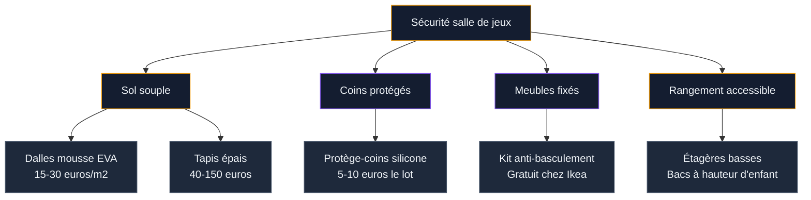
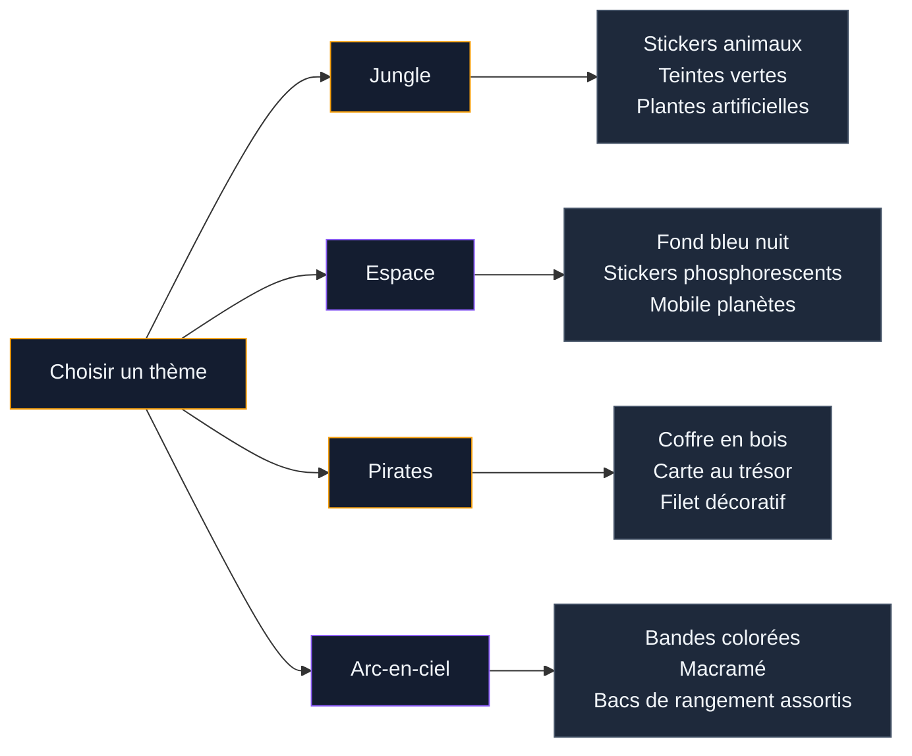

Tu as une pièce libre (ou un coin de salon à sacrifier) et tu rêves d'en faire un vrai repaire pour tes enfants ? Un endroit où ils peuvent jouer, créer, se défouler - sans que le reste de la maison ressemble à un champ de bataille permanent ? Bonne nouvelle : aménager une salle de jeux, ca n'exige ni un budget délirant ni 40 m2. Ce qui compte, c'est de bien penser les zones, la sécurité et le rangement dès le départ.

J'ai testé pas mal de configurations (et ramassé beaucoup de Lego avec les pieds) avant de trouver ce qui marche vraiment. Voici tout ce que je sais, avec des marques accessibles et des prix concrets.

## Définir le projet : jeu, apprentissage ou les deux ?

Avant d'acheter quoi que ce soit, pose-toi la question : qu'est-ce que tu veux que cette pièce apporte à tes enfants ? Parce qu'une salle 100% défoulement et une salle qui mélange jeu et éveil, ca ne s'organise pas pareil.

**Les trois profils classiques :**

- **La salle récréative** : priorité au mouvement, à la musique, aux jeux libres. Peu de mobilier, beaucoup d'espace au sol.
- **La salle créative** : coin dessin, peinture, pate à modeler, construction. Ca demande des surfaces de travail et du rangement spécifique.
- **La salle mixte** : un mélange des deux avec des zones bien délimitées. C'est le choix le plus courant et celui que je recommande si tu as au moins 8-10 m2.

> [!TIP]
> Implique tes enfants dans le choix du thème et des couleurs. Un enfant qui participe à la conception de sa salle de jeux y passera beaucoup plus de temps - et la rangera plus volontiers.

Pour les petits espaces, la logique de [décorer un petit salon](/guides/decoration/decoration-petit-salon/) s'applique ici aussi : chaque meuble doit servir à plusieurs choses, et on privilégie la verticalité.

## La sécurité : le socle de tout l'aménagement

On ne va pas se mentir, les enfants courent, grimpent, tombent et lancent des objets. La sécurité, ca se pense avant la déco - pas après.

### Le sol

C'est le point le plus important. Un carrelage dur ou un parquet brut, ca fait mal. Les options adaptées :

- **Dalles en mousse EVA emboitables** : la solution la plus populaire. Chez Amazon ou Leroy Merlin, compte 15-30 euros le lot de 10 dalles (environ 1 m2). Faciles à poser, à retirer, à nettoyer. Les modèles Ludi ou Tigse sont bien notés.
- **Tapis de jeu épais** : les tapis Vertbaudet en coton (à partir de 40 euros) ou les tapis réversibles Toddlekind (environ 100-150 euros pour 1,80 x 1,20 m) offrent un bon amorti et un look soigné.
- **Moquette courte** : option économique mais plus difficile à nettoyer. Privilégie les moquettes antiallergiques et lavables.

### Les coins et les arêtes

Les protège-coins en silicone (lot de 8 à 12 pour 5-10 euros) se posent sur les meubles, les rebords de fenêtre et les étagères basses. Chez Ikea, les blocs de rangement Trofast ont déjà des coins arrondis - c'est un bon point de départ.

### Le mobilier stable

Fixe au mur tout ce qui peut basculer : étagères, bibliothèques, meubles hauts. Les kits anti-basculement Ikea sont gratuits sur demande en magasin. C'est un geste simple qui évite les accidents graves.

> [!CAUTION]
> Ne place jamais de meubles grimpables près d'une fenêtre. Et vérifie que les fenêtres de la pièce ont un blocage d'ouverture (les entrebailleurs se trouvent à partir de 5 euros en grande surface de bricolage).

## Organiser les zones : coin lecture, espace créatif, aire de jeux

L'erreur classique, c'est de tout mettre en vrac au milieu de la pièce. Les enfants ont besoin de repères visuels pour savoir où faire quoi. Pas besoin de murs ni de cloisons - un tapis différent, un changement de couleur au sol ou une petite étagère basse suffisent à délimiter les espaces.

### Le coin lecture

Un petit coin douillet avec des coussins de sol, un pouf ou un tipi, et des étagères à portée de mains. Les étagères à livres Flisat d'Ikea (15 euros pièce) montrent les couvertures de face - les enfants choisissent bien mieux leurs livres quand ils voient les images.

Ajoute une guirlande lumineuse LED à piles (10-15 euros chez Action ou Gifi) pour créer une ambiance cosy qui donne envie de s'installer.

### L'espace créatif

Table et chaises adaptées à la taille de tes enfants. Le set Latt d'Ikea (table + 2 chaises) coute 30 euros et fait le job pour les 2-6 ans. Pour les plus grands, la table Flisat (60 euros) avec ses bacs intégrés permet de ranger crayons et feutres directement dans le plateau.

**Mon astuce :** colle un rouleau de papier kraft (8 euros les 50 mètres chez Cultura) sur un mur, à hauteur d'enfant. Ils dessinent directement dessus, tu déchires la feuille et tu recommences. Ca protège le mur et ca libère la créativité.

### L'aire de jeux libres

C'est la zone la plus grande - celle où les enfants jouent au sol avec des Lego, des Playmobil, des circuits de train. L'idée, c'est de garder cet espace le plus dégagé possible. Pas de table au milieu. Juste un sol souple et du rangement tout autour.

Si tu as la hauteur sous plafond et le budget, un petit toboggan d'intérieur (Smoby, 50-80 euros) ou une balancoire d'intérieur (à partir de 25 euros chez Vertbaudet) transforme la pièce en vrai terrain d'aventure.

## Le rangement : la clé pour ne pas devenir fou

C'est LE sujet. Une salle de jeux sans système de rangement solide, ca se transforme en zone sinistrée en 24 heures.

**Le système Trofast d'Ikea** est la référence et pour cause : les bacs de couleur sont légers, empilables, et les enfants peuvent les sortir et les remettre seuls. Un meuble Trofast en pin (60 euros) avec 6 bacs (3 euros pièce) donne une base de rangement efficace pour moins de 80 euros au total.

**Les autres options qui fonctionnent :**

- **Étagères Kallax** (Ikea, à partir de 40 euros pour un 2x2) avec des bacs en tissu Drona (5 euros pièce). Parfait pour séparer les catégories : un bac pour les voitures, un pour les peluches, un pour les déguisements.
- **Coffre à jouets** : attention, les modèles avec charnière à fermeture lente sont obligatoires pour éviter les doigts coincés. Le coffre Stuva d'Ikea (50 euros) a ce mécanisme intégré.
- **Filet à peluches** : un hamac d'angle accroché en hauteur (10-15 euros sur Amazon) libère beaucoup d'espace au sol. Les peluches sont visibles, accessibles et rangées.
- **Paniers étiquetés** : colle des étiquettes avec des images (pas seulement du texte) sur chaque bac. Les enfants qui ne savent pas encore lire rangent quand même au bon endroit.

> [!NOTE]
> Le rangement doit être à hauteur d'enfant. Si tu veux qu'ils rangent seuls, tout doit être accessible sans aide. Garde les étagères hautes pour le matériel que tu veux superviser (peinture, ciseaux, petites pièces).

Pour aller plus loin sur les astuces de [rangement créatif et optimisation](/rangement-creatif-optimisation/), tu trouveras d'autres idées adaptables à une salle de jeux.

## Thèmes et déco murale : donner une identité à la pièce

C'est le moment fun. Le thème, ca transforme une pièce banale en univers magique pour un enfant. Et pas besoin de repeindre tous les murs ou de poser du papier peint partout - quelques touches bien placées suffisent.

### Les thèmes qui marchent en 2026

- **Jungle / animaux** : stickers muraux géants (à partir de 15 euros chez Vertbaudet ou Amazon), teintes vertes et ocres. Si tu veux pousser le concept, jette un oeil à notre guide sur [la décoration chambre style jungle](/guides/chambre/decorer-une-chambre-dans-un-style-jungle/) pour des idées transposables.
- **Espace / planètes** : fond bleu nuit, stickers phosphorescents (10 euros le lot), mobile de planètes. Le plafond étoilé avec des guirlandes LED fait son petit effet.
- **Pirates / aventure** : coffre en bois déco, carte au trésor géante au mur, filet de pêche décoratif.
- **Arc-en-ciel / couleurs** : très tendance, ca convient à tous les ages et ca vieillit bien. Des bandes de couleur peintes au mur ou un grand arc-en-ciel en macramé (30-50 euros chez Etsy).

### La peinture murale

Deux options économiques qui changent tout :

**La peinture ardoise** (Leroy Merlin, 15 euros le pot de 0,5L) : tu peins un pan de mur ou un rectangle, et tes enfants dessinent à la craie dessus. Ca se nettoie à l'éponge humide, ca évite les murs tagués au feutre.

**La peinture magnétique** (Julien, environ 25 euros le pot de 0,5L) : une sous-couche magnétique recouverte de la couleur de ton choix. Tes enfants y accrochent des magnets, des dessins avec des aimants, sans trous dans le mur.

## L'éclairage : adapter la lumière aux activités

L'éclairage d'une salle de jeux, ca ne se résume pas à un plafonnier central. Chaque zone a des besoins différents.

**L'éclairage général** : un plafonnier LED à lumière chaude (3000K) ou une suspension ludique. Chez Ikea, la suspension Solvinden (à partir de 10 euros) ou les plafonniers de la gamme enfant Amscan proposent des formes amusantes. Vise une puissance de 300-400 lumens par m2.

**L'éclairage du coin lecture** : une lampe de chevet ou une guirlande LED à intensité variable. La lumière tamisée encourage la lecture et crée un espace distinct du reste de la pièce.

**L'éclairage du coin créatif** : ici il faut de la lumière blanche neutre (4000K) pour bien voir les couleurs et les détails. Une lampe de bureau orientable (Ikea Tertial, 12 euros) fait parfaitement l'affaire.

> [!WARNING]
> Évite les lampes posées au sol ou les lampadaires dans une salle de jeux - les enfants les renversent. Privilégie les éclairages muraux, suspendus ou fixés à la table.

## Budget récapitulatif par niveau

**Aménagement malin (200-400 euros)**
- Dalles mousse EVA : 30-60 euros
- Meuble Trofast + 6 bacs : 80 euros
- Table et chaises enfant Latt : 30 euros
- Étagères Flisat x2 : 30 euros
- Stickers muraux + guirlande : 25-40 euros
- Tapis ou coussins de sol : 30-50 euros
- Lampe et accessoires : 20-30 euros

**Aménagement complet (500-900 euros)**
- Dalles ou tapis de qualité : 60-150 euros
- Système rangement Kallax + Trofast : 150-200 euros
- Mobilier créatif (table Flisat + chaises) : 90 euros
- Peinture ardoise + peinture magnétique : 40 euros
- Thème déco complet (stickers, accessoires, textile) : 80-150 euros
- Éclairage multi-zones : 50-80 euros
- Toboggan ou balancoire intérieur : 50-80 euros

**Aménagement premium (1 000 euros et plus)**
- Sol professionnel type salle de jeux : 200-400 euros
- Mobilier sur mesure ou Montessori : 300-500 euros
- Mur d'escalade intérieur (kit Decathlon, à partir de 150 euros) : 150-300 euros
- Déco murale personnalisée (fresque peinte ou papier peint panoramique) : 150-400 euros
- Éclairage LED connecté : 80-150 euros

## Faire évoluer la pièce avec l'age des enfants

Un point qu'on oublie souvent : une salle de jeux pour un enfant de 3 ans ne ressemblera plus à rien pour un enfant de 10 ans. Pense ta pièce comme un espace évolutif.

**Les éléments fixes** (qui restent longtemps) : le sol souple, les étagères murales, la peinture ardoise, les systèmes de rangement modulables type Kallax.

**Les éléments remplacables** (qui changent avec les ages) : les stickers muraux, le thème, le type de jouets stockés, la hauteur de la table et des chaises.

Quand ton enfant grandit, la salle de jeux peut se transformer en coin gaming, en studio créatif ou en espace devoirs. Pour les ados, un guide comme [les idées déco chambre ado moderne](/chambre-ado-moderne-idees-decoration-tendance/) te donnera des pistes pour faire évoluer l'espace.

## Sur le meme theme

- [salons modernes 2026](/guides/decoration/salons-modernes-tendances-2026/)
- [décoration art déco](/guides/decoration/50-idees-de-decoration-art-deco/)
- [peindre des bocaux ou bouteilles en verre](/guides/decoration/comment-peindre-des-bocaux-ou-des-bouteilles-en-verre/)

## FAQ

**Quelle surface minimale pour une salle de jeux ?**
Avec 6 m2, tu peux déjà créer un espace fonctionnel en combinant coin lecture et aire de jeux. L'idéal se situe entre 9 et 15 m2 pour avoir de vraies zones séparées. En dessous de 6 m2, opte pour un coin jeux intégré dans une autre pièce.

**À quel age une salle de jeux devient utile ?**
Dès 18 mois, un espace dédié avec sol souple et bacs de rangement bas a du sens. La salle évolue avec l'enfant : jouets de motricité pour les tout-petits, construction et créativité pour les 3-6 ans, jeux de société et lecture pour les plus grands.

**Comment entretenir une salle de jeux au quotidien ?**
La règle d'or : on range avant de sortir une nouvelle catégorie de jouets. Instaure un rituel de rangement de 5 minutes avant le repas ou le bain. Avec des bacs étiquetés et un système simple, un enfant de 3-4 ans peut ranger seul 80% de ses jouets.

**Quels matériaux éviter dans une salle de jeux ?**
Le verre (étagères, cadres non sécurisés), les meubles avec des arêtes vives en métal, les rideaux longs dans lesquels les enfants peuvent s'enrouler, et les petits éléments déco fragiles posés en hauteur instable. Privilégie le bois, le textile, le plastique et les matériaux souples.
