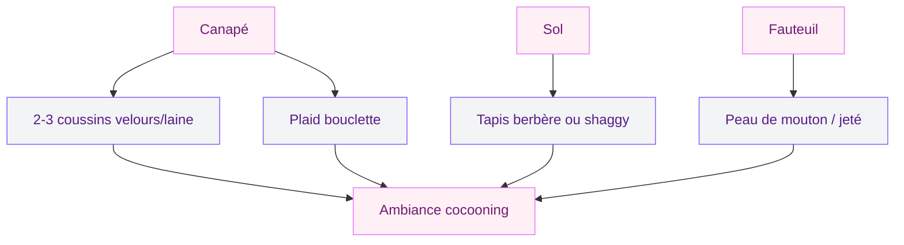
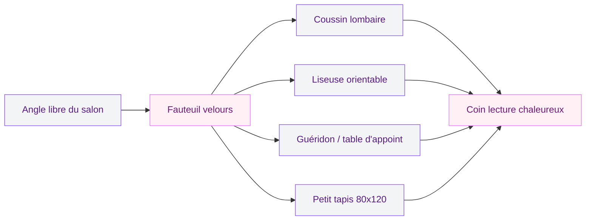

Tu rentres chez toi, tu t'affales dans ton canapé et... tu trouves que ça manque un peu de vie. Le salon est propre, rangé, mais il donne l'impression d'un showroom sans âme. Pas de panique. Avec quelques ajustements bien placés, tu peux transformer cette pièce froide en un vrai cocon où tu auras envie de passer tes soirées. Je te partage mes 10 astuces testées et approuvées pour rendre ton salon plus chaleureux - sans tout casser, sans gros budget, et sans avoir besoin d'un décorateur.

## 1. Miser sur des couleurs chaudes pour les murs

La couleur des murs, c'est la base. Un blanc trop froid ou un gris clair sans relief, ça refroidit instantanément l'ambiance. Pour réchauffer ton salon, oriente-toi vers des teintes terreuses : terracotta, ocre jaune, beige sable, rose poudré ou un vert sauge profond.

Tu n'es pas obligé de peindre les quatre murs. Un seul mur d'accent en terracotta derrière le canapé change déjà toute la dynamique de la pièce. L'astuce, c'est de garder les autres murs dans un ton neutre chaud (blanc cassé, lin, coquille d'œuf) pour équilibrer le tout.

Si tu veux creuser le sujet des palettes, jette un œil à mon guide sur les [couleurs du salon en 2026](/guides/decoration/couleurs-du-salon-2026-palettes-de-murs-et-de-decors) - tu y trouveras des combinaisons qui marchent à coup sûr.

> [!TIP]
> Avant de te lancer, achète des échantillons et teste-les sur un carton A3 que tu déplaces dans la pièce. La lumière naturelle change tout : une couleur superbe en magasin peut virer terne chez toi.

## 2. Superposer les textiles douillets

Un salon chaleureux, c'est un salon où tu as envie de toucher les choses. Le velours, la laine, le coton tufté, la fausse fourrure - ces matières invitent à s'installer et à rester. L'idée, c'est de superposer les couches.

Voici un plan concret :

- **Sur le canapé** : 2 à 3 coussins de tailles différentes (un grand 60x60, deux moyens 45x45) + un plaid en laine ou en bouclette drapé sur l'accoudoir
- **Au sol** : un tapis épais type berbère ou shaggy sous la table basse, assez grand pour dépasser du canapé
- **Sur les fauteuils** : une peau de mouton ou un jeté en fausse fourrure

Pour les couleurs des textiles, reste dans une palette cohérente : bordeaux, rouille, moutarde, écru. Évite le total look monochrome - le mélange des textures suffit à créer de la richesse visuelle.

## 3. Travailler l'éclairage en plusieurs couches

L'erreur classique : un seul plafonnier qui éclaire tout le salon comme un bureau. Pour une ambiance chaleureuse, il faut multiplier les sources de lumière et les répartir à différentes hauteurs.

Trois niveaux à combiner :

1. **Éclairage d'ambiance** : guirlandes lumineuses, bougies (ou bougies LED si tu as des enfants ou des animaux), lampes avec variateur
2. **Éclairage fonctionnel** : une liseuse près du canapé, une lampe de bureau dans le coin lecture
3. **Éclairage décoratif** : un lampadaire en rotin, une suspension en laiton, des appliques murales

La température de couleur joue aussi un rôle important. Choisis des ampoules à 2700K maximum - c'est la lumière chaude, tirant sur le jaune doré. À partir de 4000K, ça vire au blanc clinique.

> [!NOTE]
> Un variateur d'intensité coûte entre 15 et 30 euros et se pose en 10 minutes. C'est l'investissement le plus rentable pour l'ambiance de ton salon.

## 4. Intégrer du bois et des matières naturelles

Le bois apporte de la chaleur de manière quasi instantanée. Qu'il soit brut, teinté miel ou noyer foncé, il crée une connexion avec la nature qui adoucit n'importe quel intérieur.

Où placer du bois dans ton salon :

- **Table basse** en chêne massif ou en manguier
- **Étagères murales** en bois brut avec équerre en métal noir
- **Cadres photos** en bois naturel au lieu du plastique
- **Plateau décoratif** en bois sur la table basse pour regrouper bougies et petits objets

En complément du bois, ajoute d'autres matières naturelles : un panier en osier pour les magazines, un vase en grès, des accessoires en rotin. Si le sujet t'intéresse, j'ai écrit un article sur le [rotin et l'osier en déco](/guides/decoration/rotin-osier) avec plein d'idées concrètes.

## 5. Ajouter des plantes vertes (même sans la main verte)

Les plantes apportent de la vie, de la couleur et une sensation de fraîcheur. Et non, tu n'as pas besoin d'un jardin intérieur pour que ça fonctionne. Deux à trois plantes bien placées suffisent.

Mes recommandations pour un salon :

- **Monstera** : grandes feuilles graphiques, peu d'entretien, pousse vite
- **Ficus lyrata** : port arbustif élégant, idéal pour combler un angle vide
- **Pothos** : plante retombante parfaite sur une étagère en hauteur
- **Sansevieria** : quasi indestructible, supporte le manque de lumière

Place tes plantes là où elles captent un peu de lumière : près d'une fenêtre, sur une étagère face à la source lumineuse. Un cache-pot en terre cuite ou en fibre tressée renforce le côté chaleureux.

> [!WARNING]
> Certaines plantes d'intérieur sont toxiques pour les chats et les chiens (pothos, monstera, ficus). Si tu as des animaux, vérifie la compatibilité avant d'acheter.

## 6. Créer un coin lecture ou détente

Un salon qui n'a qu'un canapé face à la télé, ça manque d'ancrage. Créer un petit coin à part - un fauteuil avec une liseuse, une pile de livres et un petit guéridon - donne une dimension supplémentaire à la pièce et invite à s'y poser autrement.

Tu n'as pas besoin de beaucoup d'espace. Un fauteuil en velours côtelé, un coussin lombaire, une lampe orientable et un petit tapis sous les pieds : c'est tout. L'idée, c'est de marquer visuellement un espace distinct du reste du salon.

## 7. Jouer avec les bougies et les senteurs

Les bougies, c'est le raccourci le plus simple vers un salon cocooning. La flamme vibrante, la lumière douce, le parfum subtil - tout ça active un sentiment de confort presque immédiat.

Quelques règles pour bien les utiliser :

- **Regroupe-les** : 3 bougies de tailles différentes sur un plateau ou un miroir crée plus d'impact qu'une bougie isolée
- **Choisis des senteurs douces** : vanille, bois de santal, figue, ambre. Évite les parfums trop chimiques ou trop puissants
- **Varie les supports** : photophores en verre fumé, bougeoirs en laiton, pots en béton

Si tu n'es pas fan de la flamme nue, les diffuseurs à bâton ou les brumisateurs d'huiles essentielles font aussi l'affaire pour la dimension olfactive.

## 8. Habiller les murs avec des éléments personnels

Des murs vides, ça sonne creux. Mais attention : habiller les murs ne veut pas dire couvrir chaque centimètre. L'objectif, c'est de créer des points d'intérêt qui racontent quelque chose.

Ce qui fonctionne bien :

- **Une galerie murale** : un groupe de 5 à 7 cadres de tailles variées, mélangeant photos perso, illustrations et petits objets
- **Un miroir** : en plus de réfléchir la lumière, il agrandit visuellement l'espace
- **Des étagères décoratives** : mix de livres, bougies, petits vases et objets chinés
- **Un macramé** ou une tenture textile pour adoucir les lignes droites

Pour les cadres et l'accrochage, consulte mon guide sur [comment bien accrocher un tableau mural](/guides/decoration/bien-accrocher-tableau-mural) - ça t'évitera les trous inutiles.

## 9. Choisir un mobilier aux formes arrondies

Les meubles aux lignes angulaires et tranchantes donnent un aspect strict. Pour un salon chaleureux, privilégie les formes arrondies et les volumes généreux : un canapé aux accoudoirs courbés, une table basse ronde ou ovale, un pouf au lieu d'un tabouret rigide.

Ce n'est pas une question de style précis - ça marche aussi bien en déco scandinave qu'en déco bohème ou contemporaine. La rondeur appelle le confort et la convivialité. Un canapé en L avec des coussins moelleux reste le meilleur investissement pour un salon où l'on aime recevoir.

Pour les matériaux, le velours et la bouclette sont les grands gagnants en matière de chaleur visuelle. Le cuir vieilli fonctionne aussi, mais évite le cuir noir lisse qui refroidit l'ambiance.

> [!TIP]
> Un pouf en velours ou en laine bouclette (comptez 40 à 80 euros) sert à la fois de siège d'appoint et de repose-pieds. C'est l'accessoire polyvalent par excellence pour un salon cocooning.

## 10. Soigner les détails qui font la différence

Les détails, c'est ce qui sépare un salon "correct" d'un salon où l'on se sent vraiment bien. Voici les petits plus qui comptent :

- **Un joli panier** pour ranger les télécommandes, les chargeurs et le bazar du quotidien
- **Des dessous de verre** en liège ou en marbre sur la table basse
- **Un plat décoratif** avec des fruits secs, des pommes de pin ou des pierres
- **Des rideaux épais** qui tombent jusqu'au sol - le lin lavé ou le velours côtelé, c'est parfait
- **Un jeté de canapé** qui se voit même quand personne ne l'utilise

L'idée générale : chaque objet visible doit être soit utile, soit beau, soit les deux. Range ce qui est moche, expose ce qui a du caractère.

## Récapitulatif : les 10 leviers d'un salon chaleureux

## Par où commencer ? Le plan d'action concret

Si tu te sens un peu dépassé par toutes ces astuces, voici l'ordre que je te recommande :

1. **Semaine 1** : Achète un plaid et 2-3 coussins dans des matières douces. Budget : 50 à 100 euros.
2. **Semaine 2** : Remplace tes ampoules par des 2700K et ajoute une ou deux sources de lumière d'appoint. Budget : 30 à 60 euros.
3. **Semaine 3** : Installe 2-3 plantes et quelques bougies. Budget : 30 à 50 euros.
4. **Mois suivant** : Investis dans un tapis si tu n'en as pas, puis pense à la peinture d'un mur d'accent. Budget : 80 à 250 euros.

En un mois, pour moins de 300 euros, ton salon aura complètement changé de visage. Pas besoin de tout refaire d'un coup - c'est l'accumulation des petits gestes qui crée l'ambiance.

Pour encore plus d'inspiration sur les tendances actuelles, découvre aussi mon guide sur les [salons modernes et élégants en 2026](/guides/decoration/salons-modernes-et-elegants-2026).

> [!IMPORTANT]
> L'erreur la plus courante, c'est de vouloir tout acheter d'un coup dans le même magasin. Prends ton temps, chine dans les brocantes, mélange les sources. C'est le mix qui rend un intérieur unique et personnel.

## FAQ

### Comment rendre un salon chaleureux avec un petit budget ?

Commence par les textiles : un plaid en laine et quelques coussins en velours coûtent entre 30 et 60 euros et changent immédiatement l'ambiance. Ajoute des bougies (même basiques) et remplace tes ampoules par des modèles 2700K. Pour moins de 50 euros, tu auras déjà une différence visible.

### Quelles couleurs réchauffent le plus un salon ?

Les teintes terreuses sont tes meilleures alliées : terracotta, ocre jaune, beige chaud, rouille, moutarde. Le vert sauge profond fonctionne aussi très bien. Évite les gris froids et les blancs purs qui créent une ambiance clinique. Un seul mur d'accent dans une de ces teintes peut transformer la pièce.

### Quel éclairage choisir pour un salon cocooning ?

Multiplie les sources de lumière à différentes hauteurs : lampadaire, lampe à poser, bougies, guirlande lumineuse. Le point important, c'est la température de couleur - reste à 2700K pour une lumière chaude et dorée. Un variateur d'intensité te permet d'adapter l'ambiance selon le moment de la journée.

### Comment rendre un salon moderne plus chaleureux sans changer le mobilier ?

Les accessoires font tout le travail. Ajoute des textiles (coussins, plaid, tapis épais), des plantes vertes, des bougies et quelques objets en bois naturel. Habille tes murs avec une galerie de cadres ou un miroir. Tu peux aussi poser un jeté de canapé en bouclette ou en fausse fourrure pour adoucir un canapé en cuir ou en tissu lisse.

### Quelles matières privilégier pour un salon cocooning ?

Le velours, la laine, la bouclette et le coton tufté sont les matières stars. Pour les meubles et accessoires, le bois massif, le rotin, l'osier et le grès apportent une touche naturelle. Évite le plastique, le verre trempé et le métal chromé qui refroidissent l'atmosphère. Le cuir vieilli reste une option valable à condition de l'associer à des matières plus douces.
