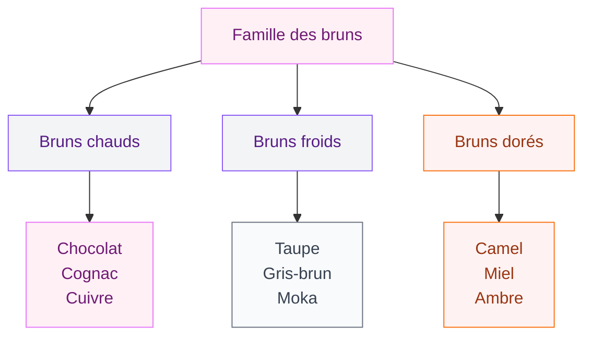
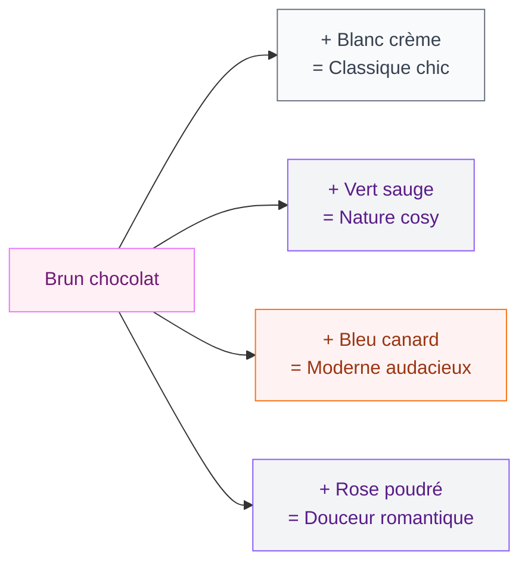

Le brun, c'est la couleur qu'on oublie souvent quand on pense déco. On fonce sur le vert sauge, le bleu canard, le terracotta - et on zappe complètement cette teinte qui est pourtant une des plus chaleureuses et polyvalentes qui existe. Si tu veux un salon qui respire le cocon, le calme et une certaine élégance discrète, le brun est ton meilleur allié. Je t'explique comment l'utiliser sans tomber dans le "salon de mamie", avec des idées concrètes, des repères de prix et des combinaisons de couleurs qui fonctionnent vraiment.

## Pourquoi le brun revient en force dans nos salons

Le brun a longtemps souffert d'une mauvaise réputation. On l'associait aux salons des années 80, aux canapés en skaï marron et aux lambris défraîchis. Mais la tendance s'est complètement inversée. En 2026, les intérieurs qui misent sur les tons bruns - du chocolat profond au camel doux - sont partout sur les réseaux et dans les magazines.

Plusieurs raisons à ce retour :

- Les matériaux naturels sont au coeur des tendances actuelles : bois, cuir, lin brut, jute. Et ces matières sont naturellement brunes.
- Le brun s'accorde avec presque tout. Blanc, noir, vert, bleu, orange, rose : il sert de base neutre chaude.
- C'est une couleur qui vieillit bien. Un canapé brun en cuir, dans 10 ans il sera encore plus beau qu'au premier jour.

> [!NOTE]
> Le brun n'est pas une couleur unique mais une famille entière : chocolat, noisette, camel, taupe, cognac, moka, terre brûlée. Chaque nuance change complètement l'ambiance d'un salon.

## Les nuances de brun à connaître (et comment choisir la tienne)

Avant de te lancer, il faut comprendre que tous les bruns ne se valent pas. Le choix de la nuance dépend de la taille de ton salon, de sa luminosité et de l'ambiance que tu veux créer.

### Bruns chauds : chocolat, cognac, cuivre

Les bruns chauds tirent vers le rouge et l'orange. Ils créent immédiatement une ambiance enveloppante, presque gourmande. Le chocolat foncé fonctionne très bien sur un seul mur d'accent, surtout si ton salon a de belles fenêtres. Le cognac, lui, est parfait pour le cuir d'un canapé ou d'un fauteuil.

Un canapé en cuir cognac chez Made.com tourne autour de 1200-1800 euros. Chez Ikea, le modèle LANDSKRONA en cuir brun-doré est une alternative solide à 799 euros.

### Bruns froids : taupe, gris-brun, moka

Si tu préfères quelque chose de plus discret et contemporain, les bruns froids sont faits pour toi. Le taupe - ce mélange subtil de gris et de brun - est une vraie pépite pour un salon qui veut être élégant sans en faire trop. Le moka, un brun tiré vers le gris foncé, donne un côté très "loft parisien".

> [!TIP]
> Pour tester une teinte taupe sur tes murs, regarde la gamme Dulux Valentine "Brun de Terre" ou Farrow & Ball "London Clay" (environ 95 euros le litre). En budget malin, Leroy Merlin propose des teintes taupe en peinture Luxens autour de 25-35 euros les 2,5L.

### Bruns dorés : camel, miel, ambre

Les bruns dorés apportent de la lumière. Si ton salon manque de luminosité naturelle, ces teintes compensent en créant un effet chaud et rayonnant. Le camel est un classique pour les plaids, les poufs et les coussins. L'ambre fonctionne magnifiquement en velours sur un fauteuil d'appoint.

## Le canapé brun : la pièce maîtresse du salon

Le canapé, c'est le point de départ logique quand on veut intégrer du brun dans son salon. C'est le meuble le plus imposant visuellement, et c'est lui qui donne le ton à toute la pièce.

### Cuir ou tissu ?

Le cuir brun, c'est le grand classique. Un canapé en cuir pleine fleur couleur cognac ou chocolat, ça traverse les décennies sans broncher. Le cuir vieillit bien, il se patine - et cette patine fait partie du charme. Budget : entre 800 euros (Ikea KIVIK cuir) et 3500 euros (canapés artisanaux type BoConcept ou Roche Bobois).

Le tissu, c'est plus accessible et plus doux au toucher. Un canapé en velours brun chocolat fait un effet dingue dans un salon un peu dépouillé. Le modèle VIMLE chez Ikea en brun foncé tourne autour de 600-900 euros. Chez La Redoute, la gamme AM.PM propose des canapés en velours côtelé brun à partir de 899 euros.

> [!TIP]
> Mon secret pour un canapé brun qui ne fait pas "masse sombre" : ajoute des coussins en lin naturel beige, un plaid en fausse fourrure crème et un coussin moutarde. Le contraste clair-foncé donne du relief et empêche l'effet caverne.

### Canapé brun : les modèles qui marchent

- **Canapé droit 3 places** : le plus polyvalent. Fonctionne dans les petits et grands salons.
- **Canapé d'angle** : parfait si tu as la place. En cuir brun, c'est un vrai statement piece.
- **Canapé modulable** : tendance 2026. Tu peux réorganiser les modules selon tes envies. Tediber propose un modèle brun à partir de 1490 euros.

Si tu cherches aussi des idées pour [moderniser ton appartement dans un style parisien](/guides/decoration/comment-moderniser-votre-appartement-dans-le-plus-pur-style-parisien/), le canapé brun en cuir est un élément clé de ce look.

## Les murs bruns : oser ou doser ?

Peindre un mur en brun, ça fait peur à beaucoup de monde. Et c'est normal - mal dosé, ça peut vite assombrir une pièce. Mais bien fait, c'est spectaculaire.

### La règle du mur unique

Ne peins jamais les quatre murs en brun foncé. La bonne stratégie, c'est un seul mur d'accent dans un brun profond (chocolat, moka, terre brûlée), et les trois autres en blanc chaud, crème ou beige très clair. Ça crée de la profondeur sans étouffer l'espace. Pour aller plus loin sur le sujet des couleurs qui créent de la profondeur, jette un oeil à notre article sur les [couleurs pour donner de la profondeur à un mur ou à une pièce](/guides/couleurs/des-couleurs-pour-donner-de-la-profondeur-a-un-mur-ou-a-une-piece/).

### Peinture ou papier peint ?

La peinture mate en brun foncé donne un rendu très haut de gamme. Les finitions mat profond absorbent la lumière et créent un effet cocooning très immersif. Regarde la teinte "Salon Drab" de Farrow & Ball ou "Chocolat Amer" chez Tollens.

Le papier peint est une autre option géniale. Les papiers peints à motifs botaniques sur fond brun (feuillages, palmes) apportent du caractère sans peindre. Chez Leroy Merlin, tu trouves des rouleaux entre 15 et 40 euros. Pour du haut de gamme, Pierre Frey ou Elitis proposent des papiers peints bruns somptueux à partir de 80 euros le rouleau.

## Les combinaisons de couleurs qui marchent avec le brun

Le brun est une base géniale parce qu'il se marie avec une quantité énorme de couleurs. Voici les combinaisons les plus réussies pour un salon.

### Brun + blanc crème : le duo intemporel

C'est le combo le plus sûr. Un canapé brun foncé, des murs blancs chauds, du bois clair au sol. C'est propre, lumineux et chaleureux. Ça fonctionne dans tous les styles, du scandinave au contemporain.

### Brun + vert : la connexion nature

Le brun et le vert, c'est la combinaison la plus naturelle qui soit - littéralement. Pense à la forêt, aux troncs et aux feuilles. Un salon avec du mobilier brun et des touches de vert (plantes, coussins vert olive, mur vert sauge) respire l'harmonie. Si les [couleurs du salon 2026](/guides/decoration/couleurs-du-salon-2026-palettes-de-murs-et-de-decors/) t'intéressent, tu verras que le vert et le brun sont au coeur de plusieurs palettes tendance cette année.

### Brun + bleu canard : le contraste chic

Le bleu canard profond avec le brun, c'est un duo qui claque. Les deux couleurs sont intenses mais ne se font pas concurrence. Un canapé brun cognac avec des coussins bleu canard et un tapis brun clair, c'est un salon qui a du caractère.

### Brun + rose poudré : la douceur inattendue

On n'y pense pas forcément, mais le rose poudré adoucit le brun de manière très élégante. Un fauteuil brun foncé avec un plaid rose antique, des coussins en lin rose pâle sur un canapé taupe - c'est doux, moderne et un peu inattendu.

> [!WARNING]
> Évite de combiner le brun foncé avec du noir en grande quantité. Le résultat risque d'être trop sombre et étouffant, surtout dans un petit salon. Utilise le noir uniquement en petites touches (cadres, lampe, pieds de meuble).

## Les matières qui subliment le brun dans un salon

La force du brun, c'est qu'il fonctionne avec presque toutes les matières. Mais certaines associations sont vraiment magiques.

### Le bois : l'évidence

Bois de noyer, chêne moyen, acacia - les essences naturelles sont brunes par nature. Une table basse en noyer massif (autour de 300-600 euros chez Maisons du Monde ou Made.com), des étagères en chêne, un parquet en bois foncé : le brun du bois apporte de la noblesse.

### Le cuir : la patine

Un vieux fauteuil club en cuir brun, c'est un objet qui raconte une histoire. Même neuf, le cuir brun a cette capacité à paraître déjà vécu, déjà aimé. Les poufs en cuir marocain (autour de 60-100 euros sur Etsy ou dans les boutiques déco) sont une manière facile d'ajouter du cuir brun sans casser la tirelire.

### Le velours : la gourmandise

Le velours brun, c'est le confort absolu. Des coussins en velours chocolat (H&M Home à partir de 12 euros, Zara Home autour de 25 euros) ou un canapé entièrement en velours brun - c'est une invitation à s'installer et ne plus bouger.

### Le rotin et la jute : le naturel

Tapis en jute (à partir de 40 euros chez Ikea), panier en rotin, suspension en fibres naturelles. Ces matières brunes claires allègent l'ambiance et apportent une touche bohème qui empêche le salon d'être trop "sérieux".

## Salon brun : 5 ambiances concrètes à reproduire chez toi

### 1. Le salon brun cocooning

Canapé en velours chocolat, plaid en laine écru, coussins camel et moutarde, tapis berbère beige, mur blanc chaud, guirlande lumineuse. Budget total (hors canapé) : environ 200-350 euros.

### 2. Le salon brun contemporain

Canapé en cuir cognac, table basse en métal noir et bois, mur gris-brun clair, lampadaire arc doré, coussins graphiques noir et blanc. Si tu veux aller dans cette direction, les [salons modernes et élégants 2026](/guides/decoration/salons-modernes-et-elegants-2026/) te donneront plein d'idées complémentaires.

### 3. Le salon brun nature

Meuble TV en bois brut, canapé en lin brun clair, plantes vertes en quantité, tapis en jute, paniers en osier, mur vert sauge. Le brun et le vert se répondent pour créer une bulle végétale.

### 4. Le salon brun bohème

Canapé brun foncé avec des coussins dépareillés (terracotta, moutarde, prune), macramé au mur, tapis kilim, pouf en cuir, suspension en rotin. Le brun sert de fil conducteur dans un mix de couleurs et de motifs.

### 5. Le salon brun luxe discret

Canapé en cuir pleine fleur brun foncé, table basse en marbre, touches de laiton (appliques, poignées), rideaux en lin épais taupe, tapis uni gris-brun. Peu de couleurs, beaucoup de textures. C'est le brun version sobre et raffiné.

## Les accessoires bruns pas chers qui changent tout

Tu n'as pas forcément besoin de racheter un canapé pour intégrer le brun dans ton salon. Quelques accessoires bien choisis suffisent à changer l'ambiance.

- **Coussins en velours brun** : H&M Home à partir de 9,99 euros, Primark Home 6 euros
- **Plaid en fausse fourrure brune** : Ikea SMARAGDBUSKE 25 euros, Zara Home 49 euros
- **Tapis en jute naturelle** : Ikea LOHALS à partir de 39 euros (160x230 cm)
- **Vases en grès brun** : Sostrene Grene 8-15 euros, Action 3-5 euros
- **Cadres en bois foncé** : Ikea HOVSTA 9,99 euros, La Foirfouille 5 euros

> [!IMPORTANT]
> Le brun au sol (tapis, parquet) et le brun en hauteur (rideaux, étagères) ne donnent pas du tout le même effet. Si ton salon est petit, concentre le brun foncé au niveau du sol et des assises, et garde le haut des murs et le plafond clairs.

## Sur le meme theme

- [salons modernes 2026](/guides/decoration/salons-modernes-tendances-2026/)

## FAQ

### Le brun est-il adapté à un petit salon ?

Oui, à condition de choisir les bonnes nuances. Les bruns clairs (camel, miel, taupe clair) agrandissent visuellement l'espace. Évite le chocolat foncé sur les murs dans un petit salon - réserve-le pour le mobilier et les accessoires.

### Quelles couleurs associer au brun pour un salon moderne ?

Le blanc crème, le vert sauge, le bleu canard et le noir en petites touches. Pour un résultat très actuel, ajoute du laiton doré dans les luminaires et les poignées.

### Comment éviter qu'un salon brun fasse triste ou vieux ?

Mise sur le contraste et les textures. Mélange des bruns clairs et foncés, ajoute du blanc ou du crème pour la luminosité, et varie les matières (cuir, velours, lin, bois). Les plantes vertes sont aussi tes meilleures alliées pour casser le côté monotone.
