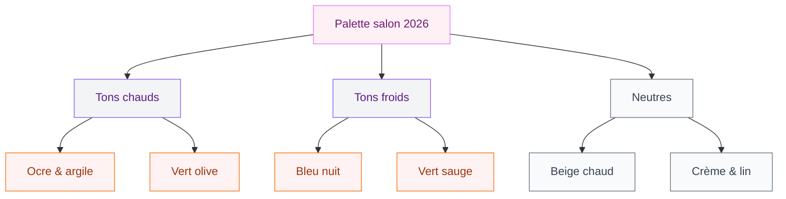
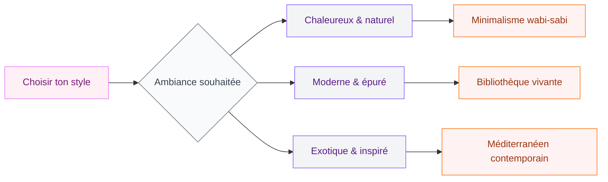

Tu as envie de relooker ton salon mais tu ne sais pas trop par où commencer ? Pas de panique - 2026 apporte des tendances vraiment sympa, accessibles et surtout cohérentes. Que tu aimes le style minimaliste épuré, les ambiances chaleureuses avec du bois et du lin, ou les intérieurs aux teintes audacieuses, cette année offre quelque chose pour chaque goût. Je t'emmène faire le tour des grandes tendances, avec des idées concrètes et des repères de prix pour t'aider à passer à l'action.

## Les couleurs phares du salon en 2026

La palette de 2026 joue clairement la carte de l'apaisement. On sort des intérieurs tout blancs aseptisés pour aller vers des teintes qui respirent, qui réchauffent, qui donnent envie de rester.

### Le retour des terres et des sages

Les tons de terre dominent : ocre doux, argile, brique patinée. Ces couleurs s'inspirent directement de la nature et créent une ambiance à la fois moderne et intemporelle. Elles fonctionnent particulièrement bien sur un mur d'accent, avec un mobilier clair en contraste.

Si tu es tentée par cette direction, tu peux regarder les peintures Farrow & Ball (gamme "Joa's White", "Dead Salmon", "Elephant's Breath") autour de 80-100 euros le litre - cher mais vraiment beau. Pour un budget plus serré, les gammes Tollens ou Dulux Ambiance font très bien le travail à 30-40 euros le litre.

> [!TIP]
> Pour tester une couleur avant de peindre tout un mur, commande les petits pots d'échantillon (2 à 4 euros) et applique des carrés de 30 x 30 cm sur le mur. Regarde-les à différentes heures de la journée - une teinte peut totalement changer selon la lumière.

### Le vert sauge et ses cousins

Le vert sauge reste très présent, mais en 2026 il s'enrichit d'autres verts : le vert mousse, le vert olive profond, le vert céladon très pâle. Ces tons se marient magnifiquement avec le bois naturel, le rotin, et les textiles beige ou écru.

Si tu aimes les associations de couleurs plus audacieuses, les teintes orangées se prêtent aussi au jeu avec ces verts. Je te conseille d'aller jeter un oeil à notre article sur les [couleurs compatibles avec l'orange pour les murs et la décoration](/guides/couleurs/couleurs-compatibles-avec-lorange-pour-les-murs-et-la-decoration/) - il y a des combinaisons vraiment surprenantes qui fonctionnent super bien dans un salon.

### Le bleu nuit et le prune

Pour ceux qui aiment les salons plus dramatiques et cocooning, le bleu nuit profond et les tons prune-aubergine font une entrée remarquée. Utilisés sur un seul mur ou dans les éléments de mobilier, ils créent un effet luxueux sans alourdir la pièce.

## Les matières et textures tendance

En 2026, le toucher compte autant que le regard. Les salons bien construits jouent sur la superposition des matières pour créer de la richesse visuelle sans surcharger.

### Le bois clair et le chêne blanchi

Le bois est partout, mais pas n'importe lequel. Le chêne clair, le frêne, le hêtre - les essences claires dominent et apportent cette légèreté scandinave qu'on aime tant. Le chêne blanchi ou huilé donne un résultat très propre et moderne.

Côté mobilier, une table basse en chêne massif chez Maisons du Monde tourne autour de 200-350 euros. Si tu veux quelque chose de plus costaud et durable, regarde du côté de chez Hartô (tables entre 400 et 800 euros) ou BoConcept (souvent au-dessus de 600 euros mais la qualité suit).

### Le rotin et l'osier revisités

Le rotin ne repart pas - au contraire, il s'affine. En 2026, on le voit dans des formes plus géométriques, associé à des structures métal fin noir mat. Un fauteuil en rotin comme le modèle "Apapa" chez Maisons du Monde (environ 230 euros) s'intègre très bien dans un salon moderne.

### Le velours et le boucle

Pour les canapés et fauteuils, deux matières sortent du lot : le velours (côtelé notamment) dans des tons vert, bleu ou terracotta, et le tissu boucle - ce tissu texturé qui ressemble à de la laine bouclée et qui a un rendu très cosy.

Un canapé en velours côtelé vert bouteille chez La Redoute se trouve autour de 600-900 euros. Pour le boucle, IKEA a sorti des housses et des chaises dans cette matière à des prix accessibles (entre 60 et 250 euros selon la pièce).

> [!NOTE]
> Le velours côtelé est plus résistant qu'on ne le croit - il est facile à entretenir avec une brosse douce. En revanche, le boucle peut accrocher les ongles ou s'effilocher avec des animaux. Si tu as des chats, préfère le velours traité anti-griffes.

## Les styles qui dominent en 2026

### Le minimalisme chaleureux

On dépasse le minimalisme froid des années 2010. En 2026, "épuré" ne veut plus dire "sans âme". L'idée est de choisir moins de meubles, mais des pièces plus belles, plus significatives. Un beau canapé, une table basse sculptée, deux ou trois objets choisis avec soin - et c'est tout.

Ce style s'inspire beaucoup du wabi-sabi japonais : l'imperfection, le temps qui passe, les matières naturelles légèrement brutes. Une poterie artisanale, un bouquet de branches séchées, un tapis en laine teinte naturelle - voilà le genre de détails qui font la différence.

### Le style méditerranéen-marocain contemporain

Les influences du bassin méditerranéen arrivent fort en 2026. Carreaux de ciment sur un petit pan de mur, moucharabieh en claustra, lanternes en métal ciselé - autant d'éléments qu'on intègre dans un intérieur moderne pour créer une identité forte sans tomber dans le pittoresque.

Si ce style t'attire, je t'invite à lire notre guide sur la [décoration marocaine moderne ou classique](/guides/decoration/decoration-marocaine-moderne-ou-classique/) - tu y trouveras des idées très concrètes pour intégrer ces codes dans ton intérieur actuel.

### Le salon "bibliothèque vivante"

Grande tendance de 2026 : le salon qui intègre des livres de façon décorative. Pas juste une bibliothèque dans un coin - mais des livres qui font partie de la composition visuelle de la pièce. Des étagères ouvertes sur toute une hauteur de mur, des piles de beaux livres sur la table basse, des volumes disposés sur des niches...

Ce style fonctionne bien avec des couleurs profondes (vert bouteille, bleu nuit, noir mat) qui mettent en valeur les objets posés devant.

## L'éclairage, le grand oublié

Un salon peut être décoré avec les plus beaux meubles du monde - si l'éclairage est raté, tout tombe à plat. En 2026, l'éclairage devient une vraie pièce de déco à part entière.

### Multiplier les sources lumineuses

Le plaffonnier central unique est mort. La règle d'or : au moins trois sources de lumière à des hauteurs différentes. Un plafonnier pour la lumière générale, une ou deux lampes à poser pour les zones de lecture ou de convivialité, et une lumière d'ambiance (guirlande, ruban LED derrière un meuble, bougie de grande taille).

Les marques comme Ferm Living ou Muuto proposent de très beaux luminaires entre 100 et 300 euros. Pour un budget plus accessible, les gammes Hay chez Merci ou les lampes de chez H&M Home sont souvent à moins de 80 euros et ont vraiment bien travaillé le design ces dernières années.

> [!WARNING]
> Evite les ampoules à lumière bleue (6500K) dans un salon - elles donnent un rendu de bureau et nuisent à la détente. Choisis des ampoules entre 2700K et 3000K pour une lumière chaude et cosy. Toutes les ampoules LED modernes précisent la température de couleur sur l'emballage.

### Les suspensions en matières naturelles

Les suspensions en corde, en raphia, en rotin ou en papier de riz sont partout en 2026. Elles apportent cette touche organique et douce qui contraste bien avec des meubles plus rigides. Une belle suspension en rotin tressé chez La Redoute tourne autour de 60-120 euros.

## Le sol et les tapis

### Les revêtements qui s'imposent

Pour les sols, deux matières dominent : le parquet en bois clair (chêne huilé naturel de préférence) et le carrelage imitation pierre naturelle. Le travertin, le calcaire et l'ardoise font un retour fort - dans des formats larges de 60x120 ou 80x80 cm qui donnent une impression d'espace.

Pour un parquet, compte environ 30-60 euros le m² pour un stratifié de qualité, et 60-120 euros le m² pour un parquet contrecollé. L'installation ajoute en général 15-25 euros le m².

### Le tapis comme ancre visuelle

Dans un salon, le tapis est l'élément qui "pose" la pièce. En 2026, on aime les grands tapis - bien plus grands qu'on ne l'imagine souvent. Idéalement, tous les pieds du canapé et des fauteuils doivent être posés dessus, ou au moins les pattes avant.

Les matières naturelles (laine, jute, coton) restent en tête. Chez IKEA, le tapis "Stoense" en laine tufté (200x300 cm) est autour de 299 euros - un très bon rapport qualité-prix. Pour quelque chose de plus artisanal, les tapis kilim ou berbères sur des sites comme Nodi ou Beni Rugs se trouvent entre 200 et 800 euros selon la taille.

Si la déco terracotta te parle, notre article sur la [déco terracotta en chambre](/guides/chambre/deco-terracotta-chambre/) donne plein d'idées transposables aussi au salon - les associations de couleurs et les matières fonctionnent très bien d'une pièce à l'autre.

> [!IMPORTANT]
> Un tapis trop petit est l'erreur la plus courante en décoration de salon. Pour une pièce standard, préfère un tapis d'au moins 160x230 cm, et idéalement 200x300 cm. Un grand tapis dans un petit salon donne une impression d'espace - un petit tapis dans une grande pièce fait exactement l'inverse.

## Accessoires et plantes : la touche finale

### Les plantes comme éléments structurants

En 2026, les plantes ne sont plus de simples accessoires - elles font partie de la composition de la pièce. On les choisit pour leur forme sculpturale : un ficus lyrata avec son grand tronc, un Strelitzia aux feuilles graphiques, un olivier en pot pour une touche méditerranéenne.

Pour une grande plante d'intérieur, compte entre 40 euros (pour un ficus basique chez IKEA) et 200-400 euros pour une belle pièce mature chez un pépiniériste spécialisé. L'investissement en vaut la peine - une belle plante bien placée vaut tous les tableaux du monde.

### Les objets déco : moins mais mieux

La règle de 2026 : acheter moins, acheter mieux. Plutôt que de multiplier les petits objets sans lien entre eux, on compose des "vignettes" - des regroupements de 3 à 5 éléments qui ont une cohérence de couleur, de hauteur, de matière.

Une bougie chez Diptyque (60-80 euros) posée à côté d'une poterie artisanale trouvée sur un marché et d'un livre relié en tissu - voilà une vignette qui a du sens et du caractère.

> [!TIP]
> Pour créer une vignette réussie, suis la règle des trois hauteurs : un objet grand, un moyen, un petit. Et joue sur trois matières différentes : céramique + bois + métal, ou verre + textile + pierre. Ce contraste crée automatiquement de l'intérêt visuel.

## Budget : combien ça coûte vraiment ?

Pour remettre à plat un salon sans tout changer, voici des fourchettes réalistes :

| Poste | Budget accessible | Budget confort |
|---|---|---|
| Peinture (1 mur d'accent) | 50-80 euros | 100-150 euros |
| Canapé | 500-800 euros | 1200-2500 euros |
| Table basse | 100-200 euros | 300-600 euros |
| Tapis | 150-300 euros | 400-800 euros |
| Éclairage | 100-200 euros | 300-600 euros |
| Plantes + accessoires | 100-200 euros | 300-500 euros |
| **Total** | **1000-1780 euros** | **2600-5150 euros** |

Le secret pour rester dans les clous : ne pas tout changer d'un coup. Commence par la peinture et les textiles (coussins, plaid) - c'est peu cher et l'effet est immédiat. Ensuite le tapis, puis le mobilier au fur et à mesure.

Si la cuisine fait partie de ton projet de rénovation globale, notre article sur la [cuisine avec une palette olive](/guides/cuisine/cuisine-olive/) peut t'aider à créer une cohérence entre les pièces - les tons olive se marient d'ailleurs très bien avec les tendances salon 2026.

## En résumé : les 5 clés d'un salon moderne et élégant en 2026

1. **Une palette de couleurs cohérente** - deux ou trois tons max, avec une vraie réflexion sur les contrastes
2. **Des matières naturelles et texturées** - bois, rotin, lin, laine plutôt que plastique et synthétique
3. **Un éclairage travaillé** - minimum trois sources, toutes à 2700-3000K
4. **Un grand tapis** - vraiment grand, qui ancre tous les meubles
5. **Des plantes structurantes** - une ou deux grandes, pas dix petites

2026, c'est l'année où le salon devient un vrai lieu de vie pensé pour toi, pas pour faire une belle photo sur Instagram. Un espace qui respire, qui te ressemble, dans lequel tu as vraiment envie de passer du temps.

---

## Questions fréquentes

**Quelles sont les couleurs tendance pour un salon en 2026 ?**
Les tons chauds dominent : ocre, argile, vert sauge, vert olive. Les tons profonds comme le bleu nuit ou le prune restent aussi très présents pour des ambiances plus cocooning.

**Comment rendre un salon moderne sans changer tout le mobilier ?**
Commence par la peinture (un mur d'accent suffit), change les textiles (coussins, plaid, tapis), ajoute une belle plante structurante et travaille l'éclairage. Ce sont les quatre leviers les plus efficaces et les plus accessibles.

**Quel budget prévoir pour relooker un salon ?**
Avec 1000 à 1800 euros tu peux vraiment transformer un salon en partant des postes clés. Pour un résultat plus abouti avec du mobilier de qualité, compte 2500 à 5000 euros.

**Le velours est-il toujours tendance en 2026 ?**
Oui, surtout le velours côtelé dans des tons chaleureux (vert, terracotta, bleu). Le tissu boucle fait aussi une très forte percée dans les salons tendance 2026.

**Faut-il vraiment un grand tapis dans un petit salon ?**
Oui - c'est contre-intuitif mais un grand tapis agrandit visuellement l'espace. Un petit tapis "flottant" au milieu d'une pièce fait l'effet inverse et fragmente l'espace.
