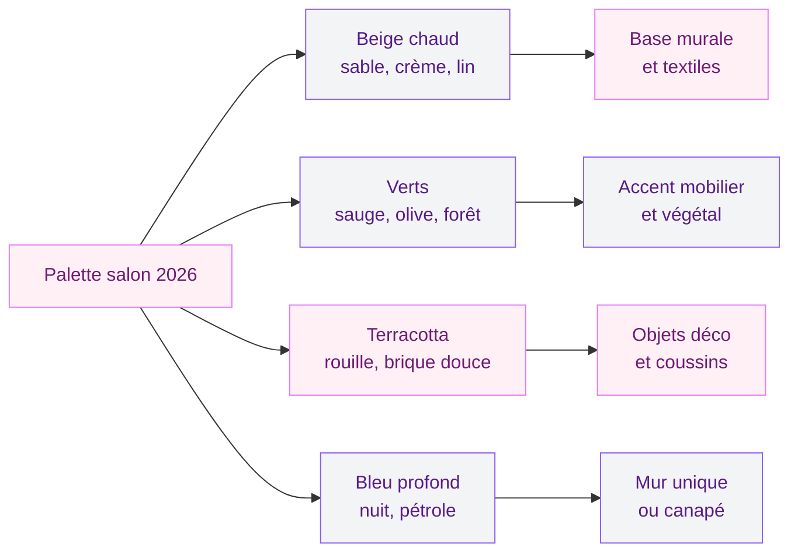
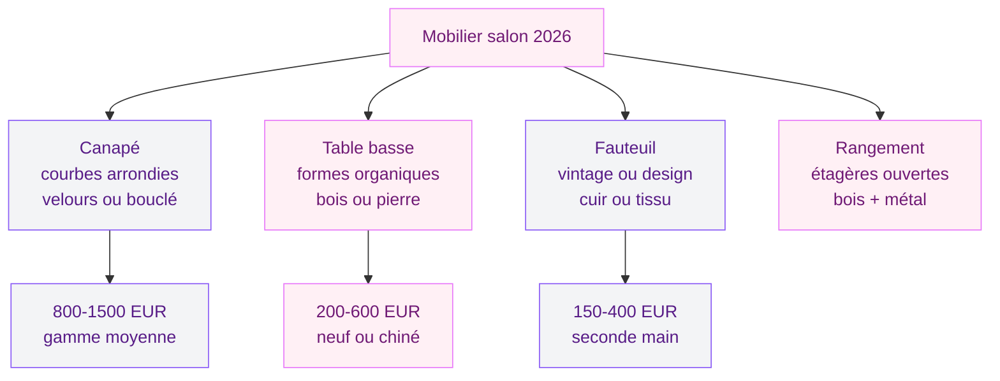
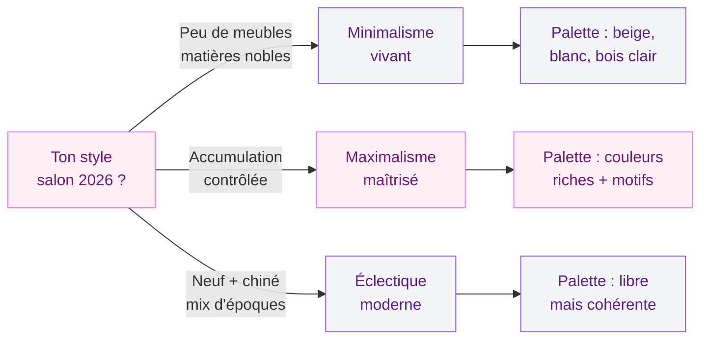

Tu as envie de redonner du caractère à ton salon sans tomber dans le total look catalogue ? En 2026, les tendances déco pour les salons modernes s'orientent vers un vrai équilibre entre design contemporain et authenticité. Moins de pièces "parfaites", plus d'intérieurs qui racontent une histoire. Et bonne nouvelle : on peut obtenir un résultat canon sans exploser le budget. Je te fais le tour complet des idées qui marchent cette année.

## Le minimalisme vivant : la tendance qui redéfinit les salons modernes

Oublie les salons tout blancs et tout vides des années 2010. Le minimalisme version 2026 garde l'idée d'un espace aéré, mais y ajoute de la chaleur, de la personnalité, des objets qui ont du sens. Les designers parlent de "minimalisme vivant", et franchement c'est l'approche la plus maline pour un salon moderne.

  

Le principe est simple : tu gardes peu de meubles, mais chaque pièce est choisie avec soin. Un canapé avec du vrai caractère (en velours texturé ou en cuir patiné), une table basse en bois brut aux formes organiques, un ou deux objets déco qui te plaisent vraiment - et c'est tout. L'espace respire, mais il n'est jamais froid.

> [!TIP]
> Pour tester cette approche, commence par retirer 30% des objets de ton salon pendant une semaine. Tu verras vite ce qui te manque réellement et ce qui n'était que du remplissage visuel.

Ce qui change par rapport au minimalisme classique, c'est le rapport aux matières. On ne cherche plus la surface parfaitement lisse. Un mur avec un enduit légèrement irrégulier, une poterie artisanale, un tapis en laine avec des imperfections assumées - ces textures donnent de la profondeur et de l'âme à la pièce.

## Les couleurs qui définissent les salons modernes en 2026

La palette de cette année joue sur des teintes à la fois douces et affirmées. Fini le tout-gris qui a dominé pendant des années. Place aux couleurs qui réchauffent et qui racontent quelque chose.

  

### Le beige chaud et ses déclinaisons

Le beige revient en force, mais pas le beige triste des années 90. On parle d'un beige vivant : crème, sable, lin, biscuit. Ces teintes servent de base parfaite pour un salon moderne parce qu'elles s'adaptent à tous les styles. Sur les murs, elles créent une atmosphère enveloppante sans réduire l'espace visuellement.

Pour les peintures, la gamme Tollens "Lin et sable" propose de belles nuances autour de 30-40 euros le litre. Chez Farrow & Ball, les teintes "Joa's White" ou "Skimming Stone" montent à 80-100 euros le litre, mais le rendu mat profond vaut le détour si le budget suit.

### Le vert sous toutes ses formes

Le vert s'installe durablement dans nos intérieurs. Vert sauge pour la douceur, vert olive pour le caractère, vert forêt pour la profondeur. En 2026, on le retrouve autant sur les murs que dans le mobilier et les accessoires. Un canapé vert olive, un mur d'accent vert sauge ou simplement un tapis vert mousse suffisent à ancrer la tendance.

### La terracotta adoucie

Moins orangée qu'il y a deux ans, la terracotta version 2026 tire vers la brique douce, le rose poudré chaud, la rouille atténuée. Elle s'intègre par petites touches dans les coussins, les vases, les cadres muraux, et se marie parfaitement avec le beige et le vert. Si tu aimes cette approche, tu trouveras des idées concrètes dans notre guide sur [la décoration terracotta](/decorer-avec-terracota/).

> [!NOTE]
> Règle simple pour une palette salon réussie : une couleur dominante (murs et gros meubles), une couleur secondaire (textiles et petits meubles), une couleur d'accent (objets et accessoires). Pas plus de trois familles de teintes.

## Les matières phares pour un salon contemporain

C'est peut-être la partie la plus intéressante des tendances 2026 : le toucher reprend ses droits. Un salon moderne ne se regarde plus seulement, il se vit avec les mains, les pieds, le corps entier. Les matières sont choisies autant pour leur esthétique que pour la sensation qu'elles procurent.

  

### Le bois brut et le bois récupéré

Le bois reste le pilier de la déco salon. Mais en 2026, on le préfère brut, avec ses noeuds, ses veines visibles, ses imperfections. Le chêne naturel, le noyer fumé, le frêne blanchi dominent. Et le bois récupéré ou de seconde main gagne du terrain : une vieille table de ferme retapée, un tabouret vintage en orme, un plateau en bois flotté.

Une table basse en chêne massif coûte entre 200 et 500 euros chez Maisons du Monde ou La Redoute Intérieurs. Pour du mobilier en bois vintage, chine sur Selency ou LeBonCoin - les prix sont souvent 40 à 60% moins chers que le neuf pour des pièces avec bien plus de personnalité.

### Le métal mat et le laiton vieilli

Le métal apporte la structure et le contraste dans un salon moderne. En 2026, on le choisit mat plutôt que brillant. Le métal noir brossé pour les pieds de table, les luminaires, les étagères. Le laiton vieilli pour les petits accessoires, les poignées, les cadres. Ces touches de métal donnent un aspect design sans froideur.

### Le velours et le bouclé

Pour les textiles, deux matières s'imposent. Le velours côtelé ou lisse apporte la douceur et l'élégance - parfait pour un canapé ou des coussins d'accent. Le tissu bouclé (boucle) crée cette ambiance cocooning et texturée que tout le monde recherche. Ces matières se retrouvent dans les couleurs tendance : vert, beige, terracotta, bleu nuit.

> [!WARNING]
> Si tu as des animaux de compagnie, le tissu bouclé accroche les griffes et peut pelucher rapidement. Privilégie le velours traité anti-taches ou les matières tissées serrées, plus résistantes au quotidien.

## Mobilier : les formes qui comptent en 2026

Le mobilier salon 2026 se reconnaît à ses formes. La ligne droite et anguleuse laisse la place aux courbes douces, aux formes organiques, aux volumes généreux. C'est un virage qui s'est amorcé il y a deux ans, mais qui arrive maintenant à maturité dans des pièces vraiment abouties.

  

### Le canapé aux lignes arrondies

Le canapé est la pièce centrale de tout salon. En 2026, les modèles les plus recherchés ont des accoudoirs arrondis, des dossiers légèrement incurvés, des assises profondes. On s'éloigne du canapé carré et strict pour aller vers des formes plus accueillantes. Les canapés modulables restent aussi très demandés pour leur capacité à s'adapter aux petits et grands espaces.

Budget à prévoir : un bon canapé dans cette esthétique se trouve entre 800 et 1500 euros chez des enseignes comme Made, La Redoute Intérieurs ou IKEA (gamme haute). Pour du haut de gamme, Roche Bobois et Ligne Roset proposent des pièces à partir de 2000 euros.

### La table basse sculpturale

C'est LA pièce déco du salon en 2026. La table basse n'est plus un simple plateau sur pieds - elle devient un objet sculptural. Formes organiques en bois massif, blocs de pierre polie, plateaux en résine teintée, bases asymétriques. On la choisit comme on choisirait une oeuvre d'art : pour son allure et l'émotion qu'elle provoque.

### Les meubles vintage chinés

La tendance vintage ne faiblit pas. Mixer des meubles neufs et des pièces chinées donne au salon un look unique et une vraie authenticité. Un fauteuil en cuir des années 70, un guéridon en métal rétro, une étagère en bois patinée - ces éléments apportent cette petite dose d'imprévu qui empêche un intérieur d'avoir l'air sorti d'un catalogue. Pour aller plus loin sur ce sujet, jette un oeil à notre guide [décoration vintage : 50 images et idées](/decoration-vintage-50-images-et-idees-pour-linspiration/).

## Accessoires et déco murale : les détails qui changent tout

Un salon moderne se joue aussi dans les détails. Les accessoires et la décoration murale permettent de personnaliser l'espace sans engagement lourd. Tu peux changer de tapis, de coussins ou d'objets déco tous les six mois sans refaire toute la pièce.

  

### Le tapis comme pièce maîtresse

Le tapis est redevenu central dans la déco salon. En 2026, on le choisit grand (il doit passer sous le canapé et la table basse), dans des matières naturelles : laine, jute, sisal, coton tissé. Les motifs abstraits discrets et les textures en relief sont les plus demandés. Un tapis en laine 160x230 cm coûte entre 200 et 600 euros chez Benuta, Westwing ou AM.PM.

Les tapis vintage - kilims, beni ouarain, azilal - gardent aussi la cote. Ils apportent de la couleur et du caractère sans effort. Tu en trouves sur Etsy ou dans les brocantes spécialisées, entre 150 et 400 euros pour un modèle authentique en bon état.

### L'éclairage d'ambiance

Les luminaires deviennent des objets déco à part entière. Lampadaires sculpturaux, suspensions en matières naturelles (rotin, papier, lin), appliques murales graphiques - l'éclairage contribue autant à l'ambiance qu'à la décoration du mur. L'idée en 2026 : multiplier les sources de lumière douce plutôt que tout miser sur un plafonnier central.

### Le mur habillé avec intention

Le mur blanc vide, c'est terminé. En 2026, on habille ses murs avec une approche réfléchie : un ensemble de cadres dépareillés mais harmonieux, un miroir aux formes organiques, des étagères murales pour exposer des objets, un grand tableau ou une tenture murale en tissu. Le mur devient un espace d'expression au même titre que le mobilier.

Pour des idées concrètes d'agencement mural, consulte notre guide pour [bien accrocher un tableau mural](/bien-accrocher-tableau-mural/).

> [!TIP]
> Astuce de pro pour une composition murale réussie : dispose tes cadres au sol d'abord, prends une photo avec ton téléphone, et ajuste avant de percer. Tu gagneras du temps et tu éviteras les trous inutiles.

## Le maximalisme maîtrisé : l'autre grande tendance

A l'opposé du minimalisme vivant, le maximalisme contrôlé fait son grand retour. Pas question de tout empiler n'importe comment : il s'agit de superposer les motifs, les couleurs, les textures et les objets avec intention. AD Magazine le confirme comme une des tendances fortes de 2026.

Un salon maximaliste réussi joue sur l'accumulation de matières (velours, bois, métal, céramique), les motifs (un tapis à motifs + des coussins imprimés + un papier peint), et les époques (un canapé contemporain + une lampe vintage + un miroir ancien). La clé, c'est la cohérence de la palette de couleurs qui unifie le tout.

Ce style demande un bon oeil et un peu d'audace, mais le résultat est un intérieur avec une vraie personnalité. Si le sujet t'intéresse, notre article sur [les couleurs du salon 2026](/couleurs-du-salon-2026-palettes-de-murs-et-de-decors/) te donnera les palettes idéales pour composer un look maximaliste sans faute de goût.

## L'esthétique durable : le salon responsable

Dernière tendance qui irrigue toutes les autres : la durabilité. En 2026, un salon moderne est aussi un salon pensé pour durer. Ca passe par le choix de meubles de qualité (plutôt que du jetable remplacé tous les deux ans), par les matières naturelles et recyclables, et par la seconde main.

Les designers intègrent cette dimension directement dans leurs collections : bois issus de forêts gérées, tissus en fibres recyclées, meubles démontables et réparables. Et côté déco, les objets faits main et artisanaux remplacent progressivement les accessoires industriels produits en masse.

> [!IMPORTANT]
> Avant d'acheter un meuble neuf, pose-toi trois questions : est-ce que je peux le trouver en seconde main ? Est-ce qu'il durera au moins 10 ans ? Est-ce que je l'aime vraiment ou c'est juste un achat impulsif ? Ces trois filtres t'éviteront bien des erreurs.

## Sur le meme theme

- [salons modernes et élégants 2026](/salons-modernes-et-elegants-2026/)

## FAQ : tes questions sur les salons modernes 2026

### Quel budget prévoir pour relooker un salon en 2026 ?

Tout dépend de l'ampleur du projet. Pour un rafraîchissement (peinture + textiles + quelques accessoires), compte entre 500 et 1500 euros. Pour un relooking complet avec nouveau canapé, table basse et tapis, prévois entre 2000 et 5000 euros. Le mix neuf/chiné permet de réduire la note de 30 à 50%.

### Comment mixer les styles sans que ca fasse bazar ?

La clé, c'est la palette de couleurs. Tu peux mixer du vintage, du contemporain et du scandinave dans le même salon, à condition de rester dans la même famille de teintes. Choisis 2 à 3 couleurs max et tiens-toi à cette ligne, quel que soit le style de chaque meuble.

### Quelles sont les erreurs les plus courantes dans un salon moderne ?

Les trois erreurs classiques : un tapis trop petit (il doit passer sous les pieds avant du canapé au minimum), trop de petits meubles au lieu de quelques belles pièces, et un éclairage limité à un seul plafonnier. Corrige ces trois points et ton salon change déjà beaucoup.

### Comment rendre un petit salon moderne et spacieux ?

Privilégie les meubles aux pieds fins et visibles (ca allège visuellement), choisis des couleurs claires sur les murs, mise sur un grand miroir pour agrandir l'espace et opte pour un mobilier multifonction (table basse avec rangement, canapé convertible). Le minimalisme vivant est le style idéal pour les petits espaces.

### Quels meubles sont les plus durables pour un salon ?

Les meubles en bois massif (chêne, noyer, frêne) sont les plus résistants dans le temps. Pour les canapés, les structures en bois avec sangles et mousse haute densité durent bien plus longtemps que les cadres en contreplaqué. Un canapé de qualité peut durer 15 à 20 ans avec un entretien correct.
