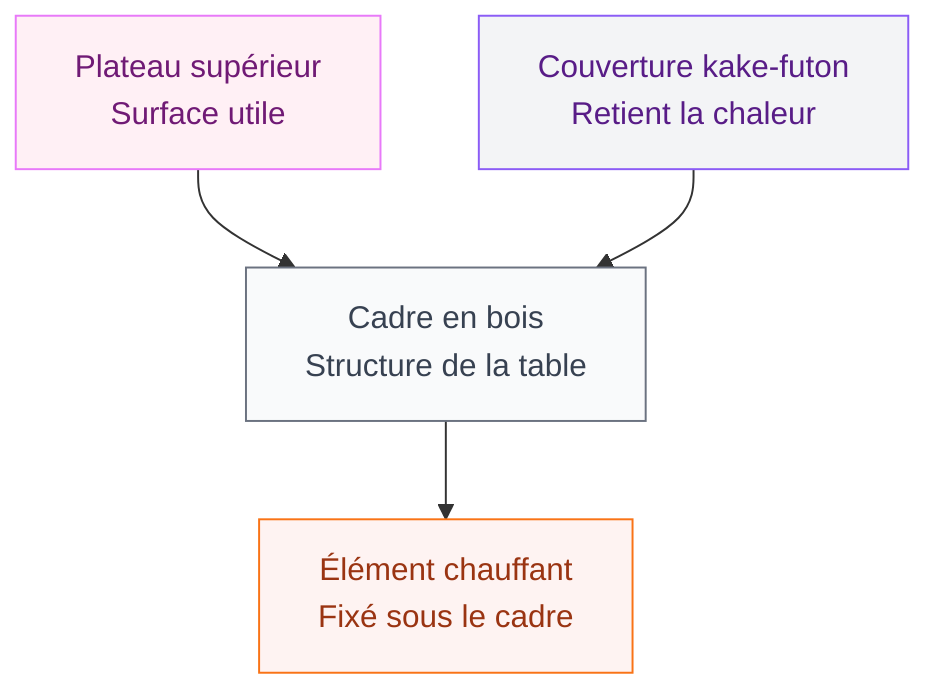
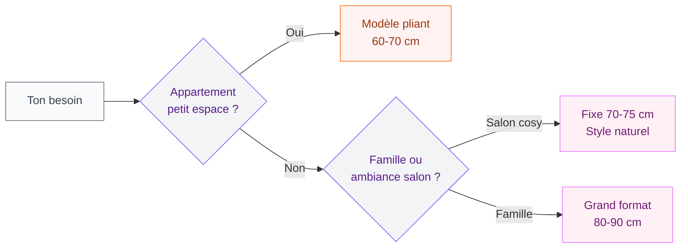

Si tu cherches un meuble qui combine confort, esthétique japonaise et un vrai côté chaleureux pour les soirées d'hiver, laisse-moi te parler du kotatsu. Ce petit trésor de la culture japonaise a tout pour devenir la pièce centrale de ton salon - au sens littéral du terme.

J'ai découvert le kotatsu il y a quelques années via une amie qui revenait du Japon, et depuis, je ne conçois plus l'hiver sans. Alors je te raconte tout ce qu'il faut savoir pour te lancer.

## C'est quoi exactement un kotatsu ?

Le kotatsu (こたつ) est une table basse japonaise avec un élément chauffant fixé sous le plateau, recouverte d'une couverture épaisse - le "kake-futon" - qui emprisonne la chaleur. On s'assoit autour sur des coussins ou un tatami, on glisse les jambes dessous, et on est enveloppé d'une douce chaleur localisée.

L'idée est brillante dans sa simplicité : plutôt que de chauffer toute une pièce, tu crées une bulle de chaleur exactement là où tu en as besoin. C'est une approche "low-tech" typiquement japonaise, dans la même veine que d'autres inventions ingénieuses du pays du soleil levant.

Un kotatsu complet se compose de 4 éléments :

1. **La table basse** - le cadre en bois, souvent rectangulaire
2. **L'élément chauffant** - fixé sous le plateau inférieur, fonctionne à l'électricité
3. **La couverture** - épaisse, descend jusqu'au sol de tous les côtés
4. **Le plateau amovible** - la surface utile sur laquelle tu poses tes affaires

> [!NOTE]
> La température d'un kotatsu tourne généralement entre 40 et 60°C sous la couverture. C'est doux et agréable, pas brûlant - l'équivalent d'une bouillotte géante et bien répartie.

## Pourquoi le kotatsu a autant de succès au Japon

Au Japon, les maisons sont souvent mal isolées et le chauffage central n'est pas la norme. Chauffer une pièce entière serait coûteux et peu efficace. Le kotatsu répond à ce problème avec une logique de chaleur localisée : tu chauffes ton corps, pas l'espace vide autour de toi.

Résultat ? Une consommation électrique dérisoire. Un kotatsu consomme entre 50 et 200 watts selon le réglage, là où un radiateur électrique classique démarre à 1000 watts. Sur une soirée de 4 heures au réglage moyen (100W), tu dépenses environ 0,06 à 0,08 euro d'électricité. C'est rien.

Mais au-delà de l'économie, il y a quelque chose d'autre. Le kotatsu crée une dynamique sociale particulière : on se retrouve autour de la table, on partage un espace chaleureux, on a du mal à partir. Au Japon, il y a même une expression - "kotatsu muri" - pour désigner l'incapacité de se lever du kotatsu tellement on est bien.

> [!TIP]
> En hiver, remplace ta table basse habituelle par un kotatsu pour créer un vrai coin lecture ou soirée jeux. Quelques coussins au sol, une tasse de thé chaud, et tu es en mode week-end zen en 10 minutes chrono.

## Quelle taille et quel modèle choisir

### Les formats disponibles

Les kotatsu se déclinent en plusieurs tailles standard :

- **60 x 60 cm** : format solo ou duo, parfait pour un petit appartement ou une chambre
- **70 x 70 cm** : le format le plus populaire, convient pour 2-3 personnes
- **80 x 80 cm** ou **75 x 105 cm** : pour 3-4 personnes autour de la table
- **90 x 90 cm** et plus : les grands modèles familiaux

Pour un salon classique, je recommande le 70-75 cm de côté. C'est la taille idéale pour s'installer confortablement à deux ou trois sans que la table n'envahisse la pièce.

### Kotatsu à pieds fixes vs pliants

Les modèles à **pieds fixes** sont plus stables et souvent mieux construits. Ils donnent une impression de meuble solide, bien ancré dans la déco.

Les modèles à **pieds pliants** sont pratiques si tu veux ranger la table en été ou la déplacer facilement. Certains ont même un système de rangement intégré sous le plateau.

### Quels prix attendre

Sur Amazon.fr, les kotatsu complets (table + couverture + chauffage) se trouvent dans ces fourchettes :

- **Entrée de gamme** : 150-250 euros pour un 60-70 cm, finition bois basique
- **Milieu de gamme** : 250-400 euros, meilleure finition, plateau amovible plus solide
- **Haut de gamme** : 400-600 euros et plus, bois noble, design soigné

Des marques comme **Yama**, **Iris Ohyama** (la référence japonaise) et plusieurs vendeurs Amazon offrent de bons rapports qualité-prix. La marque **Iris Ohyama** est celle qu'on trouve dans la plupart des foyers japonais - gage de fiabilité.

Pour les petits budgets, la solution DIY avec une table IKEA (type LACK ou HEMNES basse) et un radiateur tubulaire de 60W coûte autour de 60-80 euros et fonctionne très bien. Ce hack Reddit a beaucoup circulé pour une bonne raison.

> [!WARNING]
> Ne pose jamais le kotatsu sur un tapis synthétique ou à poils longs. La chaleur sous la couverture peut représenter un risque si la circulation d'air est trop bloquée. Préfère un tatami, un tapis en laine naturelle, ou le parquet directement.

## Intégrer un kotatsu dans ta déco

### L'ambiance japonaise minimaliste

Le kotatsu s'intègre naturellement dans une déco inspirée du Japon ou du scandinave. Les deux esthétiques partagent le même goût pour les lignes épurées, le bois naturel et les tons neutres.

Pour l'accompagner, pense à :
- Des **coussins au sol** type zabuton (coussins japonais plats) ou des coussins bas de 15-20 cm
- Un **tapis de meditation** ou un carré de tatami artificiel sous la table
- Des **bougies** et une lumière tamisée - une guirlande lumineuse dans la bibliothèque à côté fait des merveilles
- Une **plante verte** dans un coin pour rappeler la nature

Si tu as déjà adopté une déco terracotta dans d'autres pièces comme dans notre guide sur la [déco terracotta en chambre](/guides/chambre/deco-terracotta-chambre/), tu peux créer un lien visuel avec des coussins terracotta autour du kotatsu - ça chauffe visuellement la pièce avant même d'allumer le chauffage.

### La couverture comme élément déco

La couverture du kotatsu - le kake-futon - est un vrai choix déco à part entière. Elle descend jusqu'au sol et occupe visuellement beaucoup de place.

Les modèles vendus au Japon proposent des motifs traditionnels (fleurs de cerisier, motifs géométriques, couleurs profondes indigo ou bordeaux). Pour un salon moderne, une couverture unie en gris clair, beige ou vert kaki s'intègre mieux dans une déco occidentale.

Tu peux aussi utiliser un duvet basique surmonté d'un plateau en bois - c'est d'ailleurs la technique des DIYeurs qui font leur kotatsu maison.

> [!IMPORTANT]
> La couverture doit descendre suffisamment bas pour toucher presque le sol de tous les côtés - c'est ce qui crée l'effet "piège à chaleur". Si elle est trop courte, la chaleur s'échappe et tu perds l'intérêt du kotatsu.

### Mélanges de styles qui fonctionnent

Le kotatsu n'est pas réservé aux intérieurs zen épurés. Il s'adapte à plusieurs ambiances :

**Style wabi-sabi** : bois brut, céramiques imparfaites, plantes séchées, lin naturel - le kotatsu est chez lui.

**Style scandinave hygge** : bois clair, laine, bougies, coussins moelleux - le mariage est logique. La philosophie du hygge danois et celle du kotatsu se rejoignent sur l'idée du cocon chaleureux.

**Style bohème** : coussins colorés au sol, petits tapis superposés, luminaires ethniques - ça marche aussi, surtout si tu aimes les intérieurs qui racontent une histoire voyageuse.

Pour une déco à l'ambiance marocaine, tu peux même jouer la carte du métissage comme on le montre dans notre article sur la [décoration marocaine moderne](/guides/decoration/decoration-marocaine-moderne-ou-classique/) - un kotatsu avec des coussins en kilim et une lanterne en métal ajouré, c'est surprenant mais ça fonctionne vraiment.

## Utilisation au quotidien

### S'installer autour d'un kotatsu

La hauteur standard d'un kotatsu (30-40 cm) est prévue pour une assise au sol. On s'installe en tailleur, en seiza (position agenouillée japonaise) ou simplement les jambes tendues sous la table. Les Japonais utilisent souvent des dossiers de sol sans pieds - des "zaisu" - pour avoir un appui dans le dos.

Si tu préfères t'asseoir sur une chaise ou un canapé bas, certains modèles existent en hauteur plus élevée (60-70 cm), mais tu perds alors l'effet couverture.

### En été, un kotatsu sans chauffage

Un avantage méconnu du kotatsu : en été, tu retires simplement la couverture et tu as une table basse normale, souvent très jolie avec son plateau en bois. Le mécanisme de chauffage reste sous le cadre sans gêner.

C'est donc un meuble qui vit toute l'année, pas juste un gadget hivernal.

### Entretien de la couverture

La couverture se lave en machine à 30-40°C pour la plupart des modèles. Certaines sont trop grandes pour les machines ménagères - dans ce cas, le pressing ou une laverie libre-service avec grande capacité est la solution.

Le plateau supérieur s'entretient comme n'importe quelle surface en bois : un chiffon légèrement humide, un peu de produit bois neutre de temps en temps. Évite les produits abrasifs qui terniraient le vernis.

> [!TIP]
> Range la couverture dans un grand sac en coton ou une housse respirante pendant l'été - les housses plastique type déménagement peuvent laisser des odeurs si le textile n'est pas parfaitement sec.

## Le kotatsu et l'esprit "ikigai"

Il y a quelque chose de philosophique dans le kotatsu que j'aime beaucoup. Il incarne cette idée japonaise que le confort ne passe pas par l'accumulation ou la démesure, mais par la juste mesure. On ne chauffe pas une maison entière pour être bien dans un salon - on crée un coin précis de douceur et on s'y installe avec les gens qu'on aime.

C'est une leçon de déco autant qu'une leçon de vie : la maison est au service du bien-être, pas l'inverse.

Cette philosophie de l'espace pensé pour le corps et le confort se retrouve d'ailleurs dans d'autres éléments de la culture japonaise, comme la [baignoire japonaise](/guides/salle-de-bain/baignoire-japonaise/) - le bain rituel profond qui réchauffe de l'intérieur comme le kotatsu réchauffe de l'extérieur.

## FAQ sur le kotatsu

**Le kotatsu consomme beaucoup d'électricité ?**
Non. Entre 50 et 200W selon le réglage, contre 1000W minimum pour un radiateur classique. Sur une soirée de 3-4h, tu dépenses quelques centimes d'électricité.

**Peut-on dormir sous un kotatsu ?**
Les Japonais le font parfois ! Mais ce n'est pas recommandé pour des nuits complètes : risque de déshydratation et de crampes si tu dors en position contrainte. Une sieste de 30 minutes sous le kotatsu, oui. Toute la nuit, non.

**Le kotatsu chauffe toute la pièce ?**
Non, et c'est le but. Il chauffe ta bulle corporelle immédiate. Pour chauffer une pièce entière, il faut un radiateur traditionnel. Le kotatsu est un chauffage d'appoint localisé.

**Est-ce dangereux pour les enfants ou les animaux ?**
Les températures restent douces (40-60°C sous la couverture). Les chats adorent le kotatsu - c'est même une blague récurrente au Japon. Pour les très jeunes enfants, surveille simplement qu'ils ne restent pas trop longtemps sans bouger dessous.

**Où acheter un kotatsu en France ?**
Amazon.fr est la source la plus accessible avec des dizaines de modèles livrés rapidement. Des boutiques spécialisées en déco japonaise comme Japan Attitude proposent aussi des modèles soignés. Certains magasins Habitat ou des boutiques de déco tendance commencent à en proposer.

**Peut-on faire un kotatsu DIY ?**
Oui et c'est assez simple. Table basse IKEA (LACK ou basse de la gamme LISABO) + radiateur tubulaire de 60W fixé sous le plateau + couverture ou duvet. Budget total : 60-100 euros. Le résultat est très fonctionnel même si moins esthétique qu'un vrai modèle japonais.

---

Si tu as une maison avec du parquet bois et que tu remarques des taches ou des zones usées, notre guide sur le [parquet tâché](/guides/decoration/parquet-tache/) peut t'aider à les traiter avant d'installer ton coin kotatsu.

Le kotatsu, c'est finalement ça : un meuble qui transforme un angle de pièce en invitation à s'asseoir, rester, et prendre le temps. Et en hiver, il n'en faut pas plus pour changer l'ambiance de tout un appartement.
