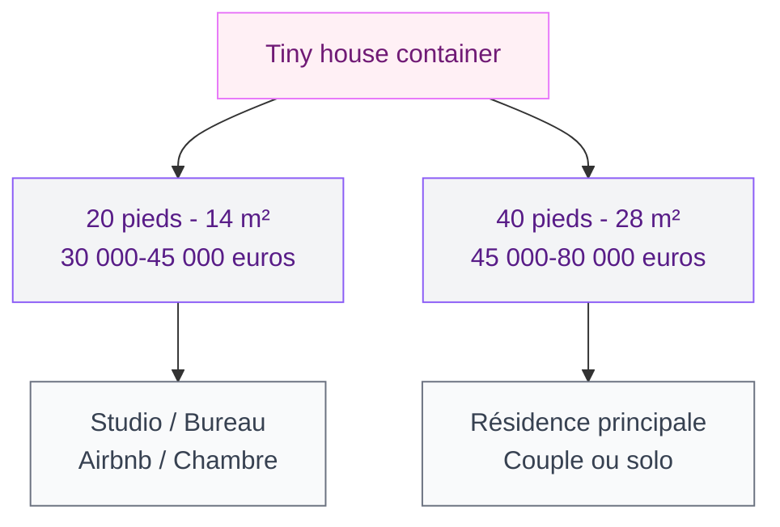
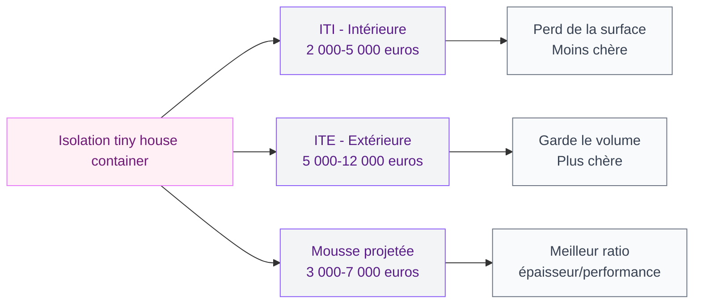

Vivre dans 14 ou 28 m² d'acier recyclé, c'est un projet qui attire de plus en plus de monde. La tiny house container, c'est la version compacte et mobile de la [maison container](/guides/decoration/maison-container/) - un seul module transformé en habitation complète, souvent pour moins de 50 000 euros. Mais entre les photos Instagram ultra léchées et la réalité du quotidien dans un espace réduit, il y a un écart. Je t'explique tout ce que tu dois savoir avant de te lancer, avec des prix réels et des retours concrets.

## Tiny house container : de quoi on parle exactement ?

Une tiny house container, c'est un conteneur maritime recyclé - celui qu'on voit empilé dans les ports - transformé en micro-habitation autonome. On garde la structure en acier d'origine, on découpe les ouvertures pour les fenêtres et la porte, on isole, on aménage l'intérieur, et on obtient un petit logement fonctionnel.

Deux formats existent :

- Le **20 pieds** (6 m x 2,4 m, environ 14 m²) - pour un studio, un bureau ou une chambre d'appoint
- Le **40 pieds** (12 m x 2,4 m, environ 28 m²) - pour une vraie habitation avec cuisine, salle d'eau et coin nuit

La version "High Cube" (HC) ajoute 30 cm de hauteur sous plafond, ce qui fait passer de 2,6 m à 2,9 m brut. Une fois l'isolation posée au sol et au plafond, ces centimètres supplémentaires changent tout le confort ressenti.

> [!NOTE]
> Un container 40 HC d'occasion coûte entre 2 500 et 5 000 euros. C'est la coque brute. L'aménagement complet en tiny house représente le gros du budget - entre 25 000 et 75 000 euros selon tes choix de finitions.

## Pourquoi choisir un container plutôt qu'une tiny house classique ?

La tiny house sur remorque en ossature bois, tu connais. Mais le container a des atouts bien à lui.

### La solidité

L'acier Corten d'un container est conçu pour supporter 30 tonnes de marchandises et résister aux embruns marins pendant 25 ans. C'est une structure ultra-robuste qui encaisse sans broncher les tempêtes, la grêle et le temps qui passe. Là où une ossature bois demande un entretien régulier, le container vieillit avec très peu d'attention.

### Le prix

À surface égale, une tiny house container revient 20 à 40 % moins cher qu'une tiny house bois artisanale. La coque existe déjà - tu ne payes pas la structure, juste sa transformation. Un projet complet en container 20 pieds tourne autour de 30 000 à 45 000 euros. En 40 pieds, compte entre 45 000 et 80 000 euros selon le niveau de finition.

### La rapidité

Un container s'aménage en atelier en 4 à 8 semaines. La livraison se fait par camion-grue, la pose sur plots prend une journée. Du premier coup de disqueuse à l'emménagement, il faut rarement plus de 3 mois.

### L'empreinte écologique

Recycler un container, c'est donner une seconde vie à 2,5 tonnes d'acier au lieu de les fondre. La construction génère peu de déchets comparée au bâti traditionnel. Et la petite surface limite mécaniquement ta consommation d'énergie.

## L'aménagement intérieur : optimiser chaque centimètre

Dans 14 ou 28 m², chaque centimètre compte. L'aménagement d'une tiny house container suit des règles très précises pour rendre l'espace vivable et agréable au quotidien.

### Le plan type en 20 pieds (14 m²)

Sur 6 mètres de long par 2,2 m utiles (après isolation), l'agencement classique donne :

- Une entrée avec rangement chaussures intégré
- Une kitchenette en longueur avec deux plaques, un évier et un petit frigo
- Un espace salon/bureau convertible
- Un bloc sanitaire compact avec douche et WC sec ou chimique
- Un lit escamotable ou une mezzanine si la hauteur le permet

### Le plan type en 40 pieds (28 m²)

Avec 12 mètres de longueur, tu respires davantage :

- Une vraie cuisine équipée (réfrigérateur, four, plan de travail généreux)
- Un salon avec canapé convertible ou fixe
- Une chambre séparée par une cloison ou un rideau épais
- Une salle d'eau avec douche italienne et WC classique
- Des rangements en hauteur sur toute la longueur

> [!TIP]
> Les meubles sur mesure sont presque obligatoires dans un container. Les dimensions standard ne collent pas avec les 2,2 m de largeur utile. Prévois un budget menuiserie de 3 000 à 8 000 euros, c'est l'investissement qui fait la différence entre un espace serré et un espace intelligent.

Pour l'ambiance intérieure, le style [minimaliste](/guides/decoration/decoration-minimaliste-idees-et-photos-faciles/) s'impose naturellement : peu d'objets, des matériaux bruts, des lignes simples. C'est la philosophie idéale pour un petit volume.

## L'isolation : le sujet que tu ne peux pas ignorer

L'acier conduit la chaleur et le froid mieux que n'importe quel matériau de construction. Sans isolation, ton container sera une étuve l'été et un frigo l'hiver. C'est LE poste technique à ne pas rater.

### Les trois options

**Isolation par l'intérieur (ITI)** - La plus courante. Panneaux de polyuréthane (6 à 10 cm) ou laine de bois collés contre les parois. Budget : 2 000 à 5 000 euros. Inconvénient : tu perds 10 à 15 cm de largeur de chaque côté.

**Isolation par l'extérieur (ITE)** - Plus chère (5 000 à 12 000 euros) mais tu conserves tout le volume intérieur. L'isolant est protégé par un bardage bois ou composite.

**Isolation mousse projetée** - Polyuréthane projeté directement sur les parois. Très efficace (faible épaisseur pour une bonne performance), étanche à l'air. Budget : 3 000 à 7 000 euros. C'est la solution préférée des constructeurs spécialisés.

### La ventilation, c'est non négociable

Dans un espace aussi compact et étanche, la VMC (Ventilation Mécanique Contrôlée) est obligatoire. Sans elle, la condensation s'installe en quelques semaines et crée des moisissures. Une VMC simple flux coûte entre 300 et 800 euros installée. Une VMC double flux (qui récupère la chaleur de l'air sortant) tourne autour de 1 500 à 3 000 euros - mais elle réduit ta facture de chauffage de 15 à 25 %.

> [!WARNING]
> Ne lésine jamais sur la ventilation d'un container habité. L'acier ne respire pas comme le béton ou le bois. Sans renouvellement d'air, l'humidité reste piégée et attaque l'isolation, le mobilier et ta santé.

## La réglementation : ce que dit la loi

La question administrative dépend de la surface, de l'emplacement et du caractère fixe ou mobile de ta tiny house.

### Conteneur fixe sur terrain

- **Moins de 5 m² de surface de plancher** : aucune autorisation
- **Entre 5 et 20 m²** : déclaration préalable de travaux en mairie
- **Plus de 20 m²** : permis de construire obligatoire (et recours à un architecte au-delà de 150 m²)

Un container 20 pieds fait 14 m² au sol : une simple déclaration préalable suffit dans la plupart des cas. Un 40 pieds dépasse les 20 m², donc c'est permis de construire.

### Conteneur sur roues

Si ta tiny house container est montée sur une remorque et qu'elle reste mobile, elle est assimilée à une caravane. Tu peux la stationner sur ton terrain 3 mois par an sans autorisation. Au-delà, tu dois demander une autorisation en mairie.

### Le PLU, le vrai obstacle

Même avec une déclaration ou un permis, certaines communes interdisent ce type de construction dans leur Plan Local d'Urbanisme. D'autres imposent des contraintes esthétiques (couleur de façade, type de toiture) qui peuvent compliquer ton projet. Vérifie toujours AVANT de te lancer.

## Les usages concrets d'une tiny house container

### Résidence principale minimaliste

Pour une personne seule ou un couple sans enfant, un container 40 pieds bien aménagé offre un confort suffisant. Le mode de vie impose du tri et de l'organisation, mais c'est souvent le but recherché. Le budget total (container + aménagement + terrain + raccordements) se situe entre 80 000 et 130 000 euros selon la région.

### Location saisonnière type Airbnb

C'est un cas d'usage très rentable. Un container aménagé en gîte atypique attire une clientèle curieuse et prête à payer un premium pour l'expérience. Le retour sur investissement peut se faire en 3 à 5 ans selon la localisation et le taux de remplissage. Si tu as un jardin suffisant, consulte les idées de [transformation de jardin avec un conteneur maritime](/guides/exterieur/comment-transformer-votre-jardin-avec-un-conteneur-maritime/) pour l'intégration paysagère.

### Bureau ou atelier en fond de jardin

Un container 20 pieds transformé en bureau, c'est 14 m² d'espace de travail indépendant de la maison. Parfait pour le télétravail ou une activité créative. Budget complet : 15 000 à 30 000 euros. Et si tu cherches aussi un espace détente extérieur pour accompagner le bureau, le guide sur [comment construire un pool house](/guides/exterieur/construire-pool-house/) peut t'inspirer.

### Habitat off-grid

Le container se prête bien à l'autonomie énergétique : panneaux solaires sur le toit, récupération d'eau de pluie, toilettes sèches, petit poêle à bois. Plusieurs constructeurs proposent des packs "off-grid" clé en main avec batteries, onduleur et gestion d'eau autonome, pour un surcoût de 8 000 à 15 000 euros.

> [!IMPORTANT]
> Même en off-grid, tu restes soumis aux règles d'urbanisme. L'autonomie énergétique ne dispense pas de la déclaration préalable ou du permis de construire. Renseigne-toi en mairie avant tout achat.

## Les erreurs courantes à éviter

**Acheter un container sans vérifier son historique.** Un container qui a transporté des produits chimiques peut contenir des résidus toxiques dans la peinture et le plancher. Demande toujours le certificat de dernière cargaison.

**Sous-estimer le budget isolation.** C'est le poste qui fait la différence entre un espace vivable et un espace pénible. Prévoir minimum 20 % du budget total pour l'isolation et la ventilation.

**Oublier les raccordements.** Eau, électricité, assainissement : même une tiny house a besoin de ses réseaux (sauf en off-grid total). Compte 3 000 à 10 000 euros selon la distance aux raccordements existants.

**Négliger la hauteur sous plafond.** Prends toujours un container High Cube. Avec l'isolation au sol (5-8 cm) et au plafond (8-10 cm), un container standard ne laisse que 2,40 m de hauteur libre - c'est oppressant à la longue.

## FAQ

### Combien coûte une tiny house container clé en main en France ?

Entre 30 000 et 80 000 euros selon la taille (20 ou 40 pieds) et le niveau de finition. Ce prix inclut le container, l'isolation, l'aménagement intérieur complet, la plomberie et l'électricité. Il n'inclut pas le terrain, les fondations et les raccordements aux réseaux.

### Faut-il un permis de construire pour installer un container habitable ?

Pour un container de moins de 20 m² de surface de plancher, une déclaration préalable de travaux suffit. Au-delà de 20 m², un permis de construire est obligatoire. Vérifie aussi le PLU de ta commune : certaines interdisent ou restreignent ce type de construction.

### Quelle est la durée de vie d'une tiny house container ?

Un container maritime en acier Corten a une durée de vie de 25 à 50 ans selon son état initial et l'entretien. Bien isolé, bien ventilé et avec un traitement anticorrosion régulier (tous les 5 à 10 ans), il peut durer aussi longtemps qu'une construction traditionnelle.

### Est-ce qu'on peut vivre confortablement dans 14 m² ?

Oui, à condition d'adopter un mode de vie minimaliste et d'investir dans un aménagement sur mesure. Les meubles multifonctions (lit escamotable, table rabattable, rangements en hauteur) permettent de gagner en confort malgré la surface réduite. Le vrai défi, c'est l'organisation au quotidien plus que la surface elle-même.

---

La tiny house container n'est pas pour tout le monde. Mais pour ceux qui cherchent un habitat abordable, rapide à installer et avec une vraie démarche de sobriété, c'est une option solide et de plus en plus accessible. Le secret, c'est de bien préparer le projet en amont - budget réaliste, réglementation vérifiée, isolation soignée - et de trouver un constructeur qui connaît vraiment le sujet.
