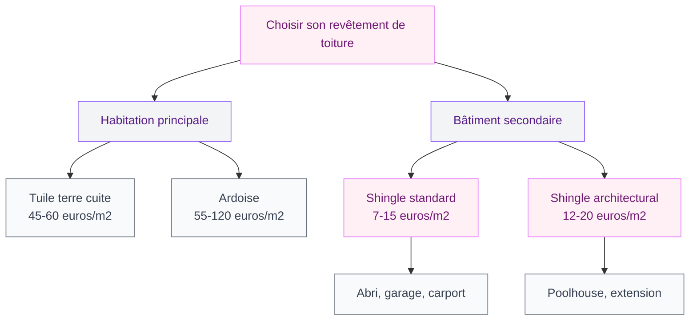
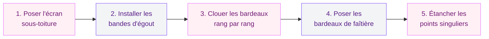

Tu cherches un revêtement de toiture pas trop cher, simple à poser et qui offre un bon rendu visuel ? Le shingle - aussi appelé bardeau bitumé ou bardeau d'asphalte - coche pas mal de cases. C'est le matériau de couverture le plus répandu en Amérique du Nord, et il gagne du terrain en France depuis quelques années. Mais attention : ce n'est pas la solution magique pour tous les projets. Je t'explique tout ce qu'il faut savoir avant de te lancer, avec des prix réels, des retours terrain et les pièges à éviter.

## Le shingle, c'est quoi exactement ?

Le shingle est un bardeau souple composé de plusieurs couches : une armature en fibre de verre, un enrobage de bitume et une finition en granulés minéraux colorés. Le résultat ? Une plaque légère, flexible, qu'on cloue directement sur un support en bois (volige ou panneau OSB).

  

Visuellement, le shingle imite très bien l'ardoise ou la tuile plate selon la découpe et la teinte choisies. Tu le trouves en noir, gris anthracite, rouge brique, vert, brun et même en jaune sable. Les fabricants comme IKO, Bardoline ou Onduline proposent des gammes variées qui s'adaptent à plein de styles architecturaux.

Le format standard d'un bardeau : environ 100 cm x 34 cm, avec un poids de 8 à 15 kg/m2 selon l'épaisseur. C'est 5 à 6 fois plus léger qu'une tuile en terre cuite (environ 45 kg/m2), et ça change tout pour certaines structures.

> [!NOTE]
> Le shingle est aussi appelé "bardeau bitumineux", "bardeau canadien" ou "shingle bitumé". Tous ces termes désignent le même produit. Ne te laisse pas embrouiller par les appellations commerciales !

## Les avantages du shingle

  

### Un prix très compétitif

C'est l'argument numéro un. Le shingle est le revêtement de toiture le moins cher du marché, loin devant la tuile ou l'ardoise. On parle de 7 à 15 euros/m2 pour le matériau seul, contre 30 à 65 euros/m2 pour de l'ardoise naturelle. Pour un garage de 30 m2 de toiture, la différence de budget est énorme.

### Une pose rapide et accessible

Le shingle se pose bien plus vite que la tuile. Un couvreur expérimenté couvre 40 à 60 m2 par jour, contre 15 à 25 m2 avec des tuiles en terre cuite. Et si tu es bricoleur, c'est un des rares matériaux de couverture qu'on peut poser soi-même avec un minimum d'outillage : un marteau, des clous galvanisés, un cutter et un cordeau.

### Une légèreté qui simplifie la charpente

Avec 8 à 15 kg/m2, le shingle n'exige pas une charpente dimensionnée pour supporter du lourd. C'est un vrai plus pour les abris de jardin, les carports, les extensions légères ou les maisons à ossature bois. Si tu as une [maison container](/maison-container/) par exemple, le shingle est souvent le choix le plus logique pour la toiture.

### Un large choix de couleurs et de formes

Le shingle existe en découpes droites, arrondies, en écaille ou en losange. Combiné avec la palette de coloris disponibles, tu peux vraiment personnaliser l'aspect de ton toit. Les gammes architecturales 3D (type IKO Cambridge ou Bardoline Classic) créent un effet de relief très joli, qui se rapproche visuellement du toit en ardoise.

> [!TIP]
> Pour un rendu haut de gamme sans casser la tirelire, opte pour du shingle architectural (aussi appelé "dimensionnel"). C'est plus épais, plus texturé et plus résistant que le shingle standard, pour seulement 3 à 5 euros/m2 de plus. Le rendu visuel est bluffant.

## Les inconvénients - ce qu'on te dit moins souvent

  

### Une durée de vie limitée

C'est le gros point faible. Un shingle standard dure entre 15 et 25 ans, contre 50 à 100 ans pour l'ardoise et 30 à 50 ans pour la tuile. Certains shingles haut de gamme (IKO Dynasty, Bardoline Marathon) promettent jusqu'à 30-35 ans, mais ça reste en dessous des matériaux traditionnels.

### Une isolation thermique moyenne

Le shingle n'est pas un bon isolant. Sa faible épaisseur (3 à 5 mm) ne protège ni du froid ni de la chaleur. En été, un toit en shingle sombre accumule la chaleur et la transmet à l'intérieur. Si tu envisages d'aménager les combles sous un toit shingle, prévois une isolation renforcée (minimum 30 cm de laine de verre ou équivalent).

### Une sensibilité aux conditions extrêmes

Le vent est l'ennemi numéro un du shingle. Au-delà de 100-120 km/h, les bardeaux peuvent se soulever et s'arracher. Les mousses et lichens s'y installent aussi plus facilement que sur de l'ardoise, surtout en versant nord. Et les variations de température provoquent un vieillissement accéléré du bitume (fissures, perte de granulés).

## Prix du shingle en 2026 : les vrais chiffres

On va droit au but avec un tableau comparatif pour que tu saches exactement à quoi t'attendre.

  

### Le shingle seul (fourniture)

| Type de shingle | Prix au m2 | Durée de vie |
|-----------------|-----------|--------------|
| Shingle standard 3 tabs | 7 à 10 euros | 15-20 ans |
| Shingle architectural | 12 à 18 euros | 25-30 ans |
| Shingle premium (IKO Dynasty) | 18 à 25 euros | 30-35 ans |

### Pose par un professionnel

Compte entre 15 et 35 euros/m2 pour la main-d'oeuvre, selon la complexité du toit (pente, accessibilité, nombre de pénétrations type cheminée ou velux). Pour un toit simple de 80 m2, le devis se situe entre 1 200 et 2 800 euros de pose seule.

### Budget total pose comprise

Pour un projet complet (fourniture + pose + accessoires), voici les fourchettes réalistes :

| Surface | Shingle standard | Shingle architectural |
|---------|------------------|-----------------------|
| 20 m2 (abri) | 450 - 700 euros | 600 - 1 000 euros |
| 50 m2 (garage) | 1 100 - 1 750 euros | 1 500 - 2 500 euros |
| 100 m2 (maison) | 2 200 - 3 500 euros | 3 000 - 5 000 euros |

À titre de comparaison, la même surface de 100 m2 en tuile terre cuite reviendrait entre 4 500 et 7 000 euros pose comprise. Le shingle reste donc 30 à 50% moins cher.

> [!WARNING]
> N'oublie pas de compter le support. Le shingle se pose sur un voligeage plein (planches jointes) ou des panneaux OSB. Si ta charpente est en liteaux espacés (comme pour les tuiles), il faudra ajouter un support continu - compte 15 à 25 euros/m2 de plus pour les panneaux OSB de 18 mm et la pose.

## Comment se passe la pose du shingle ?

  

### Les conditions préalables

Le shingle se pose sur une pente de toit d'au moins 20% (soit environ 11 degrés). En dessous, l'eau stagne et s'infiltre entre les bardeaux. Au-delà de 80%, la pose est possible mais demande des fixations renforcées.

Le support doit être un plan continu, propre et sec : volige en bois massif, panneaux OSB 3 de 12 à 18 mm d'épaisseur, ou panneaux de contreplaqué marine. Pas de liteaux espacés comme pour les tuiles - le shingle a besoin d'un support plein sur toute la surface.

### Les étapes de pose

**Étape 1 - L'écran sous-toiture.** On déroule une membrane pare-pluie (type Onduline Ondutiss) sur toute la surface du support, en la fixant par agrafes. Les lés se recouvrent de 10 cm minimum.

**Étape 2 - Les bandes d'égout.** Le premier rang de bardeaux est posé à l'envers (partie découpée vers le haut) le long de la rive d'égout, en débord de 1 à 2 cm par rapport au bord du toit. Cette bande sert de base aux rangs suivants.

**Étape 3 - Les bardeaux, rang par rang.** On cloue les bardeaux de bas en haut, en décalant chaque rang d'un demi-bardeau (comme les briques d'un mur). Chaque bardeau reçoit 4 à 6 clous galvanisés. Le recouvrement entre rangs est d'environ 14 cm - ça garantit l'étanchéité.

**Étape 4 - La faîtière.** Les bardeaux de faîtière (découpés dans des bardeaux standards ou bardeaux de faîtière spécifiques) sont posés à cheval sur l'arête du toit.

**Étape 5 - Les points singuliers.** Autour des cheminées, des lucarnes ou des sorties de ventilation, on applique des bandes de solin ou des pièces de raccord métalliques pour assurer l'étanchéité. C'est la partie la plus technique - si tu n'es pas à l'aise, fais appel à un pro pour ces finitions.

Si tu t'interroges sur les [façades de ta maison en 2026](/facades-de-maisons-modernes-2026/), sache que le choix de la toiture influence beaucoup le style général. Un shingle anthracite avec une façade blanche, par exemple, donne un rendu très contemporain.

## Comment obtenir un devis juste ?

### Demande au moins 3 devis

C'est la règle d'or. Les prix varient beaucoup d'un artisan à l'autre, parfois du simple au double. Contacte au moins 3 couvreurs de ta région et compare les devis poste par poste.

### Ce que doit contenir un bon devis

Un devis de toiture shingle sérieux doit détailler :
- La surface exacte en m2
- Le type et la marque du shingle (standard, architectural, premium)
- Le support (OSB, volige) et son épaisseur
- La membrane sous-toiture
- Les accessoires (bardeaux de faîtière, solins, clous)
- La main-d'oeuvre avec le nombre de jours prévus
- La garantie sur la pose (2 ans minimum, 10 ans idéalement)
- L'évacuation des déchets (ancien revêtement si rénovation)

### Où trouver des artisans fiables ?

Les plateformes de mise en relation (Habitatpresto, AlloVoisins, HelloArtisan) te connectent avec des couvreurs vérifiés de ton secteur. Les fabricants comme IKO ou Bardoline ont aussi des listes de poseurs agréés qui connaissent bien leurs produits. Et le bouche-à-oreille reste une valeur sûre : demande à tes voisins, regarde les chantiers en cours dans ton quartier.

> [!TIP]
> Vérifie toujours que l'artisan a une assurance décennale en cours de validité. C'est obligatoire en France pour tout travail sur la toiture. Demande l'attestation avant de signer le devis - un pro sérieux te la donne sans problème.

## Entretien du shingle : ce qu'il faut faire

Le shingle demande un entretien régulier pour atteindre sa durée de vie maximale. Sans suivi, un toit shingle peut se dégrader en 10 ans au lieu de 25.

**Ce qu'il faut faire :**
- Nettoyer les feuilles mortes et débris chaque automne (au souffleur ou au balai souple)
- Vérifier l'état des bardeaux au printemps : fissures, bardeaux soulevés, perte de granulés
- Traiter les mousses et lichens avec un produit anti-mousse adapté (Algimouss, Sika Antimousse) - une fois par an en versant nord
- Déneiger délicatement après de fortes chutes de neige (sans outils métalliques)

**Ce qu'il ne faut pas faire :**
- Marcher sur le shingle par temps très chaud (le bitume ramollit et les granulés se décollent)
- Utiliser un nettoyeur haute pression (ça arrache les granulés et détruit l'étanchéité)
- Laisser l'eau stagner dans les gouttières bouchées (l'humidité remonte sous les bardeaux)

Si tu as des travaux à prévoir à l'intérieur après la réfection de ton toit, jette un oeil à notre guide pour [crépir un mur intérieur](/crepir-un-mur-interieur/) - c'est souvent le bon moment pour remettre les murs en état.

## Shingle vs les autres matériaux : le comparatif

| Critère | Shingle | Tuile terre cuite | Ardoise | Zinc |
|---------|---------|-------------------|---------|------|
| Prix/m2 (pose comprise) | 22-50 euros | 45-80 euros | 55-120 euros | 50-90 euros |
| Durée de vie | 15-30 ans | 30-50 ans | 50-100 ans | 40-80 ans |
| Poids/m2 | 8-15 kg | 40-55 kg | 25-40 kg | 5-8 kg |
| Pose DIY possible | Oui | Difficile | Non | Non |
| Isolation thermique | Faible | Moyenne | Bonne | Faible |
| Résistance vent | Moyenne | Bonne | Bonne | Excellente |

Le shingle gagne sur le prix et la facilité de pose. Il perd sur la longévité et l'isolation. Le bon choix dépend de ton projet : pour un abri de jardin ou un garage, c'est parfait. Pour ta maison principale, la tuile ou le zinc restent plus pertinents sur la durée. Et si tu cherches à intégrer des éléments lumineux dans ta couverture, notre article sur les [tuiles transparentes](/tuile-transparente-cout-et-usage/) donne de bonnes pistes.

## Sur le meme theme

- [tuile chatière](/installation-et-usage-dune-tuile-chatiere/)

## FAQ : les questions les plus fréquentes

### Le shingle est-il autorisé partout en France ?

Non, pas toujours. Le PLU (Plan Local d'Urbanisme) de ta commune peut imposer des matériaux spécifiques, surtout dans les zones protégées. Avant d'acheter quoi que ce soit, consulte le service urbanisme de ta mairie. Certaines communes en Bretagne ou en région parisienne interdisent le shingle sur les maisons d'habitation.

### Peut-on poser du shingle soi-même ?

Oui, et c'est même un de ses gros avantages. La pose ne demande pas d'outils spécialisés : un marteau, des clous galvanisés, un cutter, un cordeau et une échelle suffisent. Pour un toit simple sans cheminée ni lucarne, un bricoleur motivé peut couvrir 30 à 40 m2 en un week-end. Par contre, les points singuliers (autour des cheminées, raccords de noue) demandent un savoir-faire technique - fais appel à un couvreur pour ces zones.

### Le shingle résiste-t-il à la grêle ?

Le shingle standard résiste aux grêles modérées (grains de moins de 2 cm). Les shingles haut de gamme type IKO Nordic ou Cambridge possèdent des certifications de résistance aux chocs. Si tu vis dans une région où la grêle est fréquente, investis dans un shingle architectural épais - les quelques euros de plus au m2 t'éviteront des réparations coûteuses.

### Le shingle est-il recyclable ?

Pas facilement. Le bardeau bitumineux est composé de matériaux mixtes (bitume, fibre de verre, granulés minéraux) qui rendent le recyclage complexe. Quelques filières commencent à se développer en France, mais pour l'instant, la plupart des bardeaux usagés finissent en centre d'enfouissement. C'est un point à garder en tête si l'impact écologique compte pour toi.
