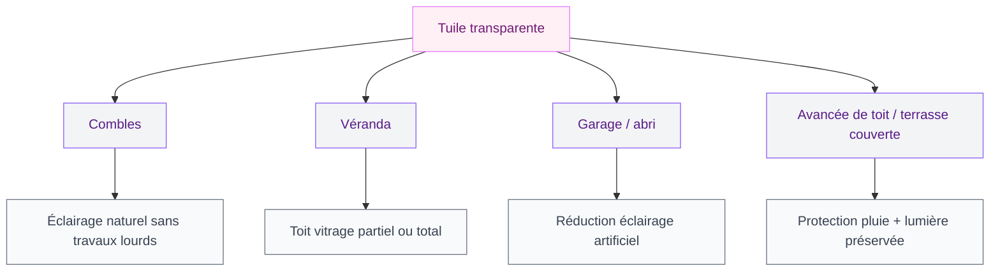
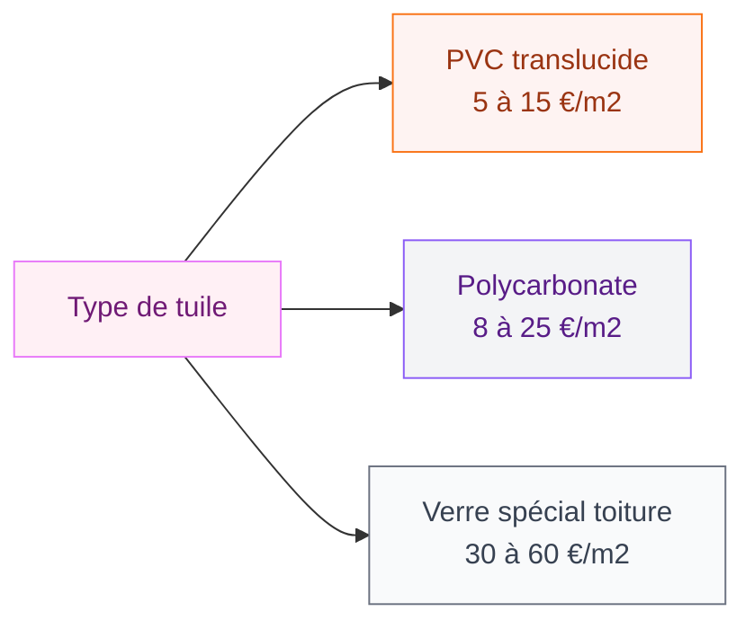

Tu veux laisser entrer la lumière du jour sans ouvrir une fenêtre de toit ? La tuile transparente est peut-être la solution qui te manquait. Quelques éléments intercalés parmi les tuiles classiques, et une pièce sombre se transforme en espace lumineux. Avant de te lancer, voilà tout ce qu'il faut savoir : les matériaux disponibles, les prix selon les marques, les usages et les pièges à éviter.

## Qu'est-ce qu'une tuile transparente exactement ?

Une tuile transparente - aussi appelée tuile translucide ou tuile de lumière - est une tuile fabriquée dans un matériau qui laisse passer la lumière solaire. Elle s'intègre dans une couverture de toit existante, à la place d'une tuile ordinaire, sans modifier la structure de la charpente.

  

Son usage premier : faire entrer la lumière naturelle dans les combles, les garages, les vérandas ou les abris de jardin, là où poser une fenêtre de toit coûterait bien plus cher.

### Les trois matériaux principaux

Il existe plusieurs familles de tuiles translucides, chacune avec ses spécificités techniques et ses usages.

**Le verre** est le matériau le plus ancien et le plus qualitatif. Une tuile en verre offre une excellente transparence, une bonne résistance thermique si elle est traitée, et une longévité qui dépasse souvent 30 ans. Elle filtre naturellement une partie des rayons UV. Prix indicatif : 30 à 60 €/m2. Marque connue : Eternit propose des modèles en verre adaptés aux tuiles romanes et aux tuiles plates.

**Le polycarbonate** est léger, résistant aux chocs et moins coûteux que le verre. Il est très utilisé pour les vérandas et les abris. Par contre, il jaunit avec le temps (surtout sans traitement anti-UV) et sa durée de vie est plus courte. Comptez 8 à 25 €/m2. Onduclair, Greca et SV Roofing sont parmi les références du marché.

**Le PVC translucide** est encore moins cher, mais sa durée de vie est limitée et il se dégrade vite sous l'effet des UV et des variations de température. À réserver pour les petits abris ou les projets temporaires. Prix : 5 à 15 €/m2.

> [!NOTE]
> La différence entre "transparent" et "translucide" est technique : une tuile transparente laisse voir au travers, une tuile translucide diffuse la lumière sans permettre de distinguer les formes. Pour un usage résidentiel, les deux termes sont souvent utilisés indifféremment dans le commerce.

## Les usages courants de la tuile transparente

La tuile translucide répond à des besoins bien précis. On l'utilise rarement sur l'ensemble d'une toiture - plutôt de façon ciblée pour créer des "puits de lumière" là où c'est le plus utile.

  

### Dans les combles et sous les toits

C'est l'usage le plus classique. Quand tu aménages tes combles en chambre, bureau ou salle de jeux, apporter de la lumière naturelle change tout le confort de la pièce. Plutôt que de découper un velux (qui implique une étanchéité complexe et un prix autour de 800 à 2 000 € posé), quelques tuiles translucides dispersées sur la toiture côté sud suffisent souvent à éclairer la pièce en journée.

Règle pratique : 1 m2 de vitrage en toiture éclaire environ 10 m2 de sol. Donc pour une pièce de 20 m2, 2 m2 de tuiles transparentes donnent un résultat acceptable.

### Dans les vérandas et abris de jardin

Pour les vérandas, le polycarbonate alvéolaire ou le verre sont utilisés en couverture partielle ou totale. On retrouve aussi ce système sur les auvents de porte d'entrée, les toits de terrasse et les abris à voitures. Les dimensions des plaques polycarbonate sont standardisées : 2,05 m x 1,05 m en général, ce qui facilite la pose sur une ossature bois.

### Sur les avancées de toit et les terrasses couvertes

Une avancée de toit transparente au-dessus d'une terrasse permet de garder la lumière tout en se protégeant de la pluie. C'est une option souvent moins chère qu'un store bioclimatique, et elle s'intègre mieux sur les maisons avec une couverture en tuiles. Si tu t'interroges sur les couleurs et l'aspect extérieur de ta maison, notre guide sur les [couleurs pour les extérieurs et les facades de maisons en 2026](/couleurs-pour-les-exterieurs-et-les-facades-de-maisons-2026/) peut t'aider à choisir une esthétique cohérente.

## Prix des tuiles transparentes : ce que tu vas vraiment payer

Le budget varie selon le matériau, la marque, et si tu poses toi-même ou si tu fais appel à un artisan.

  

### Prix au m2 par matériau

| Matériau | Prix fourniture | Durée de vie estimée |
|---|---|---|
| PVC translucide | 5 à 15 €/m2 | 10 à 15 ans |
| Polycarbonate compact | 8 à 20 €/m2 | 15 à 20 ans |
| Polycarbonate alvéolaire | 12 à 25 €/m2 | 20 à 25 ans |
| Verre trempé ou feuilleté | 30 à 60 €/m2 | 30 ans et plus |

### Exemples concrets de prix en 2026

- **Tuile polycarbonate Onduclair** (modèle 76/18) : environ 8 à 12 € la plaque de 1 m2, disponible en Leroy Merlin et Brico Dépôt
- **Tuile transparente Eternit** compatible canal 10 : autour de 12 à 18 € la pièce (soit 35 à 45 €/m2 selon le recouvrement)
- **Tuile en verre SV Roofing** compatible tuile plate : 25 à 35 € la pièce
- **Plaque polycarbonate Palram** 16 mm alvéolaire (4 m x 2,10 m) : 60 à 90 € la plaque en magasin spécialisé

> [!TIP]
> Sur Leboncoin, il arrive de trouver des lots de tuiles transparentes neuves ou peu utilisées entre 10 et 20 €/m2. Utile si tu as besoin d'une petite quantité et que ton modèle est courant (tuile romane, canal ou plate).

### Coût de la pose

Si tu poses toi-même en remplaçant quelques tuiles existantes, le coût main-d'oeuvre est nul. La pose d'une tuile translucide en remplacement d'une tuile classique se fait en quelques minutes si le modèle est compatible.

En faisant appel à un couvreur, compte 30 à 60 €/h de main-d'oeuvre. Pour une intervention simple (remplacement de 5 à 10 tuiles), la facture tourne souvent entre 150 et 350 € en déplacement + pose inclus.

Pour une véranda complète avec vitrage en polycarbonate, le budget total (structure + matériaux + pose) démarre autour de 4 000 à 6 000 € pour une surface de 10 m2.

## Avantages et limites à bien peser

  

### Ce qui plaide pour la tuile transparente

**La lumière naturelle sans travaux lourds.** Pas besoin de découpe dans la charpente, pas d'étanchéité complexe à gérer. Tu remplaces des tuiles existantes par des translucides compatibles, et c'est tout.

**Le prix.** Même en version verre, c'est bien moins cher qu'un velux posé avec finitions. Et en polycarbonate, le budget est accessible même pour un projet de bricolage du week-end.

**La filtration UV.** Les modèles en verre feuilleté ou les polycarbonates traités anti-UV laissent passer la lumière visible tout en bloquant une partie des UV, ce qui protège les matériaux et les meubles.

**La compatibilité.** La plupart des fabricants proposent des modèles calqués sur les tuiles standard : tuile romane, canal, plate, à emboîtement. Tu trouves quasiment toujours un modèle translucide qui s'adapte à ta toiture.

> [!WARNING]
> Vérifie toujours la compatibilité entre ton modèle de tuile et la tuile transparente avant d'acheter. Un écart de quelques millimètres suffit à créer une infiltration. Apporte une tuile de ta toiture chez le revendeur si tu as un doute.

### Les limites à prendre en compte

**La performance thermique.** Une tuile translucide en polycarbonate simple offre une isolation thermique très faible. En été, elle peut créer un effet de serre dans les combles. Pour limiter ce problème, opte pour les modèles alvéolaires (double paroi) ou les vitrages en verre avec traitement thermique.

**L'entretien.** Le polycarbonate attire les salissures et les dépôts de mousse plus vite que le verre. Il faut le nettoyer régulièrement avec de l'eau et un nettoyant doux (surtout pas de solvants qui rayent la surface).

**Le vieillissement.** Le PVC jaunit vite, le polycarbonate sans traitement UV se dégrade en 10 à 15 ans. Le verre reste stable bien plus longtemps mais son prix est plus élevé.

**L'esthétique.** Quelques tuiles translucides mélangées à une toiture en tuile terre cuite, ça peut faire "rustique assumé". Mais 20 % de la surface en transparent, ça commence à changer l'aspect extérieur de la maison. À doser avec soin.

> [!NOTE]
> Pour les combles, si tu ajoutes des tuiles translucides, pense aussi à l'isolation thermique globale. Une toiture bien isolée avec quelques points de lumière naturelle est bien plus confortable qu'un espace lumineux mais froid en hiver. Notre guide sur l'[isolation d'une montée d'escalier](/comment-isoler-une-montee-descalier/) donne des pistes utiles pour traiter les zones de déperdition thermique.

## Pose et entretien : les bons réflexes

  

### Poser des tuiles transparentes soi-même

Si tu remplaces simplement quelques tuiles sur une toiture accessible, la pose est à la portée d'un bricoleur organisé. Le principe est le même que pour une tuile classique : glisser sous les tuiles du rang supérieur, poser sur les liteaux, vérifier le recouvrement.

Voici les points d'attention :

1. **Compatibilité dimensionnelle** : le modèle translucide doit avoir exactement les mêmes dimensions et la même courbe que ta tuile d'origine.
2. **Positionnement** : répartis les tuiles translucides sur la surface plutôt que de les regrouper. Deux ou trois par rangée, dispersées, donnent un meilleur résultat lumineux que 10 regroupées au même endroit.
3. **Vissage ou agrafage** : sur les toits à forte pente ou dans les zones ventées, fixe les tuiles translucides avec les fixations prévues par le fabricant. Elles sont plus légères que les tuiles en terre cuite et peuvent se soulever.
4. **Étanchéité** : si une tuile translucide présente un joint ou un recouvrement légèrement différent, ajoute un cordon de silicone neutre pour garantir l'étanchéité.

### Entretien des tuiles translucides

Le polycarbonate et le PVC se salissent plus vite que le verre. Un nettoyage une à deux fois par an suffit dans la plupart des cas :

- Rinçage à l'eau claire pour enlever les dépôts légers
- Nettoyage avec un savon doux ou un produit vitre pour les taches
- Traitement anti-mousse si tu constates un verdissement (produit type Ecologis ou Rubson)
- Jamais de brosse dure, jamais de solvant

Pour le verre, l'entretien est minimal. Un rinçage après chaque gros orage suffit. Si des lichens ou de la mousse s'installent (sur les vitrages inclinés peu pentus), un traitement anti-mousse annuel suffit à les limiter.

> [!CAUTION]
> Ne monte sur le toit pour nettoyer tes tuiles transparentes que si tu as un équipement de sécurité adapté : chaussures antidérapantes, point d'ancrage, et idéalement une échelle stabilisée. Les tuiles polycarbonate sont glissantes quand elles sont mouillées.

## Ce qu'il faut retenir avant d'acheter

La tuile transparente est une solution simple et abordable pour gagner de la lumière naturelle dans les combles, un garage ou une véranda. En polycarbonate, le budget est accessible (8 à 25 €/m2) et la pose est rapide si tu travailles déjà sur ta toiture. En verre, le coût est plus élevé (30 à 60 €/m2) mais la durabilité et la qualité optique sont nettement supérieures.

Quelques points à retenir pour choisir :

- Pour les combles habitables : opte pour le verre ou le polycarbonate alvéolaire traité thermique
- Pour un abri de jardin ou un garage : le polycarbonate simple suffit
- Pour une véranda : le polycarbonate alvéolaire ou le verre feuilleté selon le budget
- Vérifie toujours la compatibilité avec ton modèle de tuile avant d'acheter

Si tu envisages aussi des travaux sur les murs intérieurs - enduit, crépissage ou finitions - tu peux consulter notre guide sur [comment crépir un mur intérieur](/crepir-un-mur-interieur/) pour compléter la rénovation de tes espaces.

Et si tu as une toiture avec des gouttières en zinc à entretenir en même temps que tu poses tes tuiles translucides, nos [instructions pour souder une gouttière en zinc](/instructions-pour-souder-une-gouttiere-en-zinc/) t'éviteront quelques mauvaises surprises sur le chantier.

---

## Sur le meme theme

- [toiture shingle](/toiture-shingle-les-caracteristiques-le-cout-et-le-devis/)

## Foire aux questions

**Combien de tuiles transparentes pour éclairer une pièce de 15 m2 ?**
Environ 1,5 m2 de surface translucide suffit pour un éclairage naturel correct dans une pièce de 15 m2. Cela représente selon les modèles 4 à 8 tuiles.

**Peut-on poser des tuiles transparentes sur n'importe quelle toiture ?**
Oui, à condition de trouver un modèle compatible avec ta tuile d'origine. La plupart des fabricants proposent des versions translucides pour les grandes familles de tuiles (canal, romane, plate, à emboîtement).

**Les tuiles transparentes résistent-elles à la grêle ?**
Le verre feuilleté résiste bien à la grêle courante. Le polycarbonate résiste aux chocs mais peut se marquer sous l'effet de grêlons gros calibre. Le PVC est plus fragile.

**Faut-il une autorisation pour poser des tuiles transparentes ?**
En règle générale, non - tant que tu ne modifies pas la structure du toit et que la surface reste limitée. Si tu habites en zone ABF (Architectes des Bâtiments de France) ou dans un secteur protégé, renseigne-toi en mairie avant.

**Quelle est la durée de vie d'une tuile en polycarbonate ?**
Entre 15 et 25 ans selon la qualité du traitement anti-UV. Les modèles premium (type Palram ou Onduclair garantie 10 ans) durent souvent plus longtemps avec un entretien régulier.
