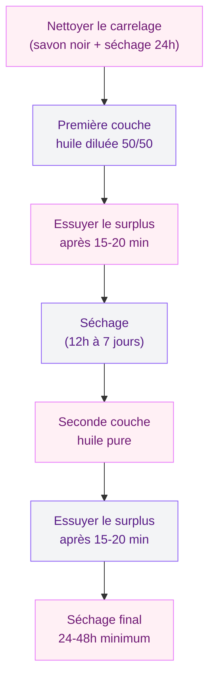

Tu as chez toi des carreaux de ciment ou de la terre cuite, et tu les trouves un peu ternes, un peu secs ? L'huile de lin est peut-être la solution que tu cherches. Utilisée depuis des siècles pour protéger les matériaux poreux, cette huile végétale naturelle nourrit le carreau en profondeur, ravive ses couleurs et lui donne une patine douce qui vieillit bien. Pas de plastique, pas de produit chimique agressif - juste une huile tirée de graines de lin.

Mais attention : mal appliquée, l'huile de lin peut laisser une surface collante, des traces inégales ou un fini qui ne sèche jamais vraiment. Dans cet article, je te donne la méthode complète pour réussir ton application, le type d'huile à choisir selon ton carrelage, et les erreurs à éviter pour un résultat propre et durable.

## Pourquoi utiliser de l'huile de lin sur du carrelage ?

L'huile de lin est un produit 100 % naturel, extrait des graines de la plante du même nom. Son gros atout : elle pénètre dans les pores du matériau au lieu de rester en surface comme un vernis. Ça signifie qu'elle protège de l'intérieur, sans créer de film plastique qui pourrait s'écailler ou jaunir avec le temps.

  

Concrètement, voici ce qu'elle apporte à tes carreaux :

- **Protection contre les taches** : l'huile comble les micro-pores du carreau, ce qui empêche les liquides (café, vin, sauce) de s'infiltrer en profondeur
- **Ravivage des couleurs** : sur des carreaux anciens devenus mats, l'huile redonne de l'intensité aux teintes d'origine
- **Aspect satiné naturel** : pas de brillance artificielle, plutôt un rendu chaud et vivant qui met en valeur les motifs
- **Entretien simplifié** : une fois traité, le carrelage se nettoie plus facilement au quotidien

> [!NOTE]
> L'huile de lin ne forme pas un film en surface comme un vernis. Elle imprègne le matériau, ce qui donne un rendu plus naturel mais aussi une protection qui s'use progressivement. Prévois un entretien tous les 2 à 3 ans selon le passage.

### Sur quels carreaux ça marche ?

C'est le point à vérifier avant tout. L'huile de lin fonctionne sur les matériaux poreux :

- **Carreaux de ciment** : c'est le cas d'usage le plus courant. Ces carreaux, souvent colorés avec des pigments, absorbent bien l'huile et réagissent très bien au traitement
- **Terre cuite** : tomettes, parefeuilles, dalles provençales... L'huile de lin est le traitement traditionnel par excellence pour ces carrelages
- **Pierre naturelle poreuse** : certaines pierres calcaires ou travertins acceptent l'huile de lin

En revanche, l'huile de lin est inutile (et même contre-productive) sur le grès cérame, la faïence émaillée ou tout carrelage déjà vitrifié. Ces surfaces non poreuses n'absorbent pas l'huile, qui reste en surface et crée une couche grasse impossible à sécher.

> [!WARNING]
> Ne mets jamais d'huile de lin sur du grès cérame ou du carrelage émaillé. L'huile ne pénétrera pas et tu te retrouveras avec un sol gras et glissant, très difficile à rattraper. En cas de doute, fais un test sur un petit coin discret.

## Les différents types d'huile de lin

Toutes les huiles de lin ne se valent pas. Le choix de la bonne version conditionne directement le résultat final et le temps de séchage. Voici les trois options principales.

  

### Huile de lin crue

C'est la version la plus pure, sans aucun additif. Elle pénètre profondément dans le matériau et offre une excellente protection. Son défaut : le temps de séchage. Compte 3 à 7 jours pour un séchage complet, parfois plus en hiver ou dans une pièce peu ventilée. Elle est parfaite pour les projets où tu n'es pas pressé.

Prix indicatif : 8 à 12 euros le litre.

### Huile de lin cuite (standolie)

L'huile de lin cuite a été chauffée à haute température, ce qui modifie sa structure moléculaire. Résultat : elle sèche plus vite (24 à 48 heures), elle est un peu plus épaisse et elle donne un fini légèrement plus brillant. C'est souvent le meilleur compromis entre performance et délai de séchage.

Prix indicatif : 10 à 15 euros le litre.

### Huile de lin avec siccatif

Un siccatif est un accélérateur de séchage ajouté à l'huile. Il réduit le temps de séchage à 12-24 heures, ce qui est pratique quand tu traites un sol dans une pièce que tu utilises au quotidien. Le siccatif le plus courant est à base d'oxyde de cobalt ou de zirconium. Cette version est pratique, mais elle est un peu moins "naturelle" que les deux autres.

Prix indicatif : 10 à 14 euros le litre.

## Le matériel nécessaire

Pas besoin d'un équipement sophistiqué. Voici ce qu'il te faut :

  

- **Pinceau large ou spalter** (10-15 cm) : pour appliquer l'huile de façon régulière
- **Chiffon en coton non pelucheux** : pour essuyer les surplus après application
- **Seau** : pour diluer l'huile si nécessaire (avec de l'essence de térébenthine)
- **Essence de térébenthine** : pour diluer la première couche (proportions : 50/50 avec l'huile)
- **Gants de ménage** : l'huile de lin est difficile à enlever des mains
- **Scotch de masquage** : pour protéger les plinthes et murs adjacents

Budget total matériel : entre 15 et 25 euros si tu n'as rien. L'huile elle-même coûte entre 8 et 15 euros le litre, et un litre couvre environ 10 à 15 m2 en deux couches sur des carreaux de ciment.

## Application étape par étape

C'est la partie la plus importante. Une application bien faite donne un résultat magnifique. Une application bâclée donne un sol collant et taché. Suis bien chaque étape.

  

### Étape 1 : préparer le carrelage

Le carrelage doit être parfaitement propre et sec. Lave-le à l'eau claire avec un peu de savon noir, rince abondamment et laisse sécher 24 heures minimum. Toute trace de gras, de cire ancienne ou de produit de nettoyage va empêcher l'huile de pénétrer correctement.

Si tes carreaux ont déjà été traités avec un autre produit (cire, vernis, hydrofuge), il faut d'abord décaper cette couche. Un décapant pour ciment ou un nettoyant alcalin fera le travail. Tu peux aussi te tourner vers la [peinture sur carrelage](/la-peinture-sur-carrelage-une-methode-pour-renover-votre-interieur/) si tes carreaux sont en trop mauvais état pour être simplement huilés.

### Étape 2 : diluer et appliquer la première couche

Pour la première couche, dilue l'huile de lin avec de l'essence de térébenthine à parts égales (50/50). Cette dilution permet à l'huile de pénétrer plus profondément dans les pores du carreau. Applique au pinceau large en couche fine et régulière, toujours dans le même sens. Travaille par zones de 1 à 2 m2 pour éviter que l'huile ne sèche en surface avant que tu aies le temps de l'étaler.

### Étape 3 : essuyer le surplus

C'est l'étape que beaucoup oublient, et c'est là que ça tourne mal. Après 15 à 20 minutes d'application, passe un chiffon propre sur la zone pour retirer l'huile qui n'a pas été absorbée. Si tu laisses du surplus en surface, il ne séchera pas correctement et ton sol restera collant pendant des semaines.

> [!CAUTION]
> L'huile de lin non absorbée qui reste en surface ne sèche pas, elle polymérise très lentement et laisse un film poisseux. Essuie toujours le surplus 15-20 minutes après l'application. C'est la règle numéro un pour éviter un sol collant.

### Étape 4 : appliquer la seconde couche

Laisse sécher la première couche selon le type d'huile utilisé (12h à 7 jours selon la version). Puis applique une seconde couche, cette fois avec l'huile pure, sans dilution. Même méthode : couche fine, pinceau régulier, et essuyage du surplus après 15-20 minutes.

Deux couches suffisent dans la grande majorité des cas. Une troisième couche peut être utile sur des carreaux très poreux (vieilles tomettes par exemple) qui "boivent" beaucoup.

## Séchage et premières précautions

Le séchage est une phase où tu ne dois pas tricher. Même si la surface semble sèche au toucher, l'huile continue de polymériser en profondeur pendant plusieurs jours. Voici les règles à respecter :

  

- **Ne marche pas sur le sol** pendant au moins 24 heures après la dernière couche (48 heures pour l'huile crue)
- **Aère la pièce** au maximum pour accélérer le séchage et évacuer les odeurs
- **Évite les courants d'air chargés de poussière** qui pourraient se coller sur la surface encore fraîche
- **Ne pose pas de meubles** pendant 5 à 7 jours pour éviter les marques permanentes

La température joue aussi un rôle : en dessous de 15 degrés, le séchage ralentit beaucoup. L'idéal est de traiter tes carreaux pendant les mois chauds, ou au moins dans une pièce chauffée à 18-20 degrés.

> [!TIP]
> Si tu traites un sol dans une pièce de passage (cuisine, entrée), prévois de bloquer l'accès pendant 48 heures minimum. Planifie le chantier un week-end ou pendant des vacances pour ne pas être coincé.

## Entretien au quotidien

Une fois le traitement à l'huile de lin terminé et bien sec, l'entretien est simple. Au quotidien, un coup de balai ou d'aspirateur suffit. Pour le nettoyage humide, utilise de l'eau tiède avec un peu de savon noir - c'est le duo idéal pour les sols traités à l'huile. Évite les nettoyants industriels acides ou à base de javel, qui vont "manger" la protection.

Tous les 6 mois environ, tu peux passer une fine couche d'huile de lin diluée (70 % huile, 30 % térébenthine) pour rafraîchir la protection. Un entretien complet (deux couches comme à la pose initiale) est à prévoir tous les 2 à 3 ans selon l'usure et le passage.

Pour une approche différente de la rénovation de carrelage, tu peux aussi explorer les techniques de [peinture pour carrelage de douche](/peinture-pour-carrelage-douche/) ou découvrir comment [peindre sans poncer](/peindre-sans-poncer/) pour d'autres surfaces.

## Les erreurs courantes à éviter

J'ai vu (et fait) pas mal d'erreurs avec l'huile de lin. Voici les plus fréquentes pour t'épargner les mauvaises surprises.

### Appliquer une couche trop épaisse

C'est l'erreur numéro un. On se dit "plus j'en mets, mieux c'est protégé". Faux. Une couche épaisse ne pénètre pas - elle stagne en surface et crée un film gras qui ne sèche pas. Résultat : un sol collant pendant des semaines, voire des mois. La règle : couches fines, toujours.

### Oublier d'essuyer le surplus

Directement lié au point précédent. Après chaque couche, essuie l'huile non absorbée avec un chiffon propre. Si tu vois des zones brillantes ou "mouillées" 20 minutes après l'application, c'est qu'il y a trop d'huile. Essuie.

### Appliquer sur un carreau non poreux

L'huile de lin est faite pour les matériaux poreux. Sur du grès cérame, de la faïence ou du carrelage émaillé, elle ne pénétrera pas et créera une surface grasse et glissante. Teste toujours sur un coin discret d'abord.

### Ne pas aérer pendant le séchage

L'huile de lin dégage une odeur assez prononcée pendant le séchage, et surtout, les vapeurs d'essence de térébenthine sont à prendre au sérieux. Aère la pièce abondamment pendant et après l'application. Et attention : les chiffons imbibés d'huile de lin peuvent s'enflammer spontanément - rince-les à l'eau et laisse-les sécher à plat en extérieur avant de les jeter.

## Huile de lin vs autres traitements

Comment l'huile de lin se positionne face aux alternatives ? Voici un aperçu :

- **Huile de lin vs cire** : la cire reste plus en surface et donne un fini plus brillant, mais elle est moins durable et demande un entretien plus fréquent. L'huile pénètre plus profondément.
- **Huile de lin vs hydrofuge** : l'hydrofuge protège uniquement contre l'eau, tandis que l'huile nourrit et embellit le carreau en plus de le protéger.
- **Huile de lin vs vernis** : le vernis crée un film plastique en surface - il protège bien mais modifie l'aspect naturel du carreau. L'huile garde le toucher et le look d'origine.

Pour un usage en cuisine ou salle de bain, l'huile de lin cuite avec siccatif est le meilleur compromis. Pour un salon ou une entrée, l'huile crue donne le rendu le plus authentique.

## Sur le meme theme

- [maison container](/maison-container/)
- [isolation dalle béton](/isolation-dune-dalle-en-beton-techniques-options-disolation-et-cout/)

## FAQ

**L'huile de lin jaunit-elle le carrelage avec le temps ?**

L'huile de lin a une teinte légèrement ambrée qui fonce un peu les carreaux clairs. Sur des carreaux de ciment blancs ou très pâles, ce jaunissement peut être visible. Sur des teintes moyennes à foncées, l'effet est plutôt un embellissement - les couleurs gagnent en profondeur. Si tu veux un traitement parfaitement incolore, tourne-toi vers une huile de tung ou un hydrofuge spécifique.

**Combien de temps dure la protection de l'huile de lin ?**

En usage domestique normal, compte 2 à 3 ans avant de devoir refaire un traitement complet. Dans les zones de fort passage (entrée, cuisine), la protection s'use plus vite - un rafraîchissement annuel avec une couche diluée est recommandé. En comparaison, un vernis dure plus longtemps mais il est plus difficile à reprendre quand il s'use.

**Peut-on utiliser l'huile de lin sur un carrelage extérieur ?**

Oui, mais avec des réserves. L'huile de lin supporte mal l'exposition prolongée à la pluie et au gel. Pour un usage extérieur (terrasse en terre cuite), préfère l'huile de lin cuite avec siccatif et prévois un entretien plus fréquent (tous les ans). Un hydrofuge spécifique pour extérieur sera souvent plus adapté.

**L'huile de lin rend-elle le sol glissant ?**

Non, à condition d'essuyer le surplus correctement après application. Une fois sèche et polymérisée, l'huile de lin ne rend pas le sol glissant - elle laisse même un toucher légèrement "accrochant" qui réduit le risque de glissade par rapport à un carreau brut et lisse.

**Que faire si mon sol est resté collant après application ?**

C'est le signe que trop d'huile est restée en surface. La solution : frotte les zones collantes avec un chiffon imbibé d'essence de térébenthine pour retirer le surplus non polymérisé. Aère bien la pièce et laisse sécher encore 48 heures. Si le problème persiste, répète l'opération. Un nettoyage avec du savon noir concentré peut aussi aider à retirer la couche grasse résiduelle.
