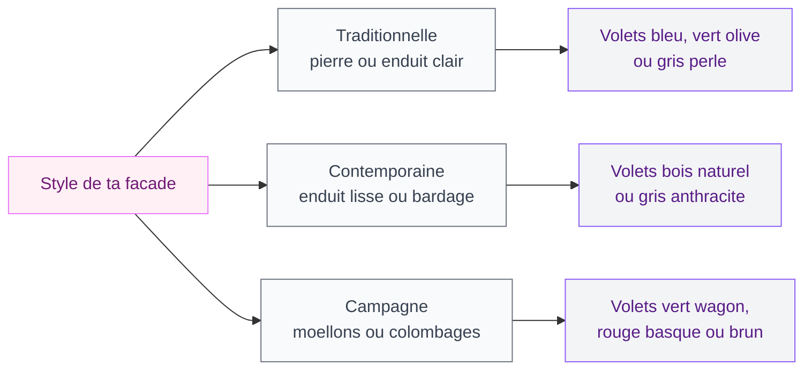

Tu cherches à donner du caractère à ta façade sans tomber dans le PVC froid ou l'alu sans âme ? Les volets en bois apportent une chaleur visuelle que rien d'autre n'égale, et en 2026, ils reviennent en force - même dans les constructions neuves. Que tu rénoves ou que tu changes tes volets fatigués, ce guide te donne toutes les clés.

On va parler essences de bois, types de volets, prix concrets avec des enseignes que tu connais, entretien simple, et idées déco pour que tes volets deviennent un vrai atout charme.

## Pourquoi choisir des volets en bois en 2026 ?

Le bois reste un matériau à part en menuiserie extérieure. Voilà pourquoi il mérite ton attention.

### Isolation naturelle et confort thermique

Le bois est un isolant naturel. Un volet massif de 27 mm offre une résistance thermique bien supérieure au PVC standard. En hiver, il garde la chaleur dedans. En été, il bloque le soleil - surtout sur les fenêtres exposées sud ou ouest.

Résultat : moins de climatisation en été, moins de chauffage en hiver. C'est du confort gagné et des économies sur ta facture énergétique.

### Esthétique et personnalisation

C'est là où le bois écrase la concurrence. Un volet en bois, tu peux le peindre dans la couleur que tu veux : bleu lavande, vert sauge, gris perle, rouge basque, blanc cassé... Tu peux aussi le lasurer pour garder le veinage visible, un rendu naturel très tendance en ce moment.

Les volets en bois s'harmonisent avec tous les styles : maison de campagne, mas provençal, pavillon des années 70, bâtiment haussmannien. Pour approfondir le sujet, consulte le guide sur les [couleurs de façades tendance en 2026](/guides/exterieur/couleurs-pour-les-exterieurs-et-les-facades-de-maisons-2026/).

### Durabilité et réparabilité

Un volet en bois bien entretenu dure 30 à 50 ans. Contrairement au PVC qui jaunit ou à l'alu qui se raye, le bois se répare : lame cassée, tu la remplaces ; peinture écaillée, tu ponces et tu repeins ; gond qui grince, quelques gouttes d'huile et c'est reparti.

> [!TIP]
> Si tu veux gagner du temps sur la rénovation de tes volets, la technique de [peinture sans poncer](/guides/decoration/peindre-sans-poncer/) fonctionne aussi sur le bois extérieur. Il faut juste utiliser un primaire d'accrochage adapté aux conditions extérieures.

## Les essences de bois : laquelle choisir ?

Le choix de l'essence détermine la durée de vie, l'aspect et le prix de tes volets. Voilà les options principales.

### Le pin : le rapport qualité-prix

L'essence la plus répandue. Le pin (maritime ou sylvestre) est facile à travailler, léger, et bon marché. Chez **Brico Dépôt**, une paire de volets battants en pin démarre à 80-120 EUR. Chez **Leroy Merlin**, compte 100-180 EUR la paire selon les dimensions.

Le point faible du pin ? Il est tendre et sensible à l'humidité. Sans traitement régulier, il peut griser et se déformer. Mais avec une bonne lasure ou peinture tous les 4-5 ans, il tient très bien.

### Le sapin : solide et accessible

Le sapin du nord (épicéa) est un cran au-dessus du pin en densité. Il résiste mieux aux intempéries et se déforme moins. C'est le choix classique pour les volets en montagne ou dans les régions humides.

Prix moyen : 120-200 EUR la paire chez **Castorama** ou **Lapeyre**. Un bon compromis entre performance et budget.

### Le chêne : le haut de gamme

Le chêne, c'est le roi des bois pour l'extérieur. Dense, dur, résistant aux insectes et à l'humidité, il peut tenir plus de 50 ans avec un entretien minimal. Son veinage prononcé rend très bien en finition lasurée.

Le prix : 350-600 EUR la paire chez les artisans menuisiers, 250-400 EUR chez **Lapeyre** en prémonté. Un investissement qui se rentabilise sur la durée.

### Le mélèze et le red cedar : les alternatives premium

Le mélèze est un résineux dense qui résiste naturellement aux intempéries sans traitement. Le red cedar (cèdre rouge) ne pourrit pratiquement jamais. Ces deux essences sont idéales en finition naturelle, sans peinture ni lasure.

Compte 250-500 EUR la paire selon les dimensions. On les trouve chez les menuisiers artisanaux ou sur des sites comme **Tryba** ou **Art & Fenêtres**.

> [!NOTE]
> Si ta maison est située en bord de mer, privilégie le mélèze ou le red cedar. L'air salin attaque rapidement le pin et le sapin, même traités. Le chêne résiste aussi, mais il peut noircir avec les embruns.

## Les différents types de volets en bois

### Volets battants : le classique indémodable

Le modèle le plus courant en France. Deux vantaux s'ouvrent vers l'extérieur, maintenus par des gonds scellés dans la façade. Version pleine (isolation et obscurité max) ou à persiennes (air et lumière tamisée).

Dimensions standard : 50 à 80 cm de large par vantail, 100 à 260 cm de hauteur. Chez **Leroy Merlin**, les volets battants pleins en pin démarrent à 70 EUR le vantail. Chez **Lapeyre**, il y a aussi des options sur mesure.

Mon conseil : en région chaude, les persiennes sont un vrai plus. Elles ventilent la pièce tout en bloquant le soleil direct - le système de climatisation naturelle le plus ancien et le plus efficace.

### Volets pliants : gain de place

Les volets pliants (ou "brisés") se composent de plusieurs vantaux articulés qui se replient sur eux-mêmes. Parfaits pour les grandes baies vitrées ou fenêtres larges où des battants classiques prendraient trop de place une fois ouverts.

Compte 200-400 EUR la paire en pin, un peu plus en chêne. Une option élégante qui donne un côté maison de charme.

### Volets coulissants : la touche contemporaine

Pour un look moderne, les volets coulissants en bois sont une option qui monte. Ils glissent sur un rail fixé le long de la façade et ne dépassent pas une fois ouverts - pratique pour les façades donnant sur un passage étroit ou un trottoir.

Le budget est plus élevé (400-800 EUR la paire pose comprise), mais le résultat est vraiment chouette sur une maison contemporaine.

> [!WARNING]
> Vérifie toujours le PLU (Plan Local d'Urbanisme) de ta commune avant de choisir le type et la couleur de tes volets. Certaines zones protégées imposent des volets battants et des couleurs spécifiques. Un simple coup de fil en mairie t'évitera des mauvaises surprises.

## L'entretien des volets en bois : pas si compliqué

C'est souvent le frein numéro un quand on hésite entre le bois et le PVC. Mais entretenir des volets en bois n'est pas la corvée que certains imaginent.

### Le calendrier d'entretien type

Voici un rythme qui fonctionne pour la plupart des essences et des climats :

- **Chaque année** : nettoyage à l'eau savonneuse avec une brosse douce, 15 minutes par fenêtre. Profites-en pour vérifier l'état des gonds et de la quincaillerie.
- **Tous les 2-3 ans** : couche d'entretien de lasure ou vernis directement sur le bois propre, sans poncer.
- **Tous les 5-7 ans** : remise en peinture complète. Ponçage léger, primaire si le bois est à nu par endroits, puis deux couches de peinture microporeuse.
- **Tous les 10-15 ans** : remplacement des quincailleries (gonds, espagnolettes, arrêts) si elles montrent des signes de fatigue.

### Les produits que je recommande

Pour la lasure, les marques **V33** (gamme "Haute Protection", environ 35 EUR les 2,5L) et **Syntilor** ("Xylodhone", 40 EUR les 2,5L) donnent de très bons résultats. Pour la peinture, la gamme **Dulux Valentine "Climats Extrêmes"** (55-70 EUR les 2L) tient super bien face aux intempéries.

> [!TIP]
> Astuce gain de temps : applique ta lasure ou ta peinture au printemps (avril-mai) ou en début d'automne (septembre). La température idéale est entre 15 et 25 degrés, sans pluie prévue dans les 24 heures. Ça permet un séchage optimal et une meilleure tenue dans le temps.

### Réparer un volet abîmé

Un volet en bois qui montre des signes de fatigue n'est pas bon pour la poubelle. Voici les réparations courantes à faire toi-même :

- **Bois fendu** : colle à bois D3 (résistante à l'eau) + serre-joint pendant 24h. Chez **Brico Dépôt**, un tube de colle D3 coûte moins de 8 EUR.
- **Lame pourrie en bas** : découpe la partie abîmée et remplace-la par une nouvelle lame. Les lames de volets se trouvent au mètre chez les négoces bois (3-8 EUR le mètre linéaire).
- **Peinture qui s'écaille** : ponce les zones écaillées au papier de verre grain 80, puis 120. Applique un primaire antirouille sur les gonds si nécessaire, et repeins.

## Déco et couleurs : faire de tes volets un atout charme

Les volets ne sont pas juste un élément fonctionnel - ils représentent une grosse partie de l'identité visuelle de ta façade. Bien choisis, ils transforment l'allure de ta maison.

### Les couleurs tendance 2026

Quelques associations qui fonctionnent bien cette année :

- **Façade blanche + volets bleu gris** : élégant et intemporel. Pense au "Bleu Breton" de Tollens.
- **Façade pierre + volets vert olive** : le vert apporte de la douceur sans dénaturer le caractère de la pierre.
- **Façade enduit beige + volets terracotta** : ambiance méditerranéenne garantie. Ça marche du tonnerre avec des [murs en crépi](/guides/decoration/crepir-un-mur-interieur/) chauds.
- **Façade sombre (gris anthracite) + volets bois naturel lasuré** : duo contemporain, le veinage contraste avec la façade lisse.

### Accessoires et détails qui font la différence

Les petits détails changent tout sur des volets en bois :

- **Pentures décoratives** : les ferrures en fer forgé donnent un cachet fou. Compte 15-30 EUR la paire chez **Leroy Merlin** ou **Manomano**.
- **Découpes décoratives** : coeur, losange ou sapin dans les volets pleins, typique des maisons de montagne et ça ajoute un charme dingue.
- **Arrêts de volets** : les arrêts "bergère" en fer forgé (8-15 EUR la paire) maintiennent tes volets ouverts avec style. Bien plus jolis que les arrêts en plastique gris.

## Fabriquer ses volets soi-même : c'est possible ?

Si tu es un peu bricoleur et que tu as les outils de base (scie circulaire, visseuse, serre-joints), fabriquer des volets en bois simples est faisable. Pour un volet battant plein, il te faut :

- Des lames de bois rabotées (pin ou sapin, épaisseur 27 mm)
- Des barres de traverse (2 ou 3 selon la hauteur)
- Une écharpe (la barre diagonale qui rigidifie le volet)
- De la quincaillerie (gonds, espagnolette, arrêts)

Le coût matériau pour une paire de volets en pin tourne autour de 50-80 EUR si tu achètes les lames en négoce bois. C'est deux à trois fois moins cher que du tout fait, avec la satisfaction du travail maison en prime.

Pour les dimensions, mesure l'embrasure et retire 10 mm en largeur et hauteur pour le jeu. Les lames sont assemblées bord à bord avec traverses vissées à l'arrière, et l'écharpe va du bas côté gond vers le haut côté opposé.

> [!IMPORTANT]
> Avant de te lancer dans la fabrication, vérifie que le bois que tu achètes est bien traité autoclave classe 3 minimum (adapté à l'extérieur). Un bois non traité va pourrir en quelques années, même peint. Le traitement autoclave protège le bois en profondeur contre les champignons et les insectes.

## Sur le meme theme

- [portes coulissantes leroy merlin](/guides/decoration/les-portes-coulissantes-disponible-chez-leroy-merlin/)

## FAQ : les questions qu'on me pose le plus

### Quelle épaisseur choisir pour des volets en bois ?

L'épaisseur standard est de 27 mm pour les volets battants. C'est un bon compromis entre solidité, poids et isolation. Pour des volets coulissants ou des grandes dimensions, on monte à 34 mm. En dessous de 22 mm, le volet risque de se voiler avec le temps.

### Volets en bois ou en PVC : quel est le meilleur choix ?

Le PVC est moins cher (50-100 EUR la paire) et ne demande quasiment aucun entretien. Mais il jaunit avec le temps, se déforme sous forte chaleur, et offre un rendu plat. Le bois coûte plus cher mais dure plus longtemps, se répare et se personnalise. Mon avis : si tu comptes rester dans ta maison plus de 10 ans, le bois est le meilleur investissement. Pour les [façades modernes](/guides/decoration/facades-de-maisons-modernes-2026/), les deux peuvent fonctionner selon le style recherché.

### Comment protéger des volets en bois neufs avant la pose ?

Avant la pose, applique un traitement insecticide-fongicide sur toutes les faces, y compris les chants et les dessous. Puis deux couches de lasure ou peinture microporeuse. L'erreur classique : oublier de traiter les chants du bas - c'est là que l'eau stagne et que le pourrissement démarre.

### Peut-on motoriser des volets en bois battants ?

Oui, et c'est de plus en plus courant. Des systèmes comme le **Somfy Yslo Flex** (350-450 EUR par fenêtre, hors pose) permettent de motoriser des volets battants existants sans modifier la menuiserie. Un vrai plus en confort, surtout pour les fenêtres en étage.

### À quelle fréquence faut-il repeindre des volets en bois ?

En moyenne, tous les 5 à 7 ans pour des volets peints, et tous les 2 à 3 ans pour une couche d'entretien de lasure. Les volets exposés sud et ouest s'usent plus vite que ceux au nord ou à l'est. Surveille les micro-fissures dans le film de peinture : c'est le signe qu'il faut s'y remettre.
