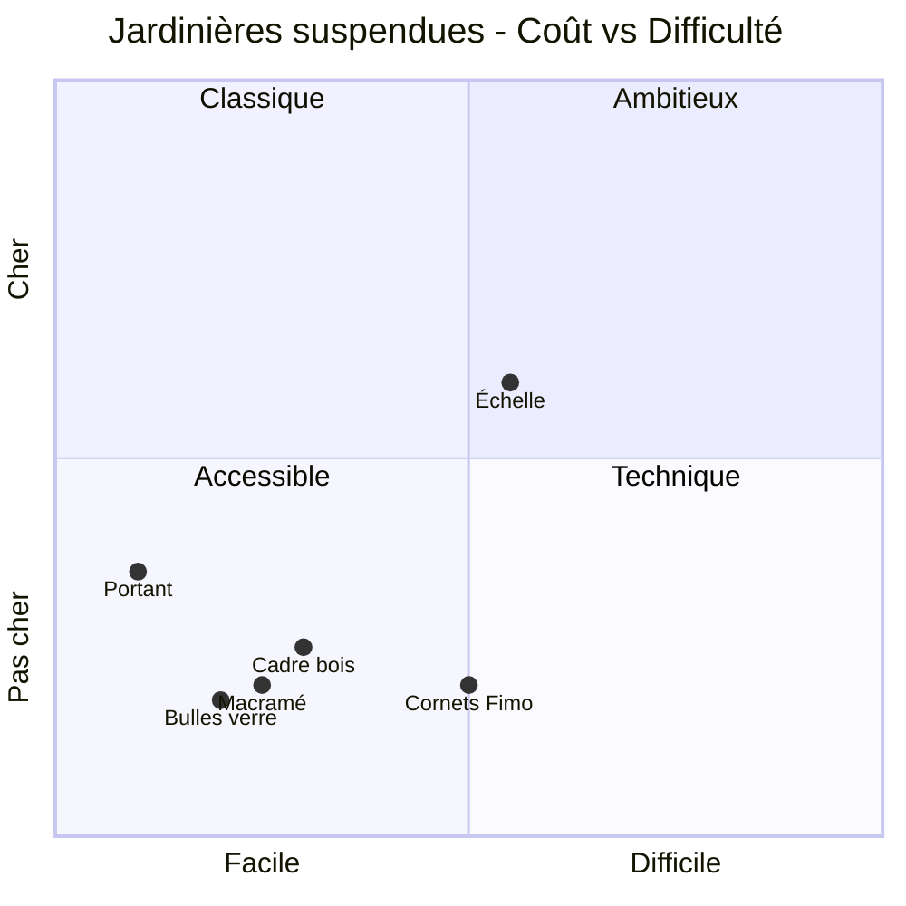

Une jardinière suspendue, c'est le moyen le plus malin de verdir un balcon sans perdre un centimètre au sol. Tu peux en fabriquer une ce week-end pour moins de 15 euros, avec des matériaux que tu as déjà chez toi. De la corde, une planche ou un pot en terre cuite, et tu obtiens un résultat unique.

Voici 6 idées classées par style et difficulté, avec matériel, étapes et budget pour chacune.

---

## Pourquoi suspendre ses jardinières ?

Suspendre ses plantes, c'est une solution pratique pour les petits espaces, les balcons étroits ou les terrasses où chaque mètre carré compte.

- **Gagner de la place au sol.** Sur un balcon de 3 m2, trois pots suspendus libèrent l'espace pour une table et une chaise.
- **Protéger les plantes.** Chats, chiens, limaces : en hauteur, tes plantes sont tranquilles.
- **Créer du volume visuel.** Des plantes à différentes hauteurs donnent de la profondeur. Les [jardins verticaux](/guides/exterieur/jardins-verticaux-de-40-photos-dinspiration-verte/) poussent le concept encore plus loin.
- **Mieux capter la lumière.** Près d'une fenêtre haute, une suspension capte un ensoleillement que les plantes au sol n'atteignent pas.

> [!TIP]
> Avant de percer ton plafond, vérifie le poids total pot + terreau + eau. Un pot en terre cuite de 20 cm rempli de terreau humide pèse 5 à 8 kg. Pour les plafonds en placoplâtre, utilise des chevilles Molly (capacité 15 à 30 kg) plutôt que des chevilles classiques.

---

## Idée 1 - La suspension macramé (la star du DIY)

Le macramé, c'est l'option qui revient partout sur Pinterest - et pour cause. C'est beau, c'est simple, et tu n'as besoin que d'un seul matériau : de la corde.

**Matériaux :**
- 8 brins de corde de coton tressé 4 mm, de 2 m chacun : 6 euros le rouleau de 50 m (Amazon, Action)
- 1 anneau en bois ou en métal de 5 cm de diamètre : 1 euro (rayon mercerie)
- 1 pot en terre cuite de 15 à 20 cm : 2 à 4 euros (Jardiland, Truffaut)

**Étapes :**

1. Plie les 8 brins en deux et passe-les dans l'anneau. Tu obtiens 16 brins pendants.
2. Fais un gros noeud sous l'anneau pour bloquer les brins.
3. Sépare les brins en 4 groupes de 4 brins.
4. Sur chaque groupe, fais un noeud plat à 25 cm sous l'anneau.
5. Prends 2 brins d'un groupe et 2 brins du groupe voisin. Fais un noeud à 10 cm sous les premiers noeuds. Répète tout autour.
6. Rassemble tous les brins et fais un dernier gros noeud à 10 cm du bas.
7. Coupe les brins restants pour former des franges régulières. Effiloche-les si tu veux un rendu bohème.

**Temps :** 30 à 45 minutes. **Coût total : 8 à 12 euros.**

> [!NOTE]
> La corde de coton naturel est idéale pour l'intérieur. En extérieur, préfère de la corde en jute ou en chanvre traitée, plus résistante à l'humidité. Chez Leroy Merlin, le chanvre tressé 6 mm coûte environ 0,80 euro le mètre.

---

## Idée 2 - Le cadre suspendu en bois de récup

Cette version utilise une planche en bois (bois de grange, palette ou étagère inutilisée) et des brides de plomberie pour maintenir le pot. Le résultat a un look industriel-rustique qui fonctionne très bien en intérieur.

**Matériaux :**
- 1 planche de bois de 30 x 15 cm, épaisseur 2 cm : récup ou 3 euros (chute en magasin de bricolage)
- 2 brides de tuyau en métal galvanisé, diamètre adapté au pot (souvent 10 ou 12 cm) : 3 euros les 2 (Brico Dépôt)
- 2 crochets à vis fermés (pitons) : 2 euros
- De la corde ou de la chaîne pour la suspension : 2 à 4 euros
- 4 vis courtes pour fixer les brides

**Étapes :**

1. Ponce la planche et applique une couche d'huile de lin ou de vernis mat pour la protéger.
2. Positionne les brides au centre de la planche, ouvertes vers le haut. Visse-les solidement.
3. Visse les deux pitons sur les côtés courts de la planche, à 2 cm du bord.
4. Attache la corde ou la chaîne aux pitons.
5. Glisse le pot (sans la plante pour le moment) dans les brides et vérifie la stabilité.
6. Suspends l'ensemble à un crochet de plafond ou à une équerre murale robuste.

**Temps :** 20 à 30 minutes. **Coût total : 8 à 15 euros.**

Ce modèle est parfait pour les plantes à port retombant - pothos, lierre, chaîne des coeurs - qui vont déborder du pot et habiller la planche.

---

## Idée 3 - L'échelle végétale suspendue au plafond

Tu as une vieille échelle en bois au garage ? C'est une base parfaite pour un jardin suspendu linéaire.

**Matériaux :**
- 1 échelle en bois (1 à 1,50 m) : récup ou 10 à 20 euros en brocante
- 4 pitons à vis fermés + 4 mousquetons : 6 euros
- Chaîne ou corde solide (capacité 30 kg minimum) : 5 à 10 euros
- 5 à 8 pots + crochets S en inox : 8 euros le lot de 10 (Amazon)
- 2 chevilles plafond haute résistance : 4 euros

**Étapes :**

1. Ponce l'échelle et traite-la avec une huile ou une cire (Starwax, Libéron) pour un rendu naturel et protégé.
2. Fixe un piton de chaque côté, aux deux extrémités de l'échelle (4 pitons au total).
3. Attache les chaînes aux pitons et relie-les au plafond avec les chevilles résistantes.
4. Règle la hauteur pour que l'échelle soit bien horizontale. Un niveau à bulle aide beaucoup.
5. Suspends les pots aux barreaux de l'échelle avec les crochets S.
6. Alterne les tailles de pots et les types de plantes (retombantes, compactes, à fleurs) pour un rendu organique.

**Temps :** 1 heure environ. **Coût total : 25 à 45 euros** selon que tu récupères l'échelle ou pas.

> [!WARNING]
> Le poids total d'une échelle chargée de 6 pots peut atteindre 30 à 40 kg. Fixe les chevilles dans une poutre, un solive ou un mur porteur - jamais dans du plâtre seul. En cas de doute, demande conseil en magasin de bricolage pour le choix des fixations.

---

## Idée 4 - Les cornets en pâte polymère (projet créatif)

Si tu aimes les travaux manuels, cette idée va te plaire. Tu modèles des petits cornets ou cônes en pâte polymère (type Fimo), tu les fais cuire au four, et tu obtiens des mini-jardinières murales originales.

**Matériaux :**
- 2 à 3 pains de pâte Fimo Soft (couleur au choix) : 3 euros le pain de 57 g (Cultura, Amazon)
- De la corde fine pour la suspension : 2 euros
- Des petites plantes grasses ou des boutures : 1 à 3 euros le godet

**Étapes :**

1. Aplatis la pâte au rouleau (épaisseur 3 à 4 mm).
2. Découpe un disque d'environ 15 cm de diamètre.
3. Forme un cornet en ramenant les bords l'un sur l'autre. Lisse la jointure.
4. Perce deux petits trous en haut du cornet, de chaque côté, pour passer la corde.
5. Perce un trou de drainage au fond du cornet.
6. Fais cuire 30 minutes à 110 degres (suivre les instructions de la marque).
7. Passe la corde dans les trous et suspends le cornet au mur avec un petit clou.
8. Remplis de substrat léger (terreau + perlite moitié-moitié) et plante ta bouture.

**Temps :** 1 heure (modelage + cuisson). **Coût total : 8 à 12 euros pour 3 cornets.**

Pour enrichir ce genre de projet créatif, tu peux aussi jeter un oeil au guide sur [comment réaliser des fleurs en tissu ou en papier](/guides/decoration/comment-realiser-des-fleurs-en-tissu-ou-en-papier-etape-par-etape/) et combiner les deux pour une déco murale végétale et artisanale.

---

## Idée 5 - Les bulles de verre recyclé

Les terrariums en verre coûtent 15 à 30 euros pièce en boutique. Avec des bocaux récupérés et du fil de fer, tu obtiens le même effet pour presque rien.

**Matériaux :**
- 2 à 3 bocaux en verre (type Le Parfait ou bocaux à confiture large) : récup, 0 euro
- Du fil de fer galvanisé de 2 mm : 3 euros le rouleau de 10 m (Castorama)
- De la mousse végétale, des graviers décoratifs et de la sphaigne : 5 euros
- Des plantes aériennes (Tillandsia) ou des petites fougères : 3 à 6 euros le lot

**Étapes :**

1. Enroule le fil de fer autour de l'ouverture du bocal en faisant 3 tours serrés.
2. Forme deux anses de suspension en torsadant le fil vers le haut (comme un panier).
3. Rejoins les anses au sommet et crée une boucle pour accrocher l'ensemble.
4. Place une couche de graviers au fond (2 cm), puis la sphaigne, puis un peu de terreau.
5. Installe la plante. Les Tillandsias n'ont même pas besoin de terre - juste de la mousse humide.
6. Suspends le bocal à un crochet de plafond, un tringle, ou une branche décorative.

**Temps :** 15 à 20 minutes par bocal. **Coût total : 8 à 14 euros pour 3 bocaux.**

---

## Idée 6 - Le portant fleuri à roulettes

Le portant à vêtements détourné en support de plantes, c'est la solution parfaite pour les locataires qui ne peuvent pas percer le plafond.

**Matériaux :**
- 1 portant à vêtements en métal (type portant simple chez IKEA Mulig à 5 euros, ou Action à 8 euros)
- 6 à 10 crochets S en inox : 4 euros le lot
- Des pots légers en plastique ou en résine avec soucoupe intégrée : 2 à 3 euros pièce

**Étapes :**

1. Monte le portant selon les instructions (5 minutes, c'est deux pieds et une barre).
2. Accroche les crochets S sur la barre horizontale.
3. Suspends les pots aux crochets. Alterne les hauteurs en variant la longueur de corde ou de chaîne.
4. Place le portant près d'une fenêtre ou sur le balcon.
5. Si besoin, leste la base du portant avec un pot lourd posé au sol entre les pieds.

**Temps :** 15 minutes. **Coût total : 15 à 30 euros.**

Tu le déplaces selon la saison, tu le rentres en hiver, tu l'emmènes si tu déménages. Et aucun trou dans le plafond.

> [!TIP]
> Enroule de la corde de jute autour de la barre du portant pour cacher le métal et donner un côté champêtre. Budget : 3 à 5 euros.

---

## Comparatif des 6 modèles

| Modèle | Coût | Difficulté | Temps | Idéal pour |
|---|---|---|---|---|
| Macramé | 8-12 euros | Facile | 30-45 min | Intérieur, bohème |
| Cadre bois + brides | 8-15 euros | Facile | 20-30 min | Look industriel |
| Échelle suspendue | 25-45 euros | Moyen | 1 h | Grand espace, terrasse |
| Cornets Fimo | 8-12 euros | Moyen | 1 h | Créatifs, déco murale |
| Bulles de verre | 8-14 euros | Facile | 15-20 min | Terrarium, minimaliste |
| Portant fleuri | 15-30 euros | Très facile | 15 min | Locataires, mobile |

---

## Quelles plantes choisir pour une jardinière suspendue ?

Il faut des espèces à port retombant ou compact, qui tolèrent un volume de terre réduit.

**En intérieur :** pothos (4 à 6 euros chez Truffaut), chaîne des coeurs (8 euros), fougère de Boston (7 à 10 euros), chlorophytum.

**En extérieur :** pétunias retombants Surfinia (3 euros le godet), lierre, fraisiers remontants (5 euros les 4 plants), lobélia retombant.

Si tu veux intégrer tes suspensions dans un aménagement plus large, le guide pour [créer un jardin zen en 7 étapes](/guides/exterieur/comment-creer-un-jardin-zen-en-7-etapes/) donne de bonnes pistes.

---

## Les erreurs à éviter

**Oublier le drainage.** Chaque pot doit avoir un trou au fond. Pour les pots déco sans trou, utilise-les comme cache-pot avec un pot percé à l'intérieur.

**Sous-estimer l'arrosage.** En hauteur, les plantes sèchent plus vite. Prévois 2 à 3 arrosages par semaine en été, un par semaine en hiver.

**Négliger les fixations.** Teste toujours la solidité en tirant fermement sur le crochet avant de suspendre quoi que ce soit.

**Accrocher trop haut.** Si tu dois monter sur un escabeau pour arroser, tu finiras par oublier. Place le bas du pot à hauteur de tes yeux.

> [!IMPORTANT]
> Pour les locataires, il existe des solutions sans percer : portant fleuri (idée 6), tringles de douche à pression, crochets adhésifs haute résistance (3M Command, capacité 3 kg) ou barres de tension entre deux murs. Pas besoin de demander au propriétaire.

---

## FAQ

### Quel poids peut supporter un crochet de plafond ?
Un crochet dans du plâtre tient 3 à 5 kg. Dans du bois (poutre, solive), un piton fermé supporte 15 à 30 kg. Les chevilles Molly en placoplâtre montent à 15-25 kg. Vérifie la capacité sur l'emballage.

### Quelles plantes survivent en intérieur sans beaucoup de lumière ?
Le pothos, le philodendron, le scindapsus et la fougère de Boston tolèrent les pièces peu lumineuses. Évite les plantes à fleurs (pétunias, géraniums) qui ont besoin de 5 à 6 heures de soleil direct. En règle générale, plus le feuillage est foncé, mieux la plante supporte l'ombre.

### Comment arroser une plante suspendue sans mettre de l'eau partout ?
Utilise une soucoupe intégrée (modèles Elho, Lechuza), un cache-pot étanche, ou décroche la suspension pour l'arroser dans l'évier. Le pot avec réservoir intégré (Lechuza Nido Cottage, environ 12 euros) est la solution la plus pratique.

### Est-ce que les jardinières suspendues abîment le plafond ?
Avec des fixations adaptées, non. Le risque vient de l'eau qui coule le long de la corde. Place un noeud "stop-goutte" 5 cm sous le crochet - l'eau s'y arrête au lieu de remonter par capillarité. Et utilise toujours une soucoupe.
