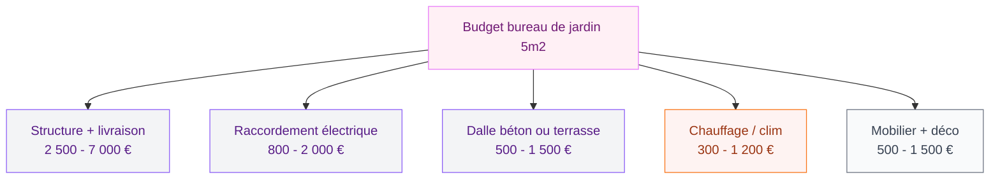
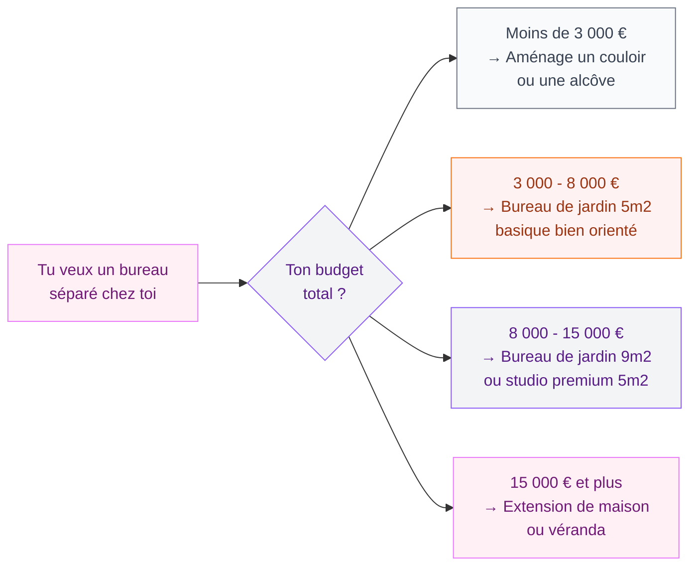

Il y a quelques années, j'ai craqué pour l'idée. Un petit bureau au fond du jardin, la nature autour, le calme garanti - loin du salon où les enfants jouent à fond, loin de la cuisine qui sent le déjeuner. Sur les réseaux, ça avait l'air parfait : des petites cabanes en bois toutes jolies, avec une baie vitrée, un bureau design dedans. Le rêve du télétravailleur moderne.

Puis j'ai commencé à creuser le sujet pour de vrai. Et là, les doutes se sont accumulés. Alors aujourd'hui, je te donne mon bilan honnête sur le bureau de jardin de 5m2 - les vrais avantages, les limites que personne ne te mentionne, et surtout comment éviter les pièges classiques si tu te lances quand même.

## Pourquoi le 5m2 séduit autant

Le seuil des 5m2 n'est pas anodin. En France, toute construction de moins de 5m2 est exonérée de permis de construire. Tu n'as même pas besoin de faire une déclaration préalable de travaux (sauf dans certaines zones protégées). C'est ce qui fait tout l'attrait du concept : tu commandes ta cabane en kit, tu la montes en un week-end, et voilà - tu as un bureau chez toi sans paperasse.

Du côté budget, les modèles d'entrée de gamme démarrent vers 2 500 - 3 500 euros pour un abri basique avec isolation légère. Les modèles sérieux avec double vitrage et isolation correcte, comme l'Avalon chez Chalet en Bois, se situent entre 4 000 et 7 000 euros. Chez des marques comme Greenkub ou Abri de Jardin Pro, les studios premium montent facilement à 10 000 - 15 000 euros mais là on s'éloigne du "simple bureau".

> [!NOTE]
> En pratique, 5m2 de surface au sol correspond à un espace d'environ 2m x 2,5m. C'est la taille d'un couloir ou d'une petite salle de bain. Suffisant pour un bureau et une chaise, mais vraiment juste pour tout le reste.

## La réalité du quotidien dans 5m2

Voilà où ça se complique. Sur les photos marketing, tout semble fluide et élégant. Dans la réalité, 5m2 c'est petit. Très petit.

### L'espace de travail, c'est OK - mais rien d'autre

Un bureau standard fait 140 x 60 cm. Avec ta chaise reculée, tu occupes déjà 1,5m de profondeur. Ajoute un meuble de rangement, une étagère, un porte-manteau - et tu es à l'étroit. Impossible de recevoir un client ou de tenir une réunion à deux. Impossible d'installer une imprimante correctement. Si tu travailles avec deux écrans, c'est le jeu de Tetris permanent.

Les cabanes de 5m2 ont généralement une surface intérieure utile de 4,5 à 4,8m2 (les murs prennent de la place). C'est honnête pour une seule personne qui fait de la saisie ou des appels visio. C'est clairement insuffisant pour un profil qui a besoin de poser des documents, des échantillons, ou du matériel.

### La gestion thermique, le vrai problème

C'est là que beaucoup de gens se font avoir. Les modèles bas de gamme avec 20 ou 30mm d'isolation sont utilisables peut-être 8 mois par an dans le meilleur des cas. En hiver, tu auras froid même avec un chauffage d'appoint. En été, c'est le four - une petite structure en bois orientée plein sud peut atteindre 35-40°C à l'intérieur sans ventilation ni climatisation.

Pour avoir un bureau vraiment utilisable toute l'année, il faut viser minimum 44mm d'isolation sur les murs, un double vitrage performant, et prévoir un système de chauffage + une ventilation efficace. Ça fait vite grimper la facture et la consommation électrique.

> [!WARNING]
> Attention à l'orientation quand tu choisis l'emplacement de ton bureau de jardin. Un modèle mal orienté (plein ouest sans ombre) peut devenir invivable l'été, même bien isolé. Prévois une toile d'ombre, des plantes grimpantes ou une avancée de toit conséquente.

### Le raccordement électrique, souvent sous-estimé

Pour travailler confortablement, il te faut au minimum : l'éclairage, des prises pour l'ordinateur et les périphériques, et un moyen de chauffer ou climatiser. Un câble depuis la maison jusqu'au fond du jardin, c'est une tranchée à creuser, un câble souterrain sécurisé, un tableau électrique dédié. Compte entre 800 et 2 000 euros pour une installation aux normes selon la distance.

Si tu veux le Wi-Fi correct, ajoute un répéteur ou mieux, un câble Ethernet enterré avec le câble électrique pendant que tu y es (coût marginal, bénéfice max).

## Ce que personne ne dit avant d'acheter

### La dalle ou le plancher, ça s'oublie souvent

La plupart des fabricants livrent la structure sans fondations. Tu dois prévoir soit une dalle béton (la solution la plus stable mais la plus chère, entre 500 et 1 500 euros selon la surface), soit des plots réglables ou une terrasse en composite. Sans une base solide et de niveau, la cabane se déforme avec le temps, les portes se bloquent, l'humidité s'infiltre par le bas.

### L'entretien du bois, c'est du boulot

Un bureau de jardin en bois naturel, ça demande une lasure ou une peinture tous les 2-3 ans, surtout si tu habites dans une région humide. Le bois non traité se fissure, se grise, et peut prendre l'humidité. Si tu choisis un modèle bardage bois, pense à l'entretien dans ton budget total.

Pour la question des couleurs de l'extérieur et l'intégration dans ton jardin, ça vaut le coup de jeter un oeil à notre guide sur les [couleurs pour les extérieurs et les façades de maisons 2026](/guides/exterieur/couleurs-pour-les-exterieurs-et-les-facades-de-maisons-2026/) - les mêmes logiques s'appliquent pour choisir la teinte de ton bureau de jardin.

> [!TIP]
> Pour limiter l'entretien du bois extérieur, opte pour une teinte foncée (gris anthracite ou brun profond) qui masque mieux le grisaillement et les traces. Une lasure de qualité comme Cetol HLS de Sikkens sur un bois sec tient facilement 3-4 ans avant de retraiter.

### La valeur ajoutée à la revente, mythe ou réalité ?

Les agences immobilières confirment qu'un bureau de jardin bien intégré peut ajouter entre 3 000 et 8 000 euros à la valeur perçue d'une maison. Mais c'est très variable. Un bureau mal entretenu, mal isolé, ou posé sans dalle correcte peut au contraire être vu comme une contrainte par les acheteurs potentiels. La qualité de la construction fait toute la différence.

## Pour qui c'est vraiment fait ?

Soyons directs : un bureau de jardin de 5m2 est une bonne idée pour des profils très spécifiques.

**C'est fait pour toi si :**
- Tu travailles seul.e, principalement sur ordinateur
- Tu as besoin d'un espace calme, séparé physiquement de ta maison
- Tu as un jardin avec de la place, une orientation favorable, et accès à l'électricité
- Tu es prêt.e à investir au total entre 6 000 et 12 000 euros (structure + installation complète)

**C'est probablement la mauvaise solution si :**
- Tu reçois régulièrement des clients ou collègues
- Tu travailles avec beaucoup de matériel ou de documents physiques
- Tu veux utiliser le bureau l'été sans ventilation/climatisation sérieuse
- Tu cherches la solution la moins chère possible (les modèles bas de gamme décèvent vite)

> [!CAUTION]
> Les bureaux de jardin vendus moins de 2 000 euros online sont en général des abris de jardin basiques avec une fenêtre en plus. L'isolation est quasi nulle, la structure fine, et la durée de vie limitée. Pour un usage professionnel réel, ne descends pas en dessous de 4 000 euros hors installation.

## Les alternatives selon ton budget

Si le 5m2 te semble trop juste ou trop cher à bien faire, voici d'autres options à envisager.

Si tu penses à aménager plutôt l'intérieur de ta maison, notre article sur [comment isoler une montée d'escalier](/guides/decoration/comment-isoler-une-montee-descalier/) peut t'ouvrir des pistes pour récupérer des espaces existants sans construire.

## Mes vraies recommandations si tu te lances

Si après tout ça tu es décidé.e à te lancer, voilà ma liste des points à ne pas négliger :

**1. L'isolation en premier** - Ne descends pas sous 44mm d'isolant dans les murs, 50mm c'est encore mieux. Vérifie le plancher aussi (souvent oublié).

**2. L'orientation** - Nord ou nord-est pour éviter la surchauffe estivale. Si tu n'as pas le choix, prévois une protection solaire sérieuse dès le départ.

**3. La base** - Prévois une dalle béton ou des plots béton sérieux. Pas de simples plots plastique vissés dans le sol.

**4. L'électricité aux normes** - Fais appel à un électricien certifié pour la tranchée et le raccordement. C'est une installation fixe, elle doit être aux normes NF C 15-100 pour les bâtiments annexes.

**5. La ventilation** - Une VMC simple flux d'entrée de gamme (comme les modèles Aldes ou Atlantic à 80-120 euros) change tout en termes de qualité d'air et d'humidité dans un espace confiné.

Si tu aménages aussi les abords du bureau - terrasse, délimitation avec le reste du jardin - pense à lire notre guide sur comment [poser une bordure de jardin sans béton](/guides/exterieur/poser-bordure-jardin-sans-beton/) pour séparer proprement les zones sans travaux lourds.

## Mon verdict final

Le bureau de jardin de 5m2, c'est une bonne idée mal vendue. Sur le papier, le concept est séduisant : autonomie, calme, pas de permis. Dans la réalité, les contraintes s'accumulent vite si tu n'anticipes pas tout ce qui va autour de la structure elle-même.

Ce n'est pas un mauvais concept en soi - c'est un concept qui demande un vrai budget (minimum 6 000 - 8 000 euros tout compris pour que ça soit vraiment agréable), une bonne préparation de terrain, et une réflexion sérieuse sur ton usage réel. Les gens qui en sont contents sont ceux qui ont bien calculé en amont. Les déçus sont ceux qui ont acheté la structure la moins chère en pensant que ça suffirait.

Si tu es dans ce dernier cas et que tu cherches un coin bureau sympa à l'intérieur à la place, nos guides sur la déco intérieure peuvent t'aider à trouver des alternatives malins. Et si tu t'y es mis mais que tu peines à chauffer l'espace en hiver, va lire notre article sur le [poêle à granulés suspendu](/guides/decoration/poele-a-granules-suspendu/) - c'est une option à envisager même dans un petit espace comme un bureau de jardin.

---

## Sur le meme theme

- [éclairage extérieur sans fil](/guides/exterieur/installer-eclairage-exterieur-sans-fil/)

## Questions fréquentes

### Un bureau de jardin de 5m2 nécessite-t-il un permis de construire ?

Non, en France une construction de moins de 5m2 ne nécessite ni permis de construire ni déclaration préalable de travaux, sauf dans les zones protégées (ZPPAUP, sites classés, etc.). Au-delà de 5m2 et jusqu'à 20m2, une déclaration préalable est nécessaire.

### Quel budget prévoir en tout pour un bureau de jardin 5m2 ?

Pour une installation complète et utilisable toute l'année, compte entre 6 000 et 12 000 euros : structure (4 000 - 7 000 euros), raccordement électrique (800 - 2 000 euros), dalle ou fondations (500 - 1 500 euros), chauffage et ventilation (400 - 1 000 euros), mobilier (500 - 1 000 euros).

### Peut-on chauffer un bureau de jardin de 5m2 efficacement ?

Oui, à condition que l'isolation soit correcte (44mm minimum). Pour un espace de 5m2 bien isolé, un radiateur électrique à inertie de 750W suffit largement. Certains optent pour un mini-split réversible (climatiseur/chauffage) qui coûte 600 - 1 200 euros à l'installation mais offre confort estival et hivernal.

### Combien de temps faut-il pour installer un bureau de jardin en kit ?

La structure en kit se monte généralement en 1 à 3 jours à deux personnes. Mais avec la préparation du terrain, le raccordement électrique et l'aménagement intérieur, prévois plutôt 2 à 4 semaines entre la commande et le premier jour de travail effectif dans ton bureau.
