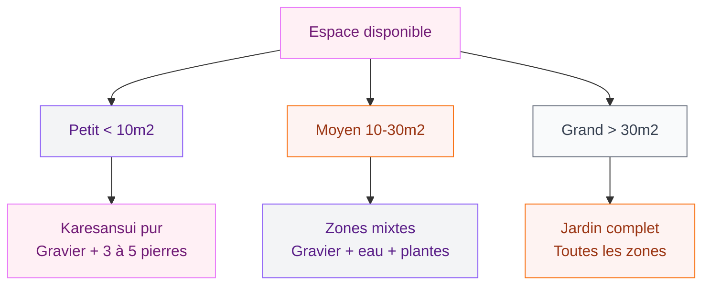

Tu as un coin de jardin qui ne ressemble a rien, ou peut-etre une terrasse qui t'inspire zero sérénité ? Un jardin zen, c'est exactement ce qu'il te faut. Pas besoin d'un grand terrain ni d'un budget foufou - avec les bons principes et quelques matériaux bien choisis, tu peux créer un espace de contemplation qui te recentre vraiment.

Le jardin zen trouve ses racines au Japon, dans les temples bouddhistes des XIVe et XVe siecles. Le karesansui - "jardin sec" en japonais - représente la nature sous forme abstraite : le gravier ratissé symbolise l'eau, les pierres évoquent les montagnes. Mais aujourd'hui, l'interpretation occidentale du jardin zen est plus souple. Ce qui compte, c'est l'atmosphere : épurée, calme, propice a la méditation.

Voila comment créer le tien, étape par étape.

## Etape 1 : Trouve ton inspiration et definis ta philosophie

Avant d'acheter la moindre pierre, prends le temps de regarder des jardins japonais. Pinterest, les livres de paysagisme, les documentaires sur les jardins de Kyoto... Cette phase d'inspiration n'est pas un luxe.

  

Les trois principes fondamentaux du jardin zen japonais sont simples : l'asymétrie (la nature ne fait jamais deux fois la meme chose), la suggestion (représenter la mer sans une goutte d'eau), et le vide (l'espace libre est aussi important que les éléments). Garde ces idées en tete quand tu feras tes choix.

La règle d'or pour les pierres : toujours les grouper en nombre impair. Trois pierres, cinq pierres, sept pierres. Un groupe de trois suit souvent la triade bouddhiste : une grande pierre verticale au centre, deux plus petites de chaque côté. Ca crée un équilibre dynamique, visuellement bien plus interessant que deux pierres identiques face a face.

> [!TIP]
> Avant de commencer, prends une photo de ton espace depuis la fenetre ou la terrasse. Tu verras mieux les proportions et tu pourras tester plusieurs compositions sur papier.

## Etape 2 : Choisis l'emplacement ideal

L'emplacement conditionne tout le reste. Un jardin zen n'a pas besoin d'etre grand - certains des plus beaux jardins japonais font moins de 20 m2. Ce qui compte, c'est l'orientation et la lisibilité de l'espace.

  

Quelques critères a évaluer :

**L'exposition.** Un jardin zen sans plantes (pur karesansui) supporte bien le plein soleil. Avec des végétaux, oriente ton espace vers le nord ou l'est pour éviter que le gravier surchauffe trop et que les plantes brulent.

**La visibilité.** Le jardin zen traditionnel est concu pour etre regardé depuis un point fixe - souvent une vérandah ou une piece intérieure. Definis ton point d'observation avant de placer quoi que ce soit.

**L'intimité.** Un jardin de méditation demande de l'isolation visuelle. Des panneaux en bambou, une haie persistante ou des bacs bien positionnés peuvent créer cette enveloppe protectrice sans grand travail.

**Les zones.** Selon la surface disponible, tu peux dédier différentes zones : une zone sèche avec gravier et pierres, une zone humide autour d'une fontaine ou d'un bassin, et une zone végétale plus douce.

## Etape 3 : Prépare le sol correctement

C'est l'étape qu'on bacle souvent, et c'est une erreur. Un bon sol, c'est la base d'un jardin qui reste beau sur le long terme.

  

Commence par délimiter ta zone avec des bordures. Des bordures propres en acier Corten, en pierre naturelle ou en bambou donnent une finition nette qui est vraiment le truc qui fait la différence entre un jardin amateur et un jardin soigné. Pour tout ce qui concerne la pose et les options disponibles, jette un oeil a notre guide sur [comment poser une bordure de jardin sans béton](/guides/exterieur/poser-bordure-jardin-sans-beton/) - c'est exactement le type d'installation qui convient ici.

Ensuite, pose un géotextile (feutre anti-mauvaises herbes) sur toute la surface du jardin sec. Ce tissu laisse passer l'eau mais bloque la végétation. Sans lui, dans 6 mois, tu passes la moitié de ton temps a désherber entre les cailloux.

Si tu as des zones plantées, améliore le sol avec du compost et vérifie le drainage. Les plantes de jardin zen détestent avoir les pieds dans l'eau.

> [!WARNING]
> Evite le plastique noir classique comme sous-couche. Il se dégrade en 3-4 ans, remonte en surface et fait un rendu catastrophique. Le géotextile tissé de qualité (80-100g/m2 minimum) coûte un peu plus cher mais dure 10-15 ans sans problème.

## Etape 4 : Choisis tes végétaux

La sélection des plantes pour un jardin zen obéit a des règles précises. On privilégie le feuillage sur les fleurs - ou alors des fleurs discrètes, pas les hortensias géants flashy. L'objectif : des végétaux qui apportent du mouvement sans trop de couleur.

  

**Les arbustes à planter en priorité :**

- Le bambou : icônique, mais attention aux espèces traçantes qui envahissent tout. Choisis du bambou non-tracant (en touffes), comme le Fargesia. Il pousse en clumps raisonnables et ne colonise pas tes plates-bandes.
- L'azalée japonaise (Rhododendron) : floraison discrète rose ou blanche au printemps, feuillage persistant.
- Le cerisier du Japon (Prunus) : pour les grands espaces, sa floraison éphémère est exactement dans l'esprit zen.
- Le pin japonais (Pinus thunbergii) : pour sculpter et créer des silhouettes asymétriques caractéristiques.

**Les plantes de sol et de bordure :**

- Les fougères pour les zones ombragées et humides.
- La mousse, qui remplace avantageusement le gazon dans les jardins japonais - ça donne ce vert velouté qu'on adore.
- Les graminées ornementales comme le Miscanthus pour le mouvement dans le vent.

**Ce qu'on évite :** les plantes a feuilles larges et tropicales, les fleurs tres colorées type géraniums ou pétunias, et tout ce qui demande un entretien quotidien.

> [!NOTE]
> Le choix des végétaux dépend aussi de ta région. Dans le sud, tu peux t'orienter vers des plantes méditerranéennes aux lignes épurées : l'olivier, le lavande, la santoline. Ca reste dans l'esprit zen sans copier le style japonais a la lettre.

## Etape 5 : Installe les éléments minéraux

C'est la phase la plus fun et la plus technique a la fois. Les éléments minéraux - gravier, sable, pierres - forment la structure visible du jardin.

  

**Le gravier et le sable.** Le gravier blanc ou gris clair est le matériau classique du karesansui. Compte 6-8 cm d'épaisseur pour un bon résultat. Le sable fin peut compléter certaines zones. Tu vas tracer des motifs dedans avec un râteau spécial zen - des lignes droites ou circulaires qui représentent l'eau. Ce geste du ratissage est lui-meme une forme de méditation.

**Les pierres.** Choisis des pierres de tailles variées avec des formes intéressantes - ni trop rondes, ni trop anguleuses. Les galets plats conviennent bien pour marquer des chemins. Les rochers plus grands servent d'éléments focaux. Souviens-toi de la règle des impairs.

Pour aller plus loin avec les galets dans un contexte déco extérieur, notre article sur les [5 astuces de déco massif avec galets](/guides/decoration/5-astuces-de-deco-massif-avec-galets/) te donnera plein d'idées sur la façon de les utiliser et de les combiner.

**Les chemins.** Des pierres plates posées en pas japonais (avec des espaces entre chaque) créent un chemin qui invite a la promenade lente. La distance entre chaque pierre correspond a un pas naturel - environ 50-60 cm entre les centres.

## Etape 6 : Intègre l'eau et les espaces de méditation

L'eau dans le jardin zen japonais a un rôle symbolique fort. Elle représente la pureté, l'écoulement du temps, la transition. Meme un tres petit jardin peut accueillir un élément d'eau.

**Les options selon le budget :**

Une fontaine d'extérieur en céramique ou en pierre est la solution la plus accessible. Comptez 80-200€ pour un modèle en circuit fermé qui se rebranche sur une simple prise 220V. Le son de l'eau qui s'écoule transforme complètement l'atmosphere.

Un bassin creusé avec quelques poissons koi (les célèbres carpes japonaises) est la version plus ambitieuse. Budget : 500-2000€ selon la taille, la pompe et le filtre choisis.

Le tsukubai - un vasque en pierre ou en bambou avec un filet d'eau - est une option traditionnelle que tu peux trouver dans les jardineries spécialisées japonaises ou chez des artisans. C'est l'élément le plus authentique et souvent le plus beau.

**L'espace de contemplation.** Un banc simple en bois de teck ou en bambou, face au jardin, suffit. Pas besoin d'un mobilier de jardin complet. Si tu as envie d'un espace de travail ou de repos plus structuré dans ton extérieur, notre article sur le [bureau de jardin en 5m2](/guides/exterieur/bureau-de-jardin-de-5m2-un-mauvais-concept-qui-etait-cense-etre-sympa/) explore d'autres façons d'aménager l'extérieur pour des usages du quotidien.

**Les éléments décoratifs zen.** Une lanterne en pierre japonaise (tôrô), un gong, quelques baguettes de bambou formant une structure géométrique... Ces details ajoutent de l'authenticité sans surcharger. La règle : chaque élément doit avoir sa raison d'etre. Si tu ne peux pas répondre a "pourquoi cet objet est la ?", il n'y a pas sa place.

> [!IMPORTANT]
> L'eclairage transforme un jardin zen la nuit. Des spots encastrés dans le gravier ou des bougies flottantes dans un bassin créent une atmosphere completement différente. Pense a l'éclairage des le début pour prévoir les passages de câbles avant de poser le gravier.

## Etape 7 : Entretiens ton jardin zen

Un jardin zen n'est pas un jardin sans entretien - c'est un mythe. Mais l'entretien est lui-meme une pratique méditative.

**Le ratissage.** Deux fois par semaine minimum pour maintenir les motifs dans le gravier. Le râteau zen traditionnel (kumade) se trouve en jardinerie spécialisée ou sur internet autour de 15-30€. Trace des lignes parallèles ou des cercles concentriques autour des pierres.

**Les végétaux.** L'élagage des arbustes est un art dans la philosophie japonaise - on ne taille pas pour contrôler la plante, on guide sa forme naturelle. Pour les bonsais et les pins sculptés, une taille annuelle au printemps suffit. Les bambous demandent qu'on retire les vieilles tiges jaunes chaque année.

**Le gravier.** Une fois par an, retire le gravier, rinse-le ou remplace-le si trop sale. Vérifie l'état du géotextile en dessous. Complète si besoin - le gravier a tendance a diminuer progressivement.

**L'eau.** Un bassin ou une fontaine demande un entretien régulier : nettoie la pompe tous les 3 mois, vérifie le pH de l'eau si tu as des poissons, retire les feuilles mortes a chaque automne.

**Désherber.** Meme avec le géotextile, quelques mauvaises herbes passent toujours entre les pierres. Un traitement thermique (désherbeur thermique a flamme ou a vapeur) est parfait pour ce type de jardin car il n'abime pas les pierres ni le gravier.

> [!TIP]
> Prévois 30 minutes par semaine pour l'entretien de base. C'est le temps minimal pour garder un jardin zen qui reste beau. La bonne nouvelle : ce moment de jardinage est lui-meme une forme de mindfulness - tu te vides la tete naturellement.

---

## Sur le meme theme

- [conteneur maritime au jardin](/guides/exterieur/comment-transformer-votre-jardin-avec-un-conteneur-maritime/)
- [jardins verticaux](/guides/exterieur/jardins-verticaux-de-40-photos-dinspiration-verte/)

## Questions fréquentes sur le jardin zen

**Peut-on créer un jardin zen sur un balcon ?**

Absolument. Un jardin zen de balcon, ou "balcon zen", peut se créer dans un grand bac : remplis-le de gravier blanc, ajoute quelques pierres et un petit bambou en pot. Un tsukubai (vasque avec filet d'eau) connecté a un reservoir interne complete le tableau. Compte 200-400€ pour un balcon de 6-8 m2.

**Quel gravier choisir pour un jardin zen ?**

Le gravier de marbre blanc ou le gravier de quartz gris clair sont les plus utilisés. Calibre idéal : 10-20mm. Evite le gravier coloré (rose, bleu) qui sort completement de l'esthétique zen. Le sable de quartz fin peut se mélanger avec le gravier dans certaines zones pour varier les textures.

**Combien coûte la création d'un jardin zen ?**

Un petit jardin zen (10-15 m2) sans bassin ni plantes coûte entre 300 et 800€ de matériaux (géotextile, gravier, 5-7 pierres, bordures, éventuellement un banc). Avec une fontaine et quelques arbustes : comptez 1500-3000€. Un grand jardin zen complet avec bassin et végétaux de qualité peut monter a 5000-10000€.

**Les pierres du jardin zen doivent-elles etre d'un certain type ?**

Non, pas forcément. Traditionnellement, les jardins japonais utilisent des pierres locales patinées par le temps. L'important c'est la forme : cherche des pierres avec des caractères propres (une surface intéressante, une forme asymétrique, une couleur qui accroche l'oeil). Evite les pierres trop lisses et trop régulières qui font artificiel.

**Combien de temps faut-il pour créer un jardin zen ?**

Un weekend suffit pour un petit jardin zen sec (karesansui) de 5-10 m2. Prévois deux weekends si tu intègres une fontaine ou un bassin. La création d'un vrai jardin zen avec végétaux, bassin et cheminement prend generalement 2-4 weekends selon la surface et ton niveau en bricolage extérieur.
