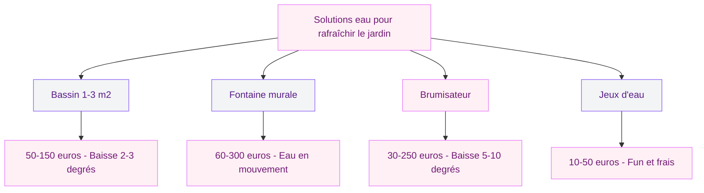
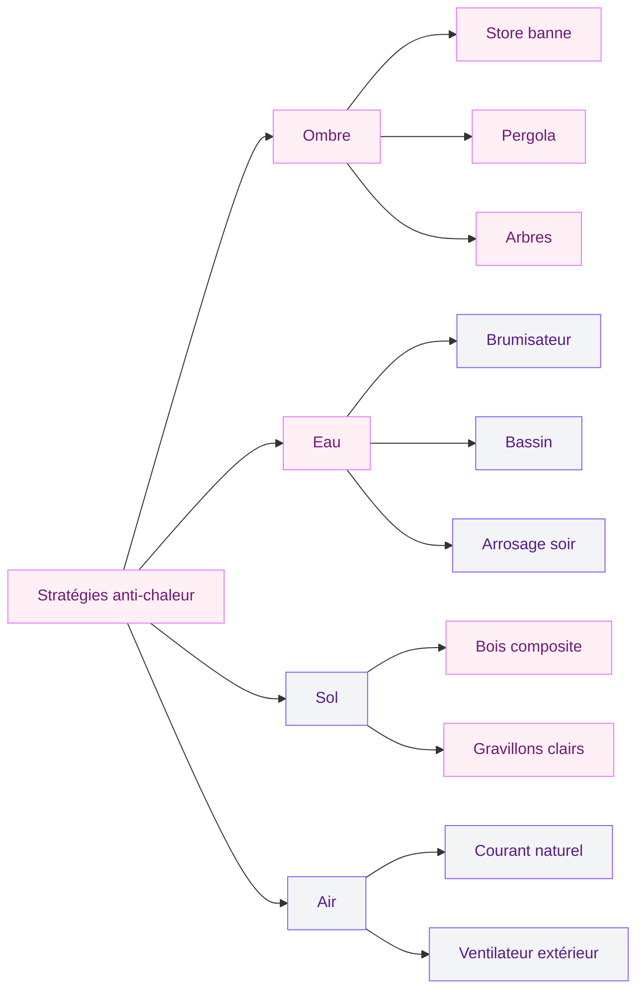
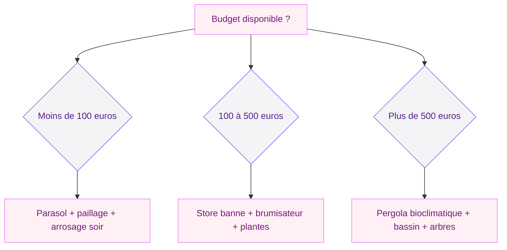

Il fait 38 degrés dehors et tu es barricadé à l'intérieur avec la clim. Ton jardin, ta terrasse, tu n'en profites plus pendant la canicule. C'est la situation de 90 % des gens.

Avec les bonnes astuces, tu peux transformer ton extérieur en zone de fraîcheur même au-dessus de 35 degrés. L'idée : combiner plusieurs solutions simples qui font baisser la température ressentie de 5 à 10 degrés. Voici 10 astuces avec des prix concrets.

## 1. Installer un store banne pour bloquer le soleil direct

Le store banne est ta première ligne de défense sur une terrasse collée à la maison. Il bloque les rayons avant qu'ils frappent le sol et les murs, et réduit la température de 5 à 8 degrés.

  

Un store manuel à manivelle démarre à 200 euros (3 mètres de large). Les versions motorisées avec capteur soleil et vent coûtent entre 800 et 2 000 euros.

Son avantage sur le parasol : il libère l'espace au sol. Pas de pied encombrant, et il protège la façade ce qui limite la chaleur à l'intérieur.

> [!TIP]
> Choisis une toile de store avec un indice UPF 50+ et une couleur claire (écru, sable, gris clair). Les couleurs foncées absorbent la chaleur au lieu de la rejeter.

Si tu cherches toutes les options d'ombrage possibles, j'ai déjà fait un [comparatif complet des 8 solutions pour ombrager ta terrasse](/ombrager-terrasse/) avec les vrais prix.

## 2. Créer de l'ombre naturelle avec des arbres

Les arbres sont les meilleurs climatiseurs naturels. Un arbre adulte fait baisser la température de 3 à 5 degrés sous sa canopée : les feuilles libèrent de l'eau qui, en s'évaporant, refroidit l'air ambiant.

  

Les meilleurs arbres pour créer de l'ombre rapidement dans un jardin :

- **Mûrier platane stérile** : port en parasol naturel, croissance rapide (50-70 cm par an), pas de fruits qui tachent. L'arbre idéal pour ombrager un coin repas.
- **Catalpa** : feuilles géantes en forme de coeur qui créent une ombre dense. Il pousse vite et atteint 8-10 mètres de haut.
- **Albizia** : silhouette élégante avec un feuillage léger et découpé qui filtre le soleil sans créer un noir total. Floraison rose en été.

Un jeune arbre en pépinière coûte 30 à 80 euros. Plante-le à 3-4 mètres de ta terrasse : en 3-4 ans, tu as un ombrage qui vaut n'importe quelle pergola.

## 3. Miser sur une pergola pour un espace protégé toute la saison

La pergola transforme une zone de ton extérieur en pièce de vie. Et quand il fait chaud, c'est l'espace où tout le monde se retrouve.

  

**Pergola classique** avec toile rétractable : à partir de 600 euros en kit. Tu gères l'ombre manuellement.

**Pergola bioclimatique** à lames orientables : les lames pivotent pour laisser passer l'air tout en bloquant le soleil direct. Prix : de 3 000 à 10 000 euros pose comprise. J'ai écrit un [guide complet sur la pergola bioclimatique](/la-pergola-bioclimatique-lalliance-parfaite-entre-esthetique-et-confort/) si tu veux creuser le sujet.

L'atout de la pergola, c'est la ventilation. L'air circule librement sous la structure. Combine-la avec un brumisateur et la température descend de 8 à 10 degrés par rapport au soleil direct.

## 4. Rafraîchir l'air avec des brumisateurs

Le principe est simple : l'eau propulsée en micro-gouttelettes s'évapore au contact de l'air chaud et rafraîchit la zone de 5 à 10 degrés.

  

**Brumisateur sur pied** : entre 80 et 250 euros, il se branche sur un robinet standard et couvre 10 à 20 m2. Consommation : 1 à 3 litres par heure.

**Rampe de brumisation** : tu fixes une ligne de buses le long de ta pergola ou sous un auvent. Kit à partir de 30 euros (6-8 buses sur 10 mètres). Un rideau de fraîcheur permanent sans se mouiller.

> [!NOTE]
> Les brumisateurs basse pression laissent des micro-gouttes qui peuvent mouiller légèrement. Les systèmes haute pression (à partir de 500 euros) produisent un brouillard sec qui rafraîchit sans mouiller du tout, comme dans les restaurants en terrasse.

## 5. Jouer avec l'eau : bassin, fontaine et jeux aquatiques

L'eau rafraîchit l'air par évaporation et crée une ambiance apaisante.

  

Un bassin de 1 à 3 m2 (30-40 cm de profondeur) fait baisser la température de 2 à 3 degrés. Bâche EPDM : 50 à 150 euros, bassin préformé : à partir de 80 euros. Ajoute une pompe solaire (20-40 euros) pour faire circuler l'eau.

Une fontaine murale ou sur pied produit de l'eau en mouvement, encore plus efficace. Prix : 60 à 300 euros.

Pour les familles, une pataugeoire ou un tapis à jets transforme le jardin en zone fraîche pour les enfants.

## 6. Choisir les bonnes plantes pour rafraîchir l'espace

Certaines plantes rafraîchissent activement l'air par évapotranspiration : elles absorbent l'eau par les racines et la libèrent par les feuilles, ce qui refroidit l'air ambiant.

Les plantes les plus efficaces pour un jardin frais en été :

- **Menthe** : en pot ou en pleine terre (attention, elle est envahissante), elle dégage une sensation de fraîcheur même par son odeur. Parfaite le long d'une terrasse.
- **Lavande** : très résistante à la chaleur et à la sécheresse, elle attire les pollinisateurs et parfume l'air. Peu d'arrosage nécessaire.
- **Agapanthe** : ses grandes tiges fleuries bleu-violet créent du volume et de l'ombre au sol. Elle aime le plein soleil.
- **Graminées ornementales** (miscanthus, pennisetum) : elles bougent avec le vent et créent une impression de légèreté et de mouvement frais dans le jardin.

Plante-les en masse autour de ta terrasse et le long des allées. Plus tu multiplies les plantes, plus l'effet est perceptible. Pour regrouper tes plantes, j'ai un [guide pas à pas pour fabriquer tes propres jardinières](/diy-jardiniere/).

> [!WARNING]
> Attention à l'arrosage en canicule : arrose tes plantes le soir après 20h ou tôt le matin avant 8h. Un arrosage en plein soleil gaspille jusqu'à 60 % de l'eau par évaporation immédiate et peut brûler le feuillage.

## 7. Adapter ton sol pour qu'il ne stocke pas la chaleur

Le sol joue un rôle majeur dans la température ressentie. Le béton et le carrelage foncé absorbent la chaleur et la restituent le soir.

Pour un sol qui reste frais :

- **Bois composite** : 15 degrés de moins en surface qu'un dallage béton au soleil. Prix : 30 à 80 euros le m2 pose comprise.
- **Gravillons clairs** : ils réfléchissent la lumière. Sac de 25 kg : 5 à 10 euros.
- **Gazon naturel** : jusqu'à 20 degrés de moins en surface par rapport au béton.

Si ton sol est en béton, pose un tapis d'extérieur en polypropylène (20 à 60 euros pour un 2x3 m) ou des caillebotis en bois.

## 8. Optimiser l'arrosage pour garder un jardin frais

Un jardin bien arrosé est un jardin frais. En canicule, arrose malin pour ne pas gaspiller.

**Arrosage automatique** : un programmateur (25-60 euros) branché sur ton robinet extérieur, réglé entre 21h et 6h. L'eau pénètre sans s'évaporer.

**Goutte-à-goutte** : idéal pour les massifs et les pots. Kit de base pour 20-30 plantes : 30 à 50 euros. L'eau arrive aux racines, zéro gaspillage.

**Paillage** : 5 à 10 cm de paillis autour des plantes réduisent l'évaporation de 40 à 70 %. Un sac de 50 litres coûte 5 à 8 euros.

> [!TIP]
> Récupère l'eau de pluie dans une cuve (200 à 1 000 litres, de 30 à 150 euros). En période de restrictions d'eau estivales, c'est ta réserve stratégique pour maintenir ton arrosage sans culpabiliser.

## 9. Choisir du mobilier qui ne brûle pas au soleil

Le mobilier joue un vrai rôle dans ton confort par forte chaleur.

**À privilégier** :
- L'aluminium avec assise en textilène (toile tendue ajourée) : léger, l'air passe à travers l'assise, la surface ne brûle pas. Une chaise en alu-textilène coûte 30 à 80 euros.
- Le bois (teck, acacia, pin traité) : il chauffe beaucoup moins que le métal. Mais il faut le protéger avec de l'huile pour éviter le grisaillement.
- La résine tressée : confortable et douce au toucher même au soleil. Un salon complet démarre à 300 euros.

**À éviter** :
- Le métal noir (fer forgé, acier peint foncé) : ça brûle littéralement la peau. Si tu en as déjà, pose des coussins clairs ou des housses dessus.
- Le plastique foncé : mêmes problèmes de surchauffe.

## 10. Créer des courants d'air naturels

L'air qui circule donne une sensation de frais même par temps chaud.

Place tes zones de vie (table, transats) dans le couloir de vent naturel de ton terrain : entre deux bâtiments, entre la maison et un mur, ou dans l'axe dominant du vent.

Si ton espace est fermé, un ventilateur d'extérieur sur pied (étanche IP44) crée un flux agréable pour 50 à 120 euros. Certains modèles intègrent un brumisateur pour un double effet frais.

Les haies basses et les claustras à lames orientent le vent sans le bloquer. L'idée, c'est de canaliser l'air vers tes zones de vie. Et pour prolonger tes soirées d'été, consulte le guide sur [l'éclairage extérieur sans fil](/installer-eclairage-exterieur-sans-fil/).

## Le plan d'action express pour cet été

Voici comment je prioriserais si je partais de zéro :

**Semaine 1** : installe un store banne ou un parasol déporté pour de l'ombre immédiate.

**Semaine 2** : ajoute un brumisateur sous ta zone ombragée. Ombre + brumisation, c'est le duo gagnant. Budget total : moins de 300 euros.

**Semaine 3** : paille tes massifs, ajoute des gravillons clairs sur le béton, plante de la menthe et de la lavande en pot.

**Automne suivant** : plante un arbre d'ombrage et, si le budget le permet, envisage une pergola. Investissements long terme pour profiter de ton jardin sans y penser.

> [!IMPORTANT]
> L'ADEME recommande de combiner au moins 3 stratégies (ombre, eau, végétation) pour obtenir un rafraîchissement significatif de l'espace extérieur. Une seule solution isolée ne suffit pas à contrer les 35 degrés et plus.

## Sur le meme theme

- [pergola ou tonnelle](/difference-pergola-tonnelle/)

## FAQ

### À quelle heure faut-il arroser son jardin en période de canicule ?

Arrose toujours le soir après 20h ou le matin avant 8h. L'arrosage en plein soleil fait évaporer jusqu'à 60 % de l'eau avant qu'elle atteigne les racines. L'arrosage nocturne laisse le temps à l'eau de pénétrer le sol et maintient la fraîcheur au niveau du sol pour le lendemain.

### Un brumisateur consomme-t-il beaucoup d'eau ?

Non. Un brumisateur basse pression consomme entre 1 et 3 litres d'eau par heure, soit moins qu'une chasse d'eau. Un système haute pression consomme encore moins car les gouttelettes s'évaporent entièrement. Sur 6 heures d'utilisation, tu dépenses environ 10 à 18 litres - bien moins qu'un arrosage de pelouse.

### Quel budget minimum pour rafraîchir une terrasse efficacement ?

Avec 100 euros, tu fais déjà une vraie différence : un parasol déporté d'entrée de gamme (50 euros), un kit de brumisation 6 buses (30 euros) et du paillage (20 euros). Pour un confort optimal, prévois 300 à 500 euros avec un store banne manuel, un brumisateur sur pied et quelques plantes en pot.

### Les pergolas bioclimatiques sont-elles efficaces contre la chaleur ?

Oui, c'est même leur point fort. Les lames orientables bloquent le soleil direct tout en laissant circuler l'air. La température sous une pergola bioclimatique peut être de 8 à 12 degrés inférieure au plein soleil. Combiné avec un brumisateur, c'est la solution la plus confortable pour profiter de son extérieur en canicule, mais le budget est élevé (3 000 à 10 000 euros).

### Quelles plantes résistent le mieux à la chaleur sans arrosage ?

La lavande, le romarin, les agapanthes et les graminées ornementales comme le miscanthus supportent très bien les fortes chaleurs avec un arrosage minimal (1 fois par semaine en été). Ce sont des plantes méditerranéennes adaptées aux étés prolongés sans pluie. Le secret : bien pailler leur pied pour garder l'humidité du sol.
