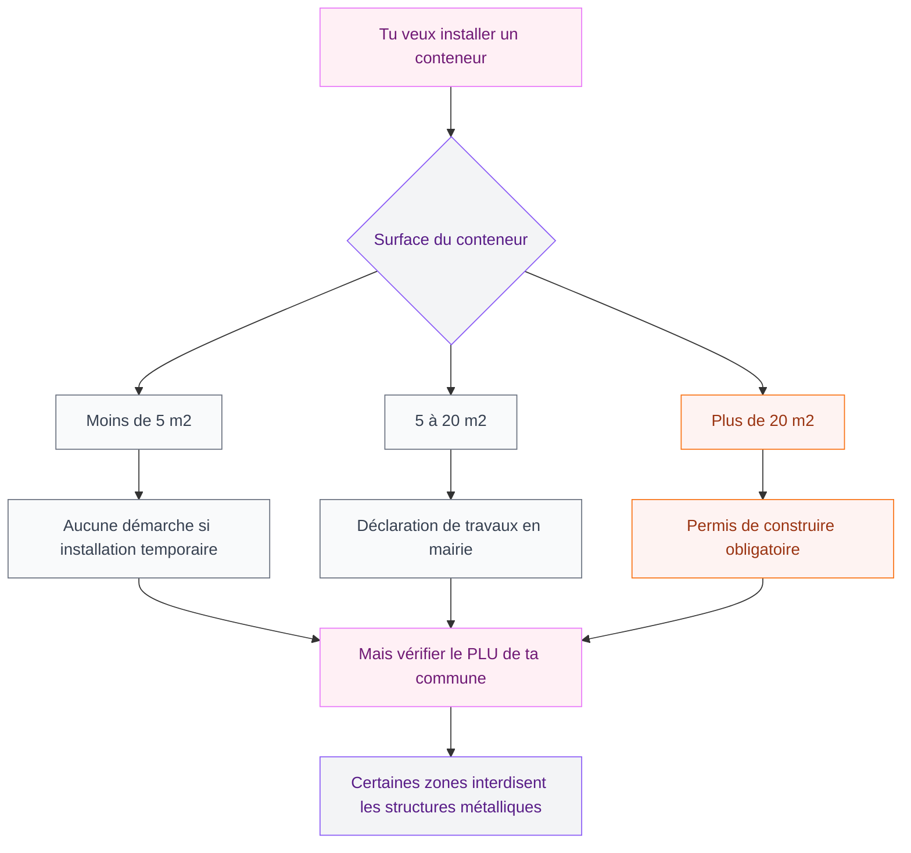

Un conteneur maritime dans le jardin, c'est le genre de projet qui fait lever un sourcil chez les voisins - et sourire deux ans plus tard quand ils voient le résultat. Ces grandes boites en acier qu'on croisait autrefois sur les quais de port ont complètement investi les jardins, les terrasses et les cours. Et franchement, c'est une des meilleures idées déco extérieures de ces dernières années.

Ce qui me plaît vraiment avec le conteneur maritime ? Il combine robustesse absolue, surface de personnalisation énorme et un look industriel-nature qui se marie super bien avec les jardins contemporains. Tu peux le peindre, le végétaliser, y percer des fenêtres, y coller un toit terrasse... Les possibilités sont larges.

Mais avant de te lancer, il y a des choses à savoir : les démarches administratives, les coûts réels, les pièges à éviter. Je t'explique tout.

## Pourquoi choisir un conteneur maritime plutôt qu'une construction classique ?

La réponse courte : parce que c'est plus rapide, souvent moins cher, et infiniment plus original.

<div class="my-8">
  
</div>


Un conteneur standard fait 20 pieds (environ 6 m de long pour 2,4 m de large) ou 40 pieds (12 m). Un 20 pieds donne environ 14 m2 utiles - ce qui correspond à un beau bureau de jardin, un atelier ou un espace détente confortable. La structure en acier corten est conçue pour résister aux conditions maritimes extrêmes, donc dans ton jardin, elle tiendra des décennies avec très peu d'entretien.

Autre avantage : la livraison et la pose se font en quelques heures. Une grue dépose ton conteneur exactement où tu le veux, et tu peux commencer l'aménagement le lendemain. Compare ça aux mois de travaux d'une construction traditionnelle.

> [!NOTE]
> Un conteneur maritime d'occasion en bon état coûte entre 1 500 et 3 500 euros selon la taille et l'état. Un conteneur neuf ou "one way" (utilisé une seule fois) est autour de 3 000 à 5 000 euros. Ajoute 200 à 500 euros pour la livraison selon ta région.

## Les 7 usages les plus malins pour ton jardin


<div class="my-8">
  
</div>

### 1. L'abri de jardin nouvelle génération

C'est l'usage le plus répandu, et le plus pratique. Oublie les abris en résine qui s'effondrent après trois hivers. Un conteneur reconverti en rangement jardin, ça tient des décennies.

Tu peux y stocker le mobilier de jardin, les outils, les vélos, la tondeuse - tout ce qu'on case habituellement dans un garage débordé. Pour l'aménagement intérieur, des étagères métalliques type Bror chez Ikea (à partir de 80 euros le module) s'intègrent parfaitement.

L'astuce : perce une porte piétonnière sur le côté pour faciliter l'accès quotidien, sans ouvrir les grandes portes coulissantes d'origine. Ça change la vie.

### 2. Le bureau de jardin

C'est LE projet qui explose depuis le télétravail. Un conteneur 20 pieds donne un bureau de 14 m2 parfaitement isolé du bruit de la maison. Pour l'aménagement, pense à l'isolation thermique et acoustique - c'est ce qui fait vraiment la différence entre un espace agréable et une boite surchauffée en été.

Pour un bureau fonctionnel, prévois : isolation par l'intérieur (laine de roche ou panneaux de mousse rigide), bardage intérieur en bois ou placos, climatisation réversible pour l'été, velux ou fenêtres coupées dans les parois pour la lumière naturelle.

Si tu es curieuse de voir ce que ça donne concrètement, j'ai écrit un article détaillé sur [les bureaux de jardin compacts et leurs limites](/bureau-de-jardin-de-5m2-un-mauvais-concept-qui-etait-cense-etre-sympa/) - avec les pièges à éviter et les vraies questions à se poser avant de commencer.

Budget bureau complet avec isolation et électricité : entre 5 000 et 12 000 euros selon les finitions.

### 3. L'atelier créatif ou l'espace hobby

Pour les peintres, les céramistes, les bricoleurs - avoir un atelier séparé de la maison, c'est changer de vie. Le sol original du conteneur en bois contreplaqué est parfait pour les ateliers. Tu peux le protéger avec de l'huile ou de la résine selon ton usage.

L'éclairage est important : prévois plusieurs spots orientables au plafond et si possible une grande baie vitrée sur un des côtés longs. Pour les activités manuelles, la lumière naturelle du nord est idéale - elle ne crée pas d'éblouissement.

### 4. La salle de jeux pour les enfants

Un conteneur transformé en cabane géante, c'est le rêve de 90% des enfants. Tu peux vraiment laisser libre cours à l'imagination : portholes dans les parois, peinture phosphorescente à l'intérieur, escalier de mezzanine pour gagner un espace de couchage...

> [!WARNING]
> Pour un espace destiné aux enfants, l'isolation thermique est encore plus importante que pour un adulte. Un conteneur non isolé peut atteindre 50 degrés en été - complètement inutilisable et dangereux. Prévois toujours une ventilation haute et basse, et idéalement une climatisation ou un brasseur d'air.

### 5. Le bar et l'espace barbecue couvert

Le conteneur fait une véranda de feu (sans mauvais jeu de mots). Avec les portes d'origine grand ouvertes sur le jardin, il crée une transition naturelle entre intérieur et extérieur. Tu peux y installer un vrai bar avec des tabourets hauts, un plan de travail en inox ou en béton ciré, et même un frigo encastré.

Pour le barbecue ou le foyer central, la clé c'est la ventilation : une ouverture en toit ou un conduit bien dimensionné. Revêts l'intérieur de carreaux réfractaires ou de plaques d'acier - ça protège la structure et l'esthétique est vraiment sympa.

### 6. L'espace piscine et détente

Deux conteneurs alignés avec une piscine hors-sol ou enterrée entre eux : c'est l'une des architectures les plus recherchées du moment. Les conteneurs servent de vestiaires, de douche extérieure, de rangement pour les équipements et de coin ombrage. Le rendu est super architecturé sans être froid.

Pour ce type de projet, tu peux t'inspirer de l'univers [maison container](/maison-container/) qui va bien plus loin dans l'intégration architecturale - certains propriétaires construisent des maisons entières avec des conteneurs empilés.

### 7. Le foyer et la salle de feu

L'idée la plus atypique : un foyer central installé au milieu d'un conteneur, avec des banquettes en béton ou en bois tout autour. Des coussins, des plaids, une ouverture en lanterneau dans le toit pour le tirage et l'évacuation de la fumée.

C'est le genre d'espace qui fait de ton jardin un lieu de vie quatre saisons - même par 5 degrés dehors, tu peux recevoir dans ton conteneur-foyer avec une ambiance de chalet scandinave.

## La réglementation : ce qu'il faut vraiment savoir

C'est LE point que beaucoup de gens ignorent et qui peut créer de vrais problèmes. En France, la réglementation varie selon la surface et la durée d'installation.

<div class="my-8">
  
</div>




La règle générale : un conteneur 20 pieds fait environ 14 m2, donc tu es dans la case "déclaration de travaux". C'est une démarche simple, mais elle prend du temps (environ 1 mois de délai légal). Dépose-la bien en avance.

> [!IMPORTANT]
> Vérifie toujours le Plan Local d'Urbanisme (PLU) de ta commune avant d'acheter le conteneur. Certaines zones - notamment les zones agricoles ou proches de monuments historiques - peuvent interdire ou limiter ce type d'installation, même en dessous de 20 m2.

## Les étapes clés pour un projet réussi

```mermaid
flowchart LR
    A["1. Définir l'usage"] --> B["2. Choisir la taille"]
    B --> C["3. Vérifier le PLU + permis"]
    C --> D["4. Préparer le terrain"]
    D --> E["5. Livraison et pose"]
    E --> F["6. Isolation et électricité"]
    F --> G["7. Finitions et déco"]

<div class="my-8">
  
</div>


    style A fill:#FFF0F5,stroke:#E879F9,color:#701A75
    style B fill:#FFF0F5,stroke:#E879F9,color:#701A75
    style C fill:#FEF3F2,stroke:#F97316,color:#9A3412
    style D fill:#F3F4F6,stroke:#8B5CF6,color:#581C87
    style E fill:#F3F4F6,stroke:#8B5CF6,color:#581C87
    style F fill:#F9FAFB,stroke:#6B7280,color:#374151
    style G fill:#FFF0F5,stroke:#E879F9,color:#701A75
```

**Préparer le terrain** : le conteneur a besoin d'un sol stable et de niveau. Les solutions les plus courantes sont les plots béton (4 à 6 selon la taille), une dalle béton, ou des semelles sur graviers compactés. Évite de poser directement sur la terre - le sol peut se tasser et déformer la structure.

**L'isolation** : c'est le poste où tu ne dois pas lésiner. Un conteneur non isolé est un four en été et un congélateur en hiver. Les deux solutions les plus efficaces sont la mousse projetée polyuréthane (couche homogène, très performante, mais à faire poser par un pro) et les panneaux de laine de roche rigide (plus accessible en DIY).

**L'électricité** : fais appel à un électricien agréé. Pour un abri de jardin, un simple circuit avec quelques prises et un éclairage suffit. Pour un bureau ou un espace de vie, prévois un tableau dédié avec disjoncteur différentiel, et une ligne dédiée depuis ton tableau principal.

## Les finitions qui font vraiment la différence

Peindre ton conteneur change complètement son look. Les conteneurs en acier corten rouillent naturellement - et c'est beau sur certains projets industriels - mais pour un jardin résidentiel, une peinture mate en teinte terre ou anthracite s'intègre beaucoup mieux.

<div class="my-8">
  
</div>


Les marques de peinture métal extérieure que je recommande : Rust-Oleum (disponible chez Leroy Merlin, autour de 40 euros le litre) ou les gammes pro de Sikkens. Prépare bien la surface avec un primaire antirouille avant d'appliquer la couche de finition.

Pour intégrer le conteneur dans le jardin, quelques plantes grimpantes font des merveilles. Une glycine ou une vigne vierge plantée à la base s'accroche naturellement sur les parois en quelques saisons. Tu peux aussi poser des bacs de plantes sur le toit si la structure le permet (elle le permet toujours - les conteneurs sont conçus pour être empilés avec des tonnes de charge).

> [!TIP]
> Pour le sol autour du conteneur, évite le béton nu - c'est froid et ça durcit l'ensemble. Préfère des dalles de terrasse en béton ciré, des lames de bois composite ou du gravier décoratif. Ça crée une transition naturelle entre le conteneur et le jardin.

Et si tu aimes cuisiner en extérieur, le conteneur peut aussi accueillir un vrai coin cuisine d'été, voire [un four à pizza fait maison](/fabriquer-four-a-pizza/) dans l'espace adjacent - le genre de projet qui transforme définitivement ton jardin en lieu de vie.

## Budget global selon les projets

| Projet | Budget moyen |
|--------|-------------|
| Abri de jardin simple | 3 000 - 5 000 euros |
| Bureau isolé avec électricité | 7 000 - 15 000 euros |
| Espace de vie (bar, détente) | 10 000 - 25 000 euros |
| Projet architectural complet | 20 000 euros et plus |

Ces fourchettes incluent le conteneur, la pose, l'isolation de base et les finitions. Elles excluent les permis et études de sol spécifiques.

> [!NOTE]
> Un conteneur d'occasion "en bon état" peut présenter des traces de rouille superficielle ou des légères déformations - c'est normal et ça n'affecte pas la solidité. Vérifie surtout l'étanchéité du toit et l'absence de trous ou de déformations importantes dans les parois.

Le conteneur maritime au jardin, c'est ce genre de projet qui fait peur au départ (c'est grand, c'est en métal, ça demande des démarches) et dont on est super fier une fois terminé. La combinaison de robustesse, de flexibilité d'usage et de rendu visuel fort en fait une solution que je recommande vraiment à quiconque cherche à créer un espace supplémentaire original sans construction lourde.

Prends le temps de bien définir l'usage avant tout - c'est lui qui déterminera tous tes choix d'aménagement. Et n'hésite pas à t'inspirer de ce que font d'autres avec des matériaux détournés : le bricolage créatif et l'aménagement extérieur vont souvent très bien ensemble.

---


## Sur le meme theme

- [jardins intérieurs modernes](/jardins-interieurs-modernes-photos-et-conseils-de-conception/)
- [jardins et cours mexicains](/jardins-et-cours-mexicains-images-et-idees-pour-linspiration/)

## Questions fréquentes

**Un conteneur maritime est-il autorisé dans tous les jardins ?**
Non. Tu dois vérifier le PLU de ta commune. Certaines zones (agricoles, protégées, près de monuments historiques) peuvent l'interdire. Pour une surface supérieure à 20 m2, un permis de construire est obligatoire. Pour 5 à 20 m2, une déclaration de travaux en mairie suffit en général.

**Combien de temps dure un conteneur maritime dans un jardin ?**
Un conteneur en acier corten correctement entretenu peut tenir 25 à 50 ans sans problème majeur. Avec une bonne peinture et une ventilation adéquate, la durabilité est très supérieure à celle de la plupart des abris de jardin classiques.

**Est-ce qu'un conteneur nécessite des fondations ?**
Pas obligatoirement. Dans la plupart des cas, 4 à 6 plots béton bien positionnés sous les coins et les points de charge suffisent. Une dalle béton est recommandée pour les projets avec usage régulier ou pour les conteneurs isolés et chauffés.

**Peut-on mettre un conteneur sur une terrasse existante ?**
Ça dépend de la capacité portante de la terrasse. Un conteneur vide pèse entre 2 et 4 tonnes selon la taille. Une terrasse en dalle béton au sol peut généralement le supporter, mais une terrasse sur pilotis ou surélevée nécessite un contrôle structurel avant.

**Quelle est la meilleure saison pour poser un conteneur ?**
Printemps ou automne, quand le sol n'est ni gelé ni détrempé. Évite les périodes de forte pluie pour les travaux de préparation du terrain et les finitions extérieures.
