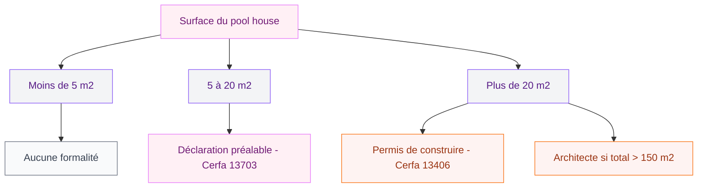
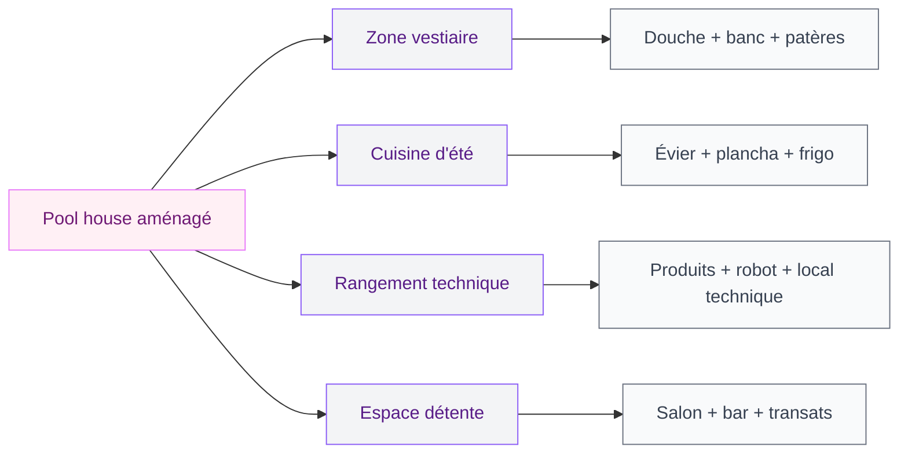

Tu as une piscine (ou tu en prévois une) et tu te dis qu'un petit espace couvert juste à côté, ça serait le rêve ? Un endroit pour ranger les serviettes, se changer sans traverser tout le jardin en maillot, et pourquoi pas poser un bar d'été avec frigo ? C'est exactement à ça que sert un pool house - et c'est plus accessible que tu ne le penses.

Que tu partes sur une petite structure de 10 m2 ou un vrai pavillon avec cuisine d'été, je t'explique tout : démarches, matériaux, budget réaliste et erreurs à éviter. Parce qu'un pool house mal conçu, c'est de l'argent jeté par la fenêtre.

## Pourquoi un pool house change tout

On pourrait se dire "c'est un luxe". Mais en réalité, une fois que tu l'as, tu te demandes comment tu faisais avant. Le pool house résout plusieurs problèmes du quotidien estival.

  

**Fini les allers-retours dans la maison.** Les serviettes mouillées qui traversent le salon, les pieds trempés sur le parquet, les invités qui cherchent les toilettes... Avec un pool house, tout reste dehors. L'intérieur de ta maison reste propre et sec.

**Un vrai espace de rangement dédié.** Les produits de traitement, le robot de piscine, les bouées, les matelas gonflables - tout ça a besoin d'un toit. Plutôt que d'encombrer ton garage, tu stockes à deux pas du bassin.

**Un coin repas et détente protégé.** Quand le soleil tape trop fort ou qu'une averse surprise débarque en plein barbecue, tu as un abri. Et si tu prévois un bar ou une plancha, ça devient le spot préféré de tous tes invités.

> [!TIP]
> Un pool house bien conçu augmente la valeur de ta propriété de 5 à 15 % selon les estimations des agents immobiliers. C'est un investissement, pas juste une dépense.

## Les démarches administratives : ce qu'il faut savoir

C'est le sujet le moins glamour, mais c'est par là qu'il faut commencer. Selon la taille de ta construction, les obligations changent.

  

**Moins de 5 m2 au sol** : aucune formalité en général (sauf zone protégée, ABF, etc.). Tu construis librement.

**Entre 5 et 20 m2** : une déclaration préalable de travaux suffit. C'est un formulaire Cerfa 13703 à déposer en mairie. Délai d'instruction : 1 mois en moyenne.

**Plus de 20 m2** : il te faut un permis de construire (Cerfa 13406). Délai : 2 à 3 mois. Et si la surface totale de ta propriété (maison + pool house + annexes) dépasse 150 m2 après travaux, tu dois obligatoirement passer par un architecte.

> [!WARNING]
> En zone PLU (Plan Local d'Urbanisme), des règles spécifiques s'appliquent : distances de recul par rapport aux limites de propriété, emprise au sol maximale, hauteur limite. Passe en mairie consulter le PLU AVANT de dessiner quoi que ce soit.

Petit point souvent oublié : la taxe d'aménagement. Elle est calculée sur la surface créée et varie selon ta commune. Pour un pool house de 20 m2, compte entre 400 et 1 200 euros selon la localisation.

## Quel type de pool house choisir ?

Il n'y a pas un seul modèle. Ton choix dépend de ton budget, de ton terrain et de ce que tu veux en faire.

  

### Le pool house ouvert (pergola aménagée)

C'est la version la plus légère : une structure avec un toit, mais sans murs ou avec un seul côté fermé. Le reste est ouvert sur le jardin et la piscine. C'est idéal si tu veux surtout un coin ombragé avec une cuisine d'été, sans investir dans un vrai bâtiment clos.

Budget : 3 000 à 10 000 euros pour une structure en bois de 15 à 25 m2, hors aménagement intérieur. Si tu cherches l'option couverte et architecturale, regarde du côté des [pergolas bioclimatiques](/la-pergola-bioclimatique-lalliance-parfaite-entre-esthetique-et-confort/) qui se marient bien avec un espace piscine.

### Le pool house fermé en dur

Murs en parpaing ou en béton, toiture classique (tuiles, bac acier, toit plat végétalisé). C'est un vrai petit bâtiment autonome. Tu peux y installer une salle d'eau complète, une cuisine, un coin salon, et même un espace de stockage technique pour le local de la piscine.

Budget : 15 000 à 50 000 euros selon les finitions et la taille (15 à 40 m2). La fourchette est large parce que les finitions font exploser le ticket - carrelage, plomberie, électricité, menuiseries.

### Le pool house en bois (kit ou sur-mesure)

C'est l'option qui a le vent en poupe. Les fabricants proposent des kits livrés en panneaux pré-montés que tu peux poser toi-même sur une dalle béton. Les marques comme Abri Bois France, Chalets & Jardin ou encore TerrasSol ont des catalogues bien fournis avec des modèles entre 10 et 30 m2.

Budget kit : 5 000 à 18 000 euros hors dalle et aménagement. Ajoute 2 000 à 4 000 euros pour la dalle béton selon la surface.

### Le pool house container

Pour un look industriel et moderne, certains recyclent un container maritime transformé. C'est solide, rapide à poser et original. Ça s'intègre bien si ta maison a un [style contemporain avec des lignes nettes](/maisons-modernes-2026-images-dexterieur-et-dinterieur/). En revanche, il faut bien traiter l'isolation thermique pour éviter l'effet "four" en été.

Budget : 8 000 à 25 000 euros selon le niveau de transformation.

## Les matériaux : faire les bons choix

L'environnement piscine est agressif pour les matériaux. L'humidité permanente, les éclaboussures chlorées, les UV... Tout s'abîme plus vite qu'ailleurs. Voici ce qui tient la route.

  

### Pour la structure

- **Bois traité autoclave classe 4** : résiste à l'humidité permanente et au contact avec le sol. Pin sylvestre traité, douglas ou mélèze naturellement imputrescible sont de bons choix. Lasure tous les 2-3 ans pour garder l'aspect.
- **Aluminium thermolaqué** : zéro entretien, ne rouille pas, ne se déforme pas. Plus cher à l'achat (comptez +30 % par rapport au bois), mais tu ne le touches plus pendant 20 ans.
- **Maçonnerie classique** (parpaing + enduit) : le plus durable et le plus polyvalent. Tu peux tout y intégrer (isolation, électricité, plomberie). C'est le choix pour un pool house habitable toute l'année.

### Pour le sol

Oublie le bois naturel au sol pour un pool house - trop glissant quand c'est mouillé, trop d'entretien. Les meilleurs choix :

- **Carrelage extérieur antidérapant R11** (grès cérame) : 25 à 55 euros le m2, très résistant, facile à nettoyer.
- **Béton ciré ou béton taloché** : 50 à 120 euros le m2 posé, rendu très moderne.
- **Dalles composites** : 30 à 60 euros le m2, imitent le bois sans les inconvénients.

> [!NOTE]
> Pour le revêtement de sol en zone humide, assure-toi que le classement antidérapant est au minimum R11. C'est indiqué sur la fiche technique de chaque produit. Si tu hésites, notre guide sur la [sécurisation des terrasses](/renovez-votre-terrasse-pour-la-securite/) détaille bien les normes.

### Pour la toiture

Un toit plat (avec légère pente de 2 à 5 % pour l'écoulement) donne un look très contemporain. L'étanchéité se fait en membrane EPDM ou en bac acier. Un toit en pente classique est plus simple à réaliser soi-même et offre un meilleur écoulement naturel.

## Aménager l'intérieur : les indispensables

Un pool house vide, ça ne sert pas à grand-chose. Voici les aménagements qui font la différence au quotidien.

  

### Le vestiaire et la douche

C'est la base. Un espace pour se changer avec des patères, un banc, un miroir. Et idéalement une douche - même juste un pommeau avec eau froide raccordé au réseau d'arrosage. Pour une vraie douche eau chaude, prévois un petit chauffe-eau instantané (Stiebel Eltron ou Atlantic, entre 150 et 300 euros).

### La cuisine d'été

Un plan de travail en inox ou en béton, un évier avec arrivée d'eau, une plancha ou un barbecue intégré, un mini-frigo. C'est le combo gagnant. Ikea propose la gamme SUNNERSTA (plan de travail + étagères) à partir de 130 euros - pas le plus solide pour l'extérieur, mais ça dépanne.

Pour du plus costaud, regarde les modules de cuisine extérieure chez Leroy Merlin (gamme Naterial, à partir de 500 euros le module) ou chez Weber pour les intégrations barbecue.

### Le rangement technique

Un mur entier dédié au rangement : étagères pour les produits piscine, crochets pour l'épuisette et le balai, espace au sol pour le robot nettoyeur. Si ton local technique piscine (pompe, filtre, électrolyseur) est dans le pool house, prévois une ventilation correcte - ces équipements dégagent de la chaleur et parfois des vapeurs.

### L'espace détente

Si la surface le permet, un petit salon avec fauteuils ou banquette fait toute la différence. Pas besoin de meubles d'intérieur classiques - privilégie du mobilier outdoor résistant aux UV et à l'humidité. La gamme JUTHOLMEN d'Ikea (canapé extérieur à 449 euros) tient bien dans le temps. Chez Maisons du Monde, la collection Oahu propose aussi des ensembles complets autour de 700 euros.

## Électricité et plomberie : ce qu'il faut prévoir

### L'électricité

Un pool house a besoin au minimum :
- D'un tableau divisionnaire dédié, raccordé au tableau principal de la maison
- De prises étanches (norme IP44 minimum) pour le frigo, la plancha électrique, les éclairages
- D'un éclairage extérieur pour les soirées (spots encastrés, guirlandes raccordées)

Budget électricité : entre 1 500 et 3 500 euros en faisant appel à un électricien. Si tu récupères l'eau de pluie pour ta piscine avec une pompe de relevage, la partie électrique doit être dimensionnée en conséquence - j'en parle en détail dans [le guide sur la récupération d'eau de piscine](/recuperation-eau-piscine/).

> [!IMPORTANT]
> Toute installation électrique dans un pool house doit respecter la norme NF C 15-100. C'est obligatoire et ça conditionne ton assurance habitation. Un circuit non conforme, c'est un sinistre non couvert en cas de problème.

### La plomberie

Si tu veux un évier et une douche, il te faut :
- Une arrivée d'eau depuis le réseau principal (tranchée à creuser)
- Une évacuation des eaux usées raccordée à ton système d'assainissement
- Un chauffe-eau si tu veux de l'eau chaude

Budget plomberie : 800 à 2 500 euros selon la complexité (distance au réseau, nombre de points d'eau).

## Budget global : combien ça coûte vraiment ?

Voici une synthèse réaliste pour un pool house de 20 m2 avec vestiaire, douche et coin cuisine :

| Poste | Fourchette basse | Fourchette haute |
|-------|-----------------|-----------------|
| Dalle béton | 2 000 euros | 4 000 euros |
| Structure (bois kit) | 5 000 euros | 12 000 euros |
| Toiture et étanchéité | 1 500 euros | 4 000 euros |
| Revêtement de sol | 600 euros | 1 500 euros |
| Électricité | 1 500 euros | 3 500 euros |
| Plomberie | 800 euros | 2 500 euros |
| Aménagement intérieur | 2 000 euros | 6 000 euros |
| **Total** | **13 400 euros** | **33 500 euros** |

Pour un pool house en maçonnerie avec des finitions soignées, monte à 40 000 - 60 000 euros. Et pour du haut de gamme avec architecte, ça peut dépasser les 80 000 euros.

Mon conseil : commence par lister tes vrais besoins. Un pool house de 15 m2 bien pensé vaut mieux qu'un de 30 m2 bâclé. Le vestiaire + douche + rangement, c'est la base. La cuisine d'été et le salon, c'est le bonus si le budget suit.

## Les erreurs à éviter

**Ne pas penser à l'orientation.** Place ton pool house de manière à créer de l'ombre sur la zone que tu veux protéger du soleil, sans masquer la vue depuis ta maison sur la piscine. L'idéal : côté ouest ou sud-ouest, face à la piscine.

**Sous-dimensionner les fondations.** Même pour une structure légère en bois, une dalle béton de 10-12 cm sur hérisson de graviers est le minimum. Sinon, ça bouge, ça fissure, et au bout de 3 ans c'est la catastrophe.

**Oublier la ventilation.** L'humidité est l'ennemi numéro un d'un pool house. Sans aération correcte, tu vas avoir de la moisissure sur les murs avant la fin du premier été. Prévois au minimum deux ouvertures opposées pour créer un courant d'air naturel.

**Négliger l'éclairage extérieur.** Tu vas utiliser ton pool house surtout en fin de journée et en soirée. Des spots encastrés dans la toiture, des appliques murales étanches et une guirlande lumineuse bien placée transforment l'ambiance.

**Poser le pool house trop loin de la piscine.** L'idéal, c'est entre 3 et 8 mètres du bassin. Assez près pour être pratique, assez loin pour ne pas gêner la circulation autour de la piscine et éviter les projections d'eau constantes sur la structure.

## Sur le meme theme

- [couleurs facades maison 2026](/couleurs-pour-les-exterieurs-et-les-facades-de-maisons-2026/)

## FAQ

**Faut-il un permis de construire pour un pool house ?**
Ça dépend de la surface. Moins de 5 m2, aucune formalité. Entre 5 et 20 m2, une déclaration préalable. Au-delà de 20 m2, un permis de construire est obligatoire. En zone protégée, les seuils peuvent être plus restrictifs.

**Combien coûte un pool house de 20 m2 ?**
Entre 13 000 et 35 000 euros pour une version bois avec vestiaire, douche et coin cuisine. En maçonnerie avec finitions soignées, prévois 40 000 à 60 000 euros. Le prix varie beaucoup selon les matériaux et le niveau d'aménagement intérieur.

**Peut-on construire un pool house soi-même ?**
Oui, surtout avec un kit en bois. La dalle béton et la pose de la structure sont accessibles pour un bon bricoleur. En revanche, l'électricité doit être réalisée par un professionnel certifié pour respecter la norme NF C 15-100. La plomberie aussi est plus simple à confier à un pro pour garantir le raccordement à l'assainissement.

**Quelle distance entre le pool house et la piscine ?**
L'idéal se situe entre 3 et 8 mètres du bassin. Trop près, tu subis les éclaboussures et tu gênes la circulation. Trop loin, tu perds l'aspect pratique du vestiaire et du rangement à proximité. Pense aussi aux règles de recul par rapport aux limites de propriété dans ton PLU.
