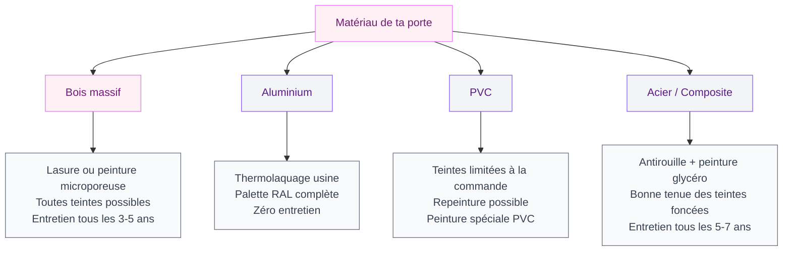
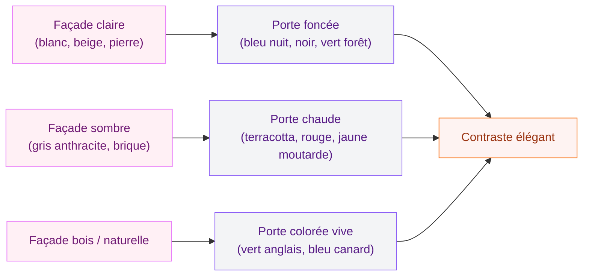

# Couleur porte d'entrée : comment bien choisir pour sublimer ta façade

Ta porte d'entrée, c'est la première chose que les gens voient en arrivant chez toi. Et pourtant, on y pense souvent en dernier - après la façade, les volets, le jardin. Résultat : un gris anonyme ou un blanc "par défaut" qui ne fait rien pour ta maison. Dommage, parce qu'une porte bien colorée, ça change tout. Ça donne du caractère, ça crée une ambiance, et ça peut même booster la valeur de ton bien.

Que ta porte soit en bois, en alu, en PVC ou en acier, la couleur que tu choisis doit raconter quelque chose. Elle doit coller avec ta façade, s'harmoniser avec tes menuiseries, et surtout te plaire à toi. Parce que c'est toi qui la vois chaque jour en rentrant du boulot.

Allez, je t'aide à trouver LA bonne teinte.

## Les couleurs tendance pour les portes d'entrée en 2026

### Les verts nature : le grand favori

Le vert est la couleur star de 2026 pour les portes extérieures. Vert sauge, vert olive, vert anglais, vert forêt - chaque nuance a son ambiance. Le vert sauge, doux et grisé, fonctionne sur à peu près tous les styles de maison. Le vert anglais (plus soutenu, presque bouteille) donne un côté chic et intemporel.

Chez Farrow & Ball, la teinte "Calke Green" (No.34) est un best-seller pour les portes d'entrée, à environ 95 EUR le litre. Plus accessible, Dulux Valentine propose "Vert Amande" dans sa gamme "Couleurs du Monde" autour de 35-45 EUR les 2,5L. Et si tu veux un vert profond ultra élégant, la teinte "Studio Green" de Farrow & Ball est un coup de coeur absolu.

> [!TIP]
> Teste toujours ta couleur sur un échantillon collé directement sur ta porte. La lumière naturelle change complètement le rendu - un vert qui paraissait parfait sur le nuancier en magasin peut virer au kaki terne une fois dehors.

### Le bleu nuit et le bleu marine : l'élégance discrète

Le bleu foncé reste une valeur sûre, surtout sur les maisons aux façades claires (blanc cassé, pierre, enduit sable). Un bleu marine bien choisi dégage un charme fou - ça fait un peu "cottage anglais" sans en faire trop.

Chez Little Greene, la teinte "Basalt" (environ 80 EUR le litre) est une merveille. Pour un budget plus serré, Tollens propose "Bleu Abysse" dans sa gamme extérieure à environ 40-50 EUR les 2,5L. Le bleu canard, un peu plus vert et lumineux, marche aussi très bien si ta façade est dans des tons chauds.

### Le noir : audacieux et graphique

Le noir sur une porte d'entrée, c'est le choix qui fait peur mais qu'on ne regrette jamais. Ça apporte un contraste net, une allure contemporaine, et ça se marie avec absolument tout : façade blanche, grise, en pierre, en bois, en brique. Le noir, c'est le couteau suisse des couleurs de porte.

La référence à retenir : "Railings" de Farrow & Ball (un noir légèrement bleuté, 95 EUR/L) ou "Noir Carbone" de V33 dans la gamme "Climats Extrêmes" (environ 55-65 EUR les 2,5L). L'avantage du noir en extérieur, c'est qu'il vieillit bien et masque les petites salissures du quotidien.

> [!NOTE]
> Le noir absorbe la chaleur. Si ta porte est exposée plein sud et sans auvent, elle peut chauffer en été. Pense à une teinte noir mat plutôt que brillante pour limiter l'effet, ou choisis un noir légèrement adouci (type gris anthracite très foncé).

### Les teintes terracotta et ocre : la chaleur méditerranéenne

Si tu as une maison dans le sud, une bastide, ou simplement une façade aux tons chauds, les couleurs terracotta et ocre sont tes alliées. Un rouille doux, un terre de Sienne, un rose ancien - ces teintes apportent une chaleur immédiate et s'intègrent dans le paysage comme si elles avaient toujours été là.

Pour retrouver les tendances complètes sur les tons chauds en façade, jette un oeil à notre guide sur les [couleurs pour les extérieurs et les façades de maisons 2026](/guides/exterieur/couleurs-pour-les-exterieurs-et-les-facades-de-maisons-2026/).

### Le rouge classique et le bordeaux

Le rouge vif sur une porte d'entrée, c'est un grand classique anglo-saxon qui fonctionne aussi chez nous. Pas un rouge pompier, hein - un rouge profond, tiré vers le bordeaux ou le lie-de-vin. Ça donne du peps sans agresser, surtout sur une façade claire ou en pierre.

## Choisir selon le matériau de ta porte

Le matériau de ta porte influence directement le rendu de la couleur et le type de peinture à utiliser. Voici un tour d'horizon pour t'y retrouver.

### Porte en bois

Le bois, c'est le support le plus agréable à peindre et le plus polyvalent. Tu peux tout faire : garder le bois naturel avec une lasure teintée, opter pour une peinture opaque colorée, ou même jouer avec des effets patinés. Le bois absorbe la peinture différemment selon l'essence (chêne, sapin, meranti), donc le rendu sera toujours un peu unique.

Pour une porte en bois extérieure, choisis une peinture microporeuse qui laisse le bois respirer. Chez Bondex, la gamme "Bois Extérieur" est un bon rapport qualité-prix (30-40 EUR les 2,5L). Xylophène propose aussi une lasure opaque qui couvre bien tout en protégeant le bois, autour de 35-50 EUR les 2,5L.

### Porte en aluminium

L'alu, c'est un peu différent. La couleur est généralement appliquée en usine par thermolaquage - un procédé ultra résistant. Tu choisis ta teinte dans le nuancier RAL au moment de la commande. Les fabricants comme Bel'M, K-Line ou Zilten proposent des gammes de 20 à 40 coloris standard, et tu peux aller sur du RAL sur mesure pour un supplément (souvent 100 à 200 EUR).

Si tu veux repeindre une porte alu existante, c'est possible mais il faut une sous-couche d'accroche spécifique (type Julien "Sous-couche métaux non ferreux", environ 25 EUR le litre).

### Porte en PVC

Le PVC offre moins de latitude couleur que l'alu, mais les gammes s'élargissent chaque année. Les teintes bois (chêne doré, chêne foncé, noyer) et les classiques (blanc, gris anthracite, noir) sont disponibles chez la plupart des fabricants. Et oui, on peut repeindre du PVC avec une peinture adaptée - V33 fait une "Peinture PVC" à environ 40 EUR le litre qui tient bien.

> [!WARNING]
> Ne mets jamais une couleur très foncée sur une porte PVC d'entrée de gamme. Le PVC bas de gamme peut se déformer sous l'effet de la chaleur absorbée par les teintes sombres. Vérifie que ton modèle est compatible avant de passer au noir ou au bleu nuit.

## L'harmonie avec ta façade : les règles qui marchent

La porte d'entrée ne vit pas en solo. Elle fait partie d'un ensemble avec la façade, les volets, les fenêtres, le toit et même la boîte aux lettres. Voici comment créer une harmonie qui fonctionne.

### Le contraste maîtrisé

La règle la plus simple : ta porte doit se démarquer de ta façade, mais sans hurler. Si ta façade est claire (blanche, beige, sable), une porte foncée (bleu marine, vert forêt, noir) crée un point focal élégant. À l'inverse, sur une façade sombre (gris anthracite, brique foncée), une porte dans un ton plus clair ou plus chaud attire le regard sans créer de conflit visuel.

### Le rappel chromatique

Un truc qui marche à tous les coups : rappeler la couleur de ta porte sur un autre élément de ta façade. Tes volets dans le même ton que ta porte, ou ta gouttière, ou les bacs à fleurs du perron. Ce rappel crée une unité visuelle très agréable.

### Les associations par style de maison

- **Maison contemporaine** (façade blanche, toit plat) : noir, gris anthracite, bleu nuit, vert forêt. Si tu veux en savoir plus sur ce style, notre guide sur les [maisons modernes 2026](/guides/exterieur/maisons-modernes-2026-images-dexterieur-et-dinterieur/) te donnera plein d'idées.
- **Maison traditionnelle** (enduit, tuiles) : vert anglais, bordeaux, bleu marine, gris moyen.
- **Maison en pierre** : rouge brique, vert sauge, bleu ardoise, noir avec ferronneries.
- **Maison en brique** : jaune moutarde, vert olive, bleu canard, noir.
- **Maison provençale** : bleu lavande, terracotta, ocre, vert olivier.

## Peindre ta porte d'entrée : le guide pratique

Si tu décides de repeindre ta porte toi-même, voici la marche à suivre. C'est un projet accessible, même pour une débutante en bricolage.

### Le matériel nécessaire

- Papier de verre grain 120 puis 240
- Sous-couche adaptée au matériau (bois, métal ou PVC)
- Peinture extérieure satinée ou mate (2 couches minimum)
- Rouleau laqueur mousse + pinceau à réchampir pour les moulures
- Scotch de masquage + bâche de protection
- Dégraissant (type Saint-Marc)

Budget matériel complet : compte entre 60 et 120 EUR selon la peinture choisie.

### Les étapes clés

1. **Démonte la porte si possible** - c'est plus simple de peindre à plat, et le résultat sera plus propre
2. **Ponce légèrement** la surface pour que la peinture accroche
3. **Dégraisse** au Saint-Marc ou à l'acétone (pour PVC et alu)
4. **Applique la sous-couche** - ne saute surtout pas cette étape, c'est elle qui garantit la tenue
5. **Première couche de couleur** - laisse sécher le temps indiqué sur le pot (en général 4 à 6 heures)
6. **Deuxième couche** - toujours dans le même sens pour éviter les traces de rouleau
7. **Remonte la porte** quand c'est bien sec (attend 24 heures idéalement)

> [!TIP]
> Peins ta porte un jour couvert et sec, entre 10 et 25 degrés. La peinture ne sèche pas bien en plein soleil (elle "tire" et laisse des marques) ni quand il fait trop froid. Le printemps et l'automne sont les meilleures saisons pour ce type de projet.

### L'entretien pour garder une belle couleur

Une porte d'entrée exposée aux éléments a besoin d'un petit coup de pouce régulier. Un nettoyage à l'eau savonneuse deux fois par an suffit pour la plupart des matériaux. Pour le bois, prévois une nouvelle couche de lasure ou de peinture tous les 3 à 5 ans selon l'exposition. Les portes alu et PVC tiennent bien plus longtemps - un rafraîchissement tous les 8 à 10 ans, grand maximum.

Si ta couleur commence à se ternir avant l'heure, c'est souvent un problème de qualité de peinture ou de préparation du support. Investir dans une bonne peinture extérieure dès le départ, ça fait une vraie différence sur la durée.

## Les erreurs à éviter absolument

### Ignorer la réglementation

Certaines communes imposent des couleurs précises pour les façades et les menuiseries, surtout en zone protégée (ABF, secteur sauvegardé). Avant de foncer sur un jaune citron, va vérifier le PLU de ta commune ou appelle le service urbanisme. Ça prend 10 minutes et ça t'évite de devoir tout reprendre.

### Choisir uniquement sur écran

Les couleurs affichées sur ton téléphone ou ton ordinateur ne sont jamais fidèles. Commande des échantillons (la plupart des grandes marques en proposent pour 2 à 5 EUR) et teste-les in situ, à différentes heures de la journée. La lumière du matin et celle de l'après-midi peuvent transformer un gris bleu en gris vert.

### Oublier les accessoires

La poignée, la serrure, le heurtoir, le numéro de maison - ces petits détails comptent énormément. Sur une porte noire ou bleu nuit, des accessoires en laiton brossé font un effet magnifique. Sur une porte verte ou terracotta, le noir mat ou le fer forgé sont plus adaptés. Et si tu cherches de jolies poignées sans te ruiner, Leroy Merlin propose une gamme de poignées d'entrée design entre 30 et 80 EUR.

Pour trouver d'autres idées déco qui s'accordent avec ta porte d'entrée, notre guide sur les [couleurs de peinture tendance 2026](/guides/couleurs/couleurs-dinterieur-de-mur-et-de-peinture-a-la-mode-2026/) peut te donner des pistes pour créer un fil conducteur entre l'extérieur et l'intérieur de ta maison.

## FAQ - Couleur porte d'entrée

### Quelle est la couleur la plus tendance pour une porte d'entrée en 2026 ?

Le vert sauge et le vert forêt dominent les tendances 2026. Ces teintes naturelles s'intègrent dans la mouvance "retour au végétal" et fonctionnent sur la majorité des façades. Le bleu nuit et le noir restent des valeurs sûres pour un look plus classique.

### Est-ce que je peux peindre ma porte d'entrée moi-même ?

Oui, c'est un projet DIY tout à fait accessible. Le plus important, c'est de bien préparer le support (ponçage, dégraissage, sous-couche) et de choisir une peinture adaptée au matériau de ta porte. Compte une journée de travail, plus le temps de séchage. Budget matériel : 60 à 120 EUR.

### Quelle couleur de porte pour une maison blanche ?

Presque tout fonctionne sur une façade blanche - c'est le gros avantage. Les choix les plus élégants : noir pour un contraste graphique, bleu marine pour un charme classique, vert anglais pour une touche nature, ou rouge bordeaux pour une personnalité affirmée.

### Faut-il accorder la porte d'entrée avec les volets ?

Ce n'est pas obligatoire, mais c'est souvent plus harmonieux. Deux options : soit tes volets et ta porte sont dans le même coloris (unité visuelle), soit ta porte se démarque volontairement (point focal). Évite juste d'avoir trois couleurs différentes entre porte, volets et fenêtres - ça crée un effet brouillon.
