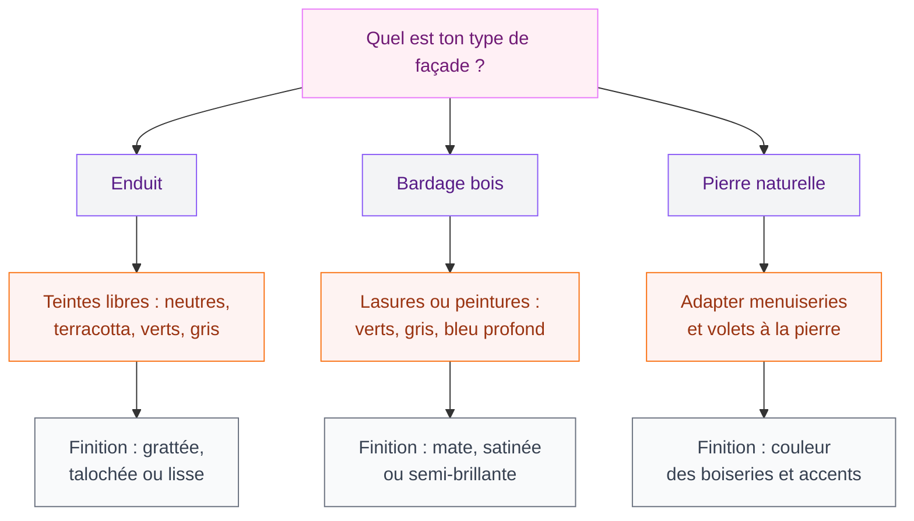
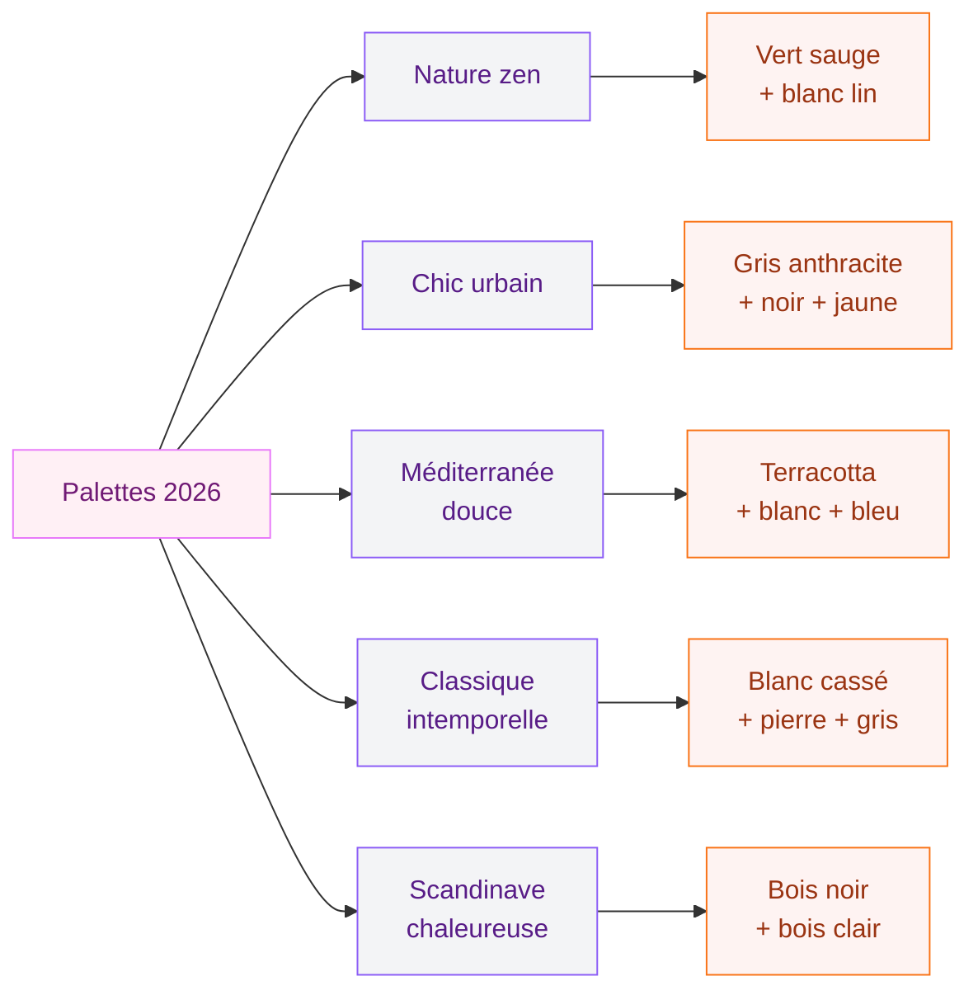

# Couleurs façades maison 2026 : tendances et palettes pour tes extérieurs

Tu veux redonner un coup de jeune à ta façade mais tu ne sais pas quelle couleur choisir ? Normal : entre les réglementations locales, les tendances qui bougent chaque année et l'offre de peinture qui déborde en magasin, on peut vite se sentir perdue. Bonne nouvelle, en 2026 les palettes extérieures sont plus belles que jamais - et je vais t'aider à y voir clair.

Que tu partes sur une rénovation complète avec isolation thermique par l'extérieur (ITE) ou un simple rafraîchissement d'enduit, la couleur de ta façade change tout. Elle influence l'ambiance de ta maison vue de la rue, le confort thermique en été, et même la valeur de ton bien. Alors autant ne pas se louper.

## Les grandes tendances couleurs façades 2026

  

### Le retour des teintes nature

La tendance numéro un cette année ? Les couleurs inspirées de la nature. On parle de verts doux (vert sauge, vert olive, vert amande), de beiges chauds, de teintes sable et de tons terre. L'idée, c'est une façade qui s'intègre dans son environnement au lieu de jurer avec le paysage.

Le vert sauge, en particulier, explose en 2026. Cette teinte douce et grisée fonctionne aussi bien sur une maison contemporaine que sur une bâtisse traditionnelle. Chez Tollens, la référence "Vert Olivier" (gamme Natura) tourne autour de 45-55 EUR le pot de 2,5L. Chez Zolpan, regarde la gamme "Nuancier Végétal" qui propose une dizaine de verts extérieurs adaptés aux enduits et bardages.

> [!TIP]
> Le vert sauge se marie à merveille avec des menuiseries blanc cassé ou bois naturel. Évite le blanc pur qui crée un contraste trop dur - un blanc crème ou lin sera bien plus harmonieux.

### Gris anthracite et teintes sombres : l'audace qui paie

Les façades sombres ne sont plus réservées aux maisons d'architecte scandinaves. Le gris anthracite, le bleu nuit, le noir charbon et même le vert forêt profond se retrouvent sur de plus en plus de maisons en France. C'est un choix audacieux mais le rendu est magnifique, surtout avec des accents clairs sur les menuiseries et les soubassements.

Attention, les teintes sombres absorbent la chaleur. Si tu habites dans le sud, mieux vaut les réserver au bardage bois d'un mur nord ou à des touches ponctuelles. En revanche, dans le nord ou l'ouest, une façade gris anthracite donne un caractère dingue à ta maison.

Côté prix, Dulux Valentine propose sa gamme "Architecte" en extérieur à environ 55-70 EUR les 2L pour les teintes sombres. V33 offre aussi de belles options avec leur gamme "Climats Extrêmes" (60-75 EUR les 2,5L), qui résiste très bien aux intempéries.

### Terracotta et tons chauds : la chaleur méditerranéenne

Le terracotta reste une valeur sûre en 2026, et il se décline maintenant en versions plus subtiles : terre de Sienne, ocre doré, rose poudreux. Ces tons chauds apportent une chaleur immédiate à la façade et fonctionnent particulièrement bien avec la pierre naturelle et le bois.

> [!NOTE]
> La couleur Pantone de l'année 2026, "Mocha Mousse", confirme cette tendance vers les bruns chauds et les teintes gourmandes. C'est un beige-brun doux qui fonctionne très bien en extérieur, surtout sur enduit.

### Le blanc revisité : jamais tout à fait blanc

Le blanc classique ne disparaît pas, mais il se réinvente. En 2026, on privilégie les blancs cassés, les blancs teintés (lin, coquille d'oeuf, pierre claire) qui apportent plus de profondeur visuelle qu'un blanc pur. Un blanc légèrement chaud en façade principale avec des menuiseries dans un ton plus soutenu - voilà la formule qui marche.

## Choisir la bonne couleur selon ta façade

  

### Le type de revêtement change tout

Ta façade n'est pas un mur intérieur. Le rendu d'une couleur dépend énormément du support :

- **Enduit** : c'est le support le plus courant. L'enduit accepte à peu près toutes les teintes, du plus clair au plus sombre. Pour un enduit gratté ou taloché, les couleurs neutres et les tons terre donnent le meilleur résultat. Un enduit lisse permet des teintes plus vives.
- **Bardage bois** : le bois peut être laissé en finition naturelle (gris argenté avec le temps), teinté ou peint. Les teintes verts, gris et bleu profond sont magnifiques sur bardage bois. Pense à une lasure plutôt qu'une peinture si tu veux garder le veinage visible.
- **Pierre** : on ne peint pas la pierre ! Mais la couleur de tes menuiseries, volets et soubassements doit s'harmoniser avec la teinte naturelle de la pierre.

### Exposition et lumière : le facteur qu'on oublie trop souvent

La lumière naturelle transforme complètement une couleur. Un gris qui paraît doux en magasin peut sembler froid et triste sur une façade nord, alors qu'il sera lumineux et élégant plein sud. Mon conseil : achète toujours un pot d'essai et teste la teinte directement sur ta façade, à différentes heures de la journée.

- **Façade sud** : les teintes claires reflètent la lumière et évitent la surchauffe. Privilégie les blancs chauds, beiges, sable.
- **Façade nord** : les tons chauds (terracotta, ocre, jaune doux) compensent le manque de lumière.
- **Façade est/ouest** : la lumière change beaucoup entre matin et soir. Les tons neutres et les gris moyens s'adaptent bien.

> [!WARNING]
> Les couleurs sombres peuvent faire grimper la température du mur de 15 à 20 degrés en été par rapport à une teinte claire. Sur une façade sud sans isolation thermique correcte, c'est un vrai problème de confort.

### Harmoniser menuiseries, volets et soubassements

La façade ne se résume pas à un aplat de couleur. Les menuiseries (fenêtres, porte d'entrée), les volets, les soubassements et les boiseries créent un ensemble. Voici les associations qui marchent le mieux en 2026 :

| Façade principale | Menuiseries | Volets / Accents |
|---|---|---|
| Blanc cassé / Lin | Gris anthracite | Noir ou vert sombre |
| Vert sauge | Blanc crème | Bois naturel |
| Gris clair | Blanc pur | Bleu marine |
| Terracotta doux | Blanc chaud | Brun chocolat |
| Beige sable | Gris moyen | Vert olive |

Si tu cherches de l'inspiration pour tes espaces extérieurs au-delà de la façade, jette un oeil à notre guide sur les [terrasses design et aménagements extérieurs tendance](/terrasse-design-amenagements-exterieurs-tendance/). Les couleurs de ta façade et de ta terrasse doivent se répondre pour un ensemble cohérent.

## Matériaux et finitions : le détail qui fait la différence

  

### Peinture, enduit ou lasure ?

Le choix du produit de finition est aussi important que la couleur elle-même :

- **Peinture façade** : la solution la plus simple pour changer de couleur. Compte 25-75 EUR le pot de 2,5L selon la marque et la qualité. Tollens, Dulux Valentine et V33 sont les références en France. Durabilité : 8 à 12 ans.
- **Enduit teinté dans la masse** : plus cher à la pose (50-80 EUR/m2 fourni-posé) mais bien plus durable. L'avantage ? La couleur ne s'écaille pas puisqu'elle est intégrée au matériau. Parfait en rénovation avec ITE.
- **Lasure bois** : pour les bardages, compte 30-50 EUR le litre chez Blanchon ou V33. Une lasure de qualité protège et colore le bois pendant 3 à 5 ans.

### Les finitions qui changent tout

Un même coloris peut avoir un rendu très différent selon la finition :

- **Mate** : la plus naturelle, elle cache les imperfections du support. C'est le choix le plus courant pour les enduits.
- **Satinée** : un léger brillant qui donne de la profondeur à la teinte. Idéale pour les menuiseries et les boiseries.
- **Grattée ou talochée** : pour l'enduit, la texture influence la perception de la couleur. Un enduit gratté crée des micro-ombres qui foncent légèrement la teinte.

Si la question des couleurs t'intéresse aussi pour l'intérieur, découvre notre article sur les [couleurs apaisantes et zen](/couleurs-apaisantes-zen/) pour créer une continuité entre dedans et dehors.

## 5 palettes tendance 2026 pour t'inspirer

Voici mes 5 palettes préférées pour cette année. Chacune fonctionne pour un style de maison différent.

  

### 1. Nature zen
Enduit vert sauge + menuiseries blanc lin + bardage bois clair. Pour les maisons contemporaines ou les constructions neuves qui veulent se fondre dans la végétation.

### 2. Chic urbain
Façade gris anthracite + menuiseries noires + porte d'entrée jaune moutarde. Un style affirmé pour les maisons de ville ou les architectures modernes.

### 3. Méditerranée douce
Enduit terracotta + menuiseries blanc cassé + volets bleu lavande. L'esprit du sud sans tomber dans le cliché.

### 4. Classique intemporelle
Façade blanc cassé + soubassements pierre claire + menuiseries gris moyen. Ça fonctionne partout, dans toutes les régions, sur tous les styles d'architecture.

### 5. Scandinave chaleureuse
Bardage bois teinté noir + accents bois naturel clair + menuiseries blanches. Le contraste bois sombre / bois clair donne un résultat très élégant et durable.

> [!IMPORTANT]
> Avant de te lancer, vérifie toujours le Plan Local d'Urbanisme (PLU) de ta commune. Certaines villes imposent des palettes de couleurs précises pour les façades, surtout en centre-ville ou en zone protégée. Un passage en mairie peut t'éviter bien des galères.

## Le confort thermique : quand la couleur fait la température

Ce n'est pas juste une question d'esthétique. La couleur de ta façade joue un rôle direct sur le confort thermique de ta maison. Les teintes claires réfléchissent jusqu'à 80% des rayons solaires, alors que les couleurs sombres peuvent en absorber 90%.

  

En 2026, avec les étés de plus en plus chauds, c'est un critère à prendre au sérieux. Si tu fais une rénovation avec ITE (isolation thermique par l'extérieur), l'isolant limite déjà les transferts de chaleur. Mais sur une maison non isolée, une façade sombre plein sud peut transformer ton salon en four.

Les peintures "cool roof" ou à haute réflectance solaire commencent à arriver sur le marché pour les façades. Tollens propose déjà des teintes à indice de réflectance solaire (IRS) élevé dans sa gamme pro. Le surcoût est d'environ 15-20% par rapport à une peinture classique, mais les économies de climatisation compensent vite.

Si tu réfléchis à l'éclairage extérieur pour mettre en valeur ta nouvelle façade le soir, consulte notre guide sur [l'éclairage moderne et ses tendances](/eclairage-moderne-tendances/) - un bon éclairage peut sublimer les couleurs de ta maison une fois la nuit tombée.

## Budget : combien coûte un ravalement de façade ?

Soyons concrètes. Voici les fourchettes de prix en 2026 pour un ravalement :

| Prestation | Prix au m2 (fourni-posé) |
|---|---|
| Simple nettoyage + peinture | 30-50 EUR/m2 |
| Ravalement enduit classique | 50-80 EUR/m2 |
| Ravalement avec ITE | 120-200 EUR/m2 |
| Bardage bois posé | 80-150 EUR/m2 |

Pour une maison de 100 m2 de façade, compte donc entre 3 000 et 8 000 EUR pour un rafraîchissement peinture, et entre 12 000 et 20 000 EUR si tu en profites pour isoler. Des aides existent (MaPrimeRénov', CEE) pour l'ITE - renseigne-toi, ça peut couvrir 30 à 50% du coût total.

Et pour aménager le reste de ton extérieur après le ravalement, découvre nos idées pour [optimiser un balcon en petit espace](/balcon-amenagement-petit-espace-optimise/).

> [!TIP]
> Achète toujours 10 à 15% de peinture en plus par rapport au calcul théorique. Les surfaces extérieures sont souvent plus poreuses et irrégulières qu'on ne le pense. Mieux vaut un pot en trop qu'un raccord visible à l'oeil nu.

## Sur le meme theme

- [facades de maisons modernes 2026](/guides/decoration/facades-de-maisons-modernes-2026/)
- [maisons modernes en adobe](/guides/exterieur/maisons-modernes-en-adobe-images-dinterieurs-et-dexterieurs/)
- [maisons modernes 2026](/guides/exterieur/maisons-modernes-2026-images-dexterieur-et-dinterieur/)
- [couleur porte d'entrée](/guides/exterieur/couleurs-des-portes-exterieures-comment-choisir-la-couleur/)
- [construire un pool house](/guides/exterieur/construire-pool-house/)

## FAQ : les questions que tu te poses

### Les couleurs de façade sont-elles réglementées ?

Oui, dans la plupart des communes. Le PLU (Plan Local d'Urbanisme) ou le règlement de lotissement peut imposer des couleurs ou en interdire. En zone classée ou près de monuments historiques, les Architectes des Bâtiments de France doivent aussi valider ton choix. Passe en mairie avant d'acheter ta peinture.

### Peut-on associer plusieurs couleurs sur une façade ?

Tout à fait, et c'est même recommandé en 2026. Le bicolore (façade principale + couleur d'accent sur un pan de mur, les menuiseries ou les soubassements) donne du relief et du caractère. La règle : maximum 3 couleurs en comptant les menuiseries, pour garder un ensemble lisible.

### Quelle couleur vieillit le mieux en extérieur ?

Les tons neutres et les teintes minérales (beige, gris, blanc cassé) vieillissent le mieux car le salissage est moins visible. Les couleurs vives et les teintes sombres demandent un entretien plus régulier. Un bon produit de finition durable (type Tollens "Façade Premium" ou V33 "Climats Extrêmes") rallonge la durée de vie de 3 à 5 ans par rapport à une peinture d'entrée de gamme.

### Quand est-ce la meilleure période pour peindre sa façade ?

Le printemps (avril-juin) et le début d'automne (septembre-octobre) sont les périodes idéales. Il faut une température entre 10 et 25 degrés, pas de pluie, et pas de vent fort. Évite l'été en plein soleil : la peinture sèche trop vite et les raccords se voient.

---

Choisir la couleur de sa façade, c'est un peu comme choisir une tenue pour sa maison : il faut que ça te plaise, que ça aille bien avec le quartier, et que ça tienne dans le temps. En 2026, tu as l'embarras du choix avec des palettes plus riches et plus naturelles que jamais. Mon dernier conseil ? Fais toujours un test grandeur nature sur ta façade avant de te lancer. Un échantillon de 50x50 cm coûte quelques euros et peut t'éviter des milliers d'euros de regrets. Trust me, ça vaut le détour.
