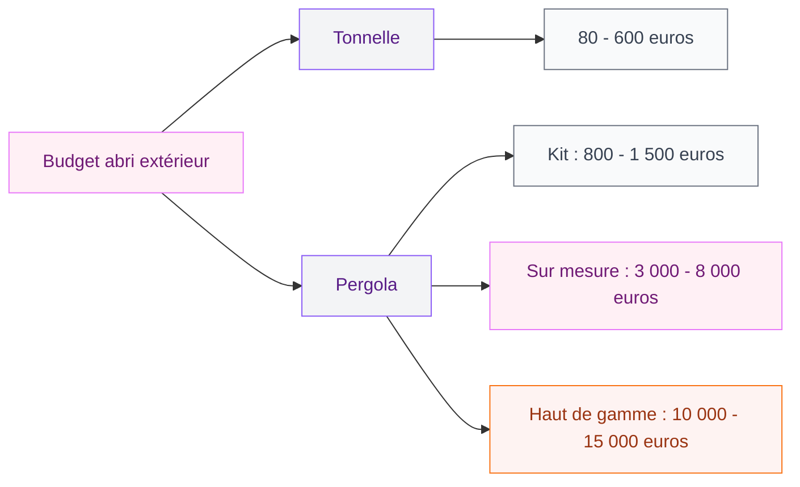
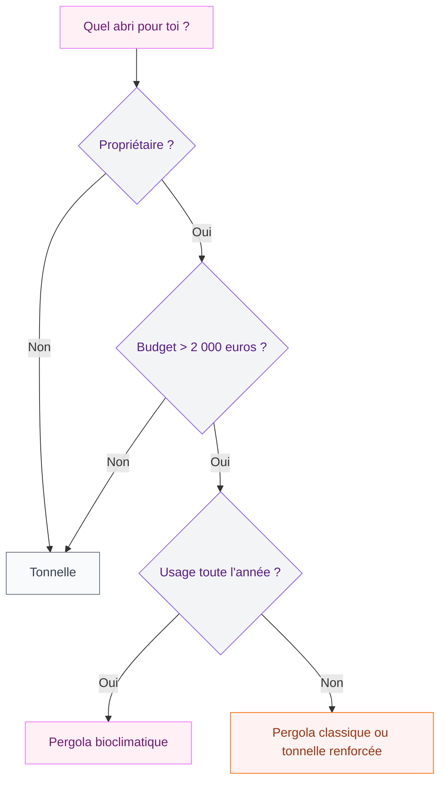

Tu veux profiter de ton jardin ou de ta terrasse même quand le soleil cogne, mais tu hésites entre une pergola et une tonnelle ? C'est LA question que tout le monde se pose au moment d'aménager son extérieur. Et la réponse n'est pas aussi simple qu'on pourrait le croire, parce que ces deux structures répondent à des besoins très différents.

Je t'explique tout : les vraies différences, les budgets, les avantages de chaque option et surtout comment choisir en fonction de TON espace et de TES envies. Parce qu'il n'y a pas de "meilleur choix" universel - il y a le choix qui colle à ta vie.

## Pergola et tonnelle : deux philosophies d'aménagement

Avant d'entrer dans les détails techniques, pose-toi cette question simple : tu cherches une solution permanente qui devient une pièce à vivre, ou un abri pratique que tu installes et désinstalles selon les saisons ?

La **pergola**, c'est une structure fixe et durable. Elle est construite pour rester en place toute l'année, qu'elle soit adossée à la façade de ta maison ou autoportée au milieu du jardin. Matériaux costauds (aluminium, bois, acier), fixation au sol solide, toiture rigide ou à lames orientables. On parle d'un vrai investissement qui s'intègre à l'architecture de ta maison.

La **tonnelle**, c'est un abri léger et démontable. Toile polyester, structure en tubes d'acier ou d'aluminium fin, montage en quelques heures. Tu la sors au printemps, tu la ranges à l'automne - ou tu la déplaces selon tes envies. C'est la liberté avant tout.

> [!NOTE]
> Le terme "tonnelle" désigne aussi parfois une treille végétalisée en arceaux dans les catalogues jardinerie. Ici, on parle de la tonnelle-abri avec toile, le modèle le plus répandu dans les magasins de bricolage.

## Les 5 critères qui font vraiment la différence

### 1. La durabilité et la résistance

C'est le point de séparation le plus net entre les deux.

Une pergola en aluminium thermolaqué résiste aux UV, à la pluie, au vent et même à la neige (selon la charge prévue). Sa durée de vie dépasse facilement 20 à 30 ans sans entretien particulier. Les modèles en bois traité autoclave tiennent 15 à 20 ans avec un entretien régulier (lasure tous les 2-3 ans).

La tonnelle a une durée de vie bien plus courte. La toile polyester se dégrade en 3 à 5 ans sous les UV, même avec un traitement anti-UV. La structure en tubes légers peut se tordre en cas de vent fort (à partir de 60-70 km/h, ça devient risqué). La plupart des fabricants recommandent d'ailleurs de la démonter en cas d'intempéries.

> [!WARNING]
> Ne laisse jamais une tonnelle montée par grand vent. Les modèles légers (moins de 20 kg) peuvent s'envoler et provoquer des dégâts. Pense aux poids de lestage (minimum 25 kg par pied) si tu la gardes en place tout l'été.

### 2. Le budget - du simple au décuple

C'est souvent le critère numéro un, et l'écart est énorme.

**Tonnelle** : de 80 euros pour un modèle basique 3x3 m chez Gifi ou Action, jusqu'à 400-600 euros pour une tonnelle renforcée avec rideaux latéraux (Hespéride chez Leroy Merlin, Outsunny sur Amazon). Pour un événement ponctuel, tu trouves même des barnum à moins de 50 euros.

**Pergola** : le budget démarre autour de 800-1 500 euros pour un kit aluminium à monter soi-même (Blooma chez Castorama, Kettler). Une pergola sur mesure en aluminium avec lames orientables, c'est 3 000 à 8 000 euros pose comprise. Les modèles haut de gamme (Biossun, Renson, Azenco) montent à 10 000-15 000 euros pour une installation complète.

### 3. L'installation et les démarches

La tonnelle se monte en 30 minutes à 2 heures selon le modèle. Aucun outil spécifique, aucune démarche administrative. Tu la poses, tu la déposes, point.

Pour la pergola, c'est une autre histoire. Un kit basique se monte en une journée à deux personnes. Une pergola sur mesure nécessite l'intervention d'un professionnel (1 à 3 jours de pose). Et côté administratif, attention : si ta pergola dépasse 5 m2, tu dois déposer une déclaration préalable de travaux en mairie. Au-delà de 20 m2, c'est un permis de construire. C'est le même principe que pour [construire un pool house](/guides/exterieur/construire-pool-house/) - renseigne-toi avant de lancer les travaux.

### 4. La personnalisation et le style

La pergola gagne haut la main sur ce terrain. Tu peux choisir les matériaux, les couleurs, ajouter des stores latéraux, des moustiquaires, des éclairages LED intégrés, des parois en verre coulissant pour créer un espace fermé en hiver. Certains modèles intègrent même des chauffages radiants ou des systèmes audio. C'est un vrai prolongement de ta maison.

La tonnelle offre moins d'options, mais elle a ses atouts : rideaux latéraux pour l'intimité, moustiquaire intégrée sur les modèles milieu de gamme, choix de coloris (écru, taupe, gris, vert). Et tu peux la relooker facilement avec des guirlandes lumineuses, des plantes grimpantes en pot ou des voilages.

### 5. L'impact sur la valeur de ta maison

Une pergola bien intégrée, surtout un modèle bioclimatique, ajoute de la valeur à ton bien immobilier. Les agents estiment cette plus-value entre 5 et 10 % du prix de la terrasse aménagée. Si tu veux en savoir plus sur les modèles à lames orientables, j'ai écrit un [guide complet sur la pergola bioclimatique](/guides/exterieur/la-pergola-bioclimatique-lalliance-parfaite-entre-esthetique-et-confort/) qui détaille tout ça.

La tonnelle, par définition temporaire, n'a aucun impact sur la valeur immobilière. Mais ce n'est pas son rôle non plus.

## Le tableau comparatif complet

| Critère | Pergola | Tonnelle |
|---------|---------|----------|
| Durée de vie | 15 à 30 ans | 3 à 5 ans |
| Budget moyen | 2 000 - 8 000 euros | 100 - 500 euros |
| Installation | 1 à 3 jours | 30 min à 2 h |
| Démarches | Déclaration ou permis | Aucune |
| Résistance au vent | Forte (> 100 km/h) | Faible (< 60 km/h) |
| Personnalisation | Très large | Limitée |
| Mobilité | Fixe | Démontable |
| Plus-value immobilière | Oui (5-10 %) | Non |
| Entretien | Faible à moyen | Faible |

## Dans quel cas choisir une tonnelle ?

La tonnelle est le bon choix si tu coches plusieurs de ces cases :

- Tu es locataire et tu ne peux pas fixer de structure permanente
- Tu veux un abri pour des événements ponctuels (anniversaires, barbecues entre amis)
- Ton budget est serré (moins de 500 euros)
- Tu déménages dans les prochaines années
- Tu veux tester l'ombrage à un endroit précis avant d'investir dans une pergola
- Tu as besoin de protéger un coin repas au fond du jardin, loin de la maison

> [!TIP]
> Mon astuce : achète une tonnelle correcte (budget 250-400 euros, marques comme Hespéride ou Outsunny) pour passer un été avec. Tu verras exactement où tu aimes t'installer, quelle taille te convient, et si tu veux vraiment investir dans une pergola à cet endroit. C'est le meilleur test grandeur nature.

Les tonnelles pliantes de type barnum (3x3 m, dépliage en 2 minutes) sont aussi géniales pour les brocantes, les vide-greniers ou les sorties camping. Rien ne les remplace pour cet usage nomade.

## Dans quel cas choisir une pergola ?

La pergola s'impose si :

- Tu es propriétaire et tu veux aménager ta terrasse pour longtemps
- Tu cherches une vraie pièce à vivre extérieure, utilisable du printemps à l'automne (et même en hiver avec des options chauffage)
- Tu veux un design intégré à l'architecture de ta maison
- Tu envisages d'y installer un salon de jardin permanent, un coin repas ou un spa
- Tu habites dans une région venteuse ou pluvieuse et tu as besoin d'une protection fiable

L'idéal, c'est de penser ta pergola en même temps que l'aménagement global de ton extérieur. Si tu refais ta [terrasse](/guides/exterieur/renovez-votre-terrasse-pour-la-securite/), c'est le moment parfait pour intégrer les fondations de la pergola dans le chantier.

## La troisième option : la tonnelle permanente

Il existe une catégorie intermédiaire qu'on oublie souvent : la tonnelle fixe en fer forgé ou en acier traité. Ce type de structure ressemble à une tonnelle par sa forme (arrondie, ouverte) mais se fixe au sol de manière permanente. Le prix tourne autour de 600 à 2 000 euros.

C'est la solution parfaite si tu aimes l'esthétique romantique du jardin à la française. Recouverte d'une vigne, d'un rosier grimpant ou d'une glycine, une tonnelle en fer forgé devient un élément décoratif à part entière. L'ombrage est alors naturel, vivant, et il évolue avec les saisons.

Pour ce type de projet végétalisé, tu peux t'inspirer des idées de [jardins verticaux](/guides/exterieur/jardins-verticaux-de-40-photos-dinspiration-verte/) qui fonctionnent aussi sur les structures type treilles et tonnelles.

## Entretien : ce qu'il faut prévoir

**Pour la tonnelle démontable** : lave la toile au jet d'eau et au savon de Marseille une fois par an. Range-la propre et sèche à l'automne dans sa housse. Vérifie les coutures et les armatures au printemps avant de la remonter. Remplace la toile quand elle commence à se décolorer ou à se craqueler (compte 30 à 80 euros pour une toile de remplacement).

**Pour la pergola aluminium** : un passage au jet d'eau 2 à 3 fois par an suffit. Vérifie les gouttières intégrées pour évacuer les feuilles mortes. C'est tout.

**Pour la pergola bois** : lasure ou saturateur tous les 2 à 3 ans. Vérifie l'état du bois au printemps, traite les éventuelles traces de moisissure avec un produit fongicide. C'est plus contraignant, mais le rendu en vaut la peine.

> [!IMPORTANT]
> Sur une pergola à lames orientables, nettoie les rails de guidage des lames au moins deux fois par an. La poussière et les débris végétaux peuvent bloquer le mécanisme. Un simple coup d'aspirateur et un peu de lubrifiant silicone suffisent.

## Les erreurs à éviter avant d'acheter

**Sous-estimer la prise au vent.** C'est l'erreur numéro un avec les tonnelles. Même avec des sardines ou des poids de lestage, une tonnelle légère dans un couloir de vent, ça finit mal. Si ton jardin est exposé, pars directement sur une pergola ou une tonnelle lourde avec structure renforcée.

**Choisir la mauvaise taille.** Prévois toujours un peu plus grand que ce que tu imagines. Un salon de jardin 4 places demande au minimum 3x3 m d'espace couvert. Pour 6 à 8 personnes autour d'une table, vise 3x4 m ou 4x4 m.

**Oublier l'orientation.** Place ton abri en pensant à la course du soleil. Une pergola ou tonnelle orientée plein sud te protège du soleil de midi, mais tu peux aussi avoir besoin d'un store latéral pour le soleil rasant du soir. Teste l'ombre à différentes heures avant de fixer l'emplacement.

**Négliger le sol.** Une pergola se fixe idéalement sur une dalle béton ou une terrasse solide. Sur de la terre ou de la pelouse, il faut prévoir des plots béton pour ancrer les pieds. Pour la tonnelle, un sol plat et stable suffit, mais évite les zones en pente.

## Mon verdict

Si tu me demandes un conseil direct : commence par définir ton budget et ta durée de vie dans ta maison actuelle.

**Tu restes moins de 5 ans ?** Une tonnelle de qualité (Hespéride, 300-500 euros) te rendra service sans te ruiner. Tu la revendras facilement ou tu l'emmèneras avec toi.

**Tu es installé pour longtemps ?** Investis dans une pergola. Même un modèle en kit à 1 500 euros te donnera 15 à 20 ans de confort. Et si tu peux monter à 4 000-6 000 euros pour un modèle bioclimatique, trust me, tu ne regretteras pas. C'est la meilleure amélioration que tu puisses faire sur une terrasse.

L'un n'empêche pas l'autre : beaucoup de gens commencent avec une tonnelle le temps de finaliser leur projet pergola. C'est malin, ça te laisse tester et réfléchir sans pression. Et le jour où la pergola est posée, la tonnelle part au fond du jardin pour couvrir le coin potager ou le barbecue. Tout le monde y gagne.

## FAQ

### Une pergola nécessite-t-elle un permis de construire ?

Pas toujours. En dessous de 5 m2 d'emprise au sol, aucune démarche n'est requise. Entre 5 et 20 m2, il faut une déclaration préalable de travaux (formulaire Cerfa 13703, un mois de délai). Au-delà de 20 m2, un permis de construire est obligatoire. Pense aussi à vérifier le PLU de ta commune qui peut imposer des règles supplémentaires.

### Peut-on laisser une tonnelle montée toute l'année ?

C'est déconseillé pour les modèles classiques à toile polyester. Le vent, la pluie et le gel dégradent rapidement la toile et peuvent déformer la structure. Si tu veux un abri à l'année, oriente-toi vers une tonnelle fixe en acier galvanisé ou directement vers une pergola.

### Quel est le meilleur rapport qualité-prix entre pergola et tonnelle ?

Si tu rapportes le coût à la durée de vie, la pergola en kit aluminium (1 200-1 500 euros pour 20 ans d'utilisation) revient à 60-75 euros par an. Une tonnelle à 200 euros remplacée tous les 4 ans revient à 50 euros par an, mais avec bien moins de confort et de résistance. L'écart réel est donc beaucoup plus faible qu'il n'y paraît au premier achat.
