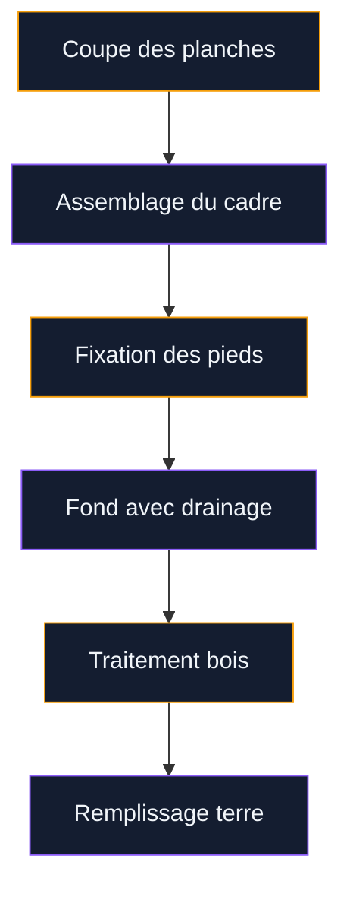
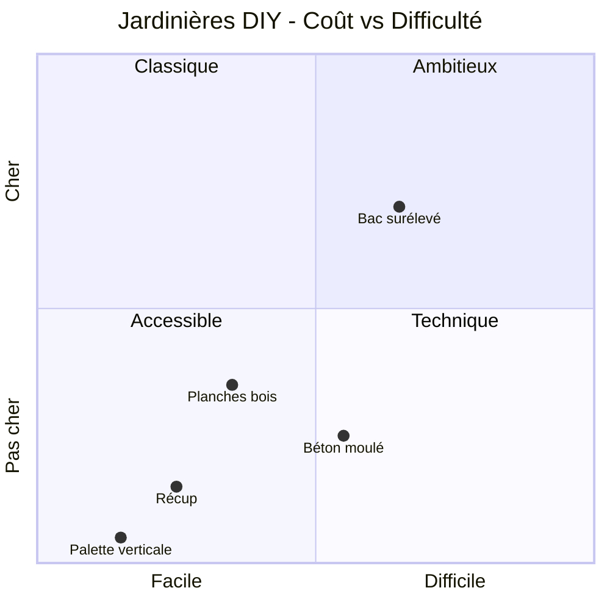

Tu rêves d'une terrasse fleurie sans te ruiner ? Bonne nouvelle : fabriquer sa propre jardinière, c'est largement à la portée d'un débutant. Pas besoin de grands outils ni de compétences avancées. Avec quelques planches, une palette récupérée ou même du béton coulé dans un vieux seau, tu peux créer des contenants vraiment stylés pour tes plantes.

Dans cet article, je te propose 5 modèles de jardinières DIY classés du plus simple au plus ambitieux. Pour chacun, tu trouveras la liste des matériaux, les outils nécessaires, les étapes détaillées et une estimation du coût réel. On commence ?

---

## Pourquoi fabriquer sa jardinière plutôt qu'en acheter une ?

Le marché des jardinières vendues en grande surface ressemble souvent à une déception : plastique cheap qui blanchit en deux étés, modèles en bois traité avec des produits douteux, ou design générique qu'on retrouve dans tous les jardins du quartier. Pour 40 à 80 € dans une enseigne de bricolage, tu n'obtiens rien de mémorable.

En DIY, 20 à 30 € suffisent pour une jardinière en bois sur mesure, exactement aux dimensions de ton balcon. Et le résultat est unique.

Il y a aussi la question de la durabilité. Une jardinière bien construite, en bois traité avec une huile naturelle ou en béton, tiendra 10 à 15 ans sans broncher. C'est rarement le cas des modèles bas de gamme du commerce.

> [!TIP]
> Avant de te lancer, mesure l'espace disponible sur ta terrasse ou ton balcon. Une jardinière trop grande devient vite gênante, surtout si tu dois l'arroser régulièrement. Prévois au moins 30 cm de profondeur pour les légumes et les tomates.

---

## Modèle 1 - La jardinière en planches de bois (débutant)

C'est le grand classique. Simple à assembler, durable et esthétique, ce modèle convient parfaitement aux débutants.

  

**Matériaux :**
- 4 planches de pin traité autoclave (classe 4 minimum pour un usage extérieur), section 200 x 25 mm, longueur 1 m : environ 18 € les 4 (Leroy Merlin, rayon bois)
- 2 tasseaux 40 x 40 mm pour les montants de coin : 4 € (chute en magasin ou planche de récup)
- Vis inox 4 x 40 mm : 5 € la boîte
- Géotextile (voile de fond) : 3 € le rouleau
- Huile ou lasure extérieure (Bondex, Syntilor) : 12 à 15 € le pot de 0,5 L

**Outils :**
- Scie sauteuse ou scie circulaire
- Visseuse-perceuse
- Mètre et crayon
- Pinceau large

**Étapes :**

1. Coupe deux planches à 80 cm (faces avant et arrière) et deux autres à 30 cm (côtés).
2. Coupe les tasseaux en 4 morceaux de 35 cm pour les montants de coin.
3. Assemble les planches en boîte rectangulaire en vissant les angles dans les tasseaux. Commence par les petits côtés sur les montants, puis fixe les grandes faces.
4. Coupe une chute de planche pour faire le fond. Perce des trous de drainage (diamètre 1 cm) tous les 15 cm.
5. Ponce légèrement les arêtes et applique deux couches d'huile ou de lasure extérieure.
6. Pose le géotextile à l'intérieur avant de remplir de terreau.

**Coût total : environ 25 à 30 €** pour une jardinière de 80 x 30 x 30 cm.

> [!NOTE]
> Le bois pin traité autoclave classe 4 est l'option la plus saine pour les jardinières destinées aux légumes. Évite le bois traité avec des sels de chrome ou d'arsenic (ancienne génération). Les produits actuels utilisent des sels de cuivre sans danger pour les cultures alimentaires.

---

## Modèle 2 - La jardinière palette verticale (zéro budget)

Les palettes Europe sont partout et souvent gratuites. Récupérées en bon état auprès d'un commerce local, d'un entrepôt ou d'un voisin, elles offrent une base solide pour une jardinière murale originale.

**Matériaux :**
- 1 palette Europe (120 x 80 cm) : gratuit ou 5 € en récupération
- Du géotextile non tissé (type toile de paillage) : 3 à 5 €
- Des agrafes ou petits clous
- Terreau universel : 7 € le sac de 20 L (Floragard, Potager & Balcon de Vilmorin)

**Outils :**
- Agrafeuse à bois ou marteau
- Ciseaux ou cutter
- Arrosoir ou tuyau

**Étapes :**

1. Inspecte la palette : les slats (lattes) du dessus doivent être en bon état, sans éclats ni pourriture.
2. Retourne la palette sur le ventre. Coupe des pièces de géotextile pour tapisser le fond et les côtés (entre les lattes), de façon à créer des poches qui retiennent le terreau.
3. Agraphe le géotextile soigneusement pour que chaque espace entre deux lattes forme une poche fermée.
4. Redresse la palette à la verticale, appuie-la contre un mur en vérifiant qu'elle tient bien.
5. Remplis chaque poche de terreau en tassant légèrement.
6. Plante directement dans les poches : herbes aromatiques (persil, basilic, menthe), fleurs basses (pétunias, lobélias), ou petites plantes grasses.

**Coût total : 3 à 12 €** selon que tu récupères la palette gratuitement ou pas.

> [!TIP]
> Pour les palettes verticales, choisis des plantes peu gourmandes en eau ou prévois un arrosage quotidien en été. Le terreau sèche plus vite dans les petites poches. Un paillis de coco sur le dessus de chaque poche limite l'évaporation.

---

## Modèle 3 - La jardinière en béton moulé (style industriel)

Le béton, c'est le matériau tendance de ces dernières années pour la déco extérieure. Beaucoup pensent que c'est compliqué à travailler. En réalité, couler du béton dans un moule en carton ou en plastique, c'est accessible à n'importe qui.

  

**Matériaux :**
- Sac de béton fin (type béton ciré en poudre ou ciment blanc) : 8 à 12 € le sac de 5 kg (Fermacell, Brico Dépôt)
- 2 boîtes plastiques gigognes (une grande, une petite, achetées en discount) : 3 à 5 €
- Huile de démoulage (huile végétale ordinaire)
- Tiges de bambou ou de bois pour le drainage

**Étapes :**

1. Enduis l'intérieur de la grande boîte et l'extérieur de la petite d'huile végétale (pour faciliter le démoulage).
2. Prépare le béton selon les instructions du sac. La consistance doit être épaisse, proche d'une pâte à cookies.
3. Verse une couche de 2 à 3 cm de béton dans la grande boîte.
4. Pose les tiges de bambou verticalement (elles créeront les trous de drainage).
5. Centre la petite boîte par-dessus, appuie doucement pour qu'elle s'enfonce dans le béton. Cale-la avec un poids.
6. Coule le béton restant dans l'espace entre les deux boîtes.
7. Laisse sécher au moins 24 h à 48 h selon la température.
8. Retire la petite boîte puis la grande. Ponce les arêtes avec du papier abrasif grain 80 puis 120.
9. Applique une couche d'imperméabilisant pour béton (Sika, Parexlanko) ou simplement de l'huile de lin.

**Coût total : 15 à 20 €** pour une jardinière ronde de 25 cm de diamètre.

---

## Modèle 4 - La jardinière surélevée en bois (potager)

Ce modèle est idéal si tu veux cultiver des légumes sans te baisser. Une jardinière surélevée sur pieds offre une meilleure ergonomie, un meilleur drainage et protège les cultures des escargots et limaces.

**Matériaux :**
- Planches douglas ou mélèze 200 x 25 mm (résistants naturellement à l'humidité) : environ 25 à 35 € pour 4 m²
- 4 pieds en bois (section 80 x 80 mm, hauteur 70 cm) : 15 à 20 €
- Équerres métalliques inox : 8 €
- Grillage anti-limaces à poser sous le fond : 5 €
- Vis inox 5 x 80 mm : 6 €

**Étapes :**

1. Coupe les planches pour former un rectangle de 120 x 60 cm (deux faces longues à 120 cm, deux petites faces à 60 cm).
2. Assemble le cadre rectangulaire avec les équerres métalliques pour solidifier les angles.
3. Fixe les quatre pieds dans les angles intérieurs du cadre, vissés bien droit.
4. Coupe des planches pour faire le fond. Laisse un espace de 1 à 2 cm entre chaque planche pour le drainage.
5. Pose le grillage anti-limaces sur le fond avant de remplir.
6. Traite tout le bois avec une huile naturelle (huile de lin cuite + essence de térébenthine, moitié-moitié) ou une lasure incolore Aquaréthane.

**Coût total : 50 à 65 €** pour un bac de 120 x 60 cm, hauteur 70 cm.

C'est le modèle qui demande le plus d'investissement, mais c'est aussi celui qui dure le plus longtemps et qui offre le meilleur confort au quotidien.

> [!WARNING]
> Pour les jardinières surélevées destinées aux légumes, évite absolument les bois traités avec les anciennes formules (bois verts ou marrons vendus avant 2006). Préfère le douglas, le mélèze ou le châtaignier, naturellement résistants, ou les bois certifiés autoclave classe 3 récents sans chrome ni arsenic.

---

## Modèle 5 - La jardinière récup' originale (upcycling)

L'upcycling consiste à transformer un objet destiné à la poubelle en quelque chose d'utile et de beau. Pour les jardinières, les possibilités sont infinies.

  

Voici trois idées concrètes que j'aime particulièrement :

**Vieille baignoire en fonte**
Les brocantes et sites de revente regorgent de vieilles baignoires à moins de 30 €. Percées de quelques trous au fond, elles font des jardinières monumentales et ultra-stylées. Seul bémol : le poids. Prévois une brouette et des bras solides pour les déplacer.

**Caisse en bois de vin (caisses à champagne)**
Les caves à vin et épiceries fines donnent souvent leurs caisses en bois. Traitées à l'huile et tapissées de géotextile, elles font de petites jardinières d'extérieur très jolies. Durée de vie : 3 à 5 ans selon les conditions météo.

**Vieux seau en zinc ou arrosoir percé**
Les brocantes regorgent de vieilles ferrailles à moins de 5 €. Un seau en zinc percé au fond et rempli de terreau accueille très bien les herbes aromatiques ou les petites fleurs. Le rendu rustique et campagnard plaît beaucoup.

Si tu aimes l'idée de transformer des objets du quotidien en éléments de déco jardin, jette un oeil à l'article sur les [pneus recyclés pour la décoration](/guides/decoration/pneus-recycles-pour-la-decoration/). C'est exactement dans cet esprit, et les résultats sont vraiment surprenants.

---

## Comparatif des 5 modèles

En résumé :

| Modèle | Coût | Difficulté | Durée | Idéal pour |
|---|---|---|---|---|
| Planches de bois | 25-30 € | Facile | 8-10 ans | Balcon, terrasse |
| Palette verticale | 3-12 € | Très facile | 3-5 ans | Mur extérieur |
| Béton moulé | 15-20 € | Moyen | 15+ ans | Déco minimaliste |
| Bac surélevé | 50-65 € | Moyen | 10-15 ans | Potager ergonomique |
| Récup | 0-30 € | Variable | Variable | Upcycling créatif |

---

## Les erreurs courantes à éviter

**Oublier le drainage.** C'est la cause principale de mort des plantes en jardinière. Chaque contenant doit avoir des trous au fond et une couche de billes d'argile (type Seramis ou Lechuza-Pon) avant le terreau. Pas de drainage = racines qui pourrissent en 2 semaines de pluie.

  

**Utiliser du terreau de mauvaise qualité.** Le terreau universel premier prix se compacte rapidement et asphyxie les racines. Investis dans un bon terreau (Floragard Pot & Balcon, Clasmann, ou le mélange maison : 1/3 terreau, 1/3 compost, 1/3 perlite). La différence sur la pousse des plantes est immédiate.

**Sous-estimer le poids.** Une jardinière en bois de 80 x 30 cm remplie de terreau humide pèse facilement 20 à 30 kg. Pour un balcon, vérifie la charge admissible (généralement 150 à 300 kg/m² selon les constructions). En cas de doute, utilise un terreau allégé à base de pouzzolane.

**Négliger le traitement du bois.** Sans protection, le bois extérieur se dégrade en 2 à 3 ans. Une simple couche d'huile ou de lasure appliquée chaque année prolonge la vie de la jardinière de 5 à 10 ans.

---

## Quelles plantes pour une jardinière DIY ?

Selon la taille et la profondeur de ta jardinière, les options varient :

**Moins de 20 cm de profondeur :** herbes aromatiques (thym, romarin, ciboulette, menthe), fleurs tapissantes (lobélia, alyssum), plantes grasses et succulentes.

**20 à 30 cm de profondeur :** géraniums, pétunias, lavande, petits poivrons, salades, épinards, radis.

**Plus de 30 cm de profondeur :** tomates cerise, courgettes, haricots, carottes courtes, fraisiers, petites herbes vivaces.

Si tu veux aller plus loin dans l'aménagement de ton extérieur, l'article sur la [pose de bordures de jardin sans béton](/guides/exterieur/poser-bordure-jardin-sans-beton/) te donnera des idées pour délimiter tes massifs avec style et sans chantier.

---

## Sur le meme theme

- [jardinières suspendues diy](/guides/exterieur/6-idees-pour-fabriquer-des-jardinieres-suspendues-maison/)
- [serre tunnel](/guides/exterieur/installer-serre-tunnel/)

  

## Par où commencer ?

Si c'est ta première jardinière DIY, commence par le modèle palette verticale ou le modèle planches de bois. Ils sont accessibles, peu coûteux, et te permettront d'apprendre les bases avant de te lancer dans le bac surélevé ou la jardinière en béton.

Pour les outils, une visseuse-perceuse suffit pour la plupart des modèles. Pas besoin d'investir dans un atelier complet. Leroy Merlin et Brico Dépôt proposent aussi la découpe sur mesure des planches à la coupe, ce qui t'évite d'acheter une scie si tu n'en as pas.

Et si l'idée de jardiner dehors t'inspire, mais que tu veux aller encore plus loin dans la transformation de ton espace extérieur, l'article sur [comment créer un jardin zen en 7 étapes](/guides/exterieur/comment-creer-un-jardin-zen-en-7-etapes/) te donnera une vision d'ensemble pour un aménagement cohérent et apaisant.

Alors, lequel des 5 modèles tu essaies en premier ?

> [!IMPORTANT]
> Avant de commencer n'importe quel projet DIY extérieur sur un balcon d'immeuble ou une terrasse partagée, vérifie le règlement de copropriété. Certains interdisent les structures en bois ou limitent le poids des installations. Mieux vaut savoir avant de visser la première planche.
