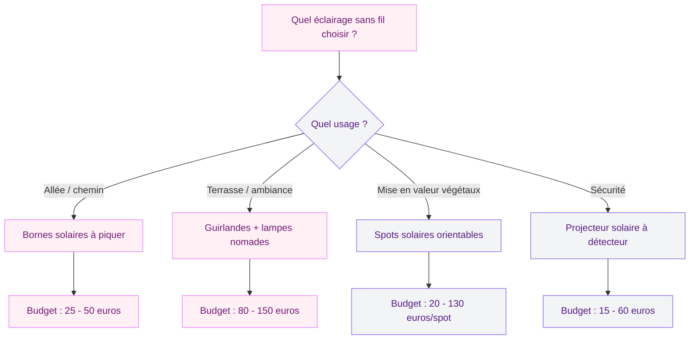
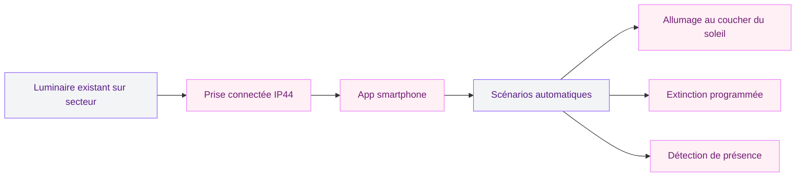

Tu rêves de dîners d'été dans ton jardin avec une lumière douce qui tombe pile où il faut, sans creuser la moindre tranchée ni tirer un seul câble ? Bonne nouvelle : l'éclairage extérieur sans fil a fait un bond en qualité ces dernières années, et les options vont bien au-delà du simple spot solaire planté dans la pelouse.

Je t'explique tout : les 3 grandes technologies (solaire, LED à piles, connecté), les meilleurs produits par usage, les prix et les erreurs que tout le monde fait au début. Parce qu'un jardin mal éclairé, c'est soit un stade de foot, soit le noir total.

## Les 3 technologies d'éclairage sans fil

Avant de foncer en magasin, il faut comprendre ce qui existe. L'éclairage extérieur sans fil se divise en trois familles, chacune avec ses forces et ses limites.

  

### Le solaire : autonome et gratuit à l'usage

Un panneau photovoltaïque intégré (ou déporté) capte la lumière du jour, stocke l'énergie dans une batterie interne, et alimente la LED une fois la nuit tombée. Zéro fil, zéro électricité, zéro coût de fonctionnement. La pose se résume à planter ou poser.

L'autonomie varie de 6 à 12 heures selon le modèle et l'ensoleillement. En plein été dans le sud, compte sur 10-12 heures. En hiver dans le nord, ça descend à 4-6 heures si le ciel reste couvert.

**Les marques à regarder** : Lumisky (française, gamme large de 15 à 80 euros), Philips Outdoor Solar (qualité supérieure, 40 à 120 euros), Xanlite (bon rapport qualité-prix chez Leroy Merlin, 10 à 50 euros).

### Les LED à piles ou batterie rechargeable

Ici, la lumière vient d'une batterie rechargeable en USB ou de piles classiques (AA, AAA ou C). La puissance est souvent plus forte que le solaire, et l'autonomie ne dépend pas de la météo.

Les guirlandes LED à piles offrent de 20 à 100 heures d'autonomie selon le nombre de LED et le mode d'éclairage (fixe ou clignotant). Les lampes de table rechargeables USB type Fermob Balad ou Lexon Mina tiennent 8 à 24 heures par charge, avec un temps de recharge de 4 à 6 heures.

**Budget** : de 10 euros pour une guirlande à piles basique à 90 euros pour une lampe design rechargeable Fermob.

### Le connecté : WiFi, Bluetooth et scénarios automatiques

Les lampes connectées se pilotent depuis une application sur ton téléphone. Tu allumes, tu éteins, tu règles l'intensité, tu changes la couleur - tout ça depuis ton canapé ou même à distance. Certaines se programment avec des horaires automatiques ou des capteurs de présence.

**Philips Hue Outdoor** (gamme Lily, Appear, Calla) est la référence. Prix : de 80 euros pour un spot d'extérieur à 250 euros pour un kit complet de 3 spots avec alimentation. Il faut un pont Hue Bridge (environ 50 euros) si tu n'en as pas déjà un.

**Ledvance Smart+ Outdoor** propose des alternatives plus abordables à partir de 35 euros. La connectivité passe par WiFi direct, sans pont supplémentaire.

> [!NOTE]
> Les lampes connectées nécessitent presque toujours une alimentation secteur (transformateur basse tension). Le "sans fil" concerne la commande, pas l'alimentation. Seules quelques lampes solaires connectées (Philips Hue Solar) combinent les deux.

## Quel éclairage pour quel usage ?

Le piège classique : vouloir tout éclairer de la même manière. Un chemin et une table de dîner n'ont pas les mêmes besoins. Voici comment répartir tes sources lumineuses.

  

### Éclairer une allée ou un chemin

Pour baliser un sentier, tu as besoin de lumière basse, régulière et orientée vers le sol. Les bornes solaires à piquer dans le sol sont parfaites pour ça.

**Ce qui marche** : des bornes solaires de 30 à 50 cm de hauteur, espacées de 2 à 3 mètres le long du chemin. Un lot de 8 bornes Xanlite coûte entre 25 et 40 euros. Pour un rendu plus soigné, les bornes Lumihome en inox brossé à 15-25 euros la pièce ont une finition bien supérieure.

### Créer une ambiance sur la terrasse

C'est là que les guirlandes LED et les lampes de table rechargeables brillent (au sens propre). L'objectif : une lumière chaude (2 700 à 3 000 K), douce, qui n'éblouit personne à table.

Une guirlande LED d'extérieur à piles ou solaire de 10 à 15 mètres, tendue entre deux points d'accroche, transforme une terrasse basique en coin de bistrot provençal. Budget : 15 à 45 euros selon la qualité des ampoules. Les guirlandes Bloolands (française) avec ampoules en verre vont de 30 à 60 euros et durent plusieurs saisons.

Pour les tables, les lampes nomades rechargeables sont un vrai plaisir. La Fermob Balad (80 euros) se balade partout, tient 10 heures en intensité moyenne, et existe dans 24 coloris. Alternative plus accessible : la lampe Lexon Mina (35 euros), plus petite mais très design.

Si ta terrasse manque aussi de protection solaire, jette un oeil au [guide pour ombrager sa terrasse](/ombrager-terrasse/) - un bon éclairage se pense en même temps que l'ombre.

> [!TIP]
> Pour une terrasse de 15-20 m2, combine une guirlande LED en hauteur (ambiance générale) avec 2 ou 3 lampes de table nomades (éclairage ponctuel). Ce duo coûte entre 80 et 150 euros et change complètement l'atmosphère des soirées.

### Mettre en valeur un massif ou un arbre

Un spot à piquer dans le sol, orienté vers le haut (éclairage d'accentuation), transforme un arbuste lambda en élément sculptural. Le solaire fonctionne bien ici si le spot est placé dans une zone qui reçoit du soleil en journée.

Les spots solaires orientables Lumisky ou Inspire (Leroy Merlin) entre 20 et 50 euros la pièce font un bel effet. Pour un rendu pro, les spots connectés Philips Hue Lily (130 euros le spot) permettent de choisir la couleur et l'intensité selon les saisons.

### Sécuriser les abords de la maison

L'éclairage de sécurité demande une lumière franche qui se déclenche au mouvement. Les projecteurs solaires à détecteur de présence sont redoutables pour ça : autonomes, dissuasifs, et sans aucun raccordement.

**Budget** : de 15 euros pour un modèle basique chez Brico Dépôt à 60 euros pour un projecteur Steinel ou Xanlite avec détecteur réglable (portée, durée d'allumage, sensibilité). Les modèles à 800-1 200 lumens éclairent large et fort, parfait pour une entrée de garage ou un portail.

## Installation pas à pas : le solaire en 15 minutes

Le gros avantage du sans fil, c'est la simplicité de pose. Pas besoin d'être électricien ni de creuser. Quelques règles à respecter quand même pour que ça fonctionne.

  

**Repérer les zones d'ensoleillement.** Observe ton jardin pendant une journée entière. Les bornes et spots solaires doivent recevoir au minimum 6 heures de soleil direct pour se recharger. Un emplacement à l'ombre d'un mur ou sous un arbre dense ne donnera rien.

**Tester le positionnement de nuit.** Pose tes lampes au sol sans les fixer, et observe le résultat une fois la nuit tombée. Tu déplaceras probablement la moitié des luminaires après ce test - c'est normal.

**Espacer régulièrement.** Pour une allée, garde un intervalle de 2 à 3 mètres entre chaque borne. Trop rapprochées, elles créent une "piste d'atterrissage" un peu agressive. Trop espacées, elles ne servent à rien.

**Orienter les spots vers le haut.** Pour valoriser un arbre ou un mur, place le spot à 30-50 cm du pied et incline-le vers le sommet. La lumière rasante crée un effet bien plus intéressant qu'un éclairage plongeant.

> [!IMPORTANT]
> Ne plante jamais une borne solaire dans un sol qui reste gorgé d'eau en hiver. L'humidité détruit la batterie en une saison. Surélève la base avec un lit de gravier de 5 cm si ton terrain est argileux ou mal drainé.

## Le connecté : transformer ton éclairage existant

Tu as déjà des luminaires extérieurs sur secteur et tu veux les rendre "intelligents" sans tout changer ? Les interrupteurs et prises connectés sont une bonne option.

  

Un interrupteur connecté Legrand Celiane with Netatmo (70 euros) ou Schneider Wiser (50 euros) remplace ton interrupteur classique et te permet de piloter tes lampes depuis une app. Tu programmes l'allumage au coucher du soleil, l'extinction à minuit, et tu oublies.

Les prises connectées d'extérieur (indice IP44 minimum) comme la Meross Outdoor Smart Plug (25 euros) ou la TP-Link Tapo P110 Outdoor (30 euros) transforment n'importe quel luminaire à prise en objet connecté. Tu branches ta guirlande dessus, tu configures un scénario, et c'est tout.

Si l'idée de piloter ton éclairage depuis ton téléphone te plaît, tu aimeras aussi le [guide sur les tableaux lumineux](/choisir-tableau-lumineux/) qui marie décoration murale et lumière d'ambiance.

## Les 5 erreurs les plus courantes (et comment les éviter)

Voici les pièges les plus fréquents et comment les éviter.

  

**Erreur 1 : acheter du solaire pour un jardin ombragé.** Si ta terrasse est sous une [pergola bioclimatique](/la-pergola-bioclimatique-lalliance-parfaite-entre-esthetique-et-confort/) ou un grand arbre, le panneau solaire ne recevra pas assez de lumière. Résultat : 2 heures d'éclairage faiblard au lieu de 8. Passe au rechargeable USB ou au connecté sur secteur dans ces zones.

**Erreur 2 : trop de lumière tue la lumière.** Un jardin, ce n'est pas un parking. 50 à 100 lumens par point lumineux suffisent pour de l'ambiance. Réserve les 800-1 200 lumens aux seuls projecteurs de sécurité.

**Erreur 3 : choisir du blanc froid (5 000-6 000 K).** En extérieur le soir, le blanc froid donne une ambiance de bloc opératoire. Privilégie toujours le blanc chaud (2 700-3 000 K) pour une atmosphère accueillante.

**Erreur 4 : oublier l'indice IP.** Tout luminaire d'extérieur doit afficher au minimum IP44. Pour une zone très exposée, vise IP65 ou IP67. Un luminaire IP20 (intérieur) ne tiendra pas une saison dehors.

**Erreur 5 : négliger la fixation des guirlandes.** Une guirlande tendue entre deux crochets bon marché se décroche au premier coup de vent. Utilise des pitons inox vissés (pas collés) et prévois un câble de soutien en acier galvanisé si la portée dépasse 5 mètres.

> [!WARNING]
> Ne laisse jamais des piles alcalines dans un luminaire d'extérieur pendant l'hiver si tu ne l'utilises pas. Le froid et l'humidité provoquent des fuites d'acide qui corrodent les contacts. Retire les piles ou passe au rechargeable.

## Comparatif rapide : solaire vs piles vs connecté

| Critère | Solaire | LED à piles/batterie | Connecté |
|---------|---------|---------------------|----------|
| Installation | Très simple | Très simple | Moyenne (app + config) |
| Coût d'achat | 10 - 120 euros | 10 - 90 euros | 50 - 250 euros |
| Coût d'usage | 0 euro | Piles ou électricité USB | Électricité secteur |
| Autonomie | 6 - 12 h (selon soleil) | 8 - 100 h (selon modèle) | Illimitée (secteur) |
| Puissance lumineuse | Faible à moyenne | Moyenne à forte | Forte |
| Pilotage à distance | Non (sauf solaire connecté) | Non | Oui (app + voix) |
| Résistance intempéries | Bonne (IP44-IP67) | Variable (vérifier IP) | Bonne (IP44-IP65) |

## Entretenir son éclairage sans fil : les bons gestes

Deux fois par an, 30 minutes max : c'est tout ce qu'il faut pour prolonger la durée de vie de tes luminaires.

**Nettoie les panneaux solaires** au printemps et en automne avec un chiffon humide. La poussière, le pollen et les fientes d'oiseaux réduisent l'efficacité de charge de 30 à 50 %.

**Vérifie les joints d'étanchéité** de tes lampes rechargeables avant chaque saison. Un joint craquelé laisse entrer l'eau dans le boîtier au premier orage.

**Rentre les lampes nomades** (type Fermob Balad, Lexon Mina) quand tu ne les utilises pas pendant plusieurs semaines. Même avec un bon indice IP, elles ne sont pas faites pour la pluie battante en continu.

**Remplace les batteries solaires** tous les 2-3 ans. Les batteries NiMH perdent leur capacité avec le temps. Une batterie neuve (2 à 5 euros) remet une borne en forme.

Si tu aménages aussi un [patio moderne](/patio-moderne-de-maisons-simples-et-belles/), l'éclairage sans fil est le complément parfait pour habiller l'espace sans toucher aux revêtements.

## Sur le meme theme

- [poser des bordures de jardin sans béton](/poser-bordure-jardin-sans-beton/)

## FAQ

### Est-ce que l'éclairage solaire fonctionne en hiver ?

Oui, mais avec une autonomie réduite. En hiver, les journées sont plus courtes et le ciel souvent couvert. Compte sur 3 à 5 heures d'éclairage au lieu de 8 à 12 en été. Les modèles avec panneau solaire déporté (que tu peux orienter vers le sud) s'en sortent mieux que ceux avec panneau intégré sur le dessus.

### Quel budget pour éclairer un jardin de 100 m2 ?

Pour un éclairage complet (allée, terrasse, mise en valeur d'un ou deux végétaux, sécurité entrée), compte entre 150 et 400 euros en solaire/piles, ou entre 300 et 800 euros en connecté. Un kit de démarrage raisonnable avec 6 bornes solaires, une guirlande LED et 2 spots orientables revient à environ 120-180 euros.

### Les lampes solaires d'extérieur sont-elles étanches ?

La plupart sont certifiées IP44 (protégées contre les projections d'eau) au minimum. Les modèles de qualité sont IP65 ou IP67 (immersion temporaire). Vérifie toujours l'indice IP sur l'emballage avant d'acheter. Un luminaire sans mention d'indice IP est suspect - évite-le.

### Peut-on utiliser un éclairage connecté sans WiFi ?

Oui, certains systèmes fonctionnent en Bluetooth (portée 10-15 mètres) sans avoir besoin de WiFi. Mais les fonctions à distance (piloter depuis l'extérieur de chez toi) et les automatisations avancées (scénarios horaires, géolocalisation) nécessitent une connexion WiFi et un pont ou hub connecté.

### Quelle différence entre lumens et watts pour choisir ses lampes ?

Les lumens mesurent la quantité de lumière émise, les watts mesurent la consommation d'énergie. Pour l'extérieur : 50-100 lumens suffisent pour baliser un chemin, 200-400 lumens pour éclairer une table, et 800-1 200 lumens pour un projecteur de sécurité. Oublie les watts, c'est les lumens qui comptent pour comparer des LED entre elles.
