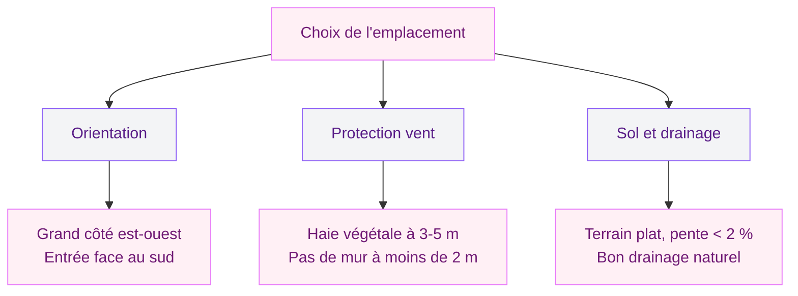

# Serre tunnel : le guide complet pour l'installer toi-même

Tu rêves de prolonger tes récoltes, de démarrer tes semis plus tôt au printemps et de protéger tes plants du gel ? La serre tunnel est la solution la plus accessible pour y arriver. Pas besoin d'être maçonne ou d'avoir un budget dingue - avec un bon plan, des bras motivés et un week-end devant toi, tu peux monter ta propre serre tunnel et commencer à jardiner sous abri.

Je te dis tout : comment choisir l'emplacement, quel modèle prendre selon ton budget, les étapes de montage concrètes, et surtout les erreurs classiques qui font perdre du temps (et de l'argent).

## Pourquoi choisir une serre tunnel plutôt qu'une serre rigide ?

La serre tunnel, c'est une structure en arceaux métalliques recouverte d'une bâche plastique (polyéthylène). Son avantage principal ? Le rapport qualité-prix. Pour le même budget qu'une petite serre en verre de 6 m2, tu obtiens une serre tunnel de 12 à 18 m2.

Quelques chiffres concrets :

- **Serre tunnel 9 m2 (3x3 m)** : de 80 à 200 euros (Outsunny, Vounot, Gardebruk)
- **Serre tunnel 18 m2 (3x6 m)** : de 200 à 500 euros (Shelterlogic, Jany, Richel Pro)
- **Serre en verre 6 m2** : à partir de 800 euros minimum (Lams, ACD, Juliana)

> [!TIP]
> Pour un premier achat, la taille 3x6 m (18 m2) est le meilleur compromis. Assez grande pour organiser tes cultures, mais pas trop imposante pour le montage à deux personnes. Richel propose un modèle à environ 350 euros qui tient bien la route.

L'autre avantage : la serre tunnel est démontable. Si tu es locataire ou si tu veux la déplacer dans deux ans, c'est possible. Essaie de faire ça avec une serre en verre scellée sur un muret en béton...

## Bien choisir l'emplacement : la clé de tout

L'emplacement, c'est 80 % de la réussite de ta serre. Un mauvais choix et tu vas galérer avec la condensation, le vent, ou le manque de lumière. Voici les critères à cocher :

### Orientation

Place ta serre avec le grand côté orienté est-ouest. Les faces latérales captent le soleil du matin et du soir, et la face longue reçoit le soleil du sud toute la journée. En hiver, c'est cette orientation qui maximise l'ensoleillement.

L'entrée doit être placée face au sud ou du côté opposé au vent dominant. En France, les vents dominants viennent souvent de l'ouest ou du nord-ouest - adapte selon ta région.

### Protection contre le vent

Le vent est l'ennemi numéro un de la serre tunnel. Une rafale à 80 km/h peut arracher ta bâche ou plier tes arceaux si la serre est en plein courant d'air. L'idéal ? Une haie végétale à environ 3 à 5 mètres de distance, qui filtre le vent sans créer de turbulences.

> [!WARNING]
> Ne colle jamais ta serre directement contre un mur ou un bâtiment. Le vent crée des effets de tourbillon à proximité des obstacles solides, ce qui est pire qu'un vent direct. Garde au moins 2 mètres de distance avec toute construction.

### Sol et drainage

Le terrain doit être le plus plat possible. Une pente de plus de 2 % va poser des problèmes d'écoulement d'eau à l'intérieur. Si ton terrain est en légère pente, installe la serre perpendiculairement à la pente pour que l'eau s'écoule uniformément.

Pour le drainage, évite les zones où l'eau stagne après la pluie. Si tu as un sol argileux qui retient l'eau, prévois une couche de gravier de 5 à 10 cm sous la serre, ou des rigoles d'évacuation sur les côtés.

## Le matériel nécessaire avant de commencer

Avant d'ouvrir le carton, prépare tout le matériel complémentaire. Rien de pire que de s'arrêter en plein montage parce qu'il te manque un maillet.

**Outils :** maillet en caoutchouc, clé à pipe (10 ou 13 mm), mètre ruban 5 m, niveau à bulle, cordeau et piquets, échelle stable.

**Matériel complémentaire (pas toujours inclus) :**
- Piquets d'ancrage supplémentaires : 15 à 30 euros le lot de 4 (Richel, Shelterlogic)
- Clips de fixation pour la bâche : environ 10 euros le lot de 20
- Scotch de réparation pour bâche : 8 à 12 euros le rouleau (Sofareb, Atoutloisir)

> [!NOTE]
> Les kits d'entrée de gamme (moins de 150 euros) incluent rarement un système d'ancrage costaud. Prévois 30 à 50 euros en plus pour des piquets en acier galvanisé ou des platines de sol - ça évite de retrouver ta serre chez le voisin après la première tempête.

## Montage étape par étape

Le montage d'une serre tunnel prend entre 3 et 6 heures à deux personnes. Seul, c'est faisable mais beaucoup plus pénible - surtout pour la mise en place de la bâche. Mon conseil : mobilise un pote, prévois des bières fraîches pour la fin du chantier.

### Étape 1 : Tracer au sol

Avec ton cordeau et tes piquets, trace le rectangle exact de ta serre au sol. Vérifie que les diagonales sont égales - c'est la méthode la plus fiable pour confirmer que ton rectangle est bien d'équerre. Tolérance : 2 cm maximum d'écart entre les deux diagonales.

### Étape 2 : Planter les pieds d'ancrage

Enfonce les pieds d'ancrage dans le sol en suivant ton traçage, à au moins 30 cm de profondeur. Sur sol dur, arrose la veille. L'espacement entre les pieds correspond à l'écartement des arceaux (en général 1 mètre). Vérifie que chaque pied est vertical avec ton niveau à bulle - un pied de travers, c'est un arceau tordu et une bâche qui tire mal.

### Étape 3 : Assembler les arceaux

Chaque arceau se compose de deux demi-tubes qui s'emboîtent au sommet. Assemble-les au sol, puis glisse chaque extrémité dans les pieds d'ancrage plantés à l'étape précédente.

Pour les grandes serres (plus de 4 m de long), monte les arceaux d'extrémité en premier, tends un fil au sommet, et aligne tous les autres arceaux dessus. Ça évite l'effet "serpent" où les arceaux zigzaguent.

### Étape 4 : Installer la faîtière et les renforts

La faîtière (tube horizontal reliant tous les arceaux au sommet) se fixe avec des boulons ou des colliers selon le modèle. Les barres de renfort latérales se fixent à mi-hauteur des arceaux - elles rigidifient la structure et servent de support pour les ficelles de tuteurage. Ne fais pas l'impasse dessus.

### Étape 5 : Poser la bâche

C'est l'étape la plus délicate. Attends une journée sans vent - je dis bien SANS vent. Même une brise légère transforme ta bâche en cerf-volant géant.

Déplie la bâche au sol à côté de la serre. Avec ton acolyte, faites-la passer par-dessus la structure en commençant par un pignon. Centrez-la bien (même débordement de chaque côté) puis fixez-la en partant du centre vers les extrémités. Ça évite les plis et les poches d'air.

> [!IMPORTANT]
> Tends bien la bâche mais ne la surtends pas. Le plastique se dilate avec la chaleur et se rétracte avec le froid. Si tu la tends à bloc en été, elle va se déchirer au premier coup de froid. Garde 2 à 3 cm de jeu latéral.

### Étape 6 : Fixer la bâche et les pignons

La bâche se fixe au sol de plusieurs manières :

- **Enterrement** : tu creuses une tranchée de 20 cm tout autour, tu y glisses le bord de la bâche, et tu rebouches. Méthode la plus solide et la plus étanche.
- **Profilé en aluminium** : un rail fixé sur l'embase dans lequel tu clipses la bâche. Plus propre et démontable.
- **Serre-joints ou clips** : solution rapide mais moins durable. OK pour les serres de moins de 12 m2.

Pour les pignons (les côtés courts), soit tu replies la bâche principale, soit tu installes des pignons séparés avec porte. Le pignon avec porte et lucarne de ventilation est le top - compte 40 à 80 euros en supplément si ce n'est pas inclus dans le kit.

## Ancrage : ne saute pas cette étape

L'ancrage, c'est ce qui sépare une serre qui tient 10 ans d'une serre qui s'envole au premier orage. Et pourtant, c'est la partie que tout le monde bâcle.

- **Piquets en T enfoncés à 40 cm** : la solution standard, incluse dans la plupart des kits. Correct pour les zones peu ventées. Environ 3 euros la pièce.
- **Vis de sol (hélicoïdales)** : s'enfoncent dans le sol comme une grosse vis. Plus résistant que les piquets droits, surtout en sol meuble. Entre 8 et 15 euros la pièce (Ground Anchor, Krinner).
- **Platines à boulonner sur dalle** : si ta serre est installée sur une surface bétonnée. Kit de 4 platines autour de 25 euros.

Pour une serre de 18 m2, prévois au minimum 6 points d'ancrage de chaque côté, plus 2 par pignon. Ça fait 16 points minimum. En zone ventée (littoral, vallée encaissée, altitude), double ce nombre.

## Ventilation : le détail qui change tout

Une serre fermée en plein soleil, c'est un four. Les températures peuvent monter à 50°C en été si tu ne ventiles pas. Et à cette température, tes plants grillent en quelques heures.

Les solutions de ventilation :

- **Ouvertures aux pignons** : le minimum. Deux ouvertures face à face créent un courant d'air naturel.
- **Latérales retroussables** : certains modèles ont des bâches latérales qui se roulent vers le haut. Très efficace et pas cher en supplément (souvent 30 à 60 euros).
- **Lucarne de faîtage** : une ouverture en haut de la serre, là où l'air chaud s'accumule. Le top pour évacuer la chaleur par convection naturelle.

Si tu cultives des tomates sous serre tunnel (et c'est souvent le projet numéro un), la ventilation est ta priorité. Les tomates détestent l'humidité stagnante - c'est la porte ouverte au mildiou.

Si tu veux aller plus loin dans l'aménagement de ton jardin, jette un oeil à nos idées pour [créer un jardin zen](/guides/exterieur/comment-creer-un-jardin-zen-en-7-etapes/) ou pour [aménager une terrasse sécurisée](/guides/exterieur/renovez-votre-terrasse-pour-la-securite/) juste à côté de ta serre.

## Entretien et durée de vie

Une serre tunnel bien entretenue dure 8 à 15 ans pour la structure, et 3 à 5 ans pour la bâche.

**Chaque saison :** vérifie la tension de la bâche, nettoie-la à l'eau savonneuse (pas de nettoyeur haute pression !), et contrôle les fixations.

**Chaque année :** inspecte les arceaux pour la rouille (un coup de spray Rustol et c'est réglé), et vérifie que les piquets d'ancrage ne se sont pas desserrés.

**Tous les 3 à 5 ans :** change la bâche. Un film polyéthylène 200 microns coûte 60 à 120 euros (Atoutloisir, Richel).

## Les erreurs à éviter absolument

1. **Monter seul par jour de vent.** Je le répète : la bâche, c'est à deux et par temps calme. Point final.
2. **Oublier le film anti-UV.** Les bâches premiers prix n'ont pas de traitement anti-UV. Résultat : le plastique se dégrade en 12 à 18 mois et devient cassant. Vérifie que la bâche est certifiée "200 microns anti-UV" minimum.
3. **Négliger la ventilation.** J'ai vu des gens perdre toute leur production de tomates parce que la serre était hermétiquement fermée en juillet. Ouvre, ventile, fais circuler l'air.
4. **Poser la serre sur un terrain non préparé.** L'herbe sous la serre va pourrir, créer de l'humidité et attirer les limaces. Désherbe, nivelle, et pose un paillage au sol (toile tissée à 0,50 euro le m2 chez Brico Dépôt).
5. **Sous-dimensionner l'ancrage.** Les petits piquets en plastique fournis avec les kits pas chers, c'est décoratif. Investis dans du vrai ancrage métallique.

Pour le sol à l'intérieur de ta serre, tu peux t'inspirer des techniques de [pose de bordures sans béton](/guides/exterieur/poser-bordure-jardin-sans-beton/) pour délimiter tes espaces de culture. Et si tu veux bricoler une [jardinière maison](/guides/exterieur/diy-jardiniere/) pour mettre devant l'entrée, c'est un joli complément.

## Budget total réaliste

Parce que le prix affiché sur le carton, c'est rarement le budget final. Voici une estimation honnête pour une serre tunnel de 18 m2 :

| Poste | Budget |
|-------|--------|
| Kit serre tunnel 3x6 m | 250 - 450 euros |
| Ancrage renforcé | 30 - 60 euros |
| Système de ventilation latérale | 30 - 60 euros |
| Toile de paillage au sol | 15 - 25 euros |
| Outillage (si tu n'as rien) | 30 - 50 euros |
| **Total** | **355 - 645 euros** |

Un investissement qui se rentabilise vite : une famille de 4 personnes économise facilement 500 à 800 euros par an en courses en cultivant sous serre. En deux saisons, c'est remboursé.

> [!TIP]
> Guette les soldes de fin de saison (septembre-octobre) chez Leroy Merlin, Gamm Vert ou Truffaut. Les serres tunnel sont souvent bradées à -30 % voire -50 % quand les jardineries font de la place pour les articles d'automne.

## Sur le meme theme

- [jardinières suspendues diy](/guides/exterieur/6-idees-pour-fabriquer-des-jardinieres-suspendues-maison/)

## FAQ

### Faut-il un permis de construire pour une serre tunnel ?

Non, pas pour les serres de moins de 1,80 m de haut au faîtage. Au-delà, une déclaration préalable de travaux suffit dans la plupart des communes pour les structures de moins de 20 m2. Au-dessus de 20 m2, un permis de construire est demandé. Renseigne-toi à ta mairie avant de te lancer.

### Quelle est la meilleure période pour installer une serre tunnel ?

Le début du printemps (mars-avril) est idéal : le sol n'est plus gelé, les températures sont douces pour travailler, et tu as toute la saison devant toi. L'automne (septembre-octobre) marche aussi si tu veux protéger tes cultures d'hiver.

### Combien de temps dure le montage d'une serre tunnel ?

À deux personnes, compte 3 à 4 heures pour une serre de 9 à 12 m2, et 5 à 6 heures pour un modèle de 18 m2 ou plus. Seul, multiplie par 1,5 à 2. Prévois une demi-journée complète pour être tranquille.

### La serre tunnel résiste-t-elle à la neige ?

Les modèles avec arceaux renforcés (tubes de 32 mm ou plus) supportent une charge de neige légère (5 à 10 cm). Mais une grosse chute de neige peut écraser la structure. En zone de montagne ou de neige fréquente, choisis un modèle avec des arceaux doubles et enlève la neige régulièrement avec un balai à manche long.
