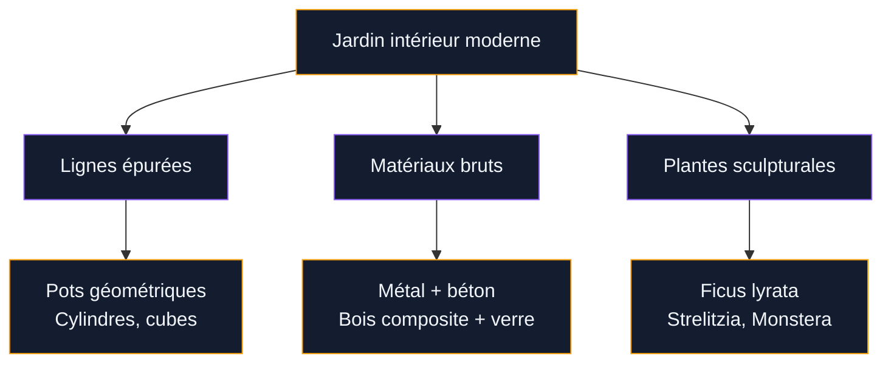
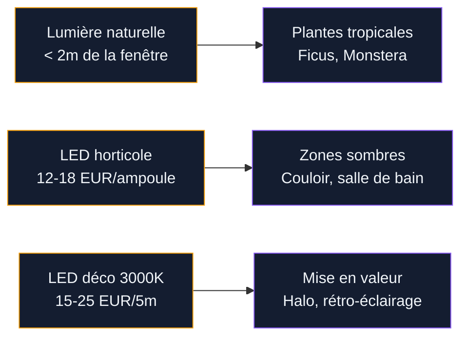

Tu rêves d'un coin de verdure chez toi, mais tu n'as ni terrasse ni balcon ? Bonne nouvelle : le jardin intérieur moderne n'a plus rien a voir avec le ficus poussérieux posé dans un coin sombre du salon. Aujourd'hui, on parle de compositions végétales pensées comme du mobilier, avec des lignes épurées, des matériaux bruts et des plantes choisies pour leur silhouette autant que pour leur résistance.

J'ai passé des semaines a analyser les tendances chez Houzz, Pinterest et dans les showrooms de paysagistes comme E-paysages et Unep. Le constat est clair : le jardin d'intérieur est devenu un vrai élément de décoration, au même titre qu'un canapé ou une oeuvre d'art. Et le meilleur dans tout ca ? C'est accessible a tous les budgets, du studio de 25 m2 a la maison avec double hauteur sous plafond.

## Les principes du jardin intérieur moderne

Un jardin intérieur moderne repose sur trois piliers : la simplicité des lignes, le contraste des matériaux et l'intégration fluide avec le reste de la pièce. On ne cherche pas a recréer une jungle - on veut un espace végétal qui dialogue avec l'architecture.

  

### Lignes épurées et design minimaliste

Le mot d'ordre, c'est "moins mais mieux". Un grand pot en béton fibré avec un seul olivier nain a plus d'impact visuel que dix petits pots dispersés sur une étagère. Les formes géométriques dominent : cylindres, cubes, cônes. Les cache-pots en métal brossé, en terrazzo ou en résine colorée remplacent les traditionnelles jardinières en terre cuite.

**Budget repère :** Un pot cylindrique en béton fibré de 60 cm de diamètre coûte entre 80 et 150 EUR chez Truffaut ou Botanic. Chez Deroma ou Elho, tu trouves des modèles design en résine recyclée a partir de 35 EUR.

### Intégration intérieur/extérieur

La tendance forte, c'est le continuum végétal. Si tu as une baie vitrée, prolonge le vert de ton jardin ou de ta terrasse vers l'intérieur. Place des plantes similaires des deux côtés de la vitre pour créer une perspective qui efface la frontière entre dedans et dehors. Les architectes d'intérieur appellent ca le "indoor-outdoor flow" - et ca marche même si ton "extérieur" se résume a un rebord de fenêtre.

> [!TIP]
> Place tes plantes les plus hautes (ficus lyrata, strelitzia) près de la baie vitrée et diminue progressivement la hauteur vers l'intérieur de la pièce. Ca crée une transition naturelle qui guide le regard.

### Matériaux contemporains

Le jardin intérieur moderne joue sur le contraste entre le vivant et le minéral. Les matériaux phares en 2026 :

- **Métal noir mat** : supports, étagères, cache-pots. Chez IKEA, la série Bittergurka propose des cache-pots suspendus a 12 EUR.
- **Bois composite ou chêne clair** : pour les meubles-jardinières et les étagères botaniques. Un meuble échelle en chêne chez Maisons du Monde coûte environ 130 EUR.
- **Béton ciré** : pour les bacs et les tablettes. Le kit béton ciré Mercadier (15 EUR le pot de 500 ml) te permet de transformer n'importe quel pot basique.
- **Verre** : terrariums, cloches, vases architecturaux. Un terrarium géométrique de 30 cm coûte 25 a 45 EUR chez Nature & Découvertes.

## Les plantes stars du jardin intérieur design

Toutes les plantes ne rentrent pas dans un décor moderne. Il faut des silhouettes graphiques, un feuillage qui a du caractère et une bonne tolérance a la culture en intérieur. Voici ma sélection, testée dans mon propre appartement.

  

### Les grandes sculpturales (plus de 1 m)

- **Ficus lyrata** (figuier lyre) : Grandes feuilles en forme de violon, port dressé. C'est LA plante du moment pour les intérieurs design. Compte 50 a 80 EUR pour un sujet de 1,20 m chez Botanic ou Jardiland. Il aime la lumière vive mais pas le soleil direct.
- **Strelitzia nicolai** (oiseau du paradis géant) : Feuilles immenses en éventail, port tropical imposant. 60 a 120 EUR selon la taille. Attention, il a besoin de beaucoup de lumière.
- **Dracaena marginata** : Tronc fin et graphique, touffe de feuilles en étoile. Résistant et peu exigeant, c'est un bon choix pour un premier grand sujet. 30 a 60 EUR.

### Les moyennes architecturales (50 cm a 1 m)

- **Monstera deliciosa** : Feuilles découpées iconiques, pousse rapide, s'adapte a la mi-ombre. 20 a 40 EUR en jardinerie. Le [scindapsus pictus](/entretenir-du-scindapsus-pictus-la-plante-robuste-qui-a-tout-pour-plaire/) est un bon complément pour les zones moins lumineuses.
- **Sansevieria** (langue de belle-mère) : Feuilles verticales en lames, quasi indestructible. Parfaite dans un pot en métal noir. 15 a 25 EUR.
- **Zamioculcas** : Tiges charnues, feuillage brillant, supporte l'ombre et l'oubli d'arrosage. 15 a 30 EUR.

### Les petites graphiques (moins de 50 cm)

- **Pilea peperomioides** (plante a monnaie chinoise) : Feuilles rondes sur tiges fines, très instagrammable. 8 a 15 EUR.
- **Calathéa orbifolia** : Feuillage rayé vert et argent, port arrondi. Demande de l'humidité. 15 a 25 EUR.
- **Succulentes en collection** : Echeveria, haworthia, crassula. Un plateau de 6 succulentes coûte 15 a 20 EUR chez Truffaut. Idéales dans un terrarium ou alignées sur un rebord de fenêtre.

> [!NOTE]
> Toutes ces plantes se trouvent facilement en jardinerie (Truffaut, Botanic, Jardiland) mais aussi en ligne. Les sites comme Bergamotte ou Begreen livrent des plantes de bonne qualité avec le pot assorti, souvent moins cher qu'en magasin pour les gros sujets.

## 5 compositions modernes a reproduire chez toi

  

### 1. Le coin jungle minimaliste

Un angle de pièce, trois plantes de tailles différentes (un ficus lyrata, une monstera, un zamioculcas), trois pots en béton de dimensions décroissantes. Ajoute un petit tabouret en bois pour surélever la plus petite plante. C'est sobre, c'est chic, et ca prend moins d'1 m2 au sol.

**Budget total :** 150 a 250 EUR (plantes + pots).

### 2. L'étagère botanique

Une étagère échelle ouverte contre un mur (type IKEA Satsumas a 40 EUR ou Maisons du Monde a 130 EUR). Sur chaque plateau, une plante différente : trailing pothos en haut, calathéa au milieu, collection de succulentes en bas. Mélange les textures de pots - un en céramique blanche, un en métal cuivré, un en terre brute.

### 3. Le mur végétal cadré

Un cadre végétal stabilisé de 60 x 40 cm accroché comme un tableau. Pas d'arrosage, pas d'entretien - la mousse et les plantes sont conservées naturellement. Flowerbox propose des cadres a partir de 90 EUR. C'est parfait au-dessus d'un canapé ou dans une entrée. Pour aller plus loin, jette un oeil aux [jardins verticaux](/jardins-verticaux-de-40-photos-dinspiration-verte/) qui offrent encore plus de possibilités.

### 4. Le terrarium XXL

Un terrarium en verre de 40 a 60 cm de diamètre posé sur une table basse ou une console. A l'intérieur : fougères miniatures, mousse, fittonia, petites pierres. C'est un micro-écosystème autonome qui ne demande presque aucun soin. Budget : 50 a 100 EUR tout compris.

### 5. La jardinière-cloison

Un bac rectangulaire en métal ou en bois composite de 120 x 30 cm, posé sur pieds, qui sépare deux zones d'une pièce ouverte. Remplis-le de sansevierias ou de bambous d'intérieur. Ca structure l'espace sans le fermer. La jardinière Lechuza Balconera (environ 60 EUR) avec son réservoir intégré fait très bien l'affaire.

> [!WARNING]
> Les pots XXL en intérieur posent un vrai problème de poids. Un bac de 80 cm rempli de terreau humide dépasse facilement 40 kg. Vérifie que ton plancher supporte la charge, surtout en étage. Et place toujours une soucoupe étanche sous le pot - une fuite d'eau sur un parquet, c'est un cauchemar.

## L'éclairage : le secret d'un jardin intérieur réussi

La lumière fait ou défait un jardin d'intérieur. Et en appartement, c'est souvent le facteur limitant. Quelques règles concrètes.

  

**Distance a la fenêtre.** Au-dela de 2 mètres d'une fenêtre, la luminosité chute de 75 %. Tes plantes tropicales (monstera, ficus) doivent rester dans cette zone de 2 mètres. Au-dela, il te faut un éclairage d'appoint.

**Les LED horticoles.** Les barres LED full spectrum imitent la lumière du soleil. La marque Sansi propose des ampoules horticoles a culot E27 (15 W, spectre complet) pour 12 a 18 EUR sur Amazon. Une seule ampoule suffit pour éclairer 4 a 6 plantes dans un rayon de 50 cm.

**Le rétro-éclairage décoratif.** Un ruban LED blanc chaud (3000 K) placé derrière une grande plante crée un effet de halo qui met en valeur la silhouette du feuillage. C'est purement décoratif, ca n'aide pas la photosynthèse, mais le rendu le soir est spectaculaire. Un rouleau de 5 m coûte 15 a 25 EUR.

## Espaces fonctionnels : adapter le jardin intérieur a chaque pièce

Le jardin intérieur moderne n'est pas qu'un objet décoratif. Il s'intègre dans tes habitudes de vie.

  

**Salon.** C'est la pièce la plus adaptée aux grandes compositions. Un ficus lyrata dans un pot surdimensionné près du canapé, un terrarium sur la table basse, et quelques trailing plants sur une étagère haute. Les perspectives courtes vers un élément végétal fort, c'est exactement ce que les paysagistes recommandent pour donner de la profondeur a un espace.

**Cuisine.** Un jardin aromatique vertical : basilic, persil, ciboulette, menthe. Le système Veritable (75 EUR) ou le Click & Grow (100 EUR) proposent des jardins d'intérieur connectés avec éclairage intégré. Tu récoltes tes herbes fraiches toute l'année.

**Salle de bain.** L'humidité naturelle de la pièce est parfaite pour les fougères, les calathéas et les pothos. Un pot suspendu au-dessus de la baignoire ou une petite étagère près de la douche - et ta salle de bain prend des airs de spa tropical.

**Bureau.** Deux ou trois petites plantes (pilea, succulentes, petite fougère) sur le bureau réduisent le stress et améliorent la concentration. Plusieurs études menées par l'Université d'Exeter montrent une hausse de 15 % de productivité dans les bureaux végétalisés.

Pour un aménagement extérieur qui prolonge cette atmosphère, découvre les [cours et jardins d'inspiration mexicaine](/jardins-et-cours-mexicains-images-et-idees-pour-linspiration/) ou les [jardins zen](/comment-creer-un-jardin-zen-en-7-etapes/).

## Entretien simplifié : la routine qui marche

Le piège classique du jardin d'intérieur, c'est l'arrosage. Soit on noie les plantes, soit on les oublie. Voici ma routine hebdomadaire - 15 minutes par semaine, pas plus.

**Lundi : inspection rapide.** Je fais le tour de mes plantes, je vérifie l'état des feuilles (jaunissement, taches, parasites) et je touche le substrat du doigt. Si c'est sec sur 2 cm de profondeur, j'arrose. Sinon, j'attends.

**Mercredi : arrosage des tropicales.** Monstera, ficus, calathéa - ces plantes aiment un substrat constamment humide (mais pas détrempé). J'utilise de l'eau a température ambiante, jamais froide.

**Samedi : brumisation.** Un coup de brumisateur sur les feuillages tropicaux. Ca augmente l'humidité locale et ca empêche les bords des feuilles de brunir. Un brumisateur en verre coûte 8 a 15 EUR.

> [!IMPORTANT]
> Le drainage est la clé de tout. Chaque pot doit avoir un trou au fond et une couche de billes d'argile (2 a 3 cm). Sans ca, les racines baignent dans l'eau et pourrissent en quelques semaines. Pas de compromis sur ce point.

**Engrais.** Une fois par mois de mars a septembre, un bouchon d'engrais liquide universel (Fertiligène, 8 EUR le litre) dans l'eau d'arrosage. Rien de plus.

## Sur le meme theme

- [conteneur maritime au jardin](/comment-transformer-votre-jardin-avec-un-conteneur-maritime/)

## FAQ - Jardins intérieurs modernes

**Quel budget prévoir pour un jardin intérieur moderne ?**
Ca dépend de ton ambition. Pour un coin végétal avec 3 plantes et des pots design, compte 100 a 200 EUR. Pour une composition complète avec étagère botanique, terrarium et 6 a 8 plantes, prévois 300 a 500 EUR. Un mur végétal stabilisé ou un jardin connecté type Click & Grow, c'est 100 a 300 EUR.

**Quelles plantes d'intérieur résistent au manque de lumière ?**
Le zamioculcas, la sansevieria et le pothos sont les champions de la survie en basse luminosité. Le spathiphyllum (fleur de lune) fleurit même avec peu de soleil. Evite en revanche le ficus lyrata et le strelitzia, qui dépérissent sans lumière vive.

**Comment éviter les moucherons dans un jardin d'intérieur ?**
Les moucherons du terreau (sciarides) adorent les substrats humides. Pour les éloquer : laisse sécher le terreau entre deux arrosages, couvre la surface avec des billes d'argile ou du sable décoratif, et place un piège jaune collant (2 EUR les 20) près de tes plantes. Si l'infestation persiste, arrose avec un mélange d'eau et de savon noir (une cuillère a soupe par litre).

**Un jardin intérieur peut-il vraiment purifier l'air ?**
L'étude NASA de 1989 a montré que certaines plantes filtrent des polluants (formaldéhyde, benzène, trichloréthylène). Mais pour un effet mesurable, il faudrait une densité de plantes que personne n'a chez soi. En pratique, ton jardin d'intérieur améliore surtout l'humidité ambiante (utile en hiver avec le chauffage) et ton bien-être psychologique - ce qui est déja beaucoup.
