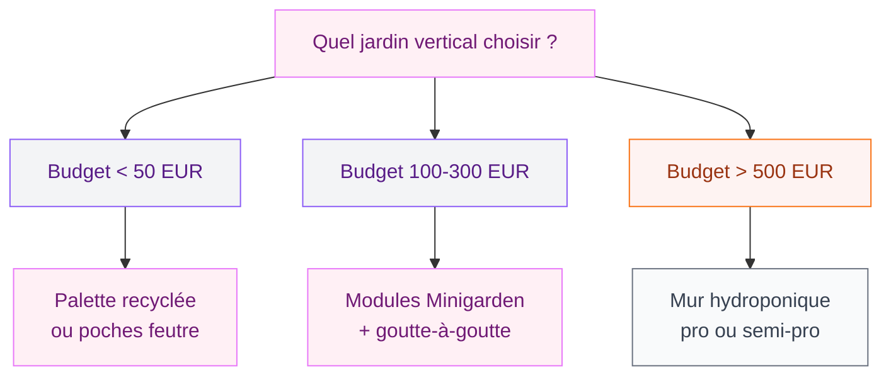

Tu vois ces façades couvertes de verdure sur Instagram et tu te demandes si c'est possible chez toi ? La réponse est oui - et c'est bien plus accessible que tu ne le penses. Que tu aies un grand mur de jardin, un balcon de 3 m2 ou même un couloir d'entrée un peu triste, le jardin vertical s'adapte à toutes les configurations.

Le concept est simple : au lieu de planter au sol, tu plantes à la verticale. Sur un mur, une clôture, une structure en métal ou en bois, avec des poches en feutre, des modules empilables ou un vrai système hydroponique. Le résultat ? Un mur vivant qui purifie l'air, isole du bruit, rafraîchit en été et donne un cachet dingue à n'importe quel espace.

Je t'ai sélectionné 40 photos qui couvrent tous les styles - du mur végétal intérieur minimaliste au jardin vertical potager sur balcon. Et surtout, pour chaque style, je te donne les infos concrètes : budget, plantes adaptées, entretien réel.

## Les 4 grands types de jardins verticaux

Avant de te lancer, il faut comprendre qu'il existe plusieurs familles de murs végétaux. Le choix dépend de ton budget, de ton espace et du temps que tu veux y consacrer.

  

### 1. Le mur végétal en poches de feutre

C'est le système le plus répandu pour débuter. Des poches en feutre géotextile sont fixées sur un support (plaque de PVC, palette, grillage). Chaque poche accueille une plante avec son substrat. L'arrosage est manuel ou par goutte-à-goutte.

**Budget :** Un kit Flowall 8 poches coûte environ 35 à 50 EUR chez Truffaut. Pour un mur complet de 2 m2, compte 150 à 250 EUR en modules.

**Avantages :** Léger, démontable, pas cher. Parfait pour un balcon ou un mur intérieur près d'une fenêtre.

**Limites :** L'arrosage demande de la régularité. Sans goutte-à-goutte, il faut arroser 2 à 3 fois par semaine en été.

> [!TIP]
> Pour un premier essai, commence par un panneau de 60 x 40 cm avec 6 à 8 poches. Tu testes les plantes, tu ajustes l'arrosage, et tu agrandis ensuite. Moins de 40 EUR pour expérimenter, c'est raisonnable.

### 2. Le mur végétal modulaire

Des modules en plastique recyclé ou en céramique s'emboîtent comme des briques Lego. Chaque module contient son propre réservoir d'eau. Les marques comme Minigarden (portugaise) ou Vertiwall proposent des systèmes bien pensés.

**Budget :** Le kit Minigarden Vertical 3 niveaux est à environ 25 EUR (Amazon, Leroy Merlin). Pour couvrir 1 m2, prévois 4 à 5 kits, soit 100 à 125 EUR.

**Avantages :** Le réservoir intégré réduit l'arrosage à une fois par semaine. Le montage est vraiment simple - pas de perceuse, des fixations adhésives suffisent pour les petits formats.

### 3. Le mur végétal hydroponique

C'est le système pro, celui des façades d'hôtels, des restaurants et des aéroports. Les plantes poussent sans terre, dans un substrat inerte (sphaigne, laine de roche, billes d'argile) alimenté par une solution nutritive en circuit fermé.

**Budget :** Là où ça pique. Un système hydroponique clé en main démarre autour de 800 EUR pour 2 m2 (matériel + pompe + minuterie). L'installation par un professionnel comme Vertiss ou Neogarden coûte entre 500 et 1 200 EUR/m2 selon la complexité.

**Avantages :** Rendu spectaculaire, croissance rapide, densité végétale maximale. C'est ce qu'on voit sur les réalisations de Patrick Blanc, le pionnier français du mur végétal.

### 4. Le jardin vertical en structure bois ou palette

Le plus DIY de tous. Tu recycles une palette ou tu construis une structure en tasseaux, tu y fixes des pots, des gouttières ou des jardinières. C'est le système parfait pour un [potager vertical sur terrasse](/diy-jardiniere/) ou un mur d'aromatiques près de la cuisine.

**Budget :** Une palette gratuite + un rouleau de géotextile (5 EUR) + du terreau (8 EUR) = moins de 20 EUR. Difficile de faire moins cher.

## 10 plantes qui marchent vraiment en vertical

Toutes les plantes ne supportent pas la culture verticale. Il leur faut des racines peu profondes, une tolérance à l'enracinement réduit et une bonne capacité d'adaptation à l'ombre partielle. Voici ma sélection testée et approuvée.

  

### Pour l'extérieur

- **Heuchère** : Feuillage coloré (pourpre, vert lime, caramel), résiste au gel, pousse bien en situation verticale. 4 à 6 EUR le godet chez Jardiland.
- **Fougère de Boston** : Volume généreux, retombante, adore l'humidité. Parfaite pour un mur ombragé. 8 à 12 EUR en pot de 14 cm.
- **Sédum** : Plante grasse ultrarésistante, quasi zéro entretien, supporte le plein soleil et la sécheresse. 3 à 5 EUR le godet. Idéal pour les murs sud.
- **Lierre** : Le grand classique. Pousse vite, s'accroche seul, persistant. Mais attention - il peut endommager les joints de maçonnerie si ton mur est ancien.
- **Fraisier** : Oui, des fraises en vertical ! Les variétés remontantes comme 'Mara des Bois' donnent des fruits de juin à octobre. 2 à 4 EUR le plant.

### Pour l'intérieur

- **Pothos** (Epipremnum aureum) : La star des murs végétaux d'intérieur. Tiges retombantes, supporte le manque de lumière, purifie l'air. 5 à 8 EUR chez Ikea ou Botanic.
- **Chlorophytum** : Increvable, produit des stolons qui cascadent le long du mur. Très graphique.
- **Fittonia** : Petit feuillage nervuré rose ou blanc, compact, adore l'humidité d'un mur végétal. 4 à 6 EUR le pot.
- **Tradescantia** : Feuillage violet et argenté, pousse vite, retombe joliment. 5 à 9 EUR.
- **Asplénium (fougère nid d'oiseau)** : Larges frondes vertes, donne un côté tropical. 10 à 15 EUR en jardinerie.

> [!NOTE]
> Pour un mur végétal intérieur, la luminosité est le facteur numéro un. Si ton mur reçoit moins de 4 heures de lumière indirecte par jour, ajoute une rampe LED horticole (30 à 60 EUR chez Amazon). Sans ça, même les plantes d'ombre vont péricliter en quelques mois.

## Jardin vertical intérieur : les 15 plus belles inspirations

Le mur végétal intérieur, c'est le truc qui transforme un salon banal en showroom Pinterest. Et la bonne nouvelle, c'est que ça fonctionne dans des pièces de tailles très différentes.

  

**Style minimaliste** : Un panneau de 1 m2 avec 3 variétés maximum (pothos, fougère, chlorophytum) sur un mur blanc. L'effet est net, contemporain, pas surchargé. Ça se marie bien avec un [intérieur aux couleurs tendance 2026](/couleurs-dinterieur-de-mur-et-de-peinture-a-la-mode-2026/).

**Style jungle tropicale** : Tout un mur recouvert, du sol au plafond, avec une vingtaine d'espèces mélangées. Monstera, philodendron, calathéa, fougères... C'est généreux, vivant, un peu sauvage. Budget conséquent (500 à 1 500 EUR selon la surface) mais l'impact visuel est maximum.

**Style cadre végétal** : Un cadre de 40 x 60 cm avec des succulentes géométriquement placées. Ça se pose sur un meuble ou s'accroche comme un tableau. Les kits Flowerbox proposent ça à partir de 60 EUR. Parfait pour un bureau ou une entrée.

**Style cuisine aromatique** : 4 à 6 pots d'herbes (basilic, persil, ciboulette, menthe, thym) alignés verticalement près de la fenêtre de cuisine. Utile et décoratif. Un support mural Ikea Sunnersta + les herbes, c'est environ 25 EUR.

## Jardin vertical extérieur : 15 idées pour terrasses et balcons

Dehors, les possibilités explosent. Ton jardin vertical peut jouer plusieurs rôles à la fois : décoratif, nourricier, intimité, isolation phonique.

  

**Mur de clôture végétal** : Tu fixes des panneaux de treillis contre ta clôture et tu plantes des grimpantes (jasmin étoilé, chèvrefeuille, clématite). En 2 saisons, ta clôture devient un mur vert odorant. Budget : 30 à 50 EUR de treillis + 20 à 40 EUR de plantes grimpantes.

**Potager vertical sur balcon** : Des gouttières en PVC fixées en escalier sur un mur. Tu y plantes des salades, des fraisiers, des herbes. C'est la solution pour ceux qui veulent manger local quand on n'a que 2 m2 de balcon.

> [!WARNING]
> Sur un balcon, vérifie la charge maximale autorisée (indiquée dans le règlement de copropriété ou le bail). Un mur végétal avec substrat humide pèse entre 30 et 50 kg/m2. Pour un grand panneau, ça peut vite devenir lourd.

**Jardin vertical autour de la piscine** : Des murs de verdure qui encadrent la zone baignade et ajoutent de la hauteur, de l'intimité et un fond photographique superbe. Les réalisations de Vertiss et Art Contracting au Moyen-Orient montrent le potentiel de ces installations sur des surfaces de 40 m2 et plus.

**Façade végétalisée** : Le niveau au-dessus. La Cité du chocolat Valrhona à Valence (182 m2 de façade végétale par Valente) ou les cours intérieures parisiennes réalisées par Envert (227 m2) sont des exemples concrets de ce que peut donner un mur végétal à grande échelle. En résidentiel, des entreprises comme Jardins de Gally proposent des solutions adaptées aux particuliers.

## Comment installer ton jardin vertical : guide pas à pas

  

### Matériel de base pour un mur en poches de feutre (2 m2)

- Support : plaque PVC expansé 200 x 100 cm (20 EUR chez Castorama)
- Bâche étanche à fixer derrière le support (8 EUR)
- Poches de feutre géotextile : 24 poches (3 kits de 8 poches, environ 40 EUR chaque)
- Terreau allégé (mélange terreau + perlite) : 2 sacs de 20 L (12 EUR)
- Système goutte-à-goutte : kit de base avec minuterie (25 à 40 EUR chez Gardena)
- Plantes : 24 godets à 5 EUR en moyenne = 120 EUR
- Fixations murales : chevilles + vis inox (10 EUR)

**Total : environ 300 à 350 EUR pour 2 m2 de mur végétal.**

### Les étapes

1. **Préparation du mur** : Vérifie que le mur supporte le poids (minimum 40 kg/m2 en charge). Fixe la bâche étanche pour protéger le mur de l'humidité.

2. **Montage du support** : Visse la plaque PVC au mur avec un espace de 2 à 3 cm pour la ventilation arrière. Utilise des cales d'espacement.

3. **Installation des poches** : Fixe les rangées de poches du bas vers le haut. Prévois 15 à 20 cm entre chaque rangée pour que les plantes aient de l'espace pour pousser.

4. **Plantation** : Remplis chaque poche de substrat allégé, installe les plantes en commençant par le haut (l'eau s'écoule vers le bas). Mets les plantes qui aiment l'humidité en bas et celles qui tolèrent la sécheresse en haut.

5. **Arrosage** : Installe le goutte-à-goutte le long de la rangée supérieure. Programme 2 à 3 arrosages de 5 minutes par jour en été, 1 en hiver.

## Entretien : ce qu'on ne te dit pas

Le jardin vertical, c'est beau sur les photos, mais il demande un suivi régulier. Pas la peine de se mentir là-dessus.

**Arrosage** : C'est LE point critique. Sans goutte-à-goutte, tu vas te lasser très vite. Un kit Gardena avec minuterie solaire coûte 35 à 50 EUR et il te sauve la mise. Programme-le et n'y pense plus.

**Taille** : Toutes les 4 à 6 semaines, taille les plantes qui débordent. Les pothos et tradescantias poussent vite et peuvent envahir les voisines. 10 minutes de taille avec un sécateur de précision (Fiskars, 12 EUR) suffisent.

**Engrais** : Une fois par mois en période de croissance (mars à septembre), ajoute un engrais liquide universel dans l'eau d'arrosage. Le Fertiligène plantes vertes (8 EUR le litre) fait le travail. Dose moitié par rapport aux recommandations du flacon - en vertical, les racines absorbent plus vite.

**Remplacement** : Certaines plantes ne tiendront pas. C'est normal. Prévois de remplacer 10 à 15 % de tes plantes chaque année. Garde toujours quelques godets en réserve.

> [!IMPORTANT]
> L'humidité permanente derrière un mur végétal peut créer des moisissures si la ventilation est insuffisante. Assure-toi qu'il y a toujours un espace d'air entre le mur et le support, et vérifie l'état du mur une fois par an en démontant une section.

## 10 photos d'inspiration supplémentaires commentées

Pour finir cette galerie, voici les styles qui reviennent le plus souvent dans les réalisations réussies :

**Le mur de mousse stabilisée** : Pas d'entretien du tout (la mousse est morte, préservée chimiquement). Rendu velours très zen, parfait pour un salon ou un [bureau](/fabriquer-un-bureau-avec-des-caissons/). Budget : 80 à 150 EUR/m2 selon la densité.

**Le jardin vertical en escalier** : Des bacs en bois ou en métal disposés en gradin contre un mur. Chaque étage reçoit la lumière. Idéal pour un potager vertical dans un petit [jardin zen](/comment-creer-un-jardin-zen-en-7-etapes/).

**Le mur de succulentes en cadre** : Un cadre en bois avec un grillage, rempli de sphaigne et planté d'échévérias, sédums et sempervivums. Se pose à plat pendant 4 semaines le temps que les racines s'installent, puis s'accroche verticalement.

**La cloison végétale d'intérieur** : Un mur végétal double face qui sépare deux espaces (salon/salle à manger par exemple). La lumière passe, l'air circule, et tu gagnes en intimité sans perdre en luminosité.

## Sur le meme theme

- [jardins intérieurs modernes](/jardins-interieurs-modernes-photos-et-conseils-de-conception/)

## FAQ - Jardins verticaux

**Combien coûte un jardin vertical au m2 ?**
Ça dépend du système. En poches de feutre avec plantes, compte 150 à 200 EUR/m2 en DIY. En modules Minigarden, 100 à 150 EUR/m2. En hydroponique professionnel, 500 à 1 200 EUR/m2 installé. La mousse stabilisée (sans entretien) coûte 80 à 150 EUR/m2.

**Un jardin vertical tient-il en intérieur sans lumière directe ?**
Oui, à condition de choisir des plantes d'ombre (pothos, fougères, chlorophytum) et d'ajouter un éclairage LED horticole si la pièce est vraiment sombre. Compte 30 à 60 EUR pour une rampe LED adaptée à 1 m2 de mur végétal.

**Quel mur peut supporter un jardin vertical ?**
Un mur en parpaing, béton ou brique supporte sans problème un mur végétal (30 à 50 kg/m2 en charge). Pour un mur en placo, limite-toi à des petits formats légers (cadres végétaux, quelques poches). Et protège toujours le mur avec une bâche étanche entre le support et la maçonnerie.

**Le jardin vertical attire-t-il les insectes ?**
En extérieur, il attire les pollinisateurs (abeilles, papillons) - c'est plutôt positif. En intérieur, le risque principal ce sont les moucherons du terreau. Pour les éviter, couvre la surface du substrat avec des billes d'argile et laisse sécher entre deux arrosages.

**Combien de temps pour que le mur végétal soit bien fourni ?**
Le mur a fière allure dès l'installation avec des godets. Mais l'effet "mur vivant" dense arrive après 3 à 6 mois, quand les plantes se touchent et comblent les espaces vides.
