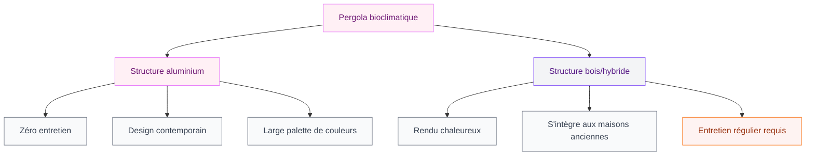
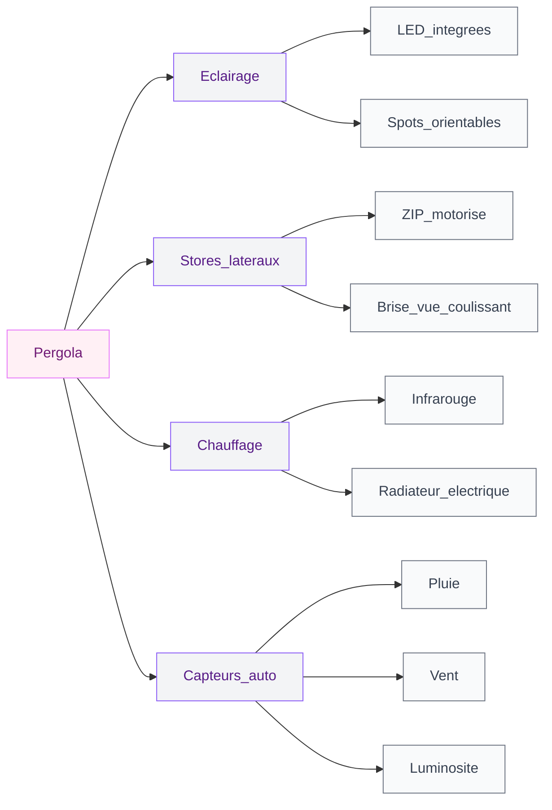

Tu regardes ta terrasse depuis la fenêtre et tu te dis que ce serait tellement bien de profiter de cet espace même quand il fait chaud, quand le vent souffle ou quand il pleut un peu ? C'est exactement le problème que règle une pergola bioclimatique. Pas un simple abri de jardin qui fait bricolage du dimanche - une vraie structure architecturale qui transforme un bout de dalles en pièce à vivre.

La pergola bioclimatique, c'est le produit outdoor qui a explosé ces dernières années, et pas pour rien. Elle joue sur plusieurs tableaux à la fois : le confort thermique, la protection des intempéries et l'esthétique de ta maison. Mais avant de signer un bon de commande, il y a des choses à comprendre pour ne pas se planter.

## Ce qu'est vraiment une pergola bioclimatique

Le mot "bioclimatique" est partout, mais ça veut dire quoi concrètement ? C'est une pergola dont le toit est composé de lames orientables en aluminium. Ces lames pivotent sur leur axe, ce qui te permet de contrôler ce qui entre : la lumière, l'air, la chaleur ou la pluie.

Quand les lames sont complètement fermées, elles forment un toit étanche. L'eau de pluie s'écoule dans les gouttières intégrées aux montants, discrètes et efficaces. Quand tu les ouvres progressivement, tu gères le flux d'air et la luminosité selon tes envies du moment.

> [!TIP]
> La majorité des pergolas bioclimatiques se pilotent via une télécommande ou une application smartphone. Certains modèles haut de gamme s'intègrent même à une domotique de maison.

Ce qui la distingue d'une véranda, c'est l'aspect ouvert sur l'extérieur. Tu restes dehors, tu respires, mais tu es protégé. Et niveau intégration dans le jardin ou sur une terrasse, c'est sans comparaison - les lignes sont souvent très propres, très architecturales.

## Les matériaux : aluminium ou bois ?

La structure en aluminium domine le marché, et c'est logique. L'aluminium thermolaqué ne rouille pas, résiste aux UV et demande zéro entretien. Tu choisis ta teinte (blanc, anthracite, gris pâle, sable, vert mousse) et tu n'y touches plus pendant des années.

Le bois existe aussi, notamment en version pergola bioclimatique hybride avec structure bois et lames alu. Ça donne un rendu plus chaud, plus organique, qui colle bien avec un jardin nature ou une maison ancienne. Mais ça demande un entretien régulier - lasure tous les deux ou trois ans minimum.

Mon conseil perso : si tu as une [maison moderne aux lignes nettes](https://www.cristallina.fr/guides/exterieur/maisons-modernes-2026-images-dexterieur-et-dinterieur/), pars sur de l'aluminium anthracite. Le rendu est net, contemporain, et ça va tout de suite ensemble. Si ta maison est plus traditionnelle avec de la pierre ou de la brique, regarde les versions avec poteaux bois.

## Les lames orientables : le coeur du système

C'est la partie qui change tout. Les lames ont généralement une largeur entre 150 et 250 mm et une épaisseur entre 50 et 80 mm. Elles pivotent de 0° (complètement fermées) à 150° environ, ce qui laisse passer l'air tout en gardant un léger effet pare-soleil.

En été, tu orientes les lames de façon à bloquer le rayonnement solaire direct mais à laisser circuler la brise. Ça fait une vraie différence sur la sensation de chaleur sous la pergola - l'ombre portée des lames + la circulation d'air, et tu passes de 38°C au soleil à quelque chose de tout à fait supportable.

En hiver ou en demi-saison, tu ouvres les lames au maximum pour profiter de l'apport thermique du soleil. Un déjeuner en plein soleil de février sous ta pergola ouverte, avec une petite brise contrôlée, c'est largement possible.

> [!NOTE]
> Certains modèles proposent des capteurs météorologiques intégrés : la pergola ferme automatiquement ses lames en cas de pluie ou de vent fort dépassé un certain seuil. Pratique si tu oublies souvent ta terrasse ouverte quand tu pars au travail.

Les gouttières intégrées dans les montants sont un détail qu'on voit peu mais qui change tout à l'expérience. Pas de filet d'eau qui tombe sur ta table ou sur toi quand tu sors sous la pergola - tout s'écoule discrètement vers le sol ou vers un système d'évacuation.

## Dimensions, quel budget prévoir ?

Les dimensions standard vont de 3x3 m pour les petites terrasses à 6x4 m ou plus pour les grands espaces. La plupart des fabricants proposent des structures modulables que tu assembles selon ta configuration.

Niveau budget, soyons honnêtes :

- **Entrée de gamme** (marques génériques, lames basiques) : 3 000 à 6 000 € posé compris
- **Milieu de gamme** (marques établies, motorisation, quelques options) : 7 000 à 15 000 €
- **Haut de gamme** (Biossun, Corradi, Renson, pergolas sur mesure) : 15 000 à 35 000 € et plus

La motorisation est souvent en option sur les modèles entrée de gamme mais incluse sur les modèles milieu et haut de gamme. Je te recommande de ne pas faire l'impasse dessus - ouvrir et fermer ses lames manuellement à la longue c'est fastidieux, et la motorisation c'est souvent 500 à 1 500 € de supplément qui valent vraiment le coup.

> [!WARNING]
> Attention aux "prix de pergola" que tu vois en ligne à 1 500-2 000 €. Ce sont souvent des structures en acier ou aluminium basique sans système bioclimatique véritable, les lames ne sont pas étanches et ne se motorisent pas correctement. Vérifie toujours les certifications de résistance au vent (minimum classe 3) et à la neige si tu habites dans une région concernée.

Si tu as déjà une terrasse bien équipée ou si tu réfléchis à [d'autres aménagements extérieurs comme un bureau de jardin](https://www.cristallina.fr/guides/exterieur/bureau-de-jardin-de-5m2-un-mauvais-concept-qui-etait-cense-etre-sympa/), il vaut mieux planifier l'ensemble du projet d'un coup pour optimiser les raccords électriques et les accès.

## Options et accessoires qui font la différence

Une pergola bioclimatique de base, c'est bien. Mais les options permettent de vraiment personnaliser l'espace.

**L'éclairage LED intégré** - Des spots ou bandeaux LED intégrés dans les poteaux ou les lames elles-mêmes. Ça évite les guirlandes bricolées et ça donne un rendu très soigné le soir. Budget : 300 à 800 € selon les modèles.

**Les stores et fermetures latérales** - Des panneaux coulissants en verre, des stores ZIP motorisés ou des brise-vues en toile. C'est ce qui transforme la pergola en véritable pièce extérieure semi-fermée. Ça protège du vent latéral et ça crée une intimité sur une terrasse exposée aux regards. Budget : 500 à 2 500 € par côté.

**Le chauffage infrarouge** - Des radiateurs infrarouges discrets fixés aux poteaux ou aux lames. Ils chauffent par rayonnement (comme le soleil) et pas l'air, ce qui est beaucoup plus efficace en extérieur. Budget : 200 à 600 € par appareil.

**La domotique** - Connexion à ton système de domotique maison ou à une application dédiée. Tu peux programmer des scénarios : ouverture automatique le matin, fermeture en cas de pluie, etc.

## Pergola adossée ou autoportante ?

C'est une question qui revient souvent. La pergola adossée s'accroche à un mur de la maison, ce qui réduit le nombre de poteaux (souvent 2 au lieu de 4) et l'intègre architecturalement au bâtiment. Elle coûte généralement moins cher à dimensions égales.

La pergola autoportante (4 poteaux) s'installe n'importe où dans le jardin, indépendamment de la maison. Elle peut couvrir un coin lounge plus éloigné, protéger un coin piscine, ou structurer un espace jardin.

Pour une pergola adossée, vérifie toujours avec un professionnel que le mur supporte les charges. Et selon les cas, une déclaration de travaux en mairie peut être obligatoire (généralement au-dessus de 20 m²).

> [!IMPORTANT]
> Au-delà de 20 m², une pergola bioclimatique nécessite généralement un permis de construire et pas seulement une simple déclaration de travaux. Renseigne-toi auprès de ta mairie avant de commander - les règles varient selon les communes et les zones.

## Quel impact sur la valeur de ta maison ?

Une pergola bioclimatique bien intégrée ajoute de la valeur à un bien. Les agents immobiliers confirment qu'un espace extérieur couvert et aménagé est un argument de vente fort, surtout dans les régions ensoleillées. On parle d'un retour sur investissement potentiel de 50 à 70% du coût d'installation lors de la revente.

Pour que ça marche sur le plan esthétique, la pergola doit être cohérente avec l'architecture de la maison. Une structure anthracite très contemporaine sur une maison provençale avec tuiles rouge, c'est souvent raté. Dans ce cas-là, des tons plus neutres (blanc cassé, beige) ou une version avec intégration bois passe mieux.

Si tu travailles sur le look extérieur global de ta maison, la pergola s'intègre dans une réflexion plus large sur les [façades et l'architecture extérieure 2026](https://www.cristallina.fr/guides/decoration/facades-de-maisons-modernes-2026/). Les deux se complètent et se renforcent quand ils sont pensés ensemble.

## Par où commencer si tu envisages d'en installer une ?

Ma stratégie : commence par faire trois devis, pas moins. Les écarts de prix et de qualité sont énormes sur ce marché. Demande systématiquement :

- Le détail des matériaux (épaisseur des profilés, certification de l'aluminium)
- La classe de résistance au vent (minimum classe 3, idéalement classe 4 en zone venteuse)
- La garantie structure et la garantie moteurs
- Les références de chantiers déjà réalisés que tu peux aller voir ou dont tu peux voir des photos

Les marques qui ont une bonne réputation en France : Biossun, Renson (belge mais très présente), HOMKiA pour les budgets mid-range, Corradi et Sunrooms pour le haut de gamme. Vérifie toujours que l'installateur est certifié par le fabricant.

> [!TIP]
> Demande toujours à voir une pergola en conditions réelles avant d'acheter - soit un showroom soit un chantier de référence. Les photos catalogue sont flatteuses mais rien ne remplace de toucher la structure, d'entendre les moteurs, de voir l'étanchéité en action.

La pergola bioclimatique, c'est un investissement à long terme. Bien choisie, elle transforme littéralement ta relation avec l'extérieur de ta maison - tu passes de "j'évite la terrasse quand il fait trop chaud ou quand le ciel se couvre" à "j'y passe le plus de temps possible". Et ça, ça n'a pas de prix.

---

## Sur le meme theme

- [pergola ou tonnelle](/guides/exterieur/difference-pergola-tonnelle/)
- [peinture carrelage extérieur terrasse](/guides/exterieur/peinture-pour-carrelage-exterieur-terrasse/)
- [rénover votre terrasse pour la sécurité](/guides/exterieur/renovez-votre-terrasse-pour-la-securite/)
- [parasols de terrasse pour cafés et restaurants](/guides/exterieur/le-guide-ultime-des-parasols-de-terrasse-pour-cafes-hotels-et-restaurants/)
- [papier peint d'extérieur](/guides/exterieur/papier-peint-dexterieur/)

## FAQ

**Quelle est la durée de vie d'une pergola bioclimatique en aluminium ?**
Avec un entretien minimal (nettoyage annuel, vérification des joints), une pergola bioclimatique en aluminium thermolaqué tient facilement 20 à 30 ans. Les moteurs ont généralement une garantie de 3 à 5 ans et peuvent être remplacés indépendamment.

**Peut-on installer une pergola bioclimatique soi-même ?**
Techniquement oui pour les modèles kit entrée de gamme, mais ce n'est pas recommandé. La fixation des poteaux au sol, les raccords électriques pour la motorisation et l'étanchéité des points de jonction demandent une expertise. Un mauvais ancrage peut être dangereux par vent fort.

**Une pergola bioclimatique tient-elle sous la neige ?**
Ça dépend de la classe de résistance de la structure. Les modèles certifiés pour les zones enneigées supportent des charges de 150 à 200 kg/m² avec les lames fermées. Si tu habites dans une région avec des chutes de neige régulières, exige une certification spécifique et n'hésite pas à ouvrir les lames sous forte neige pour laisser passer la neige entre les lames.

**Faut-il une autorisation pour installer une pergola bioclimatique ?**
En dessous de 20 m² et à plus d'un mètre des limites de propriété, une simple déclaration de travaux en mairie suffit dans la plupart des communes. Au-delà de 20 m² ou si ta commune est en zone protégée (ABF, secteur sauvegardé), un permis de construire peut être requis.

**Combien de temps dure la pose d'une pergola bioclimatique ?**
Pour une structure standard 4x3 m adossée par deux installateurs, compte 1 à 2 jours de pose. Les pergolas autoportantes ou avec de nombreuses options (stores latéraux, éclairage intégré) peuvent prendre 3 à 4 jours.
