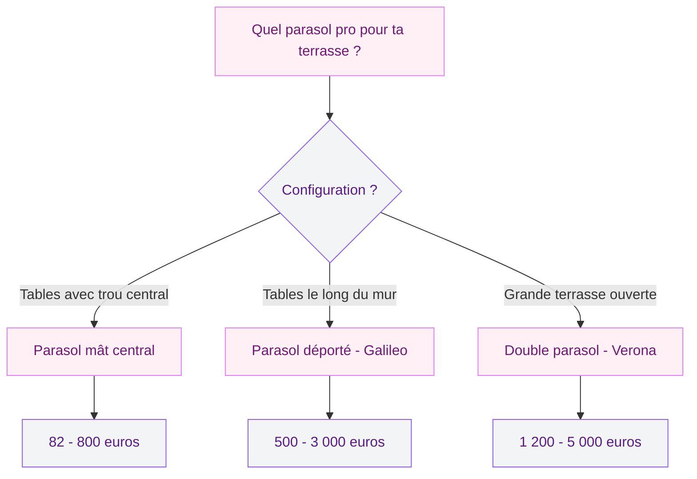
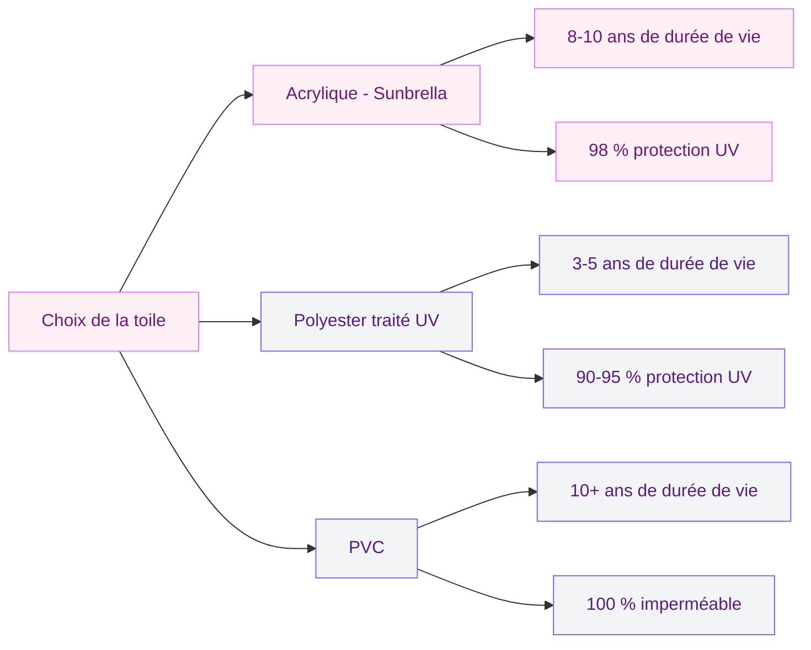

Quand tu gères un café, un restaurant ou un hôtel, la terrasse c'est ton arme secrète. C'est elle qui fait la différence entre "on rentre ?" et "on s'installe dehors !". Et ce qui rend cette terrasse agréable en plein soleil, c'est le parasol. Pas le petit modèle de jardin - un vrai parasol professionnel, dimensionné pour couvrir 10, 20 ou 50 m2 de tables.

Le choix d'un parasol CHR (Cafés, Hôtels, Restaurants) n'a rien à voir avec un achat domestique. Tu dois couvrir plus large, résister au vent urbain, supporter 300 jours d'exposition par an, et souvent afficher ton logo. Je t'explique comment choisir le bon modèle, combien ça coûte, et quels fournisseurs valent le détour en 2026.

## Les trois grandes familles de parasols pro

Trois types de parasols dominent le marché CHR. Le bon choix dépend avant tout de ta configuration de terrasse.

### Le parasol à mât central : le classique indémodable

C'est le modèle que tu vois sur 80 % des terrasses de brasseries. Un mât vertical planté au centre, une toile carrée ou ronde autour. Simple, efficace, abordable.

Le mât passe au milieu de la table (les tables CHR ont souvent un trou pré-percé) ou se fixe sur un pied lourd au sol. Tailles standard : du 2x2 m pour un guéridon jusqu'au 4x4 m pour 6-8 personnes. Le gros avantage : la stabilité, le vent a moins de prise. Le défaut : le mât au milieu gêne l'agencement des tables et le passage du service.

Budget : de 82 à 186 euros en gamme économique chez des fournisseurs comme Cuisine des Pros ou E-Terrasses. Les modèles milieu de gamme avec mât en aluminium et toile acrylique grimpent entre 300 et 800 euros.

### Le parasol déporté : la liberté totale

Le parasol déporté - aussi appelé parasol cantilever ou excentré - a son mât décalé sur le côté. La toile "flotte" au-dessus de l'espace sans que rien ne gêne en dessous. C'est la solution reine quand tu veux couvrir un groupe de tables sans aucun poteau au milieu.

Le modèle phare dans le monde pro, c'est le Galileo. Ce parasol déporté est inclinable, rotatif et rétractable. Il couvre des surfaces de 3x3 m à 4x4 m et s'adapte à la course du soleil grâce à sa rotation 360 degrés. Tu peux le replier en quelques secondes quand le mistral se lève.

Le bémol : il coûte plus cher, et le bras déporté nécessite un contrepoids sérieux - minimum 80 kg de lestage pour un 3x3 m, parfois 150 kg pour un 4x4 m. Certaines terrasses en étage ou sur dalles ne supportent pas ce poids.

> [!TIP]
> Pour une terrasse de restaurant avec des tables alignées le long de la facade, le parasol déporté est idéal : un seul mât sur le côté couvre toute une rangée sans gêner ni le service ni les clients.

### Le double parasol : couvrir large sans multiplier les mâts

C'est la solution qui monte en CHR depuis quelques années. Le double parasol, c'est deux toiles fixées de part et d'autre d'un seul mât central. Au lieu de planter six parasols individuels, tu en poses trois doubles et tu couvres la même surface.

Les tailles standards en double sont 3x6 m, 3,5x7 m et 4x8 m. Un double 4x8 m couvre 32 m2 d'un seul bloc - assez pour 8 tables de 4 personnes. Le modèle Verona est une référence dans cette catégorie. Il combine robustesse, esthétique et facilité d'ouverture avec un système de manivelle ou de treuil.

L'intérêt économique est clair : moins de mâts = moins de fixations au sol, moins d'encombrement, et un rendu visuel plus homogène sur ta terrasse.

> [!NOTE]
> Le double parasol est aussi très apprécié des hôtels pour les bords de piscine : il couvre deux rangées de transats avec un seul point de fixation central.

## Matériaux du mât : bois, aluminium ou acier ?

Le mât, c'est la colonne vertébrale du parasol. Son matériau détermine la durabilité, le poids et le look de l'ensemble.

**Bois** - Hêtre, frêne, teck ou bambou. Le rendu est chaleureux, organique, parfait pour une terrasse de bistrot qui joue la carte du charme authentique. Le bois est lourd (ce qui aide à la stabilité) mais demande un entretien régulier : huile ou vernis marin chaque année. Les mâts en bois dur comme le teck résistent bien aux intempéries, mais le prix grimpe vite. Compte 300 à 1 200 euros pour un parasol bois de qualité pro.

**Aluminium** - Le choix dominant en CHR. Léger, résistant à la corrosion, zéro entretien. L'aluminium thermolaqué se décline dans toutes les couleurs RAL pour s'accorder à ta déco. C'est le matériau des parasols Galileo et Verona. Budget : 200 à 3 000 euros selon la taille et la finition.

**Acier** - Solide et bon marché, mais plus lourd que l'alu et sensible à la rouille si le traitement de surface est médiocre. On le retrouve surtout en gamme économique. Correct pour un usage saisonnier de 4-5 mois, mais pas idéal si ton parasol reste dehors toute l'année. Budget : 82 à 400 euros.

> [!WARNING]
> En bord de mer, oublie l'acier. L'air salin attaque le revêtement en quelques mois. L'aluminium thermolaqué ou le bois traité sont les seuls choix viables dans un environnement salin.

## Toile : acrylique, polyester ou PVC ?

La toile fait le boulot le plus dur. C'est elle qui encaisse le soleil, la pluie, le vent, et c'est elle que tes clients voient. Trois matériaux dominent.

**Toile acrylique teinte dans la masse** - Le haut de gamme, avec Sunbrella comme référence mondiale. La couleur est intégrée dans la fibre, pas imprimée dessus : même après 5 ans de soleil, quasi aucune décoloration. Résistance UV de 98 %, imperméabilité, résistance à la moisissure. Durée de vie : 8 à 10 ans en usage pro intensif.

**Polyester traité anti-UV** - Le compromis qualité-prix. Protection UV correcte (90-95 %) pendant 3 à 5 ans, puis les couleurs passent et le traitement déperlant s'estompe. C'est le choix des gammes économiques et milieu de gamme.

**PVC** - Complètement imperméable, facile à nettoyer au jet d'eau. Le PVC est le choix des terrasses qui restent ouvertes sous la pluie. Défauts : lourd, retient la chaleur (pas de circulation d'air), aspect plus "bâche" que "textile". Très présent sur les grandes terrasses de brasseries urbaines.

## Comment dimensionner ton parasol selon ta terrasse

Trop petit, il ne couvre pas assez. Trop grand, il dépasse sur le trottoir et la mairie te tombe dessus. Voici les repères concrets.

**Pour un guéridon 2 places** : parasol rond de 2 à 2,5 m de diamètre. Couverture d'environ 4 m2.

**Pour une table de 4-6 places** : parasol carré ou rectangulaire de 3x3 m. Couverture de 9 m2. C'est la taille la plus vendue en CHR.

**Pour un alignement de tables** : double parasol 3,5x7 m ou 4x8 m. Un seul module couvre 4 à 6 tables côte à côte.

**Pour une terrasse complète de 40-60 m2** : combine 2 à 3 doubles parasols ou 4 à 6 parasols déportés. La règle empirique : prévois 1,5 m2 de toile par place assise.

Si tu veux une vue d'ensemble sur les solutions d'ombrage pour terrasse (pas seulement les parasols), j'ai aussi comparé [8 solutions d'ombrage selon le budget](/guides/exterieur/ombrager-terrasse/) dans un guide dédié.

## Résistance au vent : le critère que tout le monde sous-estime

Un parasol CHR reste ouvert 8 à 14 heures par jour, parfois avec des rafales de 40-50 km/h en milieu urbain (effet tunnel entre immeubles). Un parasol qui s'envole, c'est un risque pour tes clients et ta responsabilité.

Repères de résistance :

- **Force 4 Beaufort (20-28 km/h)** : tout parasol correctement lesté tient sans problème.
- **Force 5 (29-38 km/h)** : seuls les modèles pro avec mât renforcé et toile ventilée (ouverture d'aération sur le dessus) résistent. Les parasols bas de gamme se retournent.
- **Force 6+ (39 km/h et plus)** : il faut fermer. Même les meilleurs parasols ne sont pas conçus pour rester ouverts dans ces conditions.

> [!CAUTION]
> Un parasol non lesté qui s'envole peut blesser gravement un client. La jurisprudence est claire : le restaurateur est responsable. Investis dans un lestage adapté (minimum 25 kg par m2 de toile) et forme ton équipe à fermer les parasols quand le vent monte.

Les systèmes de ventilation sur le dessus de la toile (évent ou "cheminée") réduisent la prise au vent de 30 %. Beaucoup de modèles pro en sont équipés de série.

## Personnalisation : ton logo sur la toile

Un parasol personnalisé avec ton logo et tes couleurs de marque, c'est de la publicité visible depuis l'autre côté de la rue. Les marques de boissons (Coca-Cola, Kronenbourg, Perrier) le savent : elles offrent des parasols à leurs clients CHR en échange de l'affichage.

La personnalisation est possible chez la plupart des fournisseurs pro à partir de 5 à 10 unités. Surcoût : 15 à 25 % par rapport au modèle standard. L'impression en sublimation sur toile acrylique dure plus longtemps et résiste mieux aux UV que la sérigraphie sur polyester.

Tu peux aussi choisir parmi les couleurs RAL standard (blanc, écru, taupe, anthracite, bordeaux, vert foncé) sans surcoût. Si ta terrasse joue la carte du [patio moderne](/guides/exterieur/patio-moderne-de-maisons-simples-et-belles/), les teintes neutres comme le gris perle ou le sable s'intègrent le mieux.

## Budget réaliste par gamme

Voici un récapitulatif des budgets à prévoir selon tes besoins.

**Gamme économique (82 - 186 euros)** - Parasols à mât central en acier, toile polyester. Fournisseurs : Cuisine des Pros, E-Terrasses. Idéal pour démarrer ou pour une terrasse saisonnière de 3-4 mois. Durée de vie : 2 à 3 saisons.

**Milieu de gamme (500 - 2 000 euros)** - Parasols à mât alu, toile acrylique, système d'ouverture par manivelle ou poulie. Fournisseurs : Concept Parasol, Proditech Sud, Parasol Pro. C'est le segment le plus pertinent pour la majorité des restaurants et cafés. Durée de vie : 5 à 8 saisons.

**Haut de gamme (2 000 - 5 000 euros)** - Doubles parasols géants, parasols déportés motorisés, toile Sunbrella, personnalisation complète. Fournisseurs : Proditech Sud, Concept Parasol (gammes Galileo et Verona). Pour les hôtels, les restaurants gastronomiques et les établissements qui veulent du premium. Durée de vie : 8 à 12 saisons.

> [!TIP]
> Demande toujours un devis pour 5 unités minimum. Les fournisseurs pro font des remises de 10 à 20 % dès 5 parasols, et certains incluent la livraison gratuite. En achetant groupé, tu peux passer du milieu de gamme au haut de gamme pour le même budget unitaire.

## Entretien : faire durer ton investissement

Un parasol bien entretenu dure deux fois plus longtemps. Quelques réflexes à transmettre à ton équipe.

**Chaque soir** : ferme les parasols. Même s'il ne pleut pas, la rosée nocturne imbibe la toile et favorise les moisissures. Si tu as des modèles avec housse, utilise-la.

**Chaque mois** : nettoie la toile à l'eau tiède savonneuse (savon de Marseille, pas de détergent agressif). Rince au jet sans pression. Laisse sécher complètement avant de replier.

**Chaque début de saison** : vérifie coutures, fixations et mécanisme d'ouverture. Graisse les parties mobiles au lubrifiant silicone. Remplace les toiles décolorées - les fournisseurs vendent des toiles de remplacement.

Pour compléter ta terrasse, une [pergola bioclimatique](/guides/exterieur/la-pergola-bioclimatique-lalliance-parfaite-entre-esthetique-et-confort/) combinée à des parasols mobiles offre une couverture complète, été comme hiver.

## Fournisseurs pro en France

**Proditech Sud** - Spécialisé CHR, gammes Galileo et Verona. Personnalisation et montage sur site.

**Concept Parasol** - Du parasol basique au géant 5x5 m. Toiles Sunbrella disponibles. Devis en ligne.

**E-Terrasses** - Boutique en ligne, prix à partir de 82 euros. Bon rapport qualité-prix pour les petits budgets.

**Parasol Pro** - Focus sur les modèles résistants au vent, fiches techniques détaillées.

**Cuisine des Pros** - Grossiste CHR, prix compétitifs sur les lots (82 à 186 euros en gamme éco).

## FAQ

### Quelle taille de parasol choisir pour une terrasse de restaurant ?

Compte environ 1,5 m2 de toile par place assise. Pour une terrasse de 30 places, il te faut donc 45 m2 de couverture. En pratique, ça correspond à 5 parasols de 3x3 m, ou 2 doubles parasols de 3,5x7 m. Mesure bien ta terrasse et tiens compte de la course du soleil : l'ombre se déplace au fil de la journée.

### Combien coûte un parasol professionnel pour terrasse CHR ?

Les prix vont de 82 euros pour un modèle éco à mât central en acier jusqu'à 5 000 euros pour un double parasol géant avec toile Sunbrella et personnalisation. Le segment le plus courant pour les cafés et restaurants se situe entre 500 et 1 500 euros par parasol, en aluminium avec toile acrylique.

### Quelle toile résiste le mieux au soleil et aux intempéries ?

La toile acrylique teinte dans la masse (type Sunbrella) est la plus durable : 8 à 10 ans en usage pro, 98 % de protection UV, pas de décoloration. Le polyester traité UV est plus abordable mais dure 3 à 5 ans. Le PVC est imperméable et durable mais moins esthétique et plus chaud en dessous.

### Un parasol de terrasse résiste-t-il au vent ?

Les parasols pro avec mât renforcé et évent de ventilation résistent jusqu'à force 5 Beaufort (38 km/h). Au-delà, il faut fermer. Le lestage est la clé : prévois 25 kg par m2 de toile minimum. Un parasol de 3x3 m (9 m2) a besoin d'au moins 225 kg de contrepoids pour rester stable par vent fort.

### Peut-on faire imprimer son logo sur un parasol professionnel ?

Oui, la plupart des fournisseurs CHR proposent la personnalisation à partir de 5 unités. Le surcoût est de 15 à 25 % par rapport au tarif standard. L'impression en sublimation sur toile acrylique offre la meilleure tenue dans le temps. Compte 3 à 6 semaines de délai pour une commande personnalisée.
