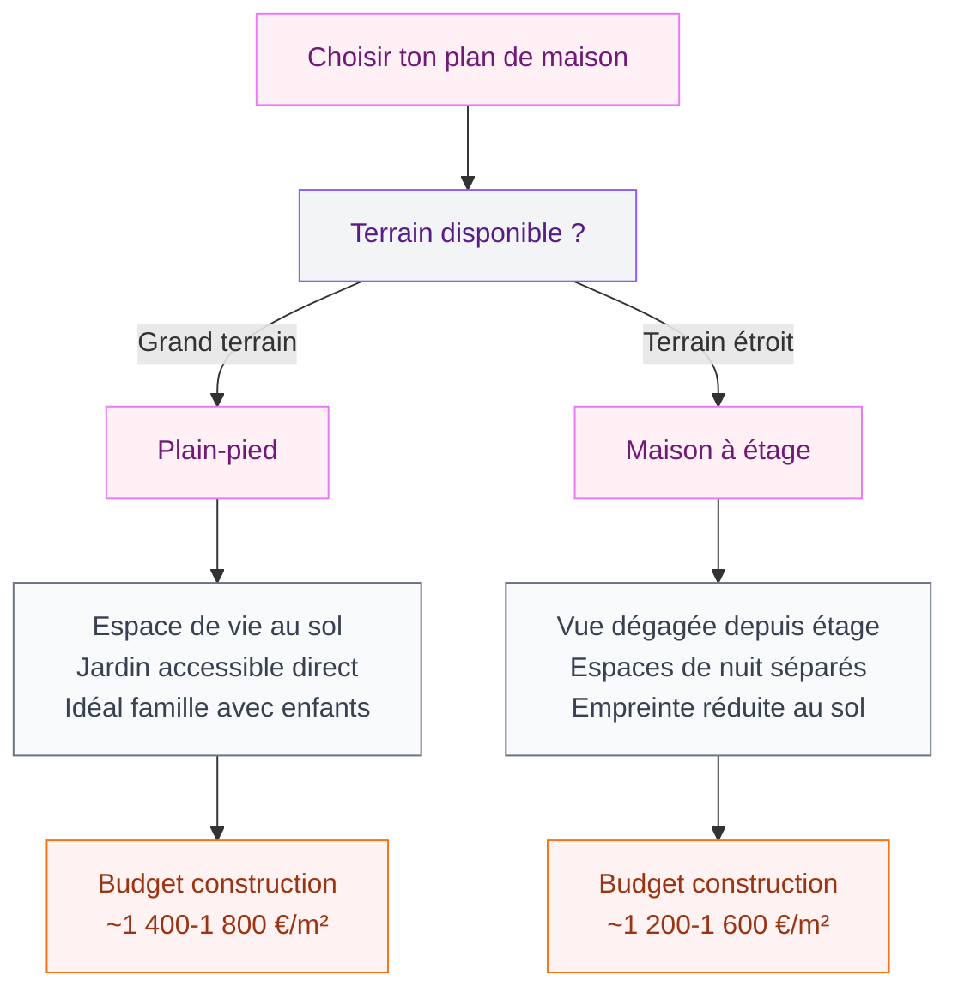
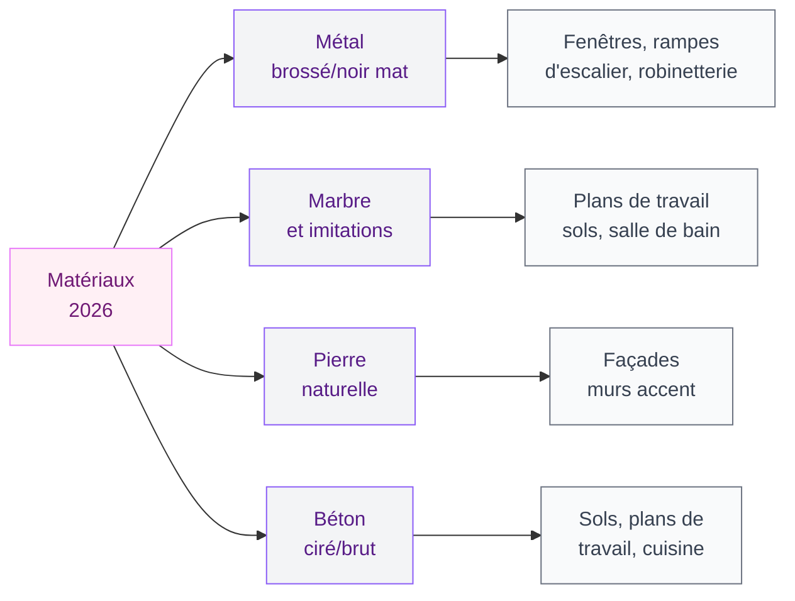

Tu rêves d'une maison moderne mais tu ne sais pas par où commencer ? Entre les images Pinterest qui s'accumulent dans tes favoris et les magazines déco, difficile de savoir ce qui est vraiment tendance en 2026. Alors j'ai fait le tour pour toi - voici ce qui sort vraiment du lot cette année, autant en extérieur qu'en intérieur.

## Ce que "maison moderne" veut dire en 2026

L'architecture moderne en 2026 ne se résume pas à une boîte blanche avec des grandes fenêtres (même si c'est toujours ultra séduisant). La définition s'est élargie : on parle de lignes épurées qui dialoguent avec les matériaux naturels, de façades qui jouent sur les textures, et d'intérieurs où chaque espace a une vraie fonction.

  

Ce qui change vraiment cette année, c'est le retour des matières brutes et chaleureuses. La maison minimaliste froide cède la place à quelque chose de plus vivant, plus humain. Pierre, bois, béton ciré, marbre : les matériaux sont présents, et ils s'assument pleinement.

> [!NOTE]
> Les maisons modernes en 2026 combinent lignes nettes et matériaux naturels. L'objectif : un espace chaleureux qui respire, pas un showroom glacial.

## Les façades qui font tourner les têtes

  

### La façade blanche et ses déclinaisons

La maison blanche avec toit plat reste une valeur sûre. Mais en 2026, on ne se contente plus du blanc uni. Les façades jouent avec les textures : enduit gratté côtoyant des panneaux de métal brossé, pierre de parement sur le rez-de-chaussée, bois composite sur l'étage. Ce mix de matières, c'est ce qui donne du caractère à une construction qui pourrait sinon paraître froide.

Pour la couleur, si tu veux sortir du blanc, les teintes de terre sont très présentes : anthracite, gris clair, sable, ocre pâle. Si tu cherches des idées précises pour choisir ta palette extérieure, notre article sur les [couleurs pour les extérieurs et les façades de maisons 2026](/couleurs-pour-les-exterieurs-et-les-facades-de-maisons-2026/) te donnera des pistes concrètes avec des codes couleurs.

### Le toit, élément de design à part entière

Le toit a longtemps été négligé dans la conception des maisons modernes. En 2026, il est devenu un vrai élément de design. Trois tendances se dégagent :

- **Toit plat ou légèrement incliné** : le grand classique du style contemporain. Il donne un volume net et permet d'aménager une terrasse en toiture. Les toits plats végétalisés sont très demandés - comptez entre 80 et 150 €/m² pour une étanchéité avec substrat végétal chez des fabricants comme Sopraflor ou Bauder.
- **Toit monopente** : très graphique, il crée une silhouette asymétrique qui se distingue du voisinage. Il se marie bien avec les constructions à ossature bois.
- **Toit à deux pans très peu incliné** : à mi-chemin entre le toit traditionnel et le contemporain, il rassure les communes aux règles d'urbanisme strictes tout en gardant un look moderne.

> [!TIP]
> Si ton PLU impose un toit en pente, opte pour une inclinaison minimale (10 à 15°) et des tuiles plates en zinc ou en ardoise naturelle. L'effet reste très contemporain tout en respectant les règles.

### Les grandes baies vitrées : oui, mais bien pensées

Difficile de parler de maison moderne sans évoquer les grandes baies vitrées. En 2026, elles sont omniprésentes - mais on les intègre mieux. Les architectes pensent désormais orientation solaire, protection thermique et confort visuel depuis l'intérieur.

Les systèmes coulissants galandage (qui se glissent dans le mur) sont très appréciés : ils disparaissent complètement et ouvrent la maison sur le jardin ou la terrasse. Chez Schüco ou Reynaers, une baie vitrée galandage de 3 mètres de large coûte entre 3 000 et 6 000 € selon les performances thermiques.

## Les plans de maisons modernes : à étage ou de plain-pied ?

  

### La maison de plain-pied : le confort au quotidien

La maison plain-pied est souvent sous-estimée côté design. Pourtant, une belle architecture contemporaine de plain-pied peut avoir beaucoup d'allure - pense aux longues lignes horizontales qui s'étendent dans le paysage, avec un toit plat ou légèrement incliné.

Les plans les plus populaires en 2026 pour une maison de plain-pied moderne autour de 120 m² :
- Salon/cuisine ouvert de 50-60 m² avec accès direct au jardin
- 3 chambres dont une suite parentale avec salle de bain privative
- Entrée dégagée avec espace rangement intégré
- Garage accolé ou double garage selon le terrain

> [!IMPORTANT]
> Pour une maison plain-pied moderne, l'orientation du plan par rapport au soleil change tout. Idéalement : le séjour au sud ou sud-ouest, les chambres à l'est pour profiter du matin, les espaces de service (buanderie, garage) au nord.

### La maison à étage : verticalité et séparation des espaces

La maison à étage moderne joue sur la verticalité et la séparation jour/nuit. En bas : vie commune (cuisine ouverte, séjour, bureau). En haut : pièces privées (chambres, salles de bains).

Ce qui se fait beaucoup cette année, c'est le décalage des volumes entre rez-de-chaussée et étage. Le premier niveau peut être en béton ou en pierre, et l'étage en bois ou en enduit blanc - ce décalage de matériaux crée un effet architectural fort sans avoir besoin de grandes surfaces.

## L'intérieur : matériaux, sols et ambiances

  

### Les sols qui posent l'ambiance

Le sol est la surface la plus influente dans la perception d'un espace. En 2026, trois types de sols dominent les intérieurs modernes :

**Le béton ciré** : il reste une référence pour les espaces ouverts. Il s'adapte à tous les styles et se prolonge naturellement vers l'extérieur. Comptez entre 80 et 150 €/m² posé chez un artisan spécialisé, ou 40-70 €/m² pour les kits à appliquer soi-même (Béton Ciré Direct, Mortex).

**Les grands carreaux de grès cérame** : format 120x60 ou même 120x120 cm, ils agrandissent visuellement les pièces et se nettoient facilement. Les imitations marbre comme celles de la gamme Statuario chez Porcelanosa (autour de 80-120 €/m²) sont vraiment belles et bien moins sensibles que le vrai marbre.

**Le parquet chêne huilé ou blanchi** : pour les espaces nuit et les séjours avec une touche plus chaleureuse. Les lames larges (14 cm minimum) sont très tendance. Marques comme Boen, Kahrs ou Quick-Step Intenso, entre 45 et 90 €/m² selon la gamme.

### La cuisine ouverte en 2026 : plan et organisation

La cuisine ouverte reste le coeur des maisons modernes. Mais en 2026, elle évolue vers une conception plus réfléchie : on cache le maximum de rangements derrière des portes, et on soigne la partie "visible" avec des matériaux nobles.

Le plan en L ou en U avec un îlot central est le plus demandé pour les espaces de 20 m² et plus. L'îlot sert à la fois de plan de travail, de bar et de point de rencontre. Pour les finitions, le mélange de deux matières s'impose : par exemple des façades laquées blanches avec un plan de travail en marbre ou en quartz (Silestone, Compac), et peut-être quelques éléments en bois massif pour réchauffer l'ensemble.

> [!WARNING]
> Évite les façades de cuisine entièrement en bois dans les plans très ouverts : le bois demande un entretien plus régulier et supporte mal l'humidité. Préfère le bois sur les éléments hauts ou l'îlot, et des matériaux plus résistants (laqué, stratifié) pour les bas de meubles.

### Murs et décoration : texture et matières

Si tu veux transformer une pièce sans tout refaire, joue sur les textures murales. En 2026, les enduits à la chaux ou les bétons décoratifs sont partout. Ils apportent cette imperfection contrôlée qui fait tout le charme des intérieurs modernes contemporains.

Pour les murs intérieurs en pierre apparente ou en brique, tu peux aussi regarder du côté des techniques d'application - notre guide sur [comment crépir un mur intérieur](/crepir-un-mur-interieur/) explique les différentes méthodes selon le rendu souhaité.

## Matériaux tendance : le métal, le marbre et la pierre

  

### Le métal dans tous les espaces

Le métal brossé ou le noir mat s'invite partout : poignées de portes, robinetterie, rampes d'escalier, luminaires, encadrements de fenêtres. Cette finition donne un caractère fort sans dominer l'espace. La marque Hansgrohe propose des mitigeurs et douchettes en noir mat très bien finis autour de 300-500 € - un investissement visible qui change vraiment l'ambiance d'une salle de bain.

Pour l'extérieur, les bardages en métal (zinc, acier Corten, aluminium thermolaqué) habillent de plus en plus les façades des maisons modernes. L'acier Corten est particulièrement intéressant : il rouille de façon contrôlée pour donner une patine orange-brun naturelle, très graphique.

### Marbre et imitations : le luxe accessible

Le marbre naturel reste une référence, mais son coût (200 €/m² et plus pour les qualités Calacatta) et sa fragilité font que beaucoup optent pour les imitations en grès cérame. Les résultats sont bluffants - les grès de la gamme Marvel chez Atlas Concorde ou les collections Marble Look de Marazzi sont difficiles à distinguer du vrai marbre à l'oeil.

Pour les revêtements de salle de bain, le marbre blanc avec des veines grises reste une des images les plus associées au luxe moderne. Si tu cherches comment l'intégrer à petit budget, les carreaux format 30x60 en imitation marbre de chez Leroy Merlin tournent autour de 25-40 €/m² - c'est très accessible.

## Terrasse et jardin : le prolongement de la maison

Une maison moderne en 2026, c'est aussi une maison qui s'ouvre sur l'extérieur. La terrasse n'est plus une surface qu'on ajoute en dernier - elle fait partie de la conception dès le départ.

Les carreaux de terrasse grand format (60x60 ou 80x80 cm) en grès cérame antidérapant sont très utilisés pour créer une continuité visuelle entre intérieur et extérieur. Les teintes béton ou pierre fonctionnent particulièrement bien pour cet effet de fluidité espace intérieur-extérieur.

Pour délimiter les espaces dans le jardin, les bordures de parterre jouent un rôle esthétique dans un aménagement contemporain. Notre guide sur [comment poser une bordure de jardin sans béton](/poser-bordure-jardin-sans-beton/) te montrera des techniques propres et faciles pour structurer ton jardin avec des lignes nettes.

> [!TIP]
> Pour une terrasse moderne à petit budget, associe des dalles grès cérame (Castorama propose des modèles 60x60 cm à partir de 20 €/m²) avec un claustra en aluminium anthracite. L'effet est très architectural pour moins de 150 €/m² de terrasse finie.

## En résumé : les éléments clés d'une maison moderne réussie en 2026

Ce qui fait une belle maison moderne cette année, c'est l'équilibre entre plusieurs éléments qui se répondent :

- Une **façade** qui joue sur les matières plutôt que sur la couleur seule
- Un **toit** pensé comme élément de design (plat, monopente, ou très peu incliné)
- Des **grandes baies vitrées** bien orientées pour la lumière naturelle
- Un **plan intérieur** fluide avec séparation jour/nuit bien pensée
- Des **matériaux cohérents** du sol au plafond : béton, marbre, bois, métal
- Un **jardin et une terrasse** conçus en continuité avec les espaces intérieurs

La maison moderne en 2026, c'est avant tout une maison qui vit bien et qui vieillit bien. Les tendances actuelles vont vers plus de durabilité et moins d'entretien - ce qui tombe bien, parce qu'une belle maison c'est surtout une maison qu'on habite vraiment.

## Sur le meme theme

- [maisons modernes en adobe](/maisons-modernes-en-adobe-images-dinterieurs-et-dexterieurs/)
- [couleur porte d'entrée](/couleurs-des-portes-exterieures-comment-choisir-la-couleur/)

## Questions fréquentes sur les maisons modernes 2026

**Quel budget pour construire une maison moderne en 2026 ?**
Compte entre 1 200 et 2 000 €/m² pour une construction neuve selon les prestations. Une maison moderne à ossature béton de 120 m² revient généralement entre 180 000 et 280 000 € hors terrain et hors raccordements. Les maisons à ossature bois peuvent être un peu moins chères à surface égale.

**La maison minimaliste blanche est-elle encore tendance ?**
Oui, mais elle évolue. La façade blanche reste très demandée, mais en 2026 on la mixe avec d'autres matériaux : bois, pierre, zinc, béton. Le tout-blanc strict fait place à des compositions plus riches en textures.

**Quels matériaux pour une façade moderne qui dure ?**
Le bardage en fibrociment (comme Cedral ou Eternit) offre un excellent rapport qualité/prix pour une façade contemporaine. Il imite le bois sans l'entretien et résiste très bien aux intempéries. Comptez 40 à 70 €/m² posé.

**Comment moderniser une maison existante sans tout démolir ?**
Le remplacement des menuiseries (fenêtres, portes) est souvent la modification la plus visible. Passer à des châssis noirs ou anthracite avec des vitrages XXL transforme radicalement l'aspect d'une maison. Le ravalement de façade avec un enduit contemporain et éventuellement un bardage partiel complète la transformation.
