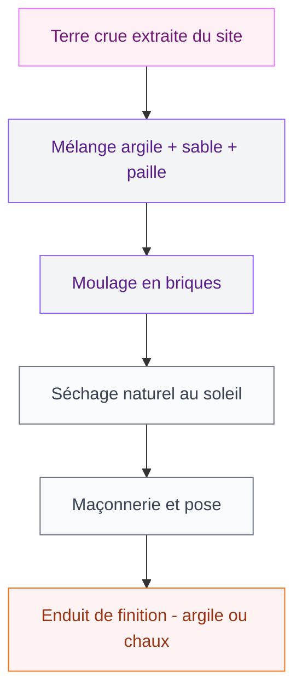
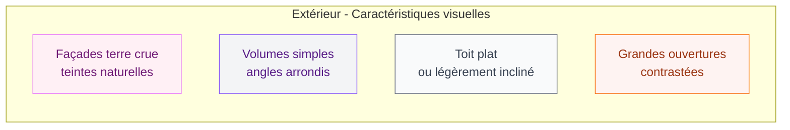
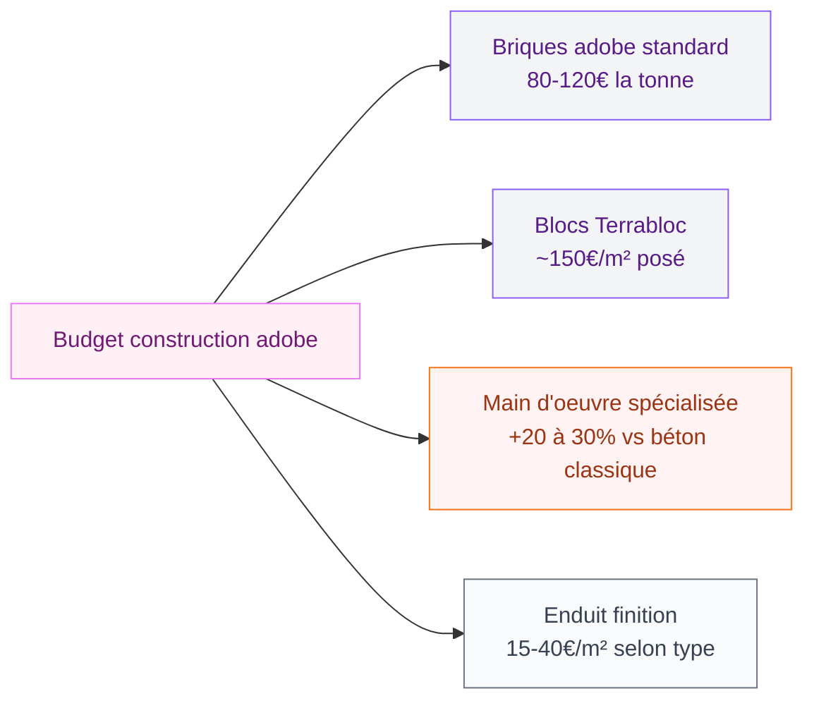

Si tu cherches une architecture qui allie chaleur, durabilité et esthétique hors du commun, la maison en adobe est sans doute l'une des réponses les plus abouties. Ces constructions en terre crue, longtemps associées aux villages du Nouveau-Mexique ou aux médinas marocaines, connaissent aujourd'hui un vrai retour en grâce. Et pas seulement dans les zones arides : des architectes européens, suisses, français, s'en emparent pour créer des maisons contemporaines qui étonnent autant par leur beauté que par leur sobriété.

Dans cet article, je t'emmène faire le tour des plus belles images de maisons modernes en adobe, côté extérieur comme côté intérieur. Je te donne aussi des clés pour comprendre ce matériau, ses avantages, ses contraintes, et comment s'en inspirer même si tu ne construis pas en adobe de A à Z.

## L'adobe aujourd'hui : un matériau millénaire relooké

L'adobe, c'est un mélange de terre argileuse, de sable, de paille et d'eau, compressé en briques puis séché au soleil. La technique remonte à des milliers d'années et a traversé les continents. Ce qui change aujourd'hui, c'est la façon dont les architectes et les particuliers l'intègrent dans des projets très actuels.

  

La société suisse Terrabloc, par exemple, a perfectionné l'adobe compressée en fabriquant des blocs à partir de déchets d'excavation locaux. Résultat : des matériaux avec une empreinte carbone très basse, adaptés à l'architecture contemporaine, et qui peuvent même être produits directement sur le chantier à partir des terres extraites. C'est ce genre d'innovation qui remet l'adobe au coeur des discussions sur la construction durable.

> [!NOTE]
> L'adobe offre une excellente inertie thermique : la maison reste fraîche l'été et garde la chaleur en hiver sans chauffage excessif. C'est une des raisons principales qui poussent à revenir à ce matériau.

## Extérieurs en adobe : ce que montrent les images

  

### Des façades aux teintes naturelles

Ce qui frappe en premier dans les images de maisons modernes en adobe, c'est la palette de couleurs. On est loin des façades blanches lisses ou des briques rouges classiques. Ici, les tons dominants vont du beige chaud au brun rosé, en passant par l'ocre profond ou le sable clair. Ces nuances viennent directement de la composition de la terre utilisée - et varient donc selon la région.

À Los Angeles, Dutton Architects a restauré une maison adobe historique signée John Byers, architecte phare du début du XXe siècle en Californie. L'approche était de conserver l'esprit originel tout en intégrant les usages contemporains. Sur les images, les murs épais aux angles arrondis créent une silhouette douce, presque sculptée. Rien de raide ni d'agressif - une architecture qui semble issue du sol.

> [!TIP]
> Pour harmoniser les façades en adobe avec ton jardin, mise sur des plantations aux tons chauds : lavandes, herbes aromatiques, graminées dorées, agaves. Ils renforcent le lien visuel entre le bâti et le paysage. Consulte aussi nos idées sur les [couleurs pour les extérieurs et façades de maisons en 2026](/couleurs-pour-les-exterieurs-et-les-facades-de-maisons-2026/) pour affiner ta palette.

### Toits plats et volumes simples

L'autre signature visuelle de l'adobe moderne, c'est la géométrie. Les maisons en adobe contemporaines aiment les volumes purs, les toits plats ou légèrement inclinés, les débords de toiture généreux qui protègent les murs de la pluie. On y trouve peu d'ornements superflus : la beauté vient de la texture même du matériau et du jeu des ombres sur les reliefs des murs.

Les grandes fenêtres et baies vitrées font contraste avec l'épaisseur des murs - parfois 40 à 60 cm d'adobe. Ce jeu entre la masse et la lumière est l'une des choses les plus photographiées dans ce type de construction. En journée, les rayons du soleil dessinent des ombres tranchées sur les parois. Le soir, les fenêtres illuminent et révèlent toute l'épaisseur des embrasures.

## Intérieurs en adobe : l'ambiance qu'on ne trouve nulle part ailleurs

  

### Des murs qui respirent et qui vibrent

À l'intérieur, l'adobe crée une atmosphère unique. Les murs ne sont jamais parfaitement droits, les angles ne sont jamais parfaitement nets - et c'est précisément ce qui donne du caractère. On retrouve souvent des niches sculptées dans la masse, des arches douces qui remplacent les ouvertures rectangulaires, des tablettes encastrées qui font corps avec le mur.

La finition intérieure joue beaucoup sur le résultat final. Un enduit à la chaux donne une surface légèrement brillante et très blanche. Un enduit à la terre conserve les tons chauds et mate de la cuisine. Certains propriétaires laissent les briques apparentes dans certaines pièces, pour un effet très graphique. Les images les plus réussies jouent sur ce contraste entre la rusticité du matériau et la sophistication du mobilier.

Si tu aimes ce style d'enduit naturel, tu peux aussi t'inspirer de la technique du [crépissage pour un mur intérieur](/crepir-un-mur-interieur/) qui partage la même philosophie de matériau vivant et texturé.

> [!TIP]
> Pour meubler un intérieur en adobe, opte pour des matières naturelles : bois brut, lin, coton, osier. Les canapés en velours côtelé ou les tapis berbères s'y intègrent à merveille. Évite les meubles trop brillants ou les finitions plastifiées qui cassent l'harmonie du matériau.

### La lumière dans les maisons en adobe

Un des aspects les moins montrés mais les plus importants dans les images d'intérieurs adobe : la façon dont la lumière se comporte à travers les épais embrasures de fenêtres. Elle pénètre en biais, crée des zones d'ombre et de lumière profondes, donne aux pièces une qualité presque picturale.

Les architectes qui travaillent l'adobe contemporain en jouent énormément. Des puits de lumière percés dans le toit envoient des colonnes de lumière directement sur les sols en terre cuite ou en béton ciré. Des ouvertures hautes, proches du plafond, éclairent sans éblouir. Et les niches - encore elles - servent souvent de spots naturels pour mettre en valeur une plante, une sculpture, une bougie.

> [!WARNING]
> Si tu achètes ou rénoves une maison en adobe, vérifie l'état des fondations et de la toiture. L'adobe craint l'humidité stagnante, surtout à la base des murs. Une bonne isolation en soubassement et une gouttière bien entretenue sont vraiment les deux points à ne pas négliger.

### Cuisine, salle de bain : les pièces de vie en adobe

Les images de cuisines en adobe sont parmi les plus appréciées. On y retrouve souvent des plans de travail en pierre naturelle, des crédences en zellige ou en carreaux de ciment, des étagères ouvertes en bois massif. La marque Fired Earth propose des carreaux en terre cuite artisanale très adaptés, entre 35 et 80€/m² selon les finitions. Les appareils électroménagers, eux, sont souvent intégrés derrière des facades en bois brut pour ne pas rompre l'ambiance.

Pour les salles de bain, l'adobe se marie superbement avec le tadelakt (enduit marocain lisse et imperméable), les vasques en pierre ou les baignoires îlot en résine matte. Une douche à l'italienne avec sol en galets naturels, des murs en enduit argile teinté - c'est l'esthétique très recherchée qu'on voit souvent dans les images de maisons en adobe au Maroc ou en Espagne. Si tu es attirée par cette esthétique orientale, tu trouveras d'autres idées dans notre article sur la [décoration marocaine moderne ou classique](/decoration-marocaine-moderne-ou-classique/).

## Combien coûte une maison en adobe ?

C'est la question que tout le monde se pose. La réponse varie beaucoup selon la région, le type de construction et les finitions. Voici quelques repères tirés du marché actuel :

  

Aux États-Unis, les plans de maisons adobe proposés par Architectural Designs démarrent à 995$ pour des modèles simples. En France et en Suisse, une construction neuve en adobe compressée tourne autour de 1 800 à 2 500€/m² selon les régions et les entreprises. Ce n'est pas un matériau "low cost", mais le bilan thermique et la durabilité compensent souvent sur le long terme.

Pour les rénovations, l'adobe existant est parfois moins cher à restaurer qu'à remplacer. Des entreprises comme Aabha Créations, spécialisées en construction en terre crue, proposent des diagnostics et des devis à partir de 300-400€ pour une première évaluation.

> [!NOTE]
> L'adobe et la terre crue bénéficient en France de certaines aides à la rénovation écologique, notamment MaPrimeRénov' si le projet inclut une amélioration thermique. Pense à vérifier ton éligibilité avant de te lancer.

## S'inspirer de l'adobe sans tout construire en terre

Même si tu n'as pas de projet de construction en adobe, tu peux tout à fait t'inspirer de cet univers pour ton intérieur ou ta façade. Quelques idées concrètes :

  

- **Enduit à la terre ou à l'argile** sur un ou deux murs dans ton salon : les marques Argisol, Tierrafino ou Keim proposent des produits prêts à l'emploi entre 40 et 90€/m² posé. Le rendu rappelle très fidèlement l'adobe.
- **Palette de couleurs terre** : ocre jaune, brun cuivré, rose poudré, beige sable. La marque Ressource a une collection "Terres" avec des teintes parfaitement calibrées pour cet esprit.
- **Mobilier et objets** : poteries brutes, bols en terre cuite, textiles en laine naturelle non teinte. Des marques comme Zara Home ou La Redoute Intérieurs proposent des pièces dans cet esprit entre 20 et 150€.
- **Côté extérieur**, un badigeon à la chaux teinté dans les tons sable ou terra cotta peut transformer une façade banale. La gamme Tollens Tecta offre des teintes très proches des vraies facades adobe, autour de 25-35€/L.

Pour aller plus loin côté extérieur, notre guide sur les [maisons modernes 2026 : images d'extérieur et d'intérieur](/maisons-modernes-2026-images-dexterieur-et-dinterieur/) regroupe d'autres sources d'inspiration pour des projets contemporains.

## Sur le meme theme

- [couleur porte d'entrée](/couleurs-des-portes-exterieures-comment-choisir-la-couleur/)

## Ce que disent les images : ce qu'il faut retenir

La maison en adobe moderne, c'est une architecture qui ne ment pas. Pas de placage, pas de simulacre - juste la matière brute mise en forme avec soin. Les images les plus belles de maisons en adobe ne font pas rêver d'un luxe ostentatoire : elles donnent envie d'un confort ancré, d'une maison qui a du sens, qui tient chaud l'hiver et fraîche l'été sans dépenser une fortune en énergie.

L'intérieur adobe réussit quand il joue sur l'imperfection assumée, les matières naturelles accumulées, la lumière travaillée. L'extérieur adobe réussit quand il s'intègre dans le paysage plutôt que de s'y imposer. Ce n'est pas la mode du moment - c'est un choix de fond, de plus en plus pertinent dans un contexte où la construction durable n'est plus une option marginale.

Si tu as un projet, même modeste, dans cet esprit - une pièce à enduire, une façade à badigeonner, un mur à sculpter - c'est le bon moment pour s'y mettre.
