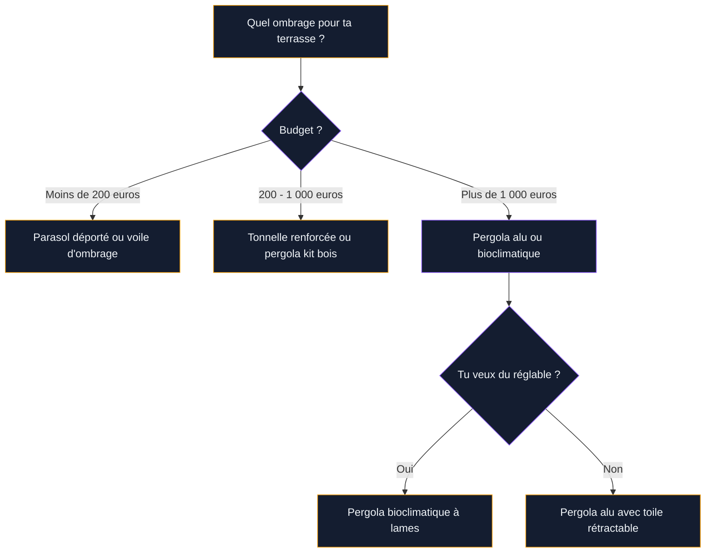
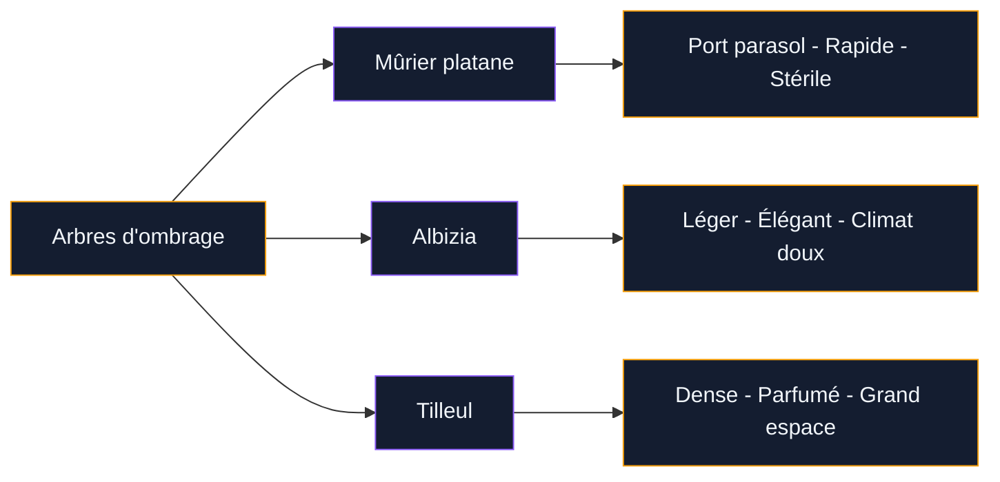
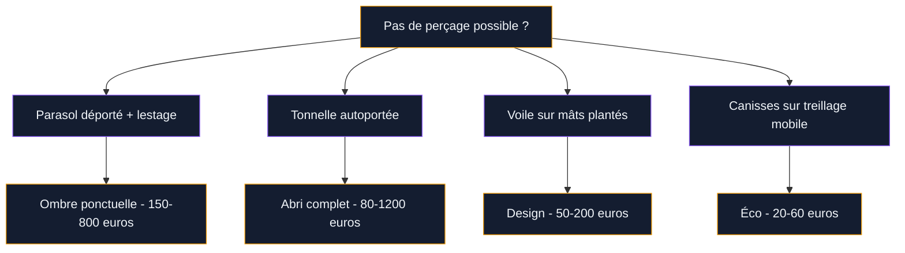

Le soleil tape fort, ta terrasse devient un four à ciel ouvert, et toi tu cherches une solution d'ombrage qui tient la route. Le problème, c'est qu'entre le parasol à 30 euros du supermarché et la pergola bioclimatique à 10 000 euros, il y a un monde. Et pas mal de solutions intermédiaires que personne ne prend le temps de comparer honnêtement.

Je te présente 8 options testées et approuvées, avec les vrais prix, les vrais défauts, et surtout des recommandations adaptées à ton budget. Que tu aies 50 ou 5 000 euros à investir, tu vas trouver ton bonheur.

## Le parasol classique : la solution express

C'est le réflexe numéro un, et c'est normal. Un parasol, tu l'achètes le matin, tu l'installes l'après-midi. Zéro travaux, zéro prise de tête.

**Le parasol droit** (mât central) coûte entre 25 et 150 euros selon la taille et la qualité de la toile. Un modèle 2,5 m de diamètre chez Gifi ou Action fait le job pour une petite table de 2-4 personnes. La limite : il prend de la place au centre de la table et il couvre une zone assez réduite.

**Le parasol déporté** (mât excentré, aussi appelé "cantilever") change complètement la donne. Le mât est sur le côté, ce qui libère tout l'espace en dessous. Un modèle 3x3 m couvre 9 m2 d'ombre, assez pour un salon de jardin complet. Le prix grimpe : de 150 euros pour un entrée de gamme (Hespéride, Outsunny) à 500-800 euros pour un modèle rotatif à 360 degrés avec manivelle (Schneider, Doppler). Les meilleurs ont une toile en polyester 250 g/m2 avec traitement anti-UV.

> [!TIP]
> Un parasol déporté de 3x3 m avec pied de lestage rempli d'eau ou de sable (minimum 60 kg) est la solution la plus rapide pour couvrir une grande zone. C'est mon premier conseil si tu as besoin d'ombre pour cet été sans rien percer.

## La voile d'ombrage : design et prix doux

La voile d'ombrage, c'est ce grand triangle ou rectangle de toile tendu entre plusieurs points d'ancrage. L'esthétique est moderne, aérienne, et ça donne un vrai style à une terrasse basique.

Le prix démarre à 20-30 euros pour une voile standard 3x3 m en polyester (Ikea, Amazon). Pour une voile en HDPE (polyéthylène haute densité) perméable à l'air et résistante aux UV, compte 50 à 120 euros (Coolaroo, Nesling). Les modèles haut de gamme en toile acrylique traitée Teflon montent à 200-400 euros, mais ils tiennent 10 ans facile.

L'installation est simple en théorie : tu fixes des pitons dans la façade et/ou tu plantes des mâts dans le sol. En pratique, il faut tendre la voile correctement (sinon elle fait des poches d'eau quand il pleut) et prévoir une inclinaison d'au moins 25 degrés pour l'évacuation. Si tu ne peux rien percer, il existe des mâts autoportés en acier galvanisé à planter au sol ou à lester avec des dalles béton.

> [!WARNING]
> Retire ta voile en cas de vent fort (au-delà de 50 km/h). Même bien fixée, la prise au vent d'une toile de 9 m2 est énorme et peut arracher les fixations du mur. Les modèles en HDPE micro-perforée résistent mieux car l'air passe à travers, mais elles ne protègent pas de la pluie.

## La pergola : l'investissement long terme

C'est la Rolls de l'ombrage terrasse. Une structure fixe, durable, qui transforme ta terrasse en vraie pièce à vivre. Et contrairement à ce qu'on pense, il y en a pour tous les budgets.

**Pergola bois** : esthétique chaleureuse, prix accessible en kit (600 à 1 500 euros pour un 3x4 m en pin traité autoclave ou en douglas). Le bois demande un entretien régulier, une lasure tous les 2-3 ans, et il est lourd à manipuler. Mais le rendu est magnifique, surtout avec des plantes grimpantes.

**Pergola aluminium** : légère, résistante, sans entretien. Un kit en alu thermolaqué 3x4 m démarre à 800-1 500 euros (Blooma chez Castorama, Kettler). Les modèles avec toile rétractable intégrée tournent autour de 2 000-3 500 euros. L'aluminium est le meilleur compromis poids/résistance/durabilité.

**Pergola bioclimatique** : le haut de gamme avec lames orientables qui s'adaptent à la course du soleil. Budget : 3 000 à 10 000 euros pose comprise (Biossun, Renson, Azenco). Si tu veux tout savoir sur ce type de structure, j'ai détaillé les avantages dans le [guide complet de la pergola bioclimatique](/guides/exterieur/la-pergola-bioclimatique-lalliance-parfaite-entre-esthetique-et-confort/).

Pour bien choisir entre pergola et tonnelle, tu peux aussi consulter le [comparatif pergola vs tonnelle](/guides/exterieur/difference-pergola-tonnelle/) qui détaille les critères de choix.

## La tonnelle autoportée : zéro perçage, zéro stress

La tonnelle, c'est la cousine démontable de la pergola. Structure en tubes d'acier ou d'aluminium, toile polyester tendue par-dessus, montage en 1 à 2 heures. Elle se pose directement sur la terrasse sans aucun perçage.

Budget : de 80 euros pour un modèle basique 3x3 m à 400-600 euros pour une tonnelle renforcée avec rideaux latéraux et moustiquaire (Hespéride, Outsunny). Les modèles à toit rigide en polycarbonate tiennent mieux dans le temps et coûtent entre 500 et 1 200 euros.

C'est la solution idéale si tu es locataire, si tu veux tester un emplacement avant d'investir dans une pergola, ou si tu as besoin d'un abri pour des événements ponctuels.

## Le store banne : l'ombre intégrée à la façade

Le store banne se fixe directement sur le mur de ta maison et se déroule au-dessus de la terrasse. C'est une solution très répandue dans le sud de la France et pour cause : ça fonctionne super bien.

Un store banne manuel (à manivelle) de 3 m de large coûte entre 200 et 500 euros en grande surface de bricolage. Les versions motorisées avec capteur vent et soleil grimpent à 800-2 000 euros. Les marques comme Franciaflex, Marquises et Storistes de France proposent du sur-mesure à partir de 1 200 euros.

L'avantage, c'est que tu gagnes de la place au sol puisque la structure est fixée en hauteur. L'inconvénient : ça ne protège que du soleil, pas de la pluie (sauf les modèles semi-coffre étanches, plus chers). Et il faut le replier en cas de vent fort.

## Les canisses et brises-vue : la solution éco

Si ton budget est serré, les canisses en bambou ou en PVC sont une option maligne. Tu les fixes sur une structure existante (pergola basique, piquet métal, treillage) pour créer une zone d'ombre à moindre coût.

**Canisses bambou naturel** : 5 à 15 euros le rouleau de 3 m. Esthétique naturelle, mais durée de vie limitée (2-3 ans en extérieur). Fragile au vent.

**Canisses PVC** : 10 à 25 euros le rouleau de 3 m. Plus durable, lavable, mais aspect plastique visible de près. Existe en couleurs (vert, marron, gris).

**Filet de camouflage ou filet d'ombrage** : de 10 à 30 euros pour une pièce de 3x4 m. Le filet d'ombrage professionnel (utilisé en agriculture) offre 70 à 90 % d'occultation et laisse passer l'air. C'est étonnamment efficace et donne un look original à ta terrasse.

> [!NOTE]
> Les canisses en bambou naturel sont écologiques et recyclables, mais elles attirent les insectes si elles restent humides. Oriente-les en pente pour que l'eau s'écoule et remplace-les dès qu'elles montrent des signes de moisissure.

## Les plantes grimpantes : l'ombrage vivant

C'est la solution la plus belle, la plus écologique... et la plus lente. Une plante grimpante sur une pergola ou un treillage crée un ombrage naturel, rafraîchit l'air par évapotranspiration (jusqu'à 3-5 degrés de moins sous un couvert végétal dense), et attire les pollinisateurs.

Les meilleures grimpantes pour l'ombrage terrasse :

- **Glycine** : croissance rapide, floraison spectaculaire au printemps. Attention, elle devient très lourde avec les années et peut déformer une structure fragile.
- **Vigne vierge** : couvre vite (2-3 m par an), feuillage dense en été, couleurs rouge-orange en automne. Feuillage caduc, donc du soleil en hiver.
- **Jasmin étoilé (Trachelospermum)** : persistant, parfumé, pousse modérée. Idéal pour le sud.
- **Bougainvillée** : pour les climats doux (littoral, sud). Floraison abondante, mais ne supporte pas le gel.

Pour un résultat rapide, combine une structure légère (pergola kit bois ou métal) avec une grimpante vigoureuse comme la vigne vierge. En 2-3 saisons, tu as un toit végétal dense.

## Les arbres d'ombrage : la solution long terme

Si tu as de l'espace autour de ta terrasse, un arbre bien placé peut ombrager naturellement toute la zone sans aucune structure. C'est un investissement sur 5 à 10 ans, mais le résultat est incomparable.

Les meilleurs arbres d'ombrage pour une terrasse :

- **Mûrier platane stérile** : port en parasol naturel, feuillage dense et large, pas de fruits qui tachent (version stérile). Croissance rapide (50-70 cm par an). Prix : 40-80 euros en pépinière pour un sujet de 2 m.
- **Albizia** : silhouette élégante, feuillage léger qui filtre la lumière sans la bloquer totalement. Floraison rose en été. Ne supporte pas les hivers rigoureux (en dessous de -10 degrés).
- **Tilleul** : arbre imposant qui fournit une ombre dense. Parfum agréable en juin. Attention à sa taille adulte (15-20 m) - prévois assez de recul.

## Tableau comparatif des 8 solutions

| Solution | Budget | Installation | Durée de vie | Protection pluie | Esthétique |
|----------|--------|-------------|-------------|-----------------|-----------|
| Parasol classique | 25 - 150 euros | 5 min | 3-5 ans | Moyenne | Basique |
| Parasol déporté | 150 - 800 euros | 15 min | 5-8 ans | Bonne | Moderne |
| Voile d'ombrage | 20 - 400 euros | 1-2 h | 5-10 ans | Faible | Design |
| Tonnelle autoportée | 80 - 1 200 euros | 1-2 h | 3-6 ans | Moyenne | Correcte |
| Store banne | 200 - 2 000 euros | Pro requis | 10-15 ans | Faible | Intégrée |
| Pergola bois/alu | 600 - 10 000 euros | 1-3 jours | 15-30 ans | Variable | Top |
| Canisses/filets | 5 - 30 euros | 30 min | 2-3 ans | Faible | Rustique |
| Plantes/arbres | 10 - 80 euros | Variable | Permanente | Faible | Naturelle |

## Mes 3 combinaisons gagnantes

Plutôt que de miser sur une seule solution, je te recommande de combiner.

**Combo petit budget (moins de 200 euros)** : un parasol déporté 3x3 m pour le coin repas + une voile d'ombrage triangulaire pour le coin détente. Tu couvres deux zones pour le prix d'une tonnelle moyenne.

**Combo investissement malin (500 à 1 500 euros)** : une pergola kit bois ou alu + une plante grimpante type vigne vierge. En 2-3 ans, tu obtiens un ombrage mixte structure/végétal qui est aussi beau que fonctionnel.

**Combo long terme (2 000 à 5 000 euros)** : une pergola bioclimatique pour la zone principale + un mûrier platane planté à côté pour ombrager une seconde zone. C'est l'aménagement complet qui donne une vraie valeur à ta terrasse. Si tu envisages un aménagement global, jette un oeil à notre guide pour [rénover ta terrasse](/guides/exterieur/renovez-votre-terrasse-pour-la-securite/) en toute sécurité.

> [!IMPORTANT]
> Quel que soit ton choix, pense à l'orientation de ta terrasse. Plein sud, il te faut de l'ombre entre 11h et 16h. Plein ouest, c'est le soleil rasant du soir qui pose problème - et là un store latéral ou des plantes en hauteur sont plus efficaces qu'un parasol.

## Solutions sans perçage : que choisir ?

Si tu es locataire ou que tu ne veux pas toucher à ta façade, voici tes meilleures options :

- **Parasol déporté** avec pied à lester (60-100 kg de lestage)
- **Tonnelle autoportée** avec pieds à poser
- **Voile d'ombrage sur mâts plantés** dans des jardinières lestées ou directement en terre
- **Canisses fixées sur une structure autoportante** type treillage sur pieds

Toutes ces solutions fonctionnent sans la moindre vis dans le mur. Et si tu veux aller plus loin dans l'aménagement de ton extérieur, pense aussi à [construire un pool house](/guides/exterieur/construire-pool-house/) qui intègre souvent une zone couverte.

## Sur le meme theme

- [peinture carrelage extérieur terrasse](/guides/exterieur/peinture-pour-carrelage-exterieur-terrasse/)

## FAQ

### Quelle est la solution la plus efficace pour ombrager une grande terrasse ?

Pour une terrasse de plus de 15 m2, la pergola bioclimatique est la meilleure option. Ses lames orientables s'adaptent à la position du soleil tout au long de la journée. Si le budget est limité, un parasol déporté 3x4 m (12 m2 d'ombre) combiné avec une voile d'ombrage couvre une très grande surface pour moins de 500 euros.

### Comment ombrager une terrasse sans rien fixer au mur ?

Le parasol déporté avec pied à lester (60-100 kg) est le plus simple. La tonnelle autoportée offre plus de surface couverte. Et les voiles d'ombrage se tendent entre des mâts plantés dans des bacs lestés au sol, sans toucher à la façade. Toutes ces solutions conviennent aux locataires.

### Les voiles d'ombrage protègent-elles de la pluie ?

Ça dépend du matériau. Les voiles en toile acrylique imperméabilisée offrent une bonne protection contre la pluie légère, à condition d'être montées en pente (25 degrés minimum) pour évacuer l'eau. Les voiles en HDPE micro-perforée laissent passer l'eau car elles sont conçues pour la ventilation. Si tu veux un abri pluie, oriente-toi vers un parasol avec toile étanche ou une pergola.

### Quel arbre planter pour ombrager rapidement une terrasse ?

Le mûrier platane stérile est le champion. Son port naturel en parasol crée un dôme d'ombre large, sa croissance est rapide (50-70 cm par an) et il ne produit pas de fruits salissants. En 3-4 ans après plantation, tu obtiens un ombrage significatif. Plante-le à 3-4 m du bord de la terrasse pour un ombrage optimal.
