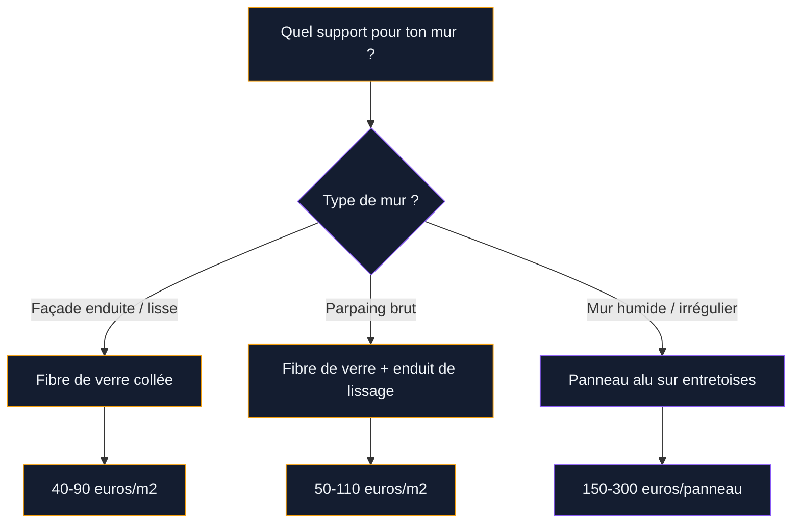

Tu en as assez de tes murs extérieurs tristes, de cette façade grise ou de ce muret en parpaing qui plombe l'ambiance de ta terrasse ? Le papier peint d'extérieur existe, et c'est une vraie solution pour transformer un mur fade en surface décorative - sans gros travaux, sans permis de construire, et pour un budget raisonnable.

Ce n'est pas un gadget ni un truc éphémère. Les revêtements muraux d'extérieur modernes sont fabriqués en fibre de verre ou en toile technique, résistent aux UV, à la pluie, au gel, et tiennent entre 5 et 12 ans selon les marques. Je te détaille les options, les prix, la pose et l'entretien pour faire le bon choix.

## Qu'est-ce que le papier peint d'extérieur exactement ?

Oublie tout de suite l'image du papier peint intérieur collé sur un mur dehors - ça ne marcherait pas deux semaines. Le papier peint d'extérieur, c'est un revêtement mural technique conçu pour résister aux intempéries. Il existe trois grandes familles de produits.

**La toile en fibre de verre** est la solution la plus courante et la plus robuste. C'est un tissage serré de filaments de verre recouvert d'un traitement anti-UV et hydrophobe. Le rendu peut être uni, texturé, ou imprimé avec un motif. Marques de référence : Acte-Déco, WallpaperDream, Etoffe.com. La fibre de verre est le matériau qui dure le plus longtemps - jusqu'à 12 ans pour les meilleures gammes d'après les fabricants.

**Le panneau aluminium composite** (type Dibond) est une plaque rigide sur laquelle un visuel est imprimé en haute définition puis protégé par un vernis anti-UV. On le fixe au mur avec des entretoises ou un système de rail. C'est plus une affiche géante qu'un papier peint à proprement parler, mais le résultat est identique visuellement. Budget plus élevé, pose plus technique.

**La toile tendue sur châssis** fonctionne comme un tableau d'extérieur. Une toile imprimée en polyester technique est tendue sur un cadre alu fixé au mur. L'avantage, c'est que tu peux la retirer facilement pour la nettoyer ou la remplacer. Etoffe.com propose ce format avec des visuels sur-mesure.

> [!NOTE]
> Les papiers peints d'extérieur sont formulés sans COV (composés organiques volatils) et sans solvant. C'est un argument écologique qui n'est pas anodin si tu décores un mur de terrasse où tu manges régulièrement.

## Pourquoi choisir le papier peint plutôt qu'une peinture ?

La peinture murale extérieure, c'est bien pour une teinte unie. Mais dès que tu veux un motif, un trompe-l'oeil, une fresque ou une texture complexe, elle atteint ses limites. Le papier peint d'extérieur te donne accès à des rendus impossibles à obtenir au rouleau : motifs tropicaux, imitations pierre ou bois, fresques graphiques, panoramiques sur-mesure.

L'autre avantage, c'est la facilité de remplacement. Une peinture fatiguée demande décapage, apprêt et deux couches. Un papier peint, tu le décolles et tu en poses un neuf. C'est aussi plus tolérant sur les imperfections du mur : la fibre de verre masque les petites fissures et les irrégularités que la peinture, elle, met en évidence.

Et si tu hésites entre peinture et revêtement pour tes façades, jette un oeil au guide sur les [couleurs pour les extérieurs et façades 2026](/guides/exterieur/couleurs-pour-les-exterieurs-et-les-facades-de-maisons-2026/) qui compare les deux approches.

## Les matériaux en détail : fibre de verre, alu, toile technique

### La fibre de verre : le standard du marché

C'est le matériau que je recommande dans 80% des cas. La fibre de verre combine souplesse (elle épouse les légers reliefs du mur), solidité mécanique (résistante aux chocs, aux griffures, au frottement) et durabilité face aux UV.

Les gammes Acte-Déco annoncent une tenue de 10 à 12 ans en exposition directe. WallpaperDream garantit 7 ans minimum sur ses modèles imprimés. En pratique, la durée de vie dépend beaucoup de l'exposition : un mur nord protégé du soleil direct conservera son éclat plus longtemps qu'une façade plein sud.

Les prix varient selon la personnalisation. Un lé standard (largeur 60 à 100 cm) en fibre de verre imprimée coûte entre 40 et 90 euros le m2. Un motif sur-mesure à partir de ta propre photo monte à 80-150 euros le m2 selon le prestataire. Pour un pan de mur de 4 m2 (2 m x 2 m), compte 160 à 360 euros en gamme standard.

### Le panneau aluminium composite

Plus rigide, plus résistant aux chocs violents, mais plus cher et plus contraignant à poser. Un panneau Dibond imprimé en 200 x 100 cm coûte entre 150 et 300 euros selon l'épaisseur (2 ou 3 mm) et la finition (mat, satiné, brillant). L'avantage : zéro contact avec le mur, donc pas de problème d'humidité. L'inconvénient : les fixations sont visibles (entretoises) ou demandent un rail en alu préalable.

Ce format est idéal pour un mur de terrasse en retrait, un abri de jardin, ou un muret de piscine. Moins adapté pour une grande façade car les jonctions entre panneaux restent visibles.

> [!TIP]
> Si tu veux habiller un muret en parpaing brut sur ta terrasse, la fibre de verre collée directement est la solution la plus simple et la moins chère. Pour un mur humide ou très irrégulier, privilégie le panneau alu sur entretoises qui laisse l'air circuler derrière.

## La pose étape par étape

Poser un papier peint d'extérieur en fibre de verre n'est pas très différent d'une pose intérieure, à quelques détails près. L'enjeu principal, c'est la préparation du mur et le choix de la colle.

### Préparer le mur

Le mur doit être propre, sec, solide et le plus lisse possible. Si tu as un enduit qui s'effrite ou de la mousse, commence par un nettoyage haute pression (80 à 100 bars max). Laisse sécher 48 à 72h. Rebouche les fissures et les trous avec un enduit de rebouchage extérieur (type Toupret, 8-12 euros le pot de 1 kg). Ponce les zones rebouchées au grain 80 puis dépoussiére.

Sur un parpaing brut, il faudra passer un enduit de lissage extérieur sur toute la surface (type Weber ou Parexlanko, 15-25 euros le sac de 15 kg). Sans cette étape, la texture grossière du parpaing se verra à travers le revêtement. Si le sujet t'intéresse, le guide pour [rénover ta terrasse en sécurité](/guides/exterieur/renovez-votre-terrasse-pour-la-securite/) détaille aussi la préparation des supports extérieurs.

### Choisir la bonne colle

C'est le point qui fait toute la différence entre un résultat qui tient 10 ans et un revêtement qui se décolle au premier orage. Il te faut une colle spécifique extérieur, résistante à l'eau et aux variations de température. Quelques références :

- **Colle fibre de verre extérieur Quelyd** : 25-30 euros le seau de 10 kg, couvre environ 15 m2
- **Colle Ovalit TM de Henkel** : professionnelle, adaptée aux revêtements lourds, 35-45 euros les 5 kg
- **Colle acrylique d'Acte-Déco** : vendue avec les lés, formulée pour leurs produits, environ 20 euros le litre

> [!WARNING]
> N'utilise jamais une colle à papier peint classique (type Metylan intérieur) en extérieur. Elle n'est pas hydro-résistante et ton revêtement va se décoller dès la première grosse pluie. La colle extérieur coûte un peu plus cher mais c'est ce qui garantit la longévité.

### Poser les lés

Enduis le mur de colle au rouleau (pas le lé, c'est du "encollage mur" comme pour l'intissé). Applique le premier lé en partant d'un bord droit (angle de mur, encadrement de fenêtre) en le pressant de haut en bas avec une spatule à maroufler. Chasse les bulles d'air vers les côtés. Les lés suivants se posent bord à bord, sans chevauchement. Découpe les surplus en haut et en bas au cutter.

Pour les joints entre lés, certains poseurs appliquent un filet de colle acrylique transparente le long des jonctions pour renforcer l'étanchéité. C'est facultatif sur un mur abrité, recommandé sur une façade exposée.

## Entretien et durée de vie

Un papier peint d'extérieur en fibre de verre bien posé avec la bonne colle tient entre 5 et 12 ans. La marque Acte-Déco communique sur 10-12 ans en conditions normales. WallpaperDream annonce 7 ans de garantie couleur.

L'entretien est minimal. Un nettoyage à l'eau claire et à l'éponge douce une à deux fois par an suffit pour retirer la poussière et les traces de pollution. Si de la mousse commence à apparaître (murs nord, zones humides), applique un anti-mousse doux type Algimouss dilué, laisse agir 15 minutes et rince. Pas de nettoyeur haute pression directement sur le revêtement - ça risque de décoller les bords.

Les UV sont l'ennemi principal. Un revêtement exposé plein sud perdra en intensité de couleur plus vite qu'un mur orienté nord ou est. Certains fabricants proposent un vernis de finition anti-UV en spray (15-25 euros le flacon de 400 ml) à appliquer tous les 2-3 ans pour prolonger l'éclat.

> [!IMPORTANT]
> Avant l'hiver, vérifie que les bords de tes lés sont bien collés. L'eau qui s'infiltre derrière le revêtement puis gèle peut décoller toute une bande en une seule nuit. Un tube de colle acrylique transparente (5-8 euros) et 10 minutes de vérification en octobre évitent les mauvaises surprises au printemps.

## Inspirations : où poser du papier peint d'extérieur ?

Le mur de la terrasse, c'est l'emplacement classique. Un motif tropical, un panoramique de forêt ou un simple effet béton ciré peut complètement changer l'ambiance de ton espace repas extérieur. Si tu cherches aussi à [ombrager ta terrasse](/guides/exterieur/ombrager-terrasse/), un mur décoré associé à une pergola crée un vrai salon de jardin.

**Le muret de piscine** est un autre spot populaire. Un revêtement imitation mosaïque bleu ou imitation bois donne un aspect haut de gamme à un muret en parpaing à moindre coût.

**La façade d'un abri de jardin** ou d'un garage en béton brut se transforme avec un panneau alu grand format. Un visuel de verdure, un motif géométrique ou même une reproduction d'oeuvre d'art - tout est possible.

**Le mur de clôture** entre voisins est souvent moche et sans intérêt. Un habillage en fibre de verre imitation pierre sèche ou imitation crépi coloré change la donne pour 100 à 300 euros.

Et pour aller plus loin dans la personnalisation de ta façade, le guide sur la [peinture pour carrelage extérieur](/guides/exterieur/peinture-pour-carrelage-exterieur-terrasse/) complète bien cette approche si tu as aussi un sol à rénover.

## Combien ça coûte au total ?

Pour un projet type - habiller un pan de mur de terrasse de 6 m2 (3 m de large x 2 m de haut) - voici une estimation réaliste.

| Poste | Budget gamme standard | Budget sur-mesure |
|-------|----------------------|------------------|
| Revêtement fibre de verre (6 m2) | 240 - 540 euros | 480 - 900 euros |
| Colle extérieur | 25 - 35 euros | 25 - 35 euros |
| Enduit de lissage (si parpaing) | 15 - 25 euros | 15 - 25 euros |
| Outils (spatule, cutter, rouleau) | 15 - 25 euros | 15 - 25 euros |
| **Total** | **295 - 625 euros** | **535 - 985 euros** |

En panneau aluminium, le même mur coûtera entre 600 et 1 200 euros tout compris.

A titre de comparaison, un ravalement classique avec enduit décoratif revient à 40-80 euros le m2 pose comprise chez un façadier, soit 240-480 euros pour 6 m2. Le papier peint coûte un peu plus cher en fournitures, mais tu le poses toi-même et tu obtiens un résultat décoratif bien plus original.

## Les limites à connaitre

Le papier peint d'extérieur n'est pas adapté à tous les murs. Un mur sujet aux remontées capillaires (base de mur en contact avec le sol, cave semi-enterrée) va poser problème : l'humidité piégée derrière le revêtement provoque moisissures et décollements. Il faut traiter le problème d'humidité en amont.

Les murs très exposés au vent avec pluie battante (façade ouest en bord de mer par exemple) mettent la colle à rude épreuve. Dans ce cas, le panneau alu fixé mécaniquement est plus adapté que la fibre de verre collée.

La pose sur bois (bardage, palissade) est possible mais demande un traitement préalable du bois et une colle spéciale. Ce n'est pas le support idéal - mieux vaut peindre ou lasurer directement le bois dans ce cas.

## Sur le meme theme

- [pergola ou tonnelle](/guides/exterieur/difference-pergola-tonnelle/)

## FAQ

### Le papier peint d'extérieur résiste-t-il vraiment à la pluie et au gel ?

Oui, à condition de choisir un produit conçu pour l'extérieur. Les revêtements en fibre de verre sont hydrophobes : l'eau glisse dessus sans pénétrer. Pour le gel, c'est la colle qui est la clé. Avec une colle extérieur adaptée et des jonctions bien scellées, le revêtement supporte les cycles gel-dégel sans se décoller. Les fabricants comme Acte-Déco testent leurs produits jusqu'à -20 degrés.

### Combien de temps dure un papier peint d'extérieur ?

Entre 5 et 12 ans selon le matériau, l'exposition et l'entretien. La fibre de verre haut de gamme (Acte-Déco, WallpaperDream) tient 10 à 12 ans sur un mur abrité. Sur une façade exposée plein sud, prévois plutôt 5 à 7 ans avant que les couleurs ne pâlissent sensiblement. Un vernis anti-UV appliqué tous les 2-3 ans prolonge la durée de vie.

### Peut-on poser soi-même un papier peint d'extérieur ?

Oui, si tu as déjà posé du papier peint intérieur, tu sais faire. La technique est la même - encollage mur, pose bord à bord, marouflage. Les deux différences : la colle doit être spécifique extérieur et la préparation du mur demande plus de soin (nettoyage, rebouchage, éventuel enduit de lissage). Compte une demi-journée pour un mur de 6 m2, préparation comprise.

### Quel budget prévoir pour décorer un mur de terrasse ?

Pour un pan de mur de 6 m2 en fibre de verre avec un motif standard, prévois 300 à 600 euros tout compris (revêtement, colle, outils). Un motif sur-mesure ou un format panoramique monte à 550 - 1 000 euros. En panneau aluminium, le budget passe à 600 - 1 200 euros. C'est un investissement intermédiaire entre la peinture simple (100-200 euros) et le parement en pierre (800-2 000 euros).
