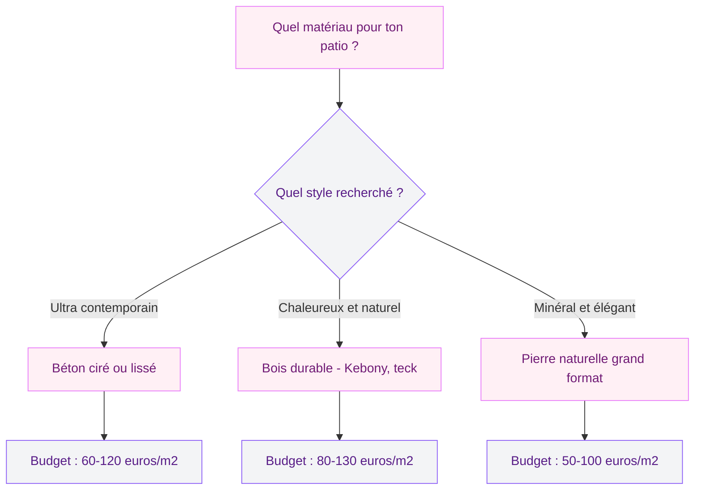
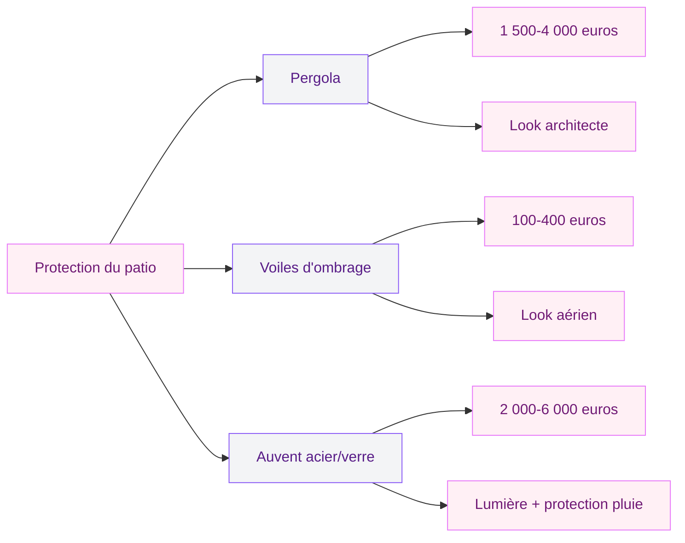
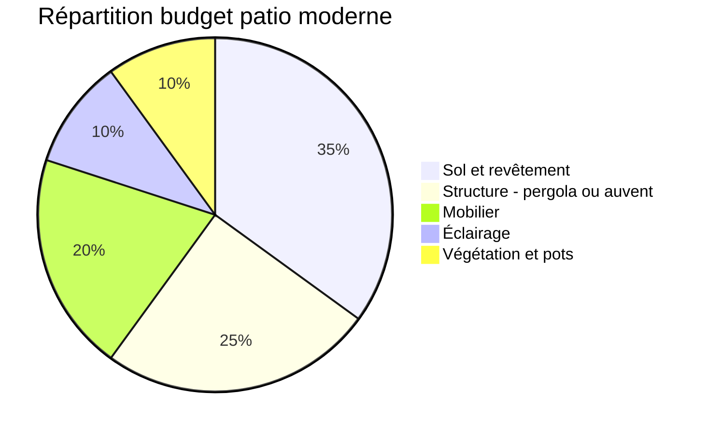

Tu as une cour, un espace entre ta maison et le jardin qui ne sert pas vraiment ? Le patio moderne transforme ce vide en vrai lieu de vie. Pas besoin d'une villa avec piscine - des matériaux bien choisis, du mobilier malin et quelques plantes suffisent.

Le patio, c'est cet espace extérieur couvert ou semi-couvert, entouré de murs ou de cloisons végétales, qui sert à la fois de salon, salle à manger et coin détente. Il se distingue de la terrasse par son côté plus intime, plus protégé. La tendance 2026 est claire : lignes épurées, matériaux naturels, minimalisme chic.

Je te montre comment créer le tien.

## Qu'est-ce qui rend un patio "moderne" ?

Un patio moderne se reconnaît à trois choses : la simplicité des lignes, la qualité des matériaux et l'absence de superflu. Loin du patio provençal croulé sous les jarres, ici chaque élément a une fonction précise.

  

Le design minimaliste domine : formes géométriques nettes, couleurs sobres (gris anthracite, blanc, bois naturel, beige pierre), surfaces lisses. L'oeil se repose, tout est harmonieux.

> [!TIP]
> La règle des trois matériaux fonctionne bien pour un patio moderne : choisis un matériau principal pour le sol (béton, bois, pierre), un pour la structure (métal, bois) et un pour les accessoires (textile, céramique). Pas plus, sinon ça devient brouillon.

L'éclairage joue aussi un rôle central. Spots encastrés dans le sol, appliques murales ou ruban LED sous un banc maçonné - la lumière doit être douce, indirecte, jamais agressive.

## Les matériaux qui changent tout

  

### Le béton ciré ou lissé

Le béton, c'est le roi du patio moderne. Un sol ciré ou lissé donne un look contemporain net, entretien facile (un coup de serpillière). Budget : 60 à 120 euros le m2 posé, avec traitement hydrofuge et antidérapant.

Sa continuité visuelle est un atout majeur : pas de joints, pas de lignes qui cassent l'espace. Sur un petit patio de 10 à 15 m2, l'espace paraît plus grand.

### Le bois durable

Le bois apporte la chaleur que le béton n'a pas. Mais pour un patio moderne, on ne parle pas de lames de terrasse classiques en pin du supermarché. On parle de bois haute performance comme le Kebony, le bambou thermotraité ou le teck.

Le Kebony est un bois résineux modifié par procédé bio qui lui donne les propriétés du bois tropical sans la déforestation. Il ne grise pas, résiste aux insectes, entretien minimal. Budget : 80 à 130 euros le m2 pose non comprise, pour une durée de vie qui dépasse 25 ans.

> [!NOTE]
> Le bois Kebony développe une patine gris argenté avec le temps, un peu comme le teck naturel. Si tu préfères garder la teinte brun chaud d'origine, une couche d'huile saturante une fois par an suffit.

### La pierre naturelle

Le travertin, l'ardoise ou le granit flammé donnent un rendu minéral très élégant. La pierre naturelle vieillit bien et supporte les écarts de température. Pour un patio moderne, choisis des dalles grand format (60x60 cm minimum, idéalement 80x80 cm ou plus) avec des joints fins. Les petits carreaux font "rustique", les grands formats font "architecte".

## Aménager l'espace : les zones à penser

Un bon patio, c'est un espace où chaque zone a son usage sans que les espaces se marchent dessus. Même sur 12 m2, tu peux créer un agencement réel.

  

### La zone repas

Table et chaises en aluminium laqué, banquettes maçonnées avec coussins déperlants, ou table en bois massif avec tabourets hauts - le coin repas donne le ton. Pour un look moderne, les tables avec plateau céramique et pieds métal noir fonctionnent très bien. Fermob, Hay ou Manutti proposent du mobilier outdoor minimaliste durable.

### Le coin lounge

Un canapé d'extérieur bas, des coussins grand format, une table basse en béton ou terrazzo. Si ton patio est petit (moins de 15 m2), le canapé d'angle est ton meilleur allié : il colle aux murs et libère le centre.

### L'espace végétation

Les plantes structurent le patio, mais en mode moderne, on évite le fouillis. Des jardinières rectangulaires en fibre-ciment avec des graminées (miscanthus, pennisetum) ou bambous non traçants créent des écrans végétaux légers et graphiques. Un ou deux gros pots avec un olivier nain ou un citronnier apportent une touche méditerranéenne.

Pour aller plus loin sur les solutions de verdure verticale, jette un oeil aux [jardins verticaux et murs végétaux](/guides/exterieur/jardins-verticaux-de-40-photos-dinspiration-verte/) - ça s'adapte parfaitement à un patio en ville.

## Les structures : pergola, auvent ou voile ?

Un patio moderne a besoin d'une couverture, même partielle. Sans protection, c'est juste une cour. Avec, tu restes dehors quelle que soit la météo.

  

### La pergola minimaliste

Poteaux en acier laqué noir ou aluminium anthracite, traverses fines, toile rétractable ou lames orientables. C'est la solution la plus architecturale. Une pergola adossée 3x4 m coûte entre 1 500 et 4 000 euros selon la finition. Le guide sur la [pergola bioclimatique](/guides/exterieur/la-pergola-bioclimatique-lalliance-parfaite-entre-esthetique-et-confort/) détaille les options haut de gamme avec lames orientables.

### Les voiles d'ombrage

Pour un budget plus serré, les voiles tendues en triangle ou rectangle superposées créent un jeu d'ombres graphique. En version haut de gamme (toile acrylique traitée UV), elles tiennent 8 à 10 ans. L'astuce : des tons neutres (sable, gris clair, blanc cassé) tendus à différentes hauteurs pour créer de la profondeur.

> [!WARNING]
> Si tu choisis des voiles d'ombrage, prévois des points d'ancrage solides. Un piton dans un mur en parpaing crépi, ça ne tiendra pas longtemps. Perce dans le chaînage ou dans un poteau de structure, et utilise des fixations inox avec platine de répartition. Le vent n'est pas ton ami sur ce sujet.

### L'auvent en acier et verre

Solution haut de gamme qui protège de la pluie en laissant passer la lumière. Un auvent en verre trempé avec structure acier donne un rendu contemporain, presque "loft industriel". Budget : 300 à 600 euros le m2 pose comprise, avec un résultat spectaculaire sur un patio urbain.

## Éclairage : l'élément qui fait passer de "bien" à "magnifique"

L'éclairage extérieur, c'est là où la plupart des gens se plantent. Un spot de chantier au plafond, ça ne suffit pas. Un patio moderne mérite mieux.

  

**Les spots encastrés dans le sol** (IP67 minimum pour résister à l'eau) créent des lignes de lumière au ras du sol le long des murs ou des bordures. Effet garanti pour 15 à 30 euros le spot LED encastrable (Philips Hue Outdoor, Ledvance).

**Les appliques murales d'extérieur** en forme géométrique simple (cube, cylindre) projettent un faisceau vers le haut et vers le bas qui dessine des formes sur le mur. C'est très "boutique hotel". Budget : 30 à 80 euros l'applique (Lucide, Nordlux, Faro).

**Les guirlandes lumineuses** en ampoules Edison vintage LED apportent une ambiance festive sans kitsch. Tends-les en lignes droites : un câble acier inox entre deux points avec ampoules espacées régulièrement donne un plafond de lumière très réussi.

Pour prolonger la réflexion sur les jeux de lumière en extérieur, tu trouveras d'autres pistes dans le guide sur [comment ombrager sa terrasse](/guides/exterieur/ombrager-terrasse/) - la gestion de la lumière naturelle et artificielle se répond souvent.

## Le mobilier : moins de pièces, plus d'impact

La tentation, c'est de tout remplir. Résiste : un patio moderne vit de l'espace libre. Trois meubles forts valent mieux que dix éléments moyens.

**Un canapé modulable d'extérieur** en résine tressée ou aluminium avec coussins Sunbrella (tissu résistant UV, moisissures, taches). Un modèle 3 places avec méridienne : 800 à 2 500 euros selon la marque (Vondom, Gandia Blasco, ou Maisons du Monde pour les budgets serrés).

**Une table d'appoint en béton ou en terrazzo** plutôt qu'un guéridon classique. Ça ancre l'espace et ça ne craint ni la pluie ni le soleil. Tu en trouves à partir de 80 euros en version 40x40 cm chez HAY ou Made.

**Un brasero ou une cheminée d'extérieur** transforme ton patio en destination même en mi-saison. Les modèles au bioéthanol ne produisent ni fumée ni cendre et s'installent sans conduit. Budget : 200 à 1 000 euros pour un design correct (EcoSmart Fire, Planika, Kratki).

> [!TIP]
> Pour les coussins d'extérieur, ne lésine pas sur la qualité du tissu. Un coussin en polyester basique va moisir en un mois. Les toiles Sunbrella ou Olefin résistent 5 à 7 ans en plein air sans décolorer ni moisir. L'écart de prix se récupère dès la deuxième saison.

## Végétation : le cadrage vert

Les plantes sur un patio moderne ne sont pas là pour "décorer" - elles sont là pour cadrer, structurer et adoucir. Trois approches fonctionnent bien.

**Les plantes architecturales en pot** : agaves, yuccas, palmiers nains (chamaerops humilis), phormiums. Dans des contenants en fibre-ciment gris ou acier corten, elles renforcent le look contemporain. Un gros phormium en pot de 60 cm : 40 à 80 euros plante + pot.

**Les grimpantes sur câble tendu** : jasmin étoilé, chèvrefeuille ou bougainvillée montés sur câbles inox le long d'un mur ou sur la pergola. Ecran vert léger et parfumé sans l'épaisseur d'une haie.

**Les graminées en masse** : pennisetum, stipa tenuissima, carex - en rangées dans des bacs linéaires, elles ondulent avec le vent et apportent du mouvement à l'ensemble.

Si tu as envie de créer toi-même tes contenants, le guide pour [fabriquer des jardinières DIY](/guides/exterieur/diy-jardiniere/) t'aidera à obtenir un résultat personnalisé à moindre coût.

## Budget global : combien prévoir ?

Un patio moderne de 15 m2 tout compris, ça coûte combien ?

- **Version économique** (béton existant + voiles d'ombrage + mobilier d'entrée de gamme + plantes) : 1 500 à 3 000 euros
- **Version intermédiaire** (nouveau sol béton ciré ou dalles pierre + pergola kit + bon mobilier + éclairage) : 5 000 à 10 000 euros
- **Version premium** (bois Kebony ou pierre naturelle + pergola bioclimatique + mobilier design + éclairage architectural) : 12 000 à 25 000 euros

Le sol représente 30 à 40% du budget, puis vient la structure de couverture. Le mobilier, tu peux l'étaler dans le temps - commencer avec l'essentiel et compléter saison après saison.

## Les erreurs à éviter

**Trop de matériaux différents.** Béton + bois + pierre + métal + carrelage sur 12 m2 ? Ça ressemble à un showroom, pas à un patio. Deux ou trois matériaux maximum.

**Oublier le drainage.** Un patio sans pente (1 à 2% minimum) et sans évacuation, c'est une flaque géante au premier orage. Prévois une grille linéaire ou un caniveau discret.

**Négliger le vis-à-vis.** Si les voisins voient tout, tu n'y passeras jamais de temps. Des claustras en bois composite, des canisses en PVC imitation bambou ou un mur végétal règlent le problème.

**Sous-estimer le soleil de l'après-midi.** Même avec une couverture, si ton patio est plein ouest, la chaleur va être intense entre 14h et 18h en été. Combine une couverture fixe avec des stores verticaux ou des plantes grimpantes sur le côté ouest.

Un patio moderne bien pensé, c'est un espace que tu utilises du printemps à l'automne, et en hiver avec un brasero et un plaid. Le secret : sobriété des choix et qualité des matériaux. Moins tu en mets, plus chaque élément compte.

---

## Sur le meme theme

- [pergola ou tonnelle](/guides/exterieur/difference-pergola-tonnelle/)

## FAQ

**Quelle taille minimum pour un patio moderne fonctionnel ?**
Un patio de 8 à 10 m2 suffit pour installer une petite table de 2 à 4 personnes et un fauteuil lounge. En dessous de 8 m2, l'espace devient trop étroit pour être confortable avec du mobilier. À partir de 15 m2, tu peux créer de vraies zones séparées (repas, détente, plantes).

**Faut-il un permis de construire pour aménager un patio ?**
Si tu restes au niveau du sol existant et sans construction de murs permanents, aucune autorisation n'est requise dans la plupart des communes. En revanche, si tu ajoutes une couverture fixe (pergola, auvent) au-delà de 20 m2, une déclaration de travaux - et parfois un permis de construire - sera demandée. Vérifie auprès de ta mairie.

**Quel sol de patio choisir en région pluvieuse ?**
Évite le bois lisse non strié et le béton non traité. Opte pour du bois composite avec rainures antidérapantes (classement R11 minimum), du béton brossé ou désactivé (la texture granuleuse assure l'adhérence), ou de la pierre naturelle flammée. L'important, c'est la pente d'évacuation : 1,5 à 2% pour que l'eau ne stagne jamais.

**Comment protéger un patio du vent sans casser le look moderne ?**
Les brise-vent en verre trempé fixé sur poteaux en inox sont la solution la plus élégante - ils coupent le vent sans bloquer la vue. Plus économiques, les claustras en aluminium à lames orientables (type persiennes) filtrent le vent tout en gardant une ligne épurée. Les haies de graminées en bac fonctionnent aussi, avec un rendu plus doux.

**Peut-on aménager un patio moderne en location ?**
Oui, en misant sur des éléments non fixés. Des dalles clipsables en bois composite posées directement au sol (à partir de 20 euros le m2), un mobilier déplaçable, des voiles d'ombrage sur mâts autoportés, des pots avec plantes et un éclairage sur prise suffisent à transformer une cour moche en patio stylisé. Et tu remportes tout en partant.
