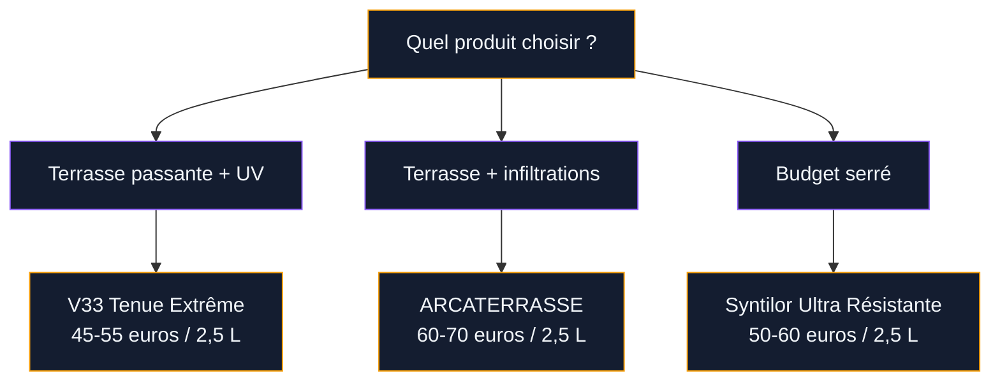

Tu regardes ta terrasse et tu te dis que ce carrelage a fait son temps. Les couleurs ont pâli, les dalles sont ternes, et tu n'as clairement pas le budget (ni l'envie) de tout arracher pour reposer du neuf. La peinture pour carrelage extérieur est une vraie solution - mais attention, ce n'est pas la même chose que repeindre une crédence de cuisine. Dehors, le soleil tape, la pluie s'invite, le gel travaille les joints. Choisir le mauvais produit, c'est un résultat qui s'écaille en moins d'un an.

Je t'explique comment choisir la bonne peinture, préparer correctement ta terrasse et appliquer pour que le résultat tienne plusieurs années sans te ruiner.

## Pourquoi repeindre son carrelage de terrasse ?

La première raison, c'est le budget. Remplacer un carrelage extérieur, c'est dépose + évacuation + repose + joint : facilement 80 à 150 euros le m2 avec un pro. Peindre, c'est 8 à 25 euros le m2 en fournitures selon le produit. Pour une terrasse de 20 m2, on passe de 2000-3000 euros à 200-500 euros. Le calcul est vite fait.

  

La deuxième raison, c'est la rapidité. Un week-end suffit pour changer complètement le look de ta terrasse. Pas besoin de faire appel à un carreleur, pas de poussière de dépose, pas de délai de livraison. Tu choisis ton produit, tu prépares, tu peins.

Et puis il y a les cas où le carrelage est en bon état structurellement mais juste moche. Des dalles beiges des années 90, un grès cérame terne, un ancien carrelage rouge devenu rose sous le soleil - la peinture redonne un coup de neuf sans gaspiller un matériau qui fait encore le job techniquement.

> [!NOTE]
> La peinture pour carrelage extérieur ne masque pas les problèmes structurels. Si tes dalles bougent, se fissurent ou se descellent, il faut d'abord réparer avant de peindre. Sinon la peinture va craqueler en quelques semaines.

## Quelle peinture choisir : le point important

C'est LA question qui fait la différence entre un résultat durable et une catastrophe. En extérieur, tu ne peux pas utiliser n'importe quel produit.

  

### Les peintures à éviter absolument

**La résine époxy.** C'est le piège classique. En intérieur, l'époxy donne un super résultat sur le carrelage de cuisine ou de salle de bain. Mais dehors ? Le soleil UV fait jaunir la résine en quelques mois. Le film devient cassant avec les chocs thermiques. ResinPro et les fabricants le disent clairement : l'époxy, c'est pour l'intérieur uniquement. Ne te laisse pas tenter par son aspect lisse et brillant - dehors ça ne tient pas.

**Les peintures acryliques basiques.** Une peinture murale acrylique standard, même "multi-supports", n'est pas faite pour résister au passage répété, aux flaques d'eau stagnante et aux cycles gel-dégel. Elle va s'écailler en plaques dès le premier hiver.

### Les bons produits pour l'extérieur

**V33 Tenue Extrême Sol Extérieur** est la référence la plus connue. Peinture polyuréthane monocomposant, elle résiste aux UV, à l'abrasion et aux intempéries. Tu la trouves chez Leroy Merlin et Castorama entre 45 et 55 euros le pot de 2,5 L (couvre environ 25 m2 en 2 couches). La gamme de teintes est vraiment bien pensée pour l'extérieur : galet, poudre de marbre, ciment, pierre, silex, rouge oxyde, carbone, terre ocrée. Des tons qui s'intègrent naturellement à un espace dehors.

**Syntilor Ultra Résistante Sol** est l'autre valeur sûre. Un peu plus chère (50-60 euros les 2,5 L) mais avec une formule très résistante aux passages intensifs. Elle s'applique aussi sur béton, pierre et ciment - pratique si ta terrasse combine plusieurs matériaux.

**ARCATERRASSE** est un produit un peu différent. C'est une résine d'étanchéité décorative plutôt qu'une peinture classique. Elle crée un film étanche et antidérapant. Le bidon de 2,5 L coûte 60-70 euros et couvre environ 5 m2 en 2 couches (le rendement est plus faible car la couche est épaisse). Option intéressante si tu as aussi des problèmes d'infiltration.

> [!TIP]
> Pour savoir quel produit te convient, regarde deux choses sur la fiche technique : la résistance aux UV (obligatoire en extérieur) et le classement antidérapant. Un produit classé R10 ou R11 te protège des glissades sur terrasse mouillée.

## Préparer la terrasse : 80% du résultat se joue ici

Peindre sans préparer, c'est jeter ton argent par la fenêtre. La préparation du carrelage extérieur demande plus de soin qu'en intérieur - il y a de la mousse, de la poussière incrustée, parfois du salpêtre. Voici les étapes dans l'ordre.

  

### Étape 1 : nettoyage en profondeur

Commence par un balayage grossier pour virer les feuilles et débris. Ensuite, passe un nettoyeur haute pression à 80-100 bars. L'objectif c'est d'enlever toute la mousse, les algues, les taches de graisse et la crasse accumulée. Insiste bien sur les joints.

Si tu n'as pas de kärcher, un produit anti-mousse (type Algimouss, 15-20 euros les 5 L) appliqué au pulvérisateur et laissé agir 48h fera le travail. Rince ensuite au jet d'eau.

### Étape 2 : réparation des joints et fissures

Regarde chaque joint et chaque dalle. Les joints vides ou friables doivent être repris avec un mortier souple pour extérieur (Mapei Ultracolor Plus, 12-18 euros le sac de 5 kg). Les fissures dans les dalles se comblent avec un mastic polyuréthane souple. Cette étape est chiante mais elle conditionne la tenue de ta peinture.

### Étape 3 : dégraisser et sécher

Applique un produit dégraissant (le Saint Marc classique marche très bien, 5-8 euros le sachet) sur toute la surface. Frotte avec un balai-brosse, rince abondamment. Puis laisse sécher 48h minimum. Le carrelage doit être parfaitement sec - c'est pour ça qu'on évite de faire ce chantier quand la météo annonce de la pluie.

### Étape 4 : appliquer le primaire d'accrochage

Certains produits comme V33 n'exigent pas de primaire si le support est propre et poreux. Mais sur un carrelage grès cérame émaillé (surface lisse et vitreuse), un primaire d'accrochage spécifique est recommandé. Julien vend un primaire carrelage à environ 20 euros le litre. Une couche fine au rouleau, 4h de séchage, et ton support est prêt.

> [!WARNING]
> Ne peins jamais sur un carrelage humide ou si la température est en dessous de 10 degrés ou au-dessus de 30 degrés. La peinture ne sèche pas correctement et le film sera fragile. La fenêtre idéale : mai-juin ou septembre, par temps sec.

## Application : les gestes qui font la différence

Le matériel nécessaire est simple : un rouleau à poils courts (type laqueur, 10 mm maximum), un pinceau à réchampir pour les bords et les joints, du ruban de masquage pour protéger les murs et les seuils, et un bac à peinture.

  

### Première couche

Mélange bien ta peinture (au moins 5 minutes avec un bâton ou un mélangeur sur perceuse). Commence par les bords au pinceau, puis remplis les grandes surfaces au rouleau en croisant les passes. Sur du carrelage, il faut insister légèrement pour bien faire pénétrer la peinture dans la micro-porosité du support.

Pose des couches fines et régulières. La tentation c'est de charger le rouleau pour "en mettre moins" mais des couches épaisses sèchent mal et cloquent. Le rendement indiqué sur le pot (10-12 m2 par litre en général) est là pour te guider.

### Temps de séchage et deuxième couche

Laisse sécher 24h entre les deux couches - même si le produit indique 8h. En extérieur, l'humidité ambiante ralentit le séchage, et tu veux un film parfaitement dur avant de repasser. La deuxième couche se pose de la même façon. Certains produits tolèrent une troisième couche pour les zones très passantes (devant la porte d'entrée par exemple).

Après la dernière couche, attends 48 à 72h avant de remettre les meubles de jardin et de marcher dessus normalement. La polymérisation complète peut prendre jusqu'à 7 jours - évite les talons aiguilles et les pieds de chaise métalliques pendant cette période.

## Entretien : comment faire durer le résultat

Un carrelage peint en extérieur tient entre 3 et 7 ans selon le produit, l'exposition et l'entretien. Pour maximiser la durée de vie, quelques réflexes simples.

  

**Nettoyage doux.** Oublie le kärcher à fond sur la peinture - la haute pression peut arracher le film. Utilise un balai-brosse avec de l'eau tiède et un savon doux (savon noir, produit vaisselle dilué). Nettoie une à deux fois par mois en saison.

**Pas de produits abrasifs.** L'eau de Javel concentrée, les décapants, les cristaux de soude agressifs - tout ça attaque le film de peinture. Si tu as une tache tenace, frotte avec du bicarbonate de soude en pâte, ça suffit en général.

**Retouches ponctuelles.** Garde un fond de pot de ta peinture. Si tu remarques un éclat ou une zone qui commence à s'user (souvent devant la porte ou au pied de la table), un coup de pinceau localement prolonge la durée de vie de l'ensemble. Ponce légèrement la zone au papier de verre fin (grain 120) avant de retoucher.

Si tu cherches aussi à sécuriser ta terrasse pendant cette rénovation, jette un oeil à mon [guide pour rénover une terrasse en toute sécurité](/renovez-votre-terrasse-pour-la-securite/). Les deux chantiers se combinent bien.

> [!TIP]
> Place des patins en feutre sous les pieds de tes meubles de jardin. Les pieds métalliques rayent la peinture à chaque déplacement. Un jeu de patins coûte 3-5 euros et évite des retouches.

## Couleurs : quoi choisir pour l'extérieur

Les teintes très claires (blanc pur, beige très pâle) se salissent vite en extérieur et marquent chaque trace de pas mouillé. Les teintes très sombres (noir, anthracite) chauffent énormément au soleil et rendent la surface brûlante pieds nus l'été.

Les tons moyens sont le bon compromis : galet, gris pierre, terre cuite, sable, vert kaki. La gamme V33 Tenue Extrême propose justement des tons pensés pour ça. Le "galet" et le "ciment" sont les deux best-sellers - neutres, faciles à assortir avec n'importe quel mobilier de jardin, et qui ne révèlent pas chaque grain de poussière.

Pour un style plus méditerranéen, le rouge oxyde ou la terre ocrée V33 donnent un beau cachet. Ça s'accorde bien avec de la pierre naturelle, du bois et des plantes vertes.

Si tu te poses aussi la question pour le carrelage intérieur, la démarche est différente : tu trouveras les bons produits dans le [guide peinture carrelage cuisine](/peinture-pour-carrelage-cuisine/) et le [guide peinture sur carrelage intérieur](/la-peinture-sur-carrelage-une-methode-pour-renover-votre-interieur/).

## Les erreurs les plus courantes (et comment les éviter)

**Peindre un carrelage humide.** C'est l'erreur numéro un. En extérieur, le carrelage peut sembler sec en surface mais retenir de l'humidité en profondeur. Après le nettoyage, attends au moins 48h sans pluie. En cas de doute, colle un morceau de film plastique sur le carrelage avec du scotch pendant 24h : si de la condensation apparaît dessous, c'est encore trop humide.

**Utiliser de l'époxy en extérieur.** On l'a dit mais ça mérite d'être répété : l'époxy jaunit aux UV et se fissure avec les écarts de température. Même les vendeurs en magasin se trompent parfois. Vérifie toujours la mention "usage extérieur" sur le pot.

**Sauter le primaire sur carrelage émaillé.** Le carrelage émaillé a une surface lisse comme du verre. Sans primaire d'accrochage, ta peinture va se décoller en plaques dès la première pluie. Dix minutes d'application du primaire sauvent des mois de frustration.

**Peindre en plein soleil.** La peinture sèche trop vite, laisse des traces de rouleau et n'adhère pas correctement. Peins le matin tôt ou en fin de journée, quand la terrasse est à l'ombre.

Si tu réfléchis aussi à d'autres aménagements pour ta terrasse, regarde la [différence entre pergola et tonnelle](/difference-pergola-tonnelle/) pour créer un coin ombragé au-dessus de ton nouveau carrelage peint.

---

Repeindre le carrelage de ta terrasse, c'est le meilleur rapport effort-résultat pour rafraîchir ton extérieur. Avec le bon produit (oublie l'époxy, mise sur V33 ou Syntilor), une préparation sérieuse et un peu de patience au séchage, tu obtiens un résultat qui change complètement l'ambiance de ton espace dehors. Et si dans 4-5 ans la peinture commence à fatiguer, tu peux remettre une couche sans tout refaire.

## Sur le meme theme

- [parasols de terrasse pour cafés et restaurants](/le-guide-ultime-des-parasols-de-terrasse-pour-cafes-hotels-et-restaurants/)

## Questions fréquentes

**Combien de temps tient la peinture sur du carrelage de terrasse ?**
Avec un produit adapté type V33 Tenue Extrême ou Syntilor Ultra Résistante, compte 3 à 5 ans en usage normal. Sur une terrasse couverte ou peu exposée, ça peut aller jusqu'à 7 ans. L'entretien doux et les retouches ponctuelles prolongent bien la durée de vie.

**Peut-on peindre du carrelage de terrasse antidérapant ?**
Oui, et c'est même plus facile car la surface rugueuse offre une meilleure accroche à la peinture. Tu peux sauter l'étape du primaire dans la plupart des cas. Vérifie quand même la fiche technique de ton produit.

**Faut-il poncer le carrelage avant de peindre ?**
Sur du carrelage poreux ou rugueux, non. Sur du grès cérame émaillé (surface brillante), un léger ponçage au papier grain 80 améliore l'accroche. Dans tous les cas, un primaire d'accrochage est plus efficace que le ponçage seul.

**Quelle est la meilleure période pour peindre sa terrasse ?**
Mai-juin et septembre sont les mois idéaux. Il te faut au moins 3-4 jours consécutifs sans pluie, une température entre 15 et 25 degrés, et une humidité ambiante raisonnable. Évite juillet-août si ta terrasse est en plein soleil - la chaleur excessive dégrade le séchage.
