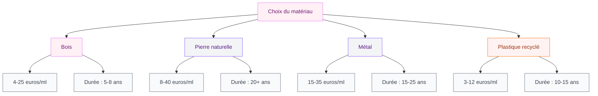

# Poser des bordures de jardin sans béton : le guide complet pour un résultat pro

Tu veux délimiter tes massifs, créer une jolie séparation entre la pelouse et les parterres, mais l'idée de te lancer dans un chantier béton te donne des sueurs froides ? Je te comprends tellement. Le béton, c'est lourd à manipuler, cher à mettre en oeuvre, et si tu changes d'avis dans deux ans... bon courage pour tout casser.

La bonne nouvelle : on peut poser des bordures de jardin solides et esthétiques sans une seule goutte de béton. Et le résultat peut être franchement canon. Que tu aies un petit jardin de ville ou un grand terrain, je vais te montrer les différentes méthodes, les matériaux qui tiennent la route, et surtout le budget réel pour chaque option.

## Pourquoi se passer de béton pour ses bordures ?

Le béton a longtemps été le réflexe numéro un pour les bordures de jardin. Mais quand on y regarde de plus près, les alternatives sans béton ont de vrais avantages :

  

- **Budget réduit** : pas besoin de ciment, de sable à mélanger, ni de matériel de maçonnerie. Tu économises facilement 30 à 50 % sur le coût total.
- **Pose rapide** : la plupart des bordures sans béton se posent en une après-midi. Pas de temps de séchage, pas de coffrage.
- **Flexibilité** : tu peux déplacer, ajuster ou remplacer une section sans tout détruire. Si tu es du genre à réarranager ton jardin chaque printemps (comme moi), c'est un vrai plus.
- **Respect du sol** : le béton empêche l'eau de s'infiltrer naturellement. Les bordures posées "à sec" laissent respirer la terre.

> [!TIP]
> Avant de choisir ton matériau, observe bien ton jardin pendant une grosse pluie. Les zones où l'eau stagne te disent où le drainage est mauvais - et c'est là qu'une bordure sans béton sera bien plus adaptée qu'un mur de béton qui bloque encore plus l'écoulement.

## Les matériaux : comparatif honnête

  

### Bordures en bois

Le bois donne un rendu chaleureux et naturel, parfait pour un jardin un peu sauvage ou champêtre. Tu as plusieurs options :

- **Rondins ou demi-rondins** : les plus accessibles. On en trouve chez Leroy Merlin à partir de 4 euros le mètre linéaire (pin traité autoclave classe 4). Durée de vie : 5 à 8 ans.
- **Traverses paysagères** : plus imposantes, elles créent une vraie structure. Compte 15 à 25 euros la traverse de 1,20 m chez Castorama ou Point Vert.
- **Planches de bois Douglas** : alternative française et durable. Environ 8 à 12 euros le mètre linéaire. Le Douglas résiste naturellement à l'humidité sans traitement chimique.

> [!WARNING]
> Évite les traverses de chemin de fer recyclées : elles sont traitées à la créosote, un produit toxique interdit dans les jardins depuis 2003. Même si on en trouve encore sur Le Bon Coin, passe ton chemin.

### Bordures en pierre naturelle

La pierre naturelle, c'est le choix haut de gamme qui vieillit le mieux. Pas besoin de béton pour la poser : on la cale dans la terre et on laisse le poids faire le travail.

- **Palis d'ardoise** : ultra tendance, finition graphique. De 20 à 40 euros le mètre linéaire chez Stonenaturelle ou en jardinerie spécialisée.
- **Galets de rivière** : pour un rendu zen et organique. Un sac de 25 kg coûte entre 8 et 15 euros chez Brico Dépôt. Compte 3 à 4 sacs par mètre linéaire.
- **Pierre de récup** : si tu as la chance de trouver des vieilles pierres en brocante ou sur un chantier, c'est gratuit et plein de charme.

### Bordures métalliques

Le métal, c'est la star des jardins modernes et des paysagistes pros. Et pour cause : discret, efficace, très simple à poser.

- **Acier corten** : cet acier qui rouille volontairement donne un look industriel chic. Environ 15 à 30 euros le mètre linéaire (EasyBordure, MultiEdge). L'épaisseur de 3 mm est le minimum pour que ça tienne dans le temps.
- **Acier galvanisé** : plus discret, il reste gris argent. Même gamme de prix. Idéal si tu veux une bordure quasi invisible.
- **Aluminium** : léger et ne rouille jamais. Un peu plus cher, autour de 20 à 35 euros le mètre linéaire (marque Kinsman ou Carea Design).

### Bordures en plastique recyclé

Longtemps boudées parce qu'elles faisaient "cheap", les bordures plastique ont beaucoup évolué. Les gammes en plastique recyclé sont solides et ont un look correct.

- **Bordures souples en polyéthylène** : à partir de 3 euros le mètre linéaire. Parfaites pour les courbes et les formes organiques. La marque Gardena propose des kits complets à 25-35 euros pour 9 mètres.
- **Bordures rigides en plastique recyclé** : imitation bois ou pierre, de 6 à 12 euros le mètre linéaire (marque EcoBorder, dispo chez Amazon ou ManoMano).

## Les étapes de pose : méthode universelle

Quel que soit le matériau que tu choisis, la préparation du terrain suit toujours le même schéma. C'est vraiment la partie la plus importante - une bordure bien préparée, c'est une bordure qui tient des années.

  

### Étape 1 : Tracer le parcours

Plante des piquets aux extrémités et tends un cordeau (ou un simple fil de maçonnerie) pour marquer ta ligne. Pour les courbes, utilise un tuyau d'arrosage souple posé au sol : c'est le truc le plus pratique pour visualiser une forme arrondie.

### Étape 2 : Creuser la tranchée

Avec une bêche plate, creuse une tranchée de 15 à 20 cm de profondeur et environ 10 cm de large. La profondeur dépend du matériau : pour des bordures métalliques fines, 10 cm suffisent. Pour des rondins de bois, prévois 15 à 20 cm.

> [!NOTE]
> Si ton sol est très argileux et compact, arrose-le abondamment la veille. La terre sera beaucoup plus facile à travailler le lendemain. Ça t'évitera de te ruiner le dos avec une bêche qui rebondit sur un sol dur comme la pierre.

### Étape 3 : Préparer le fond

Dépose une couche de 3 à 5 cm de gravier fin ou de sable grossier au fond de la tranchée. Ce lit de pose assure deux choses : un drainage correct et un calage stable pour tes bordures. Tasse légèrement avec le dos de la bêche ou un petit dame manuel.

### Étape 4 : Poser les bordures

C'est là que chaque matériau a ses petites spécificités :

**Pour le bois** : enfonce les rondins ou les planches verticalement dans la tranchée. Laisse dépasser la hauteur souhaitée (en général 5 à 10 cm au-dessus du sol). Cale-les bien droit avec de la terre tassée de chaque côté.

**Pour la pierre** : pose les pierres une par une dans la tranchée, bien serrées les unes contre les autres. Joue sur l'épaisseur du lit de sable pour ajuster la hauteur. Un maillet en caoutchouc aide à bien les caler sans les casser.

**Pour le métal** : la plupart des bordures en acier ou alu se vendent avec des piquets de fixation intégrés. Il suffit de les enfoncer au marteau. C'est probablement la pose la plus rapide - 10 mètres en moins d'une heure.

**Pour le plastique** : les modèles souples se déroulent le long de la tranchée. Fixe-les avec les piquets fournis tous les 50 cm environ. Les modèles rigides s'emboîtent par clips.

### Étape 5 : Remblayer et tasser

Rebouche la tranchée de chaque côté de la bordure avec la terre excavée. Tasse bien avec le pied ou un dame. Arrose légèrement pour que la terre se stabilise naturellement autour de la bordure.

## Budget réel : combien ça coûte pour 10 mètres ?

Parce que les chiffres au mètre linéaire c'est bien, mais ce qu'on veut savoir c'est le total au final. Voici une estimation pour 10 mètres linéaires, pose comprise (en le faisant toi-même) :

  

| Matériau | Coût bordure | Fournitures (gravier, piquets) | Total estimé |
|----------|-------------|-------------------------------|--------------|
| Rondins bois pin | 40-60 euros | 15-20 euros | **55-80 euros** |
| Palis d'ardoise | 200-400 euros | 20-30 euros | **220-430 euros** |
| Acier corten 3 mm | 150-300 euros | 10-15 euros | **160-315 euros** |
| Bordure souple plastique | 30-50 euros | 10-15 euros | **40-65 euros** |
| Galets de rivière | 80-150 euros | 15-20 euros | **95-170 euros** |

Le plastique recyclé reste l'option la plus économique. Mais si tu vises un rendu naturel et durable, le bois Douglas offre un excellent rapport qualité-prix à environ 100-140 euros les 10 mètres.

> [!TIP]
> Mon astuce budget : mixe les matériaux. Métal sur les lignes droites (plus rapide à poser, rendu net) et bois ou pierre dans les courbes et les zones visibles. Tu obtiens un jardin pro sans exploser le budget.

## Les erreurs à éviter absolument

J'ai vu (et fait) pas mal de ratages en matière de bordures. Voici les pièges classiques :

  

**Ne pas creuser assez profond.** Une bordure qui dépasse de 10 cm mais qui n'est enfoncée que de 5 cm dans le sol, ça bougera au premier coup de vent ou passage de tondeuse. Règle simple : enfonce au moins autant que ce qui dépasse.

**Oublier le lit de drainage.** Poser directement sur la terre argileuse, c'est le meilleur moyen d'avoir des bordures qui gondolent avec les cycles gel-dégel. Les 3-5 cm de gravier font toute la différence.

**Choisir du bois non traité.** Le pin brut en contact avec la terre, ça pourrit en 2 ans max. Choisis du bois classe 4 (traité autoclave) ou du bois naturellement résistant : Douglas, châtaignier, robinier.

**Négliger les jonctions.** Entre deux sections de bordure, laisse un petit espace de 2-3 mm pour la dilatation (surtout pour le métal). Pour le bois, assure une bonne jointure pour éviter que les mauvaises herbes passent entre les éléments.

## Entretien selon le matériau

Un des gros avantages des bordures sans béton, c'est l'entretien réduit. Mais chaque matériau a ses petits besoins :

**Bois** : un coup de saturateur une fois par an prolonge la durée de vie. Pas besoin de poncer - applique simplement au pinceau large sur le bois sec. Un litre de saturateur bois extérieur coûte 15-20 euros chez Leroy Merlin (marque V33 ou Bondex) et couvre facilement 10 mètres de bordure.

**Pierre** : quasi zéro entretien. Un désherbage manuel le long des bordures au printemps et c'est tout. Évite le nettoyeur haute pression qui finit par éroder la surface.

**Métal** : l'acier corten ne demande rien - la patine de rouille le protège naturellement. L'acier galvanisé peut se ternir avec les années, un coup de peinture anti-rouille tous les 5 ans suffit. L'aluminium, lui, ne bouge pas.

**Plastique** : un coup de jet d'eau si ça verdit avec les mousses. C'est tout.

Si tu te lances aussi dans l'aménagement de ta [terrasse avec un design moderne](/terrasse-design-amenagements-exterieurs-tendance/), les bordures en acier corten créent une belle continuité visuelle entre jardin et terrasse.

## Quelle bordure pour quel usage ?

Le bon matériau dépend aussi de ce que tu veux délimiter :

**Séparation pelouse / massif fleuri** : la bordure métallique fine (5-10 cm de haut) est parfaite. Elle bloque les racines de gazon sans créer de barrière visuelle. Les [plantes d'intérieur comme d'extérieur](/plantes-interieur-deco/) méritent des contours bien définis.

**Contour d'allée en gravier** : des bordures plus hautes (15-20 cm) en bois ou en pierre pour retenir le gravier. Sans ça, tu vas retrouver des cailloux partout dans la pelouse en quelques semaines.

**Potager en carrés** : le bois reste le roi. Des planches de Douglas de 20 cm de haut, assemblées en carrés, c'est le classique qui marche. Si tu aimes le DIY, c'est un projet proche de la philosophie [récup et upcycling](/decoration-recup-upcycling-maison-unique/) adaptée au jardin.

**Bordure décorative visible** : la pierre naturelle ou l'acier corten donnent le rendu le plus premium. Et pour un aménagement de [balcon ou petit espace extérieur](/balcon-amenagement-petit-espace-optimise/), des mini-bordures en ardoise font des merveilles pour structurer les jardinières.

> [!IMPORTANT]
> Pour un potager, vérifie que ton bois est certifié "contact alimentaire" ou utilise du bois non traité chimiquement (Douglas, châtaignier). Les traitements autoclave ancienne génération contenaient du CCA (cuivre-chrome-arsenic) - les normes actuelles utilisent des produits sans arsenic, mais le bois naturellement imputrescible reste le choix le plus sûr.

## Sur le meme theme

- [conteneur maritime au jardin](/guides/exterieur/comment-transformer-votre-jardin-avec-un-conteneur-maritime/)
- [jardins verticaux](/guides/exterieur/jardins-verticaux-de-40-photos-dinspiration-verte/)
- [serre tunnel](/guides/exterieur/installer-serre-tunnel/)
- [jardin zen](/guides/exterieur/comment-creer-un-jardin-zen-en-7-etapes/)
- [jardins intérieurs modernes](/guides/exterieur/jardins-interieurs-modernes-photos-et-conseils-de-conception/)

## FAQ

### Combien de temps durent les bordures posées sans béton ?

Ça dépend du matériau. Le plastique recyclé tient 10 à 15 ans, le bois traité 5 à 8 ans (le Douglas jusqu'à 15 ans), le métal 15 à 25 ans, et la pierre naturelle pratiquement une vie entière. La clé, c'est surtout la qualité de la préparation du sol et le lit de drainage.

### Est-ce que les bordures sans béton bougent avec le gel ?

Oui, un peu - c'est normal. Le cycle gel-dégel fait "travailler" le sol et les bordures peuvent se décaler de quelques millimètres. C'est pour ça que le lit de gravier est si important : il absorbe les mouvements. Au printemps, un petit recalage de 5 minutes suffit si une section a bougé.

### Peut-on poser des bordures sans béton sur un terrain en pente ?

Oui, mais il faut adapter la technique. Sur une pente, pose les bordures en escalier (chaque section légèrement plus basse que la précédente) plutôt qu'en suivant la pente. Ancre-les avec des piquets plus longs enfoncés à 25-30 cm et ajoute un peu plus de gravier au fond pour stabiliser. Pour les fortes pentes (plus de 15 %), des bordures métalliques avec fixations profondes sont le meilleur choix.

### Faut-il une autorisation pour poser des bordures de jardin ?

Non, aucune autorisation n'est requise tant que tu restes sur ta propriété et que les bordures ne dépassent pas 60 cm de haut. Au-delà, ça peut être considéré comme une clôture et les règles d'urbanisme de ta commune s'appliquent. Vérifie ton PLU en cas de doute.
