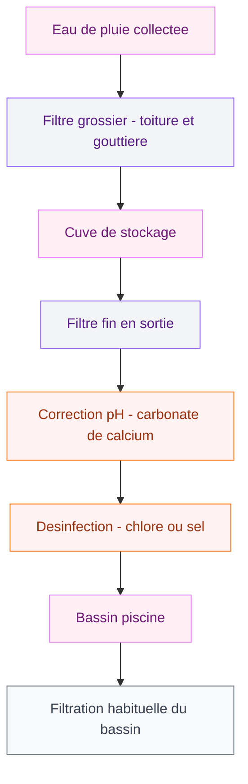

Remplir une piscine, c'est entre 30 et 60 m3 d'eau selon la taille. Autant dire que quand tu regardes ta facture en fin de saison, tu te dis qu'il doit bien y avoir une meilleure solution. Et il y en a une : récupérer l'eau de pluie pour alimenter ton bassin.

C'est pas un truc de preppers ou d'écolo extrême. C'est juste du bon sens, un peu d'installation au départ, et tu récupères très vite ta mise. Je t'explique tout ce qu'il faut savoir pour que ça marche vraiment.

## Pourquoi utiliser l'eau de pluie pour ta piscine ?

La première raison, c'est le prix. L'eau du robinet coûte en moyenne 4 à 5 euros le m3 (eau + assainissement). Pour une piscine de 50 m3, ça fait déjà 200 à 250 euros rien que pour le remplissage initial, sans compter les appoints tout au long de la saison dus à l'évaporation, aux éclaboussures, et aux purges régulières.

La deuxième raison, c'est que l'eau de pluie est douce par nature. Elle contient peu de calcaire, ce qui réduit les dépôts sur tes parois et ta filtration. Concrètement, tu consommes moins de produits d'entretien et ton filtre tient plus longtemps. C'est du bonus.

Et la troisième raison : ton jardin te remercie aussi. Si tu installes un système bien dimensionné, tu peux utiliser le trop-plein de cuve pour arroser. Si tu fais partie de ceux qui aménagent leurs espaces avec soin - comme quand on pense à [un jardin zen bien conçu](/guides/exterieur/comment-creer-un-jardin-zen-en-7-etapes/) - autant que tout soit cohérent et durable.

> [!NOTE]
> En France, l'amortissement d'une installation de récupération d'eau de pluie pour piscine se fait généralement sur 6 à 10 ans selon la taille de ton bassin et ta pluviométrie locale. Dans les régions très arrosées (Bretagne, Normandie, Alsace), c'est plus vite rentabilisé.

## Ce qu'il faut savoir avant de commencer

L'eau de pluie n'est pas de l'eau potable et elle n'est pas non plus immédiatement prête pour ta piscine. Elle est acide (pH souvent entre 5,5 et 6,5), elle peut contenir des particules en suspension, des feuilles, des matières organiques, et selon ton environnement, des traces de pollution atmosphérique.

Bonne nouvelle : ça se traite facilement. Le process est en deux temps : filtration physique avant le stockage, puis remontée du pH et désinfection avant et après l'entrée dans le bassin.

Tu n'as pas besoin d'un labo. Tu as besoin d'un bon système installé correctement.

## Le matériel de base pour un système efficace

### La cuve de récupération

C'est le coeur de ton installation. Quelques points à retenir :

- **Volume recommandé** : vise au moins 5 000 litres pour une piscine de taille standard (30 à 50 m3). Idéalement, 10 000 à 15 000 litres si tu as la place, pour lisser les périodes sans pluie.
- **Matériau** : béton ou polyéthylène. Le béton est intéressant car il tamporise naturellement l'acidité de l'eau. Le polyéthylène est plus facile à poser soi-même.
- **Enterrée vs hors-sol** : une cuve enterrée reste invisible et maintient une température stable (moins d'algues). Une cuve hors-sol est moins chère à poser mais nécessite un espace dédié.

Prix : une cuve polyéthylène de 10 000 L coûte entre 800 et 1 500 euros. Avec la pose professionnelle d'une cuve enterrée, compte 3 000 à 5 000 euros au total.

### Le système de filtration

L'eau collectée passe par un filtre avant de rentrer dans la cuve. Un filtre grossier (maille autour de 1 000 microns) retient les feuilles et gros débris. Un filtre fin en sortie de cuve (maille 100 à 200 microns) élimine les particules plus petites avant que l'eau rejoigne ton bassin.

Certaines cuves spéciales piscine intègrent directement ces deux niveaux de filtration - comme les modèles proposés par Jardineale, qui incluent un filtre inox autonettoyant. Ça simplifie l'entretien.

> [!TIP]
> Ajoute un système flotteur + électrovanne sur ta cuve. Quand le niveau descend trop bas (sécheresse), l'installation bascule automatiquement sur le réseau d'eau de ville pour maintenir un niveau minimum dans le bassin. Tu n'as rien à surveiller.

### La pompe de relevage

Si ta cuve est enterrée, tu as besoin d'une pompe pour remonter l'eau vers la piscine. Compte 200 à 500 euros pour une pompe de qualité. Branchée sur un programmateur, elle peut fonctionner la nuit pour éviter la chaleur.

## Le traitement de l'eau : la partie pas optionnelle

C'est là où certains font des erreurs. Décharger directement l'eau de pluie dans ta piscine sans traitement, ça peut fonctionner... pendant une semaine. Ensuite, tu te retrouves avec une eau verte et un pH hors norme.

### Corriger le pH

L'eau de pluie est acide. Dans une piscine, le pH idéal se situe entre 7,2 et 7,4. Si tu ajoutes de l'eau à pH 5,5 directement, ça va faire chuter le pH de ton bassin et attaquer tes parois.

Solution : ajouter du carbonate de calcium (appelé "pH plus" dans les magasins de piscine) soit dans la cuve, soit directement dans le bassin après remplissage. C'est vraiment pas compliqué. Compte 1 à 2 kg pour 10 m3 selon le pH de départ.

Si tu stockes l'eau dans une cuve en béton, ce matériau tamporise naturellement une partie de l'acidité. C'est un avantage concret du béton sur le polyéthylène pour cet usage précis.

### La désinfection

Une fois le pH corrigé, tu traites comme n'importe quelle eau de piscine : chlore, brome, ou sel si tu as un électrolyseur. L'eau de pluie n'est pas plus difficile à désinfecter que l'eau du robinet. Elle ne contient pas de calcaire en excès, ce qui est même un avantage : le chlore agit mieux dans une eau douce.

> [!WARNING]
> Fais un test de pH et de chlore après chaque ajout d'eau de pluie dans le bassin, surtout les premières fois. Quand tu auras pris tes marques et que tu connais le comportement de ton installation, tu pourras espacer les tests. Mais au départ, surveille bien.

## Peut-on aussi recycler l'eau de la piscine elle-même ?

Oui, c'est une autre approche complètement différente. Plutôt que de la vider et remplir chaque année, tu gardes l'eau d'une saison sur l'autre.

Ça marche pour les piscines enterrées et hors-sol. La clé : une hivernation soignée et un système de filtration bien entretenu pendant la période de fermeture (en mode ralenti mais actif).

Les avantages : tu économises 80 à 90% de la consommation d'eau, tu n'as pas à retraiter une eau froide au printemps, et le coût des produits chimiques est réduit car tu pars d'une eau déjà équilibrée.

L'inconvénient : si l'eau part en vrille (algues, contamination), tu es quand même obligé de la vidanger. C'est moins risqué avec une bonne couverture hivernale (bulle, bâche filet ou bâche opaque) et un traitement d'hivernation sérieux en octobre.

## Combiner les deux : la stratégie optimale

La meilleure approche si tu veux vraiment réduire ta consommation d'eau, c'est de combiner le recyclage de l'eau existante (hivernation bien faite) et la récupération d'eau de pluie pour les appoints en saison.

Concrètement :
- Tu gardes ton eau d'une année sur l'autre
- Tu installes une cuve de récup pour les pertes en cours de saison (évaporation = 3 à 5 cm par semaine en été, les éclaboussures, les purges de fond)
- Tu n'ouvres le robinet que pour les urgences

Résultat : une piscine qui tourne presque en autonomie sur l'eau. C'est atteignable, vraiment.

Si tu es dans une logique globale d'aménagement extérieur malin, cette réflexion s'intègre bien avec d'autres projets comme une [pergola bioclimatique](/guides/exterieur/la-pergola-bioclimatique-lalliance-parfaite-entre-esthetique-et-confort/) qui peut aussi récupérer l'eau de pluie de son toit pour alimenter le même système.

> [!IMPORTANT]
> En France, la réglementation autorise l'utilisation d'eau de pluie pour les usages extérieurs dont la piscine. L'eau de pluie ne doit en revanche pas être connectée au réseau d'eau potable sans un disconnecteur agréé. Si tu fais installer un système avec bascule automatique eau de ville / eau de pluie, vérifie que le plombier utilise bien un disconnecteur conforme (norme NF EN 1717).

## Budget récapitulatif

Pour un système complet eau de pluie + piscine, voilà une fourchette réaliste selon le niveau d'installation :

**Installation de base (cuve hors-sol 3 000 L + filtre simple)**
- Cuve hors-sol : 150 à 300 euros
- Filtre et raccordements : 80 à 150 euros
- Pompe de refoulement : 150 à 250 euros
- Total : 400 à 700 euros

**Installation intermédiaire (cuve enterrée 10 000 L)**
- Cuve polyéthylène avec filtre intégré : 800 à 1 500 euros
- Pose et raccordements : 500 à 1 000 euros
- Pompe + flotteur + électrovanne : 300 à 500 euros
- Total : 1 600 à 3 000 euros

**Installation haut de gamme (cuve béton + automatisation)**
- Cuve béton 15 000 L : 2 000 à 3 500 euros
- Pose professionnelle complète : 1 500 à 2 500 euros
- Système automatisé avec disconnecteur : 500 à 800 euros
- Total : 4 000 à 6 800 euros

Pour une piscine de 50 m3 avec un coût d'eau à 4,50 euros le m3, tu économises environ 225 euros par remplissage complet. Avec les appoints de saison (15 à 20 m3 en moyenne), on est sur 70 à 90 euros d'économie supplémentaire par an. L'amortissement du système de base intervient en 3 à 5 saisons.

> [!TIP]
> Si tu as un grand jardin, pense à dimensionner ta cuve pour qu'elle serve aussi l'arrosage. Un système à 10 000 litres qui alimente à la fois la piscine et tes massifs, c'est une logique globale qui accélère l'amortissement. Pour les jardins aménagés avec plusieurs zones, comme quand on travaille à [transformer un espace extérieur en zone de vie](/guides/exterieur/comment-transformer-votre-jardin-avec-un-conteneur-maritime/), ce type d'investissement s'intègre naturellement.

## Sur le meme theme

- [construire un pool house](/guides/exterieur/construire-pool-house/)
- [patio moderne](/guides/exterieur/patio-moderne-de-maisons-simples-et-belles/)

## Les questions qu'on se pose souvent

**Est-ce que l'eau de pluie peut vraiment servir dans une piscine ?**
Oui, à condition d'être filtrée et traitée. Elle est même de bonne qualité de départ car très douce, ce qui facilite l'équilibre de l'eau.

**Quelle surface de toiture faut-il pour remplir une piscine de 30 m3 ?**
Avec 100 m2 de toiture et 600 mm de pluie par an (moyenne française), tu collectes théoriquement 60 m3 par an (en tenant compte des pertes). C'est largement suffisant pour les appoints annuels, et potentiellement pour le remplissage complet si tu stockes assez.

**La municipalité peut-elle interdire ce type d'installation ?**
Non, c'est légal partout en France pour les usages non sanitaires. Certaines communes avec des restrictions d'eau peuvent même encourager ce type de système.

**Combien de temps prend le traitement de l'eau avant qu'elle soit utilisable ?**
Si tu corriges le pH et tu ajoutes le traitement dans la cuve avant d'envoyer dans le bassin, c'est quasi immédiat. Si tu verses directement dans le bassin, 24 à 48 heures de circulation et filtration suffisent pour stabiliser les paramètres.

**Peut-on installer une cuve de récupération soi-même ?**
Pour une cuve hors-sol, complètement. Pour une cuve enterrée, la partie terrassement et pose de la cuve demande généralement un professionnel, mais les raccordements peuvent se faire en DIY si tu as quelques notions de plomberie.
