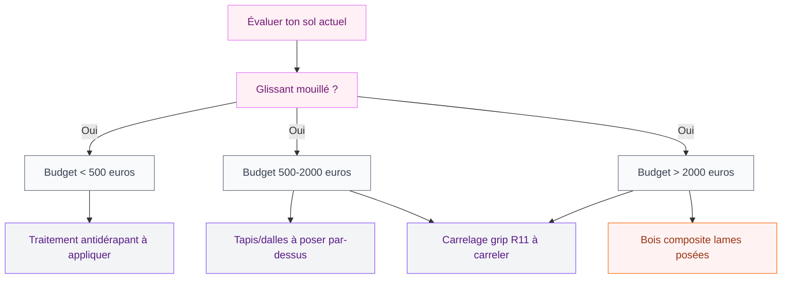
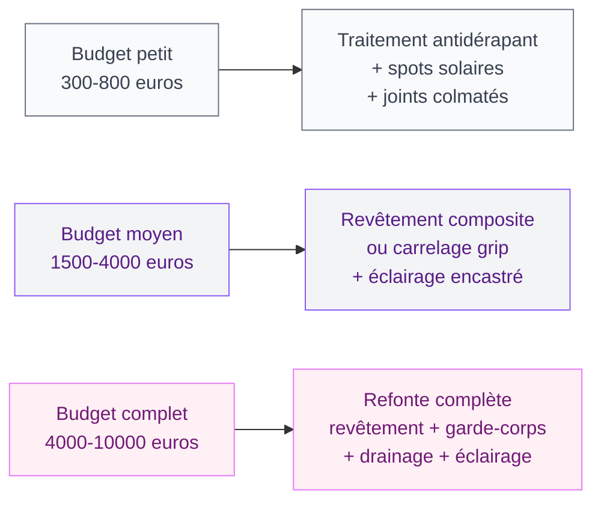

Ta terrasse est belle, le soleil est là, tu poses enfin un verre dessus... et tu glisses sur les dalles mouillées. Ou tu remarques que le garde-corps bouge un peu quand tu t'y appuies. Ces petits signaux d'alarme, on les ignore souvent jusqu'au jour où ça devient vraiment problématique.

La sécurité d'une terrasse, c'est un sujet qu'on n'a pas envie de traiter mais qui fait toute la différence au quotidien - surtout si tu as des enfants, des personnes âgées ou tout simplement envie de profiter de ton espace sans te poser de questions. Bonne nouvelle : ça ne demande pas forcément un budget énorme ni un chantier de plusieurs semaines. Avec les bons choix de matériaux et quelques vérifications régulières, tu transformes un espace potentiellement dangereux en un coin vraiment agréable.

Je t'explique tout, étape par étape.

## État des lieux : les 4 dangers les plus courants

Avant de dépenser quoi que ce soit, commence par un tour d'horizon de ta terrasse. La plupart des accidents surviennent à cause de quatre problèmes récurrents.

**Le sol glissant** est le risque numéro un. Les dalles en pierre naturelle, le béton lisse, certains carrelages extérieur... tous deviennent des patinoires dès qu'ils sont mouillés. En automne avec les feuilles mortes, c'est encore pire. Teste ton sol avec la méthode simple : mouille une zone et marche dessus avec des chaussettes. Si ça glisse, c'est qu'il faut agir.

**Le garde-corps défaillant** est le danger silencieux. Avec le temps, les fixations se desserrent, la rouille fragilise les montants métalliques, le bois pourrit en profondeur. Un garde-corps qui semble tenu peut céder sous une pression soudaine. Pour une terrasse surélevée de plus de 1 mètre, c'est le point à vérifier en priorité absolue.

**Le drainage insuffisant** crée des flaques persistantes et accélère la dégradation des matériaux. L'eau stagnante, c'est aussi de la mousse et des algues qui s'installent en quelques semaines, rendant le sol encore plus glissant.

**Les joints et fixations détériorés** créent des zones de fragilité que tu ne vois pas forcément à l'oeil nu. Une dalle descellée, une lame de terrasse qui se soulève, un escalier dont les marches bougent - autant de pièges qui attendent le mauvais moment.

> [!WARNING]
> Un garde-corps doit résister à une force horizontale de 500 N par mètre linéaire selon la norme NF P01-012. Si le tien date de plus de 15 ans ou si tu as le moindre doute, fais-le vérifier par un professionnel avant l'été.

## Choisir le bon revêtement antidérapant

C'est souvent la rénovation la plus impactante qu'on puisse faire. Et les options sont bien plus jolies qu'avant - fini les solutions laides qui font "sécurité renforcée hôpital".

### Les revêtements à éviter (ou à traiter)

Le carrelage brillant en extérieur, c'est une erreur courante. Même avec un classement UPEC correct, un carrelage poli devient dangereux dès la première pluie. Si tu le gardes, il faudra appliquer un traitement antidérapant régulièrement - ce qui représente un entretien contraignant.

La pierre naturelle polie (marbre, granite, ardoise lisse) présente le même problème. Belle en photo, risquée sous la pluie.

### Les meilleures options en 2026

**Le bois composite nouvelle génération** est mon option préférée pour allier esthétique et sécurité. Des marques comme Cedral, Silvadec ou Fiberdeck proposent des lames avec stries intégrées offrant un classement antidérapant R11 ou R12. Comptez 35 à 65 euros le m2 posé selon la gamme. Le composite ne pourrit pas, ne prend pas de vermoulure, et reste très stable thermiquement.

**Le carrelage grip** ou carrelage à fort coefficient d'adhérence (classification R11 minimum pour un extérieur) existe maintenant dans des designs très beaux. Castorama propose par exemple sa gamme "Outdoor" à partir de 25 euros le m2. En piscine ou douche extérieure, vise du R12.

**Les dalles en pierre granito ou pierre reconstituée texturée** donnent un bel effet naturel avec une adhérence bien meilleure que la pierre polie. Leroy Merlin vend des dalles béton texturées à 15-20 euros le m2 - très accessibles pour un résultat pro.

**Les revêtements caoutchouc ou vinyle extérieur** sont moins glamour mais parfaitement adaptés pour une terrasse avec enfants en bas âge. Des tapis extérieur en polypropylène tissé plat (La Redoute en a de très beaux à partir de 59 euros) ajoutent aussi une couche de sécurité tout en décorant l'espace.

> [!TIP]
> Pour les terrasses existantes en carrelage que tu ne veux pas refaire, il existe des peintures antidérapantes pour extérieur (Ripolin, Bondex, V33) à environ 25-35 euros le pot. Ça ne tient que 2-3 ans mais c'est une solution économique en attendant.

## Le garde-corps : normes et choix

Si ta terrasse est en hauteur - même 60 cm au-dessus du sol - un garde-corps s'impose. En France, la réglementation est claire : toute terrasse accessible de plus de 1 mètre de hauteur doit être équipée d'un garde-corps d'au moins 1 mètre de haut (1,10 m recommandé en pratique).

### Vérifier ce que tu as déjà

Commence par ces trois tests rapides :

1. Appuie franchement sur le garde-corps avec ton poids - il ne doit absolument pas bouger.
2. Vérifie les fixations au sol et au mur - pas de rouille, pas de jeu.
3. Regarde les barreaux ou le remplissage verre - l'écartement ne doit pas dépasser 11 cm (pour qu'un enfant ne puisse pas passer la tête).

Si ton garde-corps échoue à l'un de ces tests, la priorité c'est le renforcement ou le remplacement, pas la déco.

### Quels matériaux choisir pour un nouveau garde-corps

**L'acier galvanisé ou inox** est la solution la plus durable. Un garde-corps inox brossé 316L résiste parfaitement à la corrosion même en bord de mer. Comptez 200 à 400 euros par mètre linéaire posé, selon le design (barreaux, câble, verre).

**Le verre feuilleté sécurit** donne un rendu ultra contemporain et laisse passer la lumière - parfait pour ne pas "couper" une belle vue. Attention au prix : 350 à 600 euros du mètre linéaire posé. Si tu veux du beau, c'est l'option. Tu peux d'ailleurs t'inspirer du style des [façades de maisons modernes 2026](/guides/decoration/facades-de-maisons-modernes-2026/) pour assortir le garde-corps à l'architecture de ta maison.

**L'aluminium laqué** est plus accessible (150 à 250 euros le mètre) et disponible dans des dizaines de coloris RAL. Il ne rouille pas, ne se déforme pas, nécessite zéro entretien. Très populaire pour les terrasses contemporaines.

**Le bois** reste une option si tu l'entretiens sérieusement - lasure ou huile chaque année minimum. Un garde-corps en bois non traité devient dangereux en 5-7 ans. Pas le plus pratique si tu cherches de la tranquillité.

> [!NOTE]
> France Rénov' peut prendre en charge une partie des travaux de sécurisation si tu es propriétaire occupant avec des revenus modestes. Le dispositif MaPrimeRénov' couvre parfois les travaux d'accessibilité et de sécurité. Renseigne-toi sur france-renov.gouv.fr avant de budgéter.

## Drainage : l'étape qu'on oublie toujours

Un bon drainage, ça fait une différence énorme sur la sécurité ET sur la durabilité de ta terrasse. L'eau stagnante, c'est la mousse en 3 semaines, le gel qui fracture les dalles en hiver, et les flaques glissantes après chaque averse.

La pente minimale recommandée est de 1,5% à 2% pour évacuer l'eau efficacement. Si ta terrasse est parfaitement plate, c'est le premier problème à régler.

### Solutions selon la situation

**Terrasse avec drainage insuffisant :** installe des caniveaux de récupération en bordure (caniveaux ACO par exemple, à partir de 15 euros le mètre). Reliés à un réseau d'évacuation ou à un puisard dans le jardin, ils résolvent 80% des problèmes de stagnation.

**Terrasse en bois sur lambourdes :** vérifie que l'espace entre les lames est suffisant (au moins 5 mm) et que la circulation d'air sous les lames est libre. Un moustiquaire anti-feuilles posé en dessous empêche le colmatage progressif.

**Terrasse carrelée plate :** les joints ouverts (sable ou gravier) au lieu de joints cimentés permettent l'infiltration. C'est la technique des "dalles sur plot" qui est maintenant la norme pour les terrasses contemporaines - chaque dalle repose sur quatre plots réglables, l'eau s'écoule librement en dessous.

> [!TIP]
> Deux fois par an - printemps et automne - passe un karcher avec de l'eau froide sur ta terrasse. Ça élimine la mousse avant qu'elle s'installe et ça t'évite les produits chimiques agressifs pour les joints.

## L'éclairage : sécurité et ambiance

On l'oublie souvent mais un éclairage adéquat fait partie de la sécurité de ta terrasse. Des marches mal éclairées, un escalier dans le noir, c'est l'accident garanti.

Les spots encastrés dans les marches d'escalier sont LA solution la plus efficace - ils signalent chaque degré clairement sans éblouir. Des marques comme Paulmann, OSRAM ou les gammes pro de Castorama proposent des spots extérieur IP65 à partir de 8 euros pièce. Pour un escalier de 6 marches, compte 100 euros de matériel et 2h de pose si tu es à l'aise avec l'électricité.

Le long des cheminements et des bordures, des spots encastrés dans les dalles ou des bornes solaires balisent les zones de passage. Les bornes solaires avec détecteur de mouvement (Lumisky chez Leroy Merlin, environ 25 euros pièce) sont zéro contrainte - pas de câble, pas de consommation électrique.

Si tu réfléchis à un aménagement plus complet avec une structure couverte, les [pergolas bioclimatiques](/guides/exterieur/la-pergola-bioclimatique-lalliance-parfaite-entre-esthetique-et-confort/) intègrent souvent un système d'éclairage LED dans les poteaux - une très bonne solution pour sécuriser la zone sous la pergola.

## Budget récapitulatif : ce que ça coûte vraiment

Voilà un tableau honnête selon les scénarios les plus courants.

**Le must-have minimum (300-500 euros) :** traitement antidérapant sur sol existant, renforcement des fixations du garde-corps, nettoyage professionnel anti-mousse. Ça ne transforme pas ta terrasse mais ça élimine les risques les plus immédiats.

**La rénovation partielle (1500-3000 euros) :** remplacement du revêtement sur 15-20 m2 avec du composite ou du carrelage grip, + remplacement ou renforcement du garde-corps sur la longueur critique. La majorité des terrasses en ont pour ce budget.

**La rénovation complète (4000-8000 euros) :** nouveau revêtement, garde-corps en inox ou verre, drainage optimisé avec caniveaux, éclairage encastré dans les marches et en bordure. Pour une terrasse de 25-30 m2, c'est le budget d'une rénovation qui durera 20 ans sans entretien sérieux.

> [!IMPORTANT]
> Demande toujours 3 devis pour les travaux de garde-corps et de revêtement. Les écarts peuvent aller du simple au triple pour une prestation identique. Et vérifie que l'artisan connaît les normes NF P01-012 - c'est sa responsabilité légale en cas de problème.

## Les travaux que tu peux faire toi-même

**Le traitement antidérapant :** application au rouleau ou à la brosse, pas de compétence spéciale requise. Sèche en 24h. Durée : une demi-journée.

**La pose de dalles sur plots :** une fois le principe compris (posées sans colle, les plots se règlent en hauteur), c'est accessible en DIY. Ikea proposait (et propose parfois en édition limitée) des dalles en bois pour balcon - vérifier la disponibilité. Sinon, Castorama et Leroy Merlin ont de bons choix autour de 20-30 euros le m2 avec plots inclus.

**Le remplacement de joints détériorés :** un peu long mais pas difficile. Produit de rejointoiement souple pour extérieur (Mapei Ultracolor Plus par exemple, 12-18 euros le sac de 5 kg) et une spatule. Compte 2-3 heures pour 15 m2.

**La pose de bornes et spots solaires :** zéro électricité, juste planter les piquets ou visser les supports. Le plus simple.

**Ce qu'il vaut mieux confier à un pro :** tout ce qui touche à l'électricité encastrée, la pose d'un garde-corps (pour la garantie et la conformité aux normes), et le rejointoiement en périphérie de maison qui touche à l'étanchéité.

Si tu repenses aussi l'aspect esthétique global de ta maison en même temps que la terrasse, jette un oeil aux tendances en matière de [maisons modernes en 2026](/guides/exterieur/maisons-modernes-2026-images-dexterieur-et-dinterieur/) - les matériaux et couleurs qui marchent bien en façade fonctionnent souvent très bien en continuité sur la terrasse.

---

La sécurité de ta terrasse, c'est un investissement qui te donnera de la tranquillité d'esprit pour des années. Pas besoin de tout refaire en une fois - commence par les points critiques (sol glissant et garde-corps), puis améliore progressivement le drainage et l'éclairage. Et profite enfin de ta terrasse sans te poser de questions.

## Questions fréquentes

**Quelle est la hauteur réglementaire d'un garde-corps de terrasse en France ?**
Le garde-corps doit faire au minimum 1 mètre de haut pour une terrasse accessible. En pratique, les professionnels installent 1,10 m pour rester dans les marges de sécurité. La norme applicable est la NF P01-012.

**Quel revêtement de terrasse est le moins glissant ?**
Le bois composite texturé avec stries intégrées (classement R11-R12) et le carrelage extérieur grip (R11 minimum) sont les options les plus antidérapantes. Évite les pierres naturelles polies et le carrelage intérieur utilisé en extérieur.

**Peut-on rénover une terrasse en hiver ?**
Pour les revêtements collés ou les travaux de jointoiement, évite les températures inférieures à 5 degrés - les produits ne prennent pas correctement. La pose de dalles sur plots et l'installation de bornes solaires, en revanche, se fait par toutes températures.

**Combien de temps durent les travaux pour une terrasse de 20 m2 ?**
Un remplacement de revêtement complet prend 2-4 jours avec une équipe de 2 personnes. Un garde-corps se pose en une journée. Pour un DIY week-end, prévois de pouvoir utiliser la terrasse le week-end suivant si tu gères bien les étapes.

**Les aides financières couvrent-elles les travaux de sécurisation de terrasse ?**
Certaines aides comme MaPrimeRénov' peuvent couvrir des travaux d'accessibilité et de sécurité pour les personnes âgées ou handicapées. L'ANAH propose aussi des aides pour l'adaptation du logement. Contacte France Rénov' (0 808 800 700) pour un bilan de ta situation.
