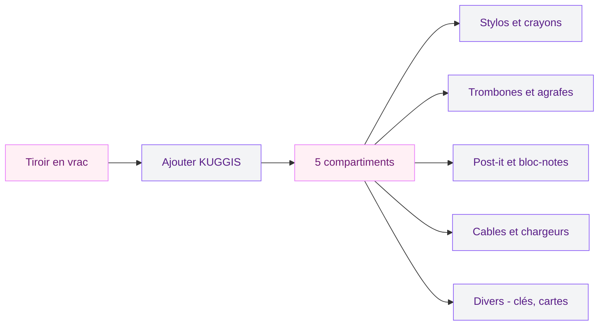
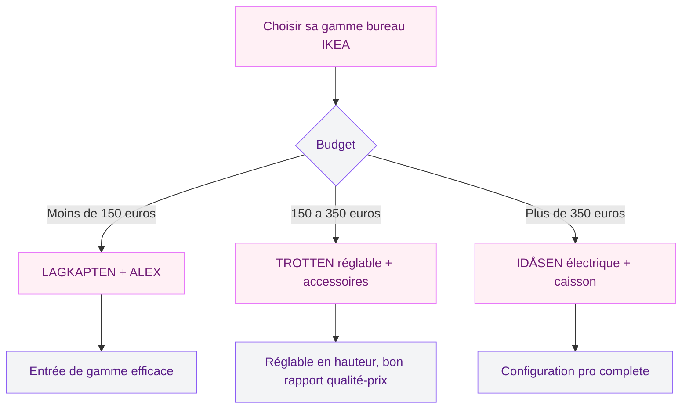

Tu t'assois a ton bureau, tu repousses la pile de papiers, tu cherches ton stylo sous trois post-it colles n'importe ou, et tu finis par bosser dans un chaos organisé (enfin, surtout chaos). Ca me parle, parce que c'est exactement ce que je vivais avant de m'attaquer a mon espace de travail avec quelques rangements IKEA bien choisis. Pas besoin de vider ton compte en banque : avec les bonnes pieces, tu peux transformer un bureau bordélique en poste de travail clair et fonctionnel en un week-end.

## Pourquoi ton bureau merite un vrai systeme de rangement

Un bureau encombre, c'est du temps perdu chaque jour. Selon une étude de Brother International, les employés de bureau passent en moyenne 38 heures par an a chercher des documents et des fournitures mal rangés. Meme si tu bosses depuis chez toi, ce temps gaspillé s'accumule vite.

  

Le probleme, c'est rarement le manque de place. C'est l'absence de systeme. Tu empiles au lieu de trier, tu poses au lieu de ranger, et en deux semaines ton plan de travail disparait sous les cables, les carnets et les tasses vides.

> [!NOTE]
> Un bureau bien organisé réduit le stress visuel et aide a se concentrer. La regle simple : chaque objet doit avoir une place attitrée. Si tu ne sais pas ou poser un truc, c'est qu'il te manque un rangement dédié.

L'avantage d'IKEA pour le bureau, c'est le rapport qualité-prix et la compatibilité entre les gammes. Un caisson ALEX se glisse sous un plateau LAGKAPTEN, une desserte ÖVNING se positionne a coté pour les documents courants, et une mini-commode FJÄDERHARV trouve sa place sur le bureau pour les petites fournitures. Tout s'emboite sans forcer.

## ALEX : le caisson a tiroirs qui fait référence

Le caisson ALEX, c'est un peu le classique indémodable du rangement bureau chez IKEA. Disponible en blanc, gris-turquoise, noir-brun et beige, il se décline en version 5 tiroirs (environ 79 euros) ou en version a tiroirs avec classeur (environ 99 euros).

  

### Ce qui le rend si populaire

La hauteur du caisson (70 cm) correspond exactement a la hauteur standard d'un bureau. Tu le glisses sous le plateau et il affleure parfaitement. Pas de décalage, pas de bricolage. Les tiroirs coulissent sur des glissieres silencieuses, et le tiroir inférieur est assez profond pour accueillir des dossiers suspendus au format A4.

**Les dimensions a retenir :**
- Largeur : 36 cm
- Profondeur : 58 cm
- Hauteur : 70 cm
- Poids : environ 20 kg

### Comment bien l'utiliser

L'erreur que je vois souvent, c'est de remplir les cinq tiroirs de la meme maniere. Mieux vaut suivre une logique de fréquence d'utilisation :

- **Tiroir du haut** : stylos, surligneurs, post-it, écouteurs - tout ce que tu attrapes dix fois par jour
- **Deuxieme tiroir** : cahier en cours, carnet de notes, calculatrice
- **Tiroir central** : fournitures de rechange (cartouches, agrafes, trombones)
- **Quatrieme tiroir** : documents en cours de traitement
- **Tiroir du bas** : archives du mois, dossiers suspendus

> [!TIP]
> Ajoute des séparateurs dans le tiroir du haut. Les organiseurs de tiroir IKEA STUK ou meme de simples boites en carton découpées empechent les stylos et petits objets de se balader a chaque ouverture. Ca change la vie au quotidien.

Si tu as un [espace de travail réduit](/decoration-petit-salon/), un seul caisson ALEX suffit. Positionne-le du coté de ta main dominante pour un acces rapide sans te contorsionner.

## FJÄDERHARV : la mini-commode qui se pose sur le bureau

C'est la petite nouveauté qui me plait beaucoup. La FJÄDERHARV, c'est une mini-commode de 2 tiroirs en blanc, au format compact : 16 x 25 cm. Elle se pose directement sur le bureau, a coté de l'écran, et sert de rangement pour tout ce qui traine habituellement en vrac.

  

### Dimensions et finition

Avec ses 16 cm de largeur et 25 cm de profondeur, la FJÄDERHARV prend tres peu de place. Elle est fabriquée en panneaux de fibres avec une finition blanche mate. Les tiroirs sont légers, sans glissieres métalliques - c'est du rangement d'appoint, pas un coffre-fort.

**Idéale pour ranger :**
- Clés USB, adaptateurs, dongles
- Elastiques, trombones, pinces
- Baume a levres, pastilles pour la gorge (oui, on a tous ca sur le bureau)
- Écouteurs sans fil et leur boitier de charge

### Ce que j'en pense apres plusieurs mois

Le point fort, c'est l'encombrement minimal. Elle ne mange quasiment rien sur le plan de travail. Le point faible, c'est la capacité limitée : si tu as beaucoup de petites fournitures, tu vas vite la remplir. Je l'utilise comme rangement de premiere ligne - uniquement pour les objets que j'utilise plusieurs fois par jour.

Pour un prix souvent en dessous de 10 euros, c'est un achat malin qui élimine le désordre visible sur le bureau. Et visuellement, ca fait beaucoup plus propre qu'un pot a crayons debordant.

## KUGGIS : l'accessoire 5 compartiments pour structurer tes tiroirs

Le KUGGIS accessoire a 5 compartiments en blanc, c'est la piece qui transforme un tiroir fourre-tout en tiroir organisé. Tu le poses dans un tiroir ALEX ou dans n'importe quel tiroir de bureau, et chaque catégorie d'objets trouve sa section.

  

### Pourquoi ca marche si bien

Le secret, c'est la contrainte. Quand tu as cinq cases devant toi, tu tries naturellement. Tu ne jettes plus tes ciseaux avec tes stylos, tu ne mélanges plus les cables avec les trombones. Et quand une case déborde, c'est un signal clair : il faut faire du tri.

Le KUGGIS est en plastique blanc, facile a nettoyer. Un coup d'éponge et c'est propre. Pour quelques euros, tu apportes de la structure la ou il n'y en avait pas. C'est le genre d'achat qu'on regrette de ne pas avoir fait plus tot.

## ÖVNING : la desserte qui complète le bureau

La desserte ÖVNING en blanc et gris-vert (54 x 33 cm) est pensée pour se placer a coté du bureau. Avec ses roulettes, tu la déplaces facilement selon tes besoins : contre le mur quand tu n'en as pas besoin, pres de toi quand tu tries des documents.

  

### Un usage malin pour le bureau

Ce n'est pas un meuble de bureau au sens classique, mais c'est justement la son intéret. La desserte crée un espace tampon entre ton bureau principal et le reste de la piece. Tu y poses :

- Les dossiers en attente de classement
- L'imprimante portable ou le scanner
- Les livres et manuels de référence
- Ta tasse et ta bouteille d'eau (pour libérer le plan de travail)

> [!WARNING]
> La desserte ÖVNING supporte un poids limité par plateau. Évite d'y empiler des classeurs lourds ou des cartons de ramettes. Vérifie la charge maximale dans la fiche produit IKEA (généralement autour de 10-15 kg par niveau).

Les roulettes avec frein permettent de la bloquer en position. Ca évite qu'elle parte en glissade a chaque fois que tu attrapes un dossier. Petit détail, mais quand tu l'utilises tous les jours, tu apprécies.

## Les gammes IDÅSEN et TROTTEN : pour aller plus loin

Si tu cherches un ensemble bureau complet plutot que des pieces séparées, les gammes IDÅSEN et TROTTEN méritent un coup d'oeil.

### IDÅSEN : la gamme pro

La gamme IDÅSEN propose des bureaux réglables en hauteur (assis-debout), des caissons a tiroirs verrouillables et des étageres assorties. C'est la gamme la plus "pro" d'IKEA, avec des finitions en brun ou noir et un mécanisme électrique pour le réglage de hauteur. Le bureau réglable IDÅSEN commence autour de 499 euros, et le caisson a tiroirs tourne autour de 129 euros.

**Les plus :**
- Mécanisme électrique silencieux pour le réglage en hauteur
- Plateau spacieux (160 x 80 cm pour le grand modele)
- Caisson verrouillable pour les documents sensibles

### TROTTEN : le juste milieu

La gamme TROTTEN se positionne entre l'entrée de gamme et l'IDÅSEN. Tu y trouves des bureaux réglables en hauteur avec manivelle (pas électrique) a partir de 199 euros, des séparateurs d'écran pour le télétravail et des accessoires de cable management.

Pour un bureau a domicile, le combo TROTTEN + ALEX est souvent le meilleur choix. Tu obtiens un plateau réglable en hauteur, un caisson a tiroirs en dessous, et tu completes avec un KUGGIS et un FJÄDERHARV pour les petites fournitures. Le tout pour moins de 300 euros.

## Comment organiser ton bureau IKEA en 5 étapes

Maintenant que tu connais les produits, voici la méthode que j'applique a chaque réorganisation de bureau.

### 1. Vider entierement le bureau

Oui, tout enlever. Chaque stylo, chaque cable, chaque papier. Pose tout sur le lit ou par terre. Ca fait peur, mais c'est la seule facon de repartir sur une base saine.

### 2. Trier en quatre catégories

- **A garder sur le bureau** : écran, clavier, souris, lampe, un seul pot a crayons
- **A ranger dans les tiroirs** : fournitures, documents courants, cables
- **A stocker ailleurs** : archives, livres qu'on ne consulte pas, objets déco en trop
- **A jeter ou donner** : les stylos qui n'écrivent plus, les cables mystere, les papiers périmés

### 3. Installer les rangements

Place le caisson ALEX sous le bureau, le KUGGIS dans le premier tiroir, la FJÄDERHARV sur le bureau et la desserte ÖVNING a portée de main.

### 4. Ranger par fréquence d'utilisation

Tout ce que tu utilises quotidiennement reste a portée de main (surface du bureau et tiroir du haut). Le reste va plus loin. C'est la meme logique que pour [organiser un dressing](/rangement-soutien-gorge/) : les pieces les plus portées devant, le reste derriere.

### 5. Maintenir le systeme

Le vrai défi, c'est la durée. Prends 5 minutes chaque vendredi soir pour remettre les choses a leur place. C'est la routine qui fait la différence entre un bureau qui reste organisé et un bureau qui replonge dans le chaos en deux semaines.

> [!IMPORTANT]
> La regle des 2 minutes : si ranger un objet prend moins de 2 minutes, fais-le immédiatement. Reposer le scotch dans le tiroir au lieu de le laisser trainer sur le bureau, ca prend 5 secondes. Mais ces 5 secondes x 10 objets, ca fait un bureau propre en permanence.

## Tableau comparatif des rangements bureau IKEA

| Produit | Usage principal | Dimensions | Prix indicatif |
|---------|----------------|------------|----------------|
| ALEX caisson 5 tiroirs | Rangement principal sous bureau | 36 x 58 x 70 cm | 79 euros |
| FJÄDERHARV mini-commode | Petites fournitures sur le bureau | 16 x 25 cm | environ 10 euros |
| KUGGIS 5 compartiments | Organisation intérieure des tiroirs | Variable | environ 5 euros |
| ÖVNING desserte | Rangement d'appoint mobile | 54 x 33 cm | environ 35 euros |
| IDÅSEN caisson | Rangement verrouillable pro | 42 x 61 x 36 cm | 129 euros |

Ces prix sont donnés a titre indicatif et peuvent varier selon les magasins et la période. Vérifie sur ikea.com/fr pour les tarifs actualisés.

## Astuces bonus pour un bureau sans cables apparents

Les cables, c'est souvent le gros point noir d'un bureau meme bien rangé. Quelques solutions rapides :

**Le filet range-cables SIGNUM** (environ 10 euros chez IKEA) : tu le visses sous le plateau et tu y fais passer tous les cables. Plus rien ne traine au sol.

**Les attaches auto-adhésives** : colle-les sur le bord arriere du bureau pour maintenir le cable de charge de ton téléphone et celui de ta lampe. Un paquet de 10 coute moins de 3 euros.

**La multiprise avec interrupteur** : fixée sous le bureau avec du velcro double-face, elle centralise toutes les prises et te permet de tout éteindre d'un coup le soir.

Pour d'autres idées de [rangement créatif](/rangement-creatif-optimisation/), j'ai un article dédié avec 20 astuces qui marchent dans toutes les pieces de la maison.

## Sur le meme theme

- [changer les portes d'une cuisine ikea faktum](/changer-portes-cuisines-ikea-faktum/)
- [canapé ikea 2 places](/ikea-frappe-fort-avec-son-nouveau-canape-2-places-parfait-pour-les-petits-salons/)
- [plateau multifonction ikea](/cohue-chez-ikea-avec-ce-plateau-multifonction-de-la-saison/)

## FAQ

### Quel est le meilleur caisson de bureau IKEA ?

Le caisson ALEX reste la référence pour un usage domestique. Ses 5 tiroirs offrent un volume de rangement généreux, il se glisse sous la plupart des bureaux IKEA et sa finition est propre. Pour un usage professionnel avec des documents confidentiels, le caisson IDÅSEN avec serrure est préférable.

### La mini-commode FJÄDERHARV est-elle solide ?

Pour un usage de bureau classique (stylos, trombones, clés USB), oui, c'est largement suffisant. Les tiroirs sont légers et sans glissieres métalliques, donc il ne faut pas les surcharger avec des objets lourds. C'est un rangement d'appoint, pas un meuble de stockage.

### Peut-on combiner des meubles de différentes gammes IKEA ?

Absolument. C'est meme recommandé. Un bureau LAGKAPTEN avec un caisson ALEX et une desserte ÖVNING, ca fonctionne tres bien ensemble. Les finitions blanches se marient entre elles, et les dimensions sont pensées pour etre compatibles.

### Comment entretenir les meubles de rangement bureau IKEA ?

Un chiffon humide suffit pour le nettoyage courant. Pour les traces tenaces sur les surfaces laquées blanches, une éponge douce avec un peu de produit vaisselle fait l'affaire. Évite les produits abrasifs qui rayent la finition. Les tiroirs ALEX bénéficient d'un coup de lubrifiant en spray sur les glissieres une fois par an pour garder une ouverture fluide.

### Quel budget prévoir pour équiper un bureau complet chez IKEA ?

Pour une configuration de base (plateau + caisson ALEX + organiseur KUGGIS + FJÄDERHARV), compte entre 120 et 150 euros. Une configuration intermédiaire avec un bureau TROTTEN réglable en hauteur et tous les accessoires tourne autour de 300 euros. Et la configuration premium avec un IDÅSEN électrique et ses accessoires dépasse les 600 euros.
