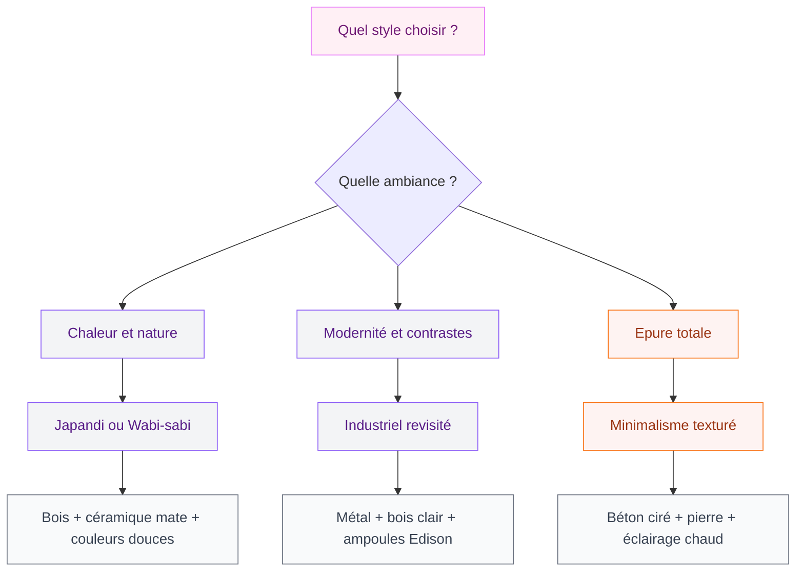
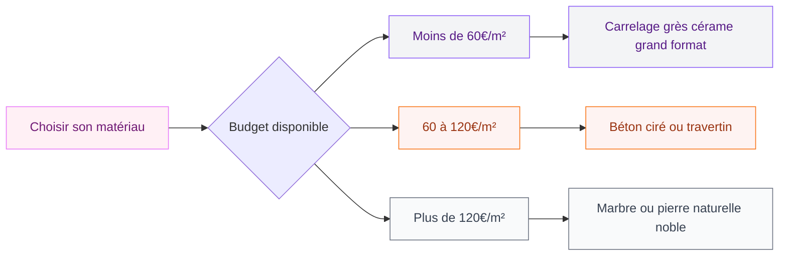
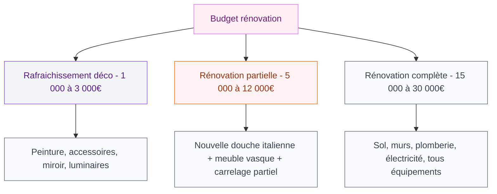

La salle de bain a bien changé ces dernières années. On ne parle plus d'un simple espace fonctionnel où tu passes cinq minutes le matin - c'est devenu une vraie pièce de vie où on investit du temps, de l'énergie et du budget. En 2026, les tendances s'orientent vers plus de confort, des matières naturelles et une esthétique pensée sur le long terme.

J'ai compilé ici les styles qui marquent cette année, des conseils concrets sur les matériaux, et des budgets réalistes pour t'aider à prendre les bonnes décisions. Que tu rénoves de fond en comble ou que tu cherches juste à rafraichir ta déco, tu devrais trouver ton bonheur.

## Les styles qui dominent en 2026

### Le Japandi, toujours au sommet

Le style Japandi - contraction de Japon et Scandinavie - continue sa progression et reste l'une des directions les plus choisies pour la salle de bain. Ce qui le rend si attrayant, c'est cet équilibre entre simplicité et chaleur : des lignes épurées, mais pas froides. Des matières naturelles, mais pas rustiques.

Concrètement, ça se traduit par des meubles bas en bois de teinte claire ou foncée (chêne naturel chez IKEA autour de 250-350 €, ou bois de noyer chez Burgbad à partir de 800 €), des vasques en céramique mate posées à même le plan, et une palette de couleurs autour du beige, du terracotta doux et du vert mousse.

Le sol joue un rôle fort dans ce style : on opte pour des carreaux en grès cérame à joints larges, format 60x60 ou plus grand, dans des tons sable ou ardoise. Des marques comme Marazzi ou Casalgrande Padana proposent des références adaptées entre 35 et 80 € le m².

> [!TIP]
> Pour un vrai rendu Japandi sans te ruiner, mise sur un seul élément signature fort - une vasque artisanale en grès, un miroir en bois massif - et garde le reste simple. Tu obtiendras plus d'effet qu'en accumulant des accessoires.

Pour aller plus loin sur ce type d'ambiance minimaliste et naturelle, jette un oeil à notre guide sur la [baignoire scandinave](/guides/salle-de-bain/baignoire-scandinave/) qui s'intègre parfaitement dans ce type d'univers.

### Le style industriel revisité : plus chaleureux qu'avant

L'industriel pur et dur - tout béton, tout métal noir - s'est adouci. En 2026, il se combine avec des éléments chauds pour éviter l'effet trop froid ou trop masculin.

La base reste là : robinetterie noire mate (Grohe Essence en noir mat, autour de 180-250 €), carrelage à joints apparents, étagères en métal. Mais on y ajoute du bois clair, des plantes vertes, des serviettes en lin beige. Ce mélange crée quelque chose de très vivant et facile à personnaliser.

Le luminaire est un vrai atout dans ce style : une ampoule Edison sur câble tressé coûte moins de 40 € et change complètement l'ambiance d'une salle de bain.

### Le minimalisme texturé

Le tout blanc clinique, c'est fini. Le minimalisme de 2026 joue avec les textures pour rester intéressant visuellement tout en gardant une vraie simplicité. Béton ciré, pierre naturelle, carreaux de grès avec reliefs - l'idée est de laisser le matériau parler.

Cette approche s'associe très bien avec un éclairage soigné. Des spots encastrés à température de couleur chaude (2700K) dans une salle de bain blanche et texturée donnent un résultat bien plus élégant que les néons d'appoint.

## Les matériaux phares de l'année

### Le béton ciré : polyvalent et tendance

Le béton ciré reste l'un des choix les plus demandés pour les salles de bain. Il unifie l'espace, s'adapte à presque tous les styles, et donne un rendu haut de gamme. Mais il demande une pose soignée et un entretien régulier.

Prix réaliste : comptez entre 80 et 150 € le m² pour la fourniture et la pose par un artisan. Des marques comme Mortex ou Marius Aurenti proposent des kits DIY autour de 40-60 € le m² si tu te lances toi-même, mais la pose demande de l'expérience.

Notre guide sur le [meuble salle de bain béton ciré](/guides/salle-de-bain/meuble-salle-de-bain-beton-cire/) détaille tout ce qu'il faut savoir pour choisir et entretenir un meuble dans ce matériau.

> [!WARNING]
> Le béton ciré non traité absorbe l'humidité et tache facilement. Une double couche de cire de protection après application, renouvelée tous les deux ans, est obligatoire dans une salle de bain. Sinon, des auréoles apparaissent rapidement.

### La pierre naturelle : durabilité et authenticité

Travertin, ardoise, marbre - la pierre naturelle revient fort. Elle apporte du caractère immédiat à une salle de bain, et sa durabilité dépasse largement celle des carrelages classiques si elle est bien entretenue.

Budget : comptez 60 à 200 € le m² selon l'essence choisie. Le travertin reste abordable (60-90 € le m²), le marbre de Carrare monte vite au-dessus de 150 €. Des enseignes comme Stones & More ou Pierre & Matériaux proposent de bons rapports qualité/prix.

Attention à choisir des finitions adaptées à la salle de bain : les pierres polies glissent et montrent chaque trace. Préfère un fini adouci ou brossé pour les sols.

### Le carrelage grand format

Les formats 60x120 ou 120x120 cm réduisent le nombre de joints, donnent une impression d'espace et simplifient l'entretien. Les fabricants espagnols et italiens comme Porcelanosa, Rex ou Fap Ceramiche sont des valeurs sures autour de 40 à 100 € le m².

Pour la douche italienne, ce format crée un très bel effet continu du sol au mur. Notre article sur le [carrelage pour douche italienne](/guides/salle-de-bain/carrelage-douche-italienne/) explore en détail les options et les prix selon les finitions.

## Repenser le plan de la salle de bain

### La douche italienne : un standard, pas une option

En 2026, une douche à l'italienne n'est plus un luxe - c'est devenu la norme dans les rénovations. Zéro receveur, niveau de sol continu, bac de douche integré dans la chape. Le résultat est plus propre, plus facile à nettoyer, et visuellement plus grand.

Côté prix, une douche italienne bien faite avec siphon de sol design (Viega Advantix ou Geberit CleanLine autour de 150-300 €), pare-douche en verre trempé (Schulte ou Lapeyre entre 300 et 800 € selon la configuration), et carrelage bien posé revient entre 1500 et 3500 € tout compris.

> [!NOTE]
> La douche italienne demande une vraie étanchéité. Une membrane d'étanchéité sous le carrelage (type Schlüter Kerdi, environ 40 € le m²) est une sécurité que tu ne regretteras pas. Un mauvais traitement de l'étanchéité coûte beaucoup plus cher à réparer par la suite.

### Baignoire ou douche : les deux sont possibles

Si tu as la place - à partir de 5 m² bien agencés - associer une baignoire et une douche reste la configuration la plus agréable. La baignoire n'est pas condamnée, elle évolue vers des modèles plus compacts et plus designés.

Les baignoires au format japonais - profondes et de petite emprise - gagnent du terrain. C'est une option très intéressante pour les petites salles de bain qui veulent quand même ce confort du bain. Notre guide sur la [baignoire japonaise](/guides/salle-de-bain/baignoire-japonaise/) te donne tous les détails sur ce format.

### L'éclairage : souvent négligé, toujours décisif

Un mauvais éclairage peut ruiner une belle salle de bain. En 2026, les tendances vont vers un éclairage en plusieurs zones : un général (plafond), un miroir (frontal de chaque côté, jamais au-dessus), et un décoratif (applique ou ruban LED dans une niche).

Marques fiables : Paulmann, Nordlux et Astro pour les appliques et spots. Budget raisonnable : 300 à 700 € pour un éclairage complet bien pensé.

> [!TIP]
> Evite les ampoules trop froides (au-dessus de 4000K) dans une salle de bain. A 2700-3000K, ta peau paraît plus saine, l'ambiance est plus douce, et tu passes de meilleur moments dans cette pièce. Le rendu colorimétrique (IRC) doit être au moins à 90.

## Budget global : ce que coûte vraiment une rénovation en 2026

Il est difficile de parler d'aménagement sans aborder les prix réels. Voici une grille honnête selon les ambitions :

Un conseil concret : sur un budget limité, investis sur ce qui se change rarement (carrelage, robinetterie, meuble vasque) et économise sur les accessoires (miroirs, rangements, textiles) que tu peux facilement modifier plus tard.

> [!IMPORTANT]
> La TVA à taux réduit (10 %) s'applique aux travaux de rénovation dans une résidence principale de plus de 2 ans. Demande à ton artisan de te le confirmer par écrit - cela représente plusieurs centaines d'euros d'économie sur une rénovation complète.

## Les petits détails qui changent tout

La robinetterie est un point que beaucoup sous-estiment. Un mitigeur bien choisi peut transformer visuellement une salle de bain entière. En 2026, les finitions or rose, laiton brossé et noir mat sont particulièrement prisées. Grohe, Hansgrohe et Vitra offrent de très bonnes gammes entre 150 et 400 €.

Les rangements doivent se penser dès la conception. Des niches dans la douche (taillées dans le mur et carrelées à l'identique), des tiroirs en pleine hauteur à côté du meuble vasque, ou des étagères en métal sur pied - plusieurs approches fonctionnent. L'idée est que rien ne traine à vue.

Enfin, les plantes s'invitent dans les salles de bain avec l'humidité et la lumière (artificielle ou naturelle) : un pothos, une fougère de Boston ou un calathéa apportent du vert et améliorent la qualité de l'air. Pas besoin de jardinière sophistiquée - un pot en terre cuite ou en grès mate suffit.

## Par où commencer concrètement ?

Si tu rénoves une salle de bain en 2026, voici les grandes étapes dans l'ordre logique :

1. **Define ton style et ton budget** avant tout achat. Constitue un moodboard (Pinterest reste l'outil le plus efficace) et fixe un plafond avec 15 % de marge pour les imprévus.
2. **Commence par la plomberie et l'électricité** si tu touches à ces installations - c'est le gros oeuvre qu'il faut faire en premier.
3. **Pose le carrelage** ensuite, murs puis sol.
4. **Installe les équipements** : meuble vasque, douche ou baignoire, WC si concerné.
5. **Termine par la robinetterie, les luminaires et les accessoires** - les éléments décoratifs en dernier.

Cette salle de bain que tu rénoves aujourd'hui, tu vivras avec pendant dix à quinze ans. Ca vaut le coup de bien réfléchir en amont et de ne pas rogner sur la qualité des éléments structurants.

---

## FAQ

**Quel est le style de salle de bain le plus tendance en 2026 ?**
Le Japandi (fusion japonais-scandinave) et le minimalisme texturé dominent les tendances 2026. Ces deux styles misent sur des matières naturelles, des lignes claires et une palette de couleurs douces.

**Quel budget prévoir pour aménager une salle de bain en 2026 ?**
Un rafraichissement déco coûte entre 1 000 et 3 000 €. Une rénovation partielle (douche italienne + meuble + carrelage) se situe entre 5 000 et 12 000 €. Une rénovation complète avec plomberie et électricité peut atteindre 15 000 à 30 000 €.

**Le béton ciré est-il adapté à une salle de bain ?**
Oui, à condition de bien le traiter. Une double couche de cire de protection est obligatoire, renouvelée tous les deux ans environ. Sans cela, le béton ciré absorbe l'humidité et tache rapidement.

**Peut-on avoir une baignoire et une douche dans la même salle de bain ?**
Oui, à partir de 5 m² bien agencés. Les baignoires japonaises compactes sont une bonne solution pour les petites surfaces qui veulent garder ce confort.

**Quelle température de couleur choisir pour l'éclairage de salle de bain ?**
Une température entre 2700K et 3000K est idéale. Elle donne un rendu chaud et flatteur, bien meilleur que les lumières froides au-dessus de 4000K.
